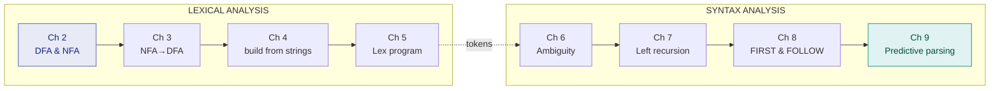

# Compiler Design — Mid-Term Notes

> **Mid syllabus:** NFA, DFA, their conversion, their construction from given string, eliminating left recursion, predictive parsing, a lex program, eliminating ambiguity, FIRST & FOLLOW.

> ⚠️ **No class material was supplied for this subject** — the `source/` folder contains only the syllabus file. These notes are written from **standard, well-established compiler theory** covering exactly the syllabus topics. Every chapter carries a banner saying so.
>
> When you upload your class notes, these can be checked against them — the topics are stable, but your teacher's **notation and preferred worked examples** may differ.

## Chapters

| # | Chapter | Syllabus topic |
|---|---|---|
| 1 | [Compiler Phases — Overview](notes/01-compiler-phases-overview.md) | *(context — orientation for the rest)* |
| 2 | [Finite Automata: DFA & NFA](notes/02-finite-automata-dfa-nfa.md) | **NFA, DFA** |
| 3 | [NFA → DFA Conversion](notes/03-nfa-to-dfa-conversion.md) | **their conversion** |
| 4 | [Constructing Automata from Strings & Regex](notes/04-automata-construction-from-strings.md) | **their construction from given string** |
| 5 | [Lexical Analysis & a Lex Program](notes/05-lexical-analysis-and-lex.md) | **a lex program** |
| 6 | [Grammars & Eliminating Ambiguity](notes/06-cfg-and-ambiguity-elimination.md) | **eliminating ambiguity** |
| 7 | [Eliminating Left Recursion & Left Factoring](notes/07-left-recursion-and-left-factoring.md) | **eliminating left recursion** |
| 8 | [FIRST & FOLLOW](notes/08-first-and-follow.md) | **FIRST & FOLLOW** |
| 9 | [Predictive Parsing (LL(1))](notes/09-predictive-parsing-ll1.md) | **predictive parsing** |

## How the chapters connect

The syllabus is really **two halves**, and the chapters build in dependency order:

> ⭐ **Chapters 6 → 7 → 8 → 9 are one continuous pipeline.** A grammar must be **unambiguous** and **free of left recursion** (and left-factored) before FIRST/FOLLOW can build a conflict-free **LL(1) parsing table**. Exam questions very often chain these: *"remove left recursion, compute FIRST and FOLLOW, construct the parsing table, and parse the string `id+id*id`."* Practise the whole chain as one exercise.

## Revision checklist

- [ ] Formal 5-tuple definition of DFA and NFA
- [ ] Differentiate DFA and NFA
- [ ] Draw a DFA/NFA for a given language description
- [ ] Construct an automaton accepting a **given string**
- [ ] **Subset construction:** convert an NFA (with and without ε) to a DFA
- [ ] ε-closure computation
- [ ] Structure of a **Lex program** (3 sections) and write one
- [ ] Token, lexeme, pattern — the difference
- [ ] CFG, derivations (leftmost/rightmost), parse trees
- [ ] Prove a grammar is **ambiguous**; remove ambiguity using **precedence and associativity**
- [ ] The **dangling-else** problem and its fix
- [ ] Remove **direct** and **indirect** left recursion
- [ ] **Left factoring**
- [ ] Compute **FIRST** and **FOLLOW** sets
- [ ] Construct an **LL(1) parsing table**; detect conflicts
- [ ] **Trace a parse** using the stack

## The rules worth memorising

**FIRST**
1. If $X$ is a terminal, $FIRST(X) = \{X\}$.
2. If $X \to \varepsilon$, add $\varepsilon$ to $FIRST(X)$.
3. If $X \to Y_1Y_2\dots Y_k$, add $FIRST(Y_1) \setminus \{\varepsilon\}$; if $\varepsilon \in FIRST(Y_1)$, also add $FIRST(Y_2) \setminus \{\varepsilon\}$, and so on. If **all** $Y_i$ derive $\varepsilon$, add $\varepsilon$.

**FOLLOW**
1. Put **`$`** in $FOLLOW(S)$ for the start symbol $S$.
2. For $A \to \alpha B \beta$: add $FIRST(\beta) \setminus \{\varepsilon\}$ to $FOLLOW(B)$.
3. For $A \to \alpha B$, **or** $A \to \alpha B\beta$ where $\varepsilon \in FIRST(\beta)$: add $FOLLOW(A)$ to $FOLLOW(B)$.

> ⚠️ **$\varepsilon$ is never in a FOLLOW set.**

**Left recursion removal:** $A \to A\alpha \mid \beta$ becomes
$$A \to \beta A' \qquad A' \to \alpha A' \mid \varepsilon$$

**Left factoring:** $A \to \alpha\beta_1 \mid \alpha\beta_2$ becomes
$$A \to \alpha A' \qquad A' \to \beta_1 \mid \beta_2$$

**LL(1) table rule:** for each production $A \to \alpha$:
- For each $a \in FIRST(\alpha)$, put $A \to \alpha$ in $M[A, a]$.
- If $\varepsilon \in FIRST(\alpha)$, for each $b \in FOLLOW(A)$ put $A \to \alpha$ in $M[A, b]$.
- **More than one entry in a cell ⇒ the grammar is NOT LL(1).**
