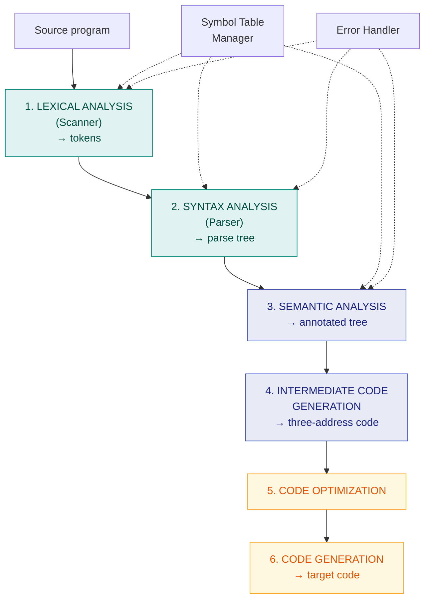

# 1. Compiler Phases — Overview

> ✅ **Checked against the class notes** (`Compiler notes.pdf`). Definitions, rules and notation match. The teacher's own worked examples are in [Ch. 10](10-class-notes-worked-examples.md).
>
> **Purpose of this chapter:** orientation. It is not itself a syllabus topic, but it shows *where* the syllabus topics sit, which makes the rest far easier to follow.

---

## 🎯 In one line

A compiler translates source code to target code in **six phases**; your syllabus covers the **first two** — lexical analysis (automata, Lex) and syntax analysis (grammars, FIRST/FOLLOW, predictive parsing).

---

## 1. What is a compiler?

A **compiler** is a program that reads a program written in one language — the **source language** — and translates it into an equivalent program in another language — the **target language**. Along the way it **reports errors** in the source program.

```
   ┌──────────────┐        ┌──────────┐        ┌──────────────┐
   │ Source       │───────►│ COMPILER │───────►│ Target       │
   │ program      │        └────┬─────┘        │ program      │
   └──────────────┘             │              └──────────────┘
                                ▼
                        ┌──────────────┐
                        │ Error        │
                        │ messages     │
                        └──────────────┘
```

### Compiler vs Interpreter

| **Compiler** | **Interpreter** |
|---|---|
| Translates the **whole program** at once | Translates and executes **line by line** |
| Produces a target program | Produces **no** intermediate object code |
| Execution is **faster** | Execution is **slower** |
| Reports **all** errors after scanning the whole program | Stops at the **first** error |
| C, C++, Java (to bytecode) | Python, BASIC |

---

## 2. The phases of a compiler ⭐



> 🟢 The two **green** phases are what your mid-term syllabus covers.

| # | Phase | Input | Output | What it does |
|---|---|---|---|---|
| **1** | **Lexical Analysis** (Scanner) | Character stream | **Tokens** | Groups characters into meaningful **lexemes** and produces tokens. Removes whitespace and comments. **Uses finite automata.** → [Ch. 2–5](02-finite-automata-dfa-nfa.md) |
| **2** | **Syntax Analysis** (Parser) | Tokens | **Parse tree** | Checks the token sequence against the **grammar**. **Uses context-free grammars.** → [Ch. 6–9](06-cfg-and-ambiguity-elimination.md) |
| **3** | **Semantic Analysis** | Parse tree | Annotated tree | **Type checking**, scope resolution — catches errors that are grammatically legal but meaningless |
| **4** | **Intermediate Code Generation** | Annotated tree | **Three-address code** | Produces a machine-independent intermediate representation |
| **5** | **Code Optimization** | Intermediate code | Optimised code | Improves speed/size without changing meaning |
| **6** | **Code Generation** | Optimised code | **Target code** | Produces the final machine/assembly code; allocates registers |

**Two components span all phases:**

| Component | Role |
|---|---|
| **Symbol Table Manager** | Stores identifiers with their attributes (type, scope, memory location) — used by nearly every phase |
| **Error Handler** | Detects and reports errors, and allows compilation to continue where possible |

### Analysis and Synthesis

| Part | Phases | Role |
|---|---|---|
| **Analysis (Front end)** | 1, 2, 3 | **Breaks up** the source program and checks it; **machine-independent** |
| **Synthesis (Back end)** | 4, 5, 6 | **Constructs** the target program; **machine-dependent** |

---

## 3. A worked trace — how `position = initial + rate * 60` flows through ⭐

This single example makes the whole pipeline concrete.

**Phase 1 — Lexical Analysis** produces tokens:

$$\texttt{id}_1 \quad \texttt{=} \quad \texttt{id}_2 \quad \texttt{+} \quad \texttt{id}_3 \quad \texttt{*} \quad \texttt{60}$$

The symbol table records `position`, `initial`, `rate`.

**Phase 2 — Syntax Analysis** builds a parse tree:

```
              =
            ╱   ╲
       id₁       +
               ╱   ╲
          id₂        *
                   ╱   ╲
               id₃      60
```

> 📌 Notice that `*` sits **below** `+` in the tree — the grammar has encoded that multiplication binds tighter. Getting that right is exactly what [Ch. 6](06-cfg-and-ambiguity-elimination.md) is about.

**Phase 3 — Semantic Analysis** inserts a type conversion, since `60` is an integer but the others are reals:

```
              =
            ╱   ╲
       id₁       +
               ╱   ╲
          id₂        *
                   ╱   ╲
               id₃    inttoreal
                          │
                          60
```

**Phase 4 — Intermediate Code:**

```
  t1 = inttoreal(60)
  t2 = id3 * t1
  t3 = id2 + t2
  id1 = t3
```

**Phase 5 — Optimization** (the conversion is done at compile time):

```
  t1 = id3 * 60.0
  id1 = id2 + t1
```

**Phase 6 — Code Generation:**

```
  MOVF  id3, R2
  MULF  #60.0, R2
  MOVF  id2, R1
  ADDF  R2, R1
  MOVF  R1, id1
```

---

## 4. Lexical vs Syntax analysis — the division of labour ⭐

| | **Lexical Analysis** | **Syntax Analysis** |
|---|---|---|
| Works on | **Characters** | **Tokens** |
| Produces | **Tokens** | **Parse tree** |
| Formalism | **Regular expressions / finite automata** | **Context-free grammars** |
| Power | Cannot count or match nesting | **Can** handle nested/recursive structure |
| Catches | Illegal characters, malformed numbers | Missing semicolons, unbalanced parentheses |

> ⭐ **Why two separate phases?** Regular expressions cannot express **balanced nesting** (like matching parentheses) — that needs a context-free grammar. Splitting the job keeps the lexer simple and fast, while the parser handles structure. This is the reason the syllabus treats automata and grammars as two distinct blocks.

---

## 5. Common exam questions

1. **What is a compiler? Differentiate a compiler from an interpreter.**
2. **Explain the phases of a compiler** with a diagram. ⭐
3. **Trace the phases for a given statement** such as `a = b + c * 10`. ⭐
4. **What are the analysis and synthesis parts of a compiler?**
5. **What is the role of the symbol table?**
6. **Differentiate lexical analysis and syntax analysis.** ⭐

---

## ⚡ Quick revision

- A **compiler** translates a source program into an equivalent target program and reports errors.
- **Six phases:** Lexical Analysis → Syntax Analysis → Semantic Analysis → Intermediate Code Generation → Code Optimization → Code Generation.
- **Symbol table manager** and **error handler** interact with all phases.
- **Analysis (front end)** = phases 1–3, machine-independent · **Synthesis (back end)** = phases 4–6, machine-dependent.
- **Lexical analysis** uses **regular expressions / finite automata** → produces **tokens**.
- **Syntax analysis** uses **context-free grammars** → produces a **parse tree**.
- Regular expressions **cannot express nesting** — that is why a separate parser exists.
- **Your syllabus = phases 1 and 2.**

---

**Next:** [2. Finite Automata: DFA & NFA →](02-finite-automata-dfa-nfa.md)
