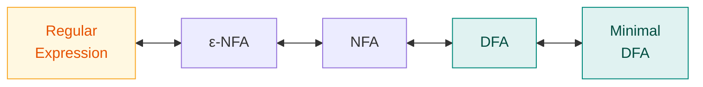

# 2. Finite Automata — DFA & NFA

> ✅ **Checked against the class notes** (`Compiler notes.pdf`). Definitions, rules and notation match. The teacher's own worked examples are in [Ch. 10](10-class-notes-worked-examples.md).
> **Syllabus:** *NFA, DFA*

---

## 🎯 In one line

A **finite automaton** is a 5-tuple machine that reads a string and accepts or rejects it; a **DFA** has **exactly one** move per (state, symbol), an **NFA** may have **several or none** — and both recognise exactly the same languages.

---

## 1. Why compilers need automata

The **lexical analyser** must decide, character by character, whether the text it has seen so far forms a valid identifier, number, keyword or operator. That decision is exactly what a finite automaton does — which is why every scanner is, underneath, a **DFA**.

```
  regular expression  ──►  NFA  ──►  DFA  ──►  minimised DFA  ──►  scanner code
        (Ch. 4)          (Ch. 2)   (Ch. 3)                          (Ch. 5)
```

---

## 2. Deterministic Finite Automaton (DFA) ⭐⭐

A DFA is a **5-tuple**:

$$\boxed{M = (Q,\ \Sigma,\ \delta,\ q_0,\ F)}$$

| Symbol | Name | Meaning |
|---|---|---|
| $Q$ | **Set of states** | A finite, non-empty set |
| $\Sigma$ | **Input alphabet** | A finite set of input symbols |
| $\delta$ | **Transition function** | $\delta: Q \times \Sigma \to Q$ — **exactly one** next state |
| $q_0$ | **Start state** | $q_0 \in Q$ |
| $F$ | **Set of final (accepting) states** | $F \subseteq Q$ |

### The defining property

> For a DFA, $\delta(q, a)$ gives **exactly one** state — never zero, never many. There are **no ε-transitions**.

### Acceptance

A string $w$ is **accepted** if, starting at $q_0$ and consuming all of $w$, the machine ends in a state belonging to $F$. The **language** of $M$ is

$$L(M) = \{\, w \in \Sigma^* \mid \hat\delta(q_0, w) \in F \,\}$$

### Notation used in diagrams

```
   ──►( q )        start state (arrow from nowhere)

     ( q )         ordinary state

    (( q ))        final / accepting state (double circle)

     ( p ) ──a──► ( q )       transition on input a
```

---

## 3. Worked DFA example ⭐

**Design a DFA over $\Sigma = \{a, b\}$ that accepts all strings ending in `ab`.**

**Thinking:** we must remember how much of the pattern `ab` we have just seen. Three situations: nothing useful, just saw an `a`, just saw `ab`.

```
              b                a               b
           ┌────┐           ┌────┐          ┌────┐
           │    ▼           │    ▼          │    ▼
        ──►( q0 )──a──►( q1 )──b──►(( q2 ))
              ▲            │           │
              │            │     a     │
              └────────────┴───────────┘
                    (from q2 on a → q1)
```

**Transition table:**

| State | `a` | `b` |
|---|---|---|
| →$q_0$ | $q_1$ | $q_0$ |
| $q_1$ | $q_1$ | $q_2$ |
| *$q_2$ | $q_1$ | $q_0$ |

$Q = \{q_0,q_1,q_2\}$, $\Sigma=\{a,b\}$, $q_0$ = start, $F = \{q_2\}$.

**Trace `aabab`:**

$$q_0 \xrightarrow{a} q_1 \xrightarrow{a} q_1 \xrightarrow{b} q_2 \xrightarrow{a} q_1 \xrightarrow{b} q_2 \in F \quad ✅ \text{ accepted}$$

**Trace `abba`:**

$$q_0 \xrightarrow{a} q_1 \xrightarrow{b} q_2 \xrightarrow{b} q_0 \xrightarrow{a} q_1 \notin F \quad ❌ \text{ rejected}$$

> 💡 **Design tip that works nearly always:** make each state mean *"the longest prefix of the pattern I have matched so far"*. Here $q_0$ = "nothing", $q_1$ = "just saw `a`", $q_2$ = "just saw `ab`". Then every transition follows mechanically.

---

## 4. Non-deterministic Finite Automaton (NFA) ⭐⭐

An NFA is also a **5-tuple**:

$$\boxed{M = (Q,\ \Sigma,\ \delta,\ q_0,\ F)}$$

The **only** difference is the transition function:

$$\delta: Q \times \Sigma \to 2^Q \qquad \text{(a \textbf{set} of states — possibly empty)}$$

| Feature | DFA | NFA |
|---|---|---|
| $\delta(q,a)$ returns | **one** state | a **set** of states (0, 1 or many) |
| ε-transitions | ❌ Not allowed | ✅ Allowed (in ε-NFA) |

### Acceptance in an NFA

A string is accepted if **at least one** of the possible paths ends in a final state. Think of the NFA as exploring **all** choices in parallel and accepting if **any** succeeds.

---

## 5. Worked NFA example ⭐

**NFA over $\Sigma = \{a,b\}$ accepting strings ending in `ab`** — much simpler to design than the DFA:

```
           a,b
          ┌───┐
          │   ▼
       ──►( q0 )──a──►( q1 )──b──►(( q2 ))
```

**Transition table** (entries are **sets**):

| State | `a` | `b` |
|---|---|---|
| →$q_0$ | $\{q_0, q_1\}$ | $\{q_0\}$ |
| $q_1$ | $\emptyset$ | $\{q_2\}$ |
| *$q_2$ | $\emptyset$ | $\emptyset$ |

> ⭐ **This is the whole point of non-determinism.** The NFA "guesses" when the final `ab` is starting. At $q_0$ on input `a` it goes to **both** $q_0$ (keep waiting) and $q_1$ (this is the start of the ending). The DFA had to track this explicitly; the NFA just guesses. That is why NFAs are **easier to design** but **harder to execute**.

**Trace `aab`:** one accepting path exists —

$$q_0 \xrightarrow{a} q_0 \xrightarrow{a} q_1 \xrightarrow{b} q_2 \in F \quad ✅$$

---

## 6. ε-NFA (NFA with epsilon moves) ⭐

An **ε-NFA** may change state **without consuming any input symbol**. The transition function becomes

$$\delta: Q \times (\Sigma \cup \{\varepsilon\}) \to 2^Q$$

### ε-closure ⭐⭐

> **$\varepsilon\text{-closure}(q)$** = the set of all states reachable from $q$ using **ε-transitions only** (including $q$ itself).

For a set of states $S$: $\ \varepsilon\text{-closure}(S) = \bigcup_{q \in S} \varepsilon\text{-closure}(q)$.

**Example:**

```
    ( q0 )──ε──►( q1 )──ε──►( q2 )──a──►( q3 )
```

$$\varepsilon\text{-closure}(q_0) = \{q_0, q_1, q_2\}, \quad \varepsilon\text{-closure}(q_2) = \{q_2\}, \quad \varepsilon\text{-closure}(q_3) = \{q_3\}$$

> 📌 **ε-closure is the single most important computation** in the NFA→DFA conversion of [Ch. 3](03-nfa-to-dfa-conversion.md). Get comfortable with it here.

---

## 7. DFA vs NFA — the comparison ⭐⭐⭐

| Feature | **DFA** | **NFA** |
|---|---|---|
| **Full form** | Deterministic Finite Automaton | Non-deterministic Finite Automaton |
| **Transition function** | $\delta: Q \times \Sigma \to Q$ | $\delta: Q \times \Sigma \to 2^Q$ |
| **Next state** | **Exactly one** | **Zero, one or many** |
| **ε-transitions** | ❌ Not allowed | ✅ Allowed |
| **Backtracking** | Not needed | May be needed |
| **Ease of design** | Harder | ✅ **Easier** |
| **Number of states** | Generally **more** (up to $2^n$) | Generally **fewer** |
| **Space required** | More | Less |
| **Execution speed** | ✅ **Faster** (one path) | Slower (many paths) |
| **Implementation** | ✅ Directly implementable | Must be converted to a DFA first |
| **Acceptance** | The unique path ends in $F$ | **At least one** path ends in $F$ |
| **Empty transitions to dead state** | Must be explicit | Simply omitted |

### The crucial equivalence theorem ⭐⭐

> **Every NFA has an equivalent DFA.** DFAs and NFAs **accept exactly the same class of languages** — the **regular languages**.
>
> Non-determinism adds **convenience**, not **power**.

$$L(\text{NFA}) = L(\text{DFA}) = \text{Regular Languages}$$

If an NFA has $n$ states, the equivalent DFA has **at most $2^n$** states (the number of subsets of $Q$) — the construction is in [Ch. 3](03-nfa-to-dfa-conversion.md).



**All four representations are equivalent in power** — each can be converted to any other.

---

## 8. More worked examples ⭐

### Example 1 — DFA for strings containing `01` as a substring

$\Sigma = \{0,1\}$

| State | Meaning | `0` | `1` |
|---|---|---|---|
| →$A$ | no useful prefix | $B$ | $A$ |
| $B$ | last symbol was `0` | $B$ | $C$ |
| *$C$ | `01` found — stay here | $C$ | $C$ |

$C$ is a **trap/absorbing** accepting state: once `01` appears, the string is accepted whatever follows.

### Example 2 — DFA for strings with an even number of `a`'s

| State | Meaning | `a` | `b` |
|---|---|---|---|
| →*$E$ | even count of `a` | $O$ | $E$ |
| $O$ | odd count of `a` | $E$ | $O$ |

$F = \{E\}$. The empty string is accepted (0 is even) ✓

### Example 3 — DFA for binary numbers divisible by 3

States track the **remainder mod 3**. Reading a bit $b$ changes the value from $v$ to $2v+b$:

| State (remainder) | `0` | `1` |
|---|---|---|
| →*$r_0$ | $r_0$ | $r_1$ |
| $r_1$ | $r_2$ | $r_0$ |
| $r_2$ | $r_1$ | $r_2$ |

$F = \{r_0\}$. Check `110` (= 6): $r_0 \xrightarrow{1} r_1 \xrightarrow{1} r_0 \xrightarrow{0} r_0 \in F$ ✅ and $6 \div 3 = 2$ ✓

> 💡 **The general trick for "divisible by $k$" problems:** make the states the **remainders** $0, 1, \dots, k-1$. It works every time.

---

## 9. Common exam questions

1. **Define DFA formally (5-tuple) and explain each component.** ⭐⭐
2. **Define NFA formally. How does it differ from a DFA?** ⭐⭐
3. **Differentiate DFA and NFA.** ⭐⭐⭐ *(the comparison table)*
4. **Construct a DFA/NFA for a given language** — ending with, containing, even/odd count, divisible by $n$. ⭐⭐⭐
5. **What is an ε-NFA? Define ε-closure and compute it for a given automaton.** ⭐⭐
6. **State the equivalence of DFA and NFA.** ⭐ → same class of languages (regular); NFA adds convenience, not power; $n$ states → at most $2^n$.
7. **Trace whether a given string is accepted.** ⭐⭐
8. **What is a dead/trap state?** → a non-accepting state from which no accepting state is reachable.

---

## ⚡ Quick revision

- **Both DFA and NFA are 5-tuples:** $M = (Q, \Sigma, \delta, q_0, F)$.
- **DFA:** $\delta: Q \times \Sigma \to Q$ — **exactly one** next state, **no ε**.
- **NFA:** $\delta: Q \times \Sigma \to 2^Q$ — a **set** of next states (0, 1 or many), **ε allowed**.
- **DFA accepts** if the unique path ends in $F$; **NFA accepts** if **at least one** path ends in $F$.
- **NFA is easier to design; DFA is faster to execute** and directly implementable.
- **$\varepsilon$-closure($q$)** = all states reachable from $q$ by ε-transitions **only**, including $q$ itself.
- ⭐ **Equivalence:** every NFA has an equivalent DFA; both recognise exactly the **regular languages**. $n$-state NFA → at most **$2^n$**-state DFA.
- **Regular Expression ↔ ε-NFA ↔ NFA ↔ DFA ↔ minimal DFA** — all equivalent in power.
- **Design tips:** make each state mean *"longest prefix of the pattern matched so far"*; for "divisible by $k$", make the states the **remainders mod $k$**.
- **Double circle** = final state; **arrow from nowhere** = start state.

---

**Previous:** [← 1. Compiler Phases](01-compiler-phases-overview.md) · **Next:** [3. NFA → DFA Conversion →](03-nfa-to-dfa-conversion.md)
