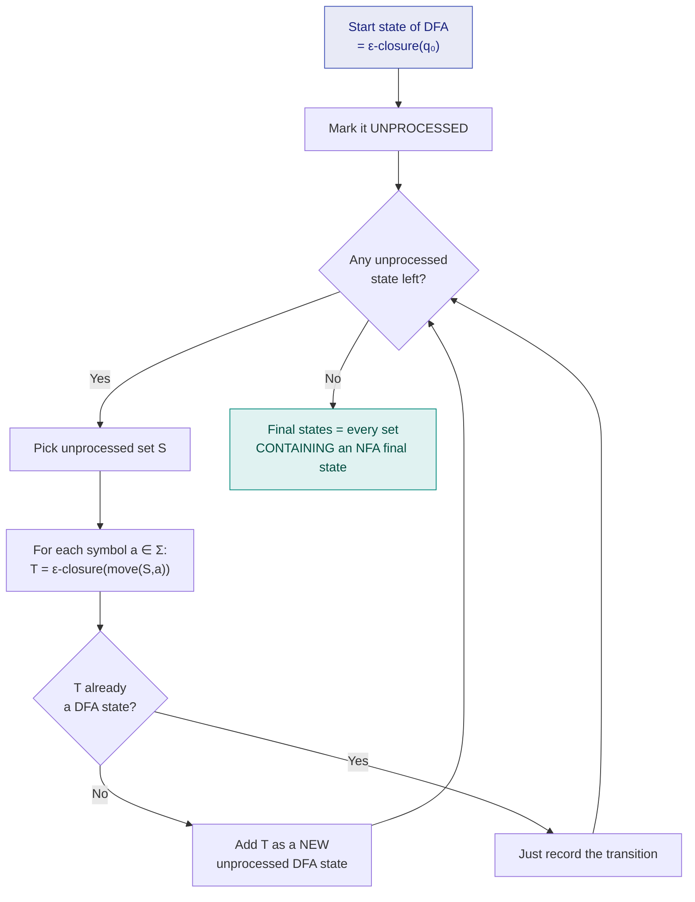

# 3. NFA → DFA Conversion (Subset Construction)

> ⚠️ **Written from standard course knowledge.** No class material was supplied for Compiler Design.
> **Syllabus:** *their conversion*

---

## 🎯 In one line

Make each DFA state a **set of NFA states** — the set the NFA could possibly be in — and the non-determinism disappears.

---

## 1. Why convert?

An **NFA is easy to design** but **hard to execute** — the machine would have to explore many paths at once. A **DFA is directly implementable** as a simple table-driven loop, which is what a real lexical analyser needs.

The conversion algorithm is called **subset construction** (or the **powerset construction**).

> ⭐ **The central idea:** at any moment, an NFA could be in **any one of a set of states**. Make that **whole set** a single DFA state. Since there are $2^n$ subsets of an $n$-state NFA, the DFA has **at most $2^n$ states**.

---

## 2. The two helper operations ⭐⭐

| Operation | Definition |
|---|---|
| **$\varepsilon\text{-closure}(S)$** | The set of all states reachable from any state in $S$ using **ε-transitions only** (including the states of $S$ themselves) |
| **$move(S, a)$** | The set of all states reachable from any state in $S$ on **exactly one** input symbol $a$ |

The combined step used at every iteration is:

$$\boxed{\delta_{DFA}(S, a) = \varepsilon\text{-closure}\big(move(S, a)\big)}$$

> 💡 **If the NFA has no ε-transitions**, $\varepsilon\text{-closure}(S) = S$, so the rule simplifies to just $\delta_{DFA}(S,a) = move(S,a)$.

---

## 3. The algorithm ⭐⭐



### Written as steps

| Step | Action |
|---|---|
| **1** | The **start state** of the DFA is $\varepsilon\text{-closure}(q_0)$. Mark it unprocessed. |
| **2** | While an unprocessed DFA state $S$ exists, for **each** input symbol $a \in \Sigma$ compute $T = \varepsilon\text{-closure}(move(S,a))$. |
| **3** | If $T$ is **not** already a DFA state, **add** it as a new unprocessed state. Record the transition $S \xrightarrow{a} T$. |
| **4** | Repeat until **no unprocessed states remain**. |
| **5** | A DFA state is **final** if the set it represents **contains at least one final state of the NFA**. |

> ⚠️ **The empty set $\emptyset$ is a legitimate DFA state** — it is the **dead/trap state**. Every transition from it goes back to itself, and it is never accepting. Many textbooks (and exam answers) simply omit it; say explicitly which convention you are using.

---

## 4. Worked Example 1 — NFA without ε ⭐⭐

**Convert this NFA** (accepts strings over $\{a,b\}$ **ending in `ab`**) **to a DFA.**

| NFA state | `a` | `b` |
|---|---|---|
| →$q_0$ | $\{q_0, q_1\}$ | $\{q_0\}$ |
| $q_1$ | $\emptyset$ | $\{q_2\}$ |
| *$q_2$ | $\emptyset$ | $\emptyset$ |

### Step 1 — start state

No ε-transitions, so the start state is simply $\{q_0\}$. Call it **A**.

### Step 2 — process A = $\{q_0\}$

$$\delta(A, a) = move(\{q_0\}, a) = \{q_0, q_1\} \quad \text{— NEW, call it } \mathbf{B}$$
$$\delta(A, b) = move(\{q_0\}, b) = \{q_0\} = A$$

### Step 3 — process B = $\{q_0, q_1\}$

$$\delta(B, a) = move(q_0,a) \cup move(q_1,a) = \{q_0,q_1\} \cup \emptyset = \{q_0,q_1\} = B$$
$$\delta(B, b) = move(q_0,b) \cup move(q_1,b) = \{q_0\} \cup \{q_2\} = \{q_0, q_2\} \quad \text{— NEW, call it } \mathbf{C}$$

### Step 4 — process C = $\{q_0, q_2\}$

$$\delta(C, a) = \{q_0,q_1\} \cup \emptyset = \{q_0,q_1\} = B$$
$$\delta(C, b) = \{q_0\} \cup \emptyset = \{q_0\} = A$$

No unprocessed states remain. ✓

### Step 5 — final states

$q_2$ is the NFA's final state. Which subsets contain $q_2$? Only $C = \{q_0,q_2\}$.

### ✅ Resulting DFA

| DFA state | Set of NFA states | `a` | `b` |
|---|---|---|---|
| →**A** | $\{q_0\}$ | B | A |
| **B** | $\{q_0, q_1\}$ | B | C |
| ***C** | $\{q_0, q_2\}$ | B | A |

```
              b                a               b
           ┌────┐           ┌────┐          ┌────┐
           │    ▼           │    ▼          │    ▼
        ──►(  A  )──a──►(  B  )──b──►(( C ))
              ▲                            │
              └──────────── b ─────────────┘
                     (C on a → B)
```

**Verify with `aab`:** $A \xrightarrow{a} B \xrightarrow{a} B \xrightarrow{b} C \in F$ ✅ accepted — and `aab` does end in `ab` ✓

**Verify with `aba`:** $A \xrightarrow{a} B \xrightarrow{b} C \xrightarrow{a} B \notin F$ ❌ rejected ✓

> 📌 The NFA had **3** states; the DFA also has **3**. The $2^n = 8$ bound is a worst case — most of the 8 subsets are simply **unreachable**, so they never get created. **Only ever construct reachable subsets.**

---

## 5. Worked Example 2 — ε-NFA ⭐⭐⭐

**Convert this ε-NFA to a DFA.**

| ε-NFA state | $\varepsilon$ | `a` | `b` | `c` |
|---|---|---|---|---|
| →$q_0$ | $\{q_1\}$ | $\{q_0\}$ | $\emptyset$ | $\emptyset$ |
| $q_1$ | $\{q_2\}$ | $\emptyset$ | $\{q_1\}$ | $\emptyset$ |
| *$q_2$ | $\emptyset$ | $\emptyset$ | $\emptyset$ | $\{q_2\}$ |

```
        ┌a┐              ┌b┐              ┌c┐
        │ ▼              │ ▼              │ ▼
     ──►( q0 )──ε──►( q1 )──ε──►(( q2 ))
```

*(This automaton accepts $a^*b^*c^*$.)*

### Step 0 — compute all ε-closures ⭐

$$\varepsilon\text{-closure}(q_0) = \{q_0, q_1, q_2\} \qquad \varepsilon\text{-closure}(q_1) = \{q_1, q_2\} \qquad \varepsilon\text{-closure}(q_2) = \{q_2\}$$

> ⭐ **Always do this first.** Nearly every mistake in this kind of question comes from forgetting to take the ε-closure at some step.

### Step 1 — start state

$$A = \varepsilon\text{-closure}(q_0) = \{q_0, q_1, q_2\}$$

### Step 2 — process A = $\{q_0,q_1,q_2\}$

$$move(A, a) = \{q_0\} \ \Rightarrow\ \varepsilon\text{-closure}(\{q_0\}) = \{q_0,q_1,q_2\} = A$$
$$move(A, b) = \{q_1\} \ \Rightarrow\ \varepsilon\text{-closure}(\{q_1\}) = \{q_1,q_2\} \quad\text{— NEW, } \mathbf{B}$$
$$move(A, c) = \{q_2\} \ \Rightarrow\ \varepsilon\text{-closure}(\{q_2\}) = \{q_2\} \quad\text{— NEW, } \mathbf{C}$$

### Step 3 — process B = $\{q_1,q_2\}$

$$move(B, a) = \emptyset \ \Rightarrow\ \emptyset \quad \text{(dead state)}$$
$$move(B, b) = \{q_1\} \ \Rightarrow\ \{q_1,q_2\} = B$$
$$move(B, c) = \{q_2\} \ \Rightarrow\ \{q_2\} = C$$

### Step 4 — process C = $\{q_2\}$

$$move(C,a) = \emptyset, \qquad move(C,b) = \emptyset, \qquad move(C,c) = \{q_2\} \Rightarrow \{q_2\} = C$$

### Step 5 — final states

$q_2 \in F_{NFA}$. Sets containing $q_2$: **A, B and C — all three are final.**

### ✅ Resulting DFA

| DFA state | Set | `a` | `b` | `c` |
|---|---|---|---|---|
| →***A** | $\{q_0,q_1,q_2\}$ | A | B | C |
| ***B** | $\{q_1,q_2\}$ | $\emptyset$ | B | C |
| ***C** | $\{q_2\}$ | $\emptyset$ | $\emptyset$ | C |

```
        ┌a┐              ┌b┐              ┌c┐
        │ ▼              │ ▼              │ ▼
     ──►((A))──b──►((B))──c──►(( C ))
          │                      ▲
          └────────── c ─────────┘
```

**Check:** `aabc` → $A \xrightarrow{a} A \xrightarrow{a} A \xrightarrow{b} B \xrightarrow{c} C \in F$ ✅
**Check:** `ba` → $A \xrightarrow{b} B \xrightarrow{a} \emptyset$ ❌ rejected — correct, since $a^*b^*c^*$ forbids an `a` after a `b` ✓
**Check:** empty string → $A$ is final ✅ correct, $\varepsilon \in a^*b^*c^*$ ✓

---

## 6. A checklist for exam answers ⭐

Following this order reliably earns full marks:

1. ✅ Write the NFA **transition table** first (if given only a diagram).
2. ✅ Compute **all ε-closures** and write them down explicitly.
3. ✅ Start with $\varepsilon\text{-closure}(q_0)$ and **name** it A.
4. ✅ Show the computation $\varepsilon\text{-closure}(move(S,a))$ **for every state and every symbol** — show the working, not just the answer.
5. ✅ **Name each new subset** (A, B, C…) as it appears, and keep a key mapping names to subsets.
6. ✅ Stop when no unprocessed subsets remain.
7. ✅ Mark as final **every subset containing an NFA final state**.
8. ✅ Draw the final DFA **diagram** and give the **transition table**.
9. ✅ **Verify** with one accepted and one rejected string.

### Common mistakes ⚠️

| Mistake | Fix |
|---|---|
| Forgetting ε-closure after `move` | Always apply $\varepsilon$-closure to the **result** of `move` |
| Forgetting ε-closure on the **start** state | The start state is $\varepsilon\text{-closure}(q_0)$, **not** $\{q_0\}$ |
| Constructing all $2^n$ subsets | Only construct **reachable** ones |
| Missing a final state | A subset is final if it contains **any** NFA final state |
| Dropping the empty set silently | Say whether you are treating $\emptyset$ as a dead state or omitting it |

---

## 7. DFA Minimisation (brief)

The DFA produced by subset construction may have **redundant states**. Two states are **equivalent** if, for every input string, they both lead to acceptance or both to rejection.

**Partition refinement method:**
1. Split states into two groups: **final** and **non-final**.
2. Repeatedly split any group whose members, on some input symbol, go to **different groups**.
3. Stop when no group can be split further.
4. Each remaining group becomes **one state** of the minimal DFA.

> 📌 The minimal DFA for a regular language is **unique** up to renaming of states.

---

## 8. Common exam questions

1. **Explain the subset construction algorithm.** ⭐⭐
2. **Convert the given NFA to an equivalent DFA.** ⭐⭐⭐ *(the single most likely question in this chapter)*
3. **Convert the given ε-NFA to a DFA.** ⭐⭐⭐
4. **Define ε-closure and `move`. Compute them for a given automaton.** ⭐⭐
5. **How many states can the equivalent DFA have?** → at most $2^n$ for an $n$-state NFA.
6. **Why do we convert an NFA to a DFA?** → a DFA is deterministic, needs no backtracking and is **directly implementable** in a scanner.
7. **Minimise the given DFA.**

---

## ⚡ Quick revision

- **Subset construction:** each DFA state is a **set of NFA states**.
- **The core formula:** $\ \delta_{DFA}(S,a) = \varepsilon\text{-closure}(move(S,a))$.
- **$\varepsilon$-closure($S$)** = states reachable using **ε only** (including $S$ itself).
- **$move(S,a)$** = states reachable from $S$ on exactly **one** symbol $a$.
- **Start state = $\varepsilon\text{-closure}(q_0)$** — not $\{q_0\}$.
- **Final states** = every subset **containing at least one** NFA final state.
- **$\emptyset$ is the dead/trap state.**
- At most **$2^n$** DFA states for $n$ NFA states — but **only build reachable subsets**.
- Without ε-transitions the rule simplifies to $\delta_{DFA}(S,a) = move(S,a)$.
- ⚠️ The most common error: **forgetting the ε-closure**, either on the start state or after `move`.
- Always **verify** the finished DFA with one accepted and one rejected string.

---

**Previous:** [← 2. DFA & NFA](02-finite-automata-dfa-nfa.md) · **Next:** [4. Constructing Automata from Strings →](04-automata-construction-from-strings.md)
