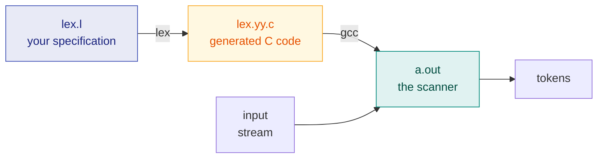

# 5. Lexical Analysis & a Lex Program

> ✅ **Checked against the class notes** (`Compiler notes.pdf`). Definitions, rules and notation match. The teacher's own worked examples are in [Ch. 10](10-class-notes-worked-examples.md).
> **Syllabus:** *a lex program*

---

## 🎯 In one line

A **Lex program has three sections separated by `%%`** — definitions, rules (pattern → action), and user subroutines — and Lex turns your regular expressions into a DFA-based scanner automatically.

---

## 1. The role of the lexical analyser

The **lexical analyser** (scanner) is the **first phase** of a compiler. It:

1. Reads the source program as a **stream of characters**
2. Groups them into **lexemes**
3. Produces a **token** for each lexeme
4. **Removes** whitespace and comments
5. Enters identifiers into the **symbol table**
6. Reports **lexical errors** (illegal characters, malformed constants)

```
   characters          ┌──────────────┐        tokens
   ──────────────────► │   LEXICAL    │ ─────────────────►  PARSER
   int x = 10;         │   ANALYSER   │   ⟨int⟩⟨id,x⟩⟨=⟩⟨num,10⟩⟨;⟩
                       └──────┬───────┘
                              ▼
                        Symbol Table
```

---

## 2. Token, Lexeme, Pattern ⭐⭐⭐

This distinction is asked almost every time.

| Term | Definition |
|---|---|
| **Token** | A **category / class** of lexical unit — a pair ⟨token-name, attribute-value⟩ |
| **Lexeme** | The **actual sequence of characters** in the source that matches a pattern |
| **Pattern** | The **rule** (a regular expression) describing the form all lexemes of a token may take |

### Example — `int count = 100;`

| Lexeme | Token | Pattern |
|---|---|---|
| `int` | **keyword** | the literal string `int` |
| `count` | **id** | `letter (letter \| digit)*` |
| `=` | **assign_op** | the literal `=` |
| `100` | **number** | `digit+` |
| `;` | **semicolon** | the literal `;` |

> 💡 **The analogy that makes it stick:** *pattern* is the **definition in a dictionary**, *lexeme* is the **word as it appears on the page**, and *token* is the **part of speech**. `count`, `total` and `x` are three different **lexemes** but all the same **token** (`id`), because they match the same **pattern**.

---

## 3. What is Lex? ⭐

**Lex** is a **lexical analyser generator**. You give it a specification of tokens as **regular expressions**; it generates a **C program** (`lex.yy.c`) containing a function `yylex()` that scans input and returns tokens.



**Commands:**

```bash
lex  prog.l          # generates lex.yy.c
gcc  lex.yy.c -ll    # compile (-ll links the lex library)
./a.out < input.txt  # run
```

> 📌 **Internally, Lex does exactly what Chapters 2–4 describe:** it converts your regular expressions to an **NFA** (Thompson's construction), then to a **DFA** (subset construction), then minimises it, and emits a table-driven scanner. **Lex is the practical payoff of the automata theory.**

---

## 4. Structure of a Lex program ⭐⭐⭐

**Three sections, separated by `%%`:**

```
        ┌─────────────────────────────────┐
        │  DEFINITION SECTION             │  ← declarations, %{ C code %},
        │                                 │     regex shorthand macros
        ├─────────────────────────────────┤
        │  %%                             │  ← mandatory separator
        ├─────────────────────────────────┤
        │  RULES SECTION                  │  ← pattern { action }
        │                                 │     the heart of the program
        ├─────────────────────────────────┤
        │  %%                             │  ← optional (needed if section 3 exists)
        ├─────────────────────────────────┤
        │  USER SUBROUTINES SECTION       │  ← main(), helper C functions
        └─────────────────────────────────┘
```

| Section | Contents |
|---|---|
| **1. Definition section** | C declarations enclosed in `%{ … %}` (copied verbatim into the output), plus **regular definitions** — named shorthand for regular expressions |
| **2. Rules section** | A list of `pattern { action }` pairs. When the pattern matches, the C action executes. |
| **3. User subroutines section** | C code, typically `main()` which calls `yylex()`, plus any helper functions |

### Built-in variables and functions ⭐

| Name | Meaning |
|---|---|
| **`yytext`** | A **char pointer to the matched lexeme** |
| **`yyleng`** | The **length** of the matched lexeme |
| **`yylex()`** | The generated scanner function — call it to start scanning |
| **`yyin`** | Input file pointer (defaults to `stdin`) |
| **`yyout`** | Output file pointer (defaults to `stdout`) |
| **`yywrap()`** | Called at end of input; return 1 to stop |
| **`ECHO`** | Shorthand for `fprintf(yyout, "%s", yytext)` |

### The two matching rules ⭐⭐

When several patterns could match, Lex resolves it by:

1. **Longest match wins.** Lex always prefers the **longest** possible match.
2. **If two patterns match the same length, the one listed FIRST wins.**

> ⚠️ **This is why keywords must be listed BEFORE the identifier rule.** `int` matches both the keyword pattern and the identifier pattern with the same length (3) — so whichever is written first wins. Put keywords first, or every keyword will be reported as an identifier. **This is the classic exam trap.**

---

## 5. Lex regular expression syntax ⭐

| Notation | Meaning | Example |
|---|---|---|
| `.` | Any character **except newline** | |
| `[abc]` | Character class — any one of a, b, c | |
| `[a-z]` | Range | |
| `[^abc]` | **Negated** class — any char except a, b, c | |
| `r*` | **Zero** or more of `r` | |
| `r+` | **One** or more of `r` | |
| `r?` | Zero or **one** of `r` (optional) | |
| `r{2,5}` | Between 2 and 5 occurrences | |
| `r1\|r2` | Union — `r1` **or** `r2` | |
| `r1r2` | Concatenation | |
| `^r` | `r` at the **beginning of a line** | |
| `r$` | `r` at the **end of a line** | |
| `"…"` | Literal string | `"++"` |
| `\` | Escape | `\n`, `\t`, `\.` |
| `()` | Grouping | |
| `{name}` | Expand a **regular definition** | `{digit}+` |

---

## 6. Complete annotated Lex program ⭐⭐⭐

**A lexical analyser for a small subset of C.** This is the kind of program asked for in exams.

```lex
/* ============ SECTION 1: DEFINITIONS ============ */
%{
    /* C code copied verbatim into lex.yy.c */
    #include <stdio.h>
    int keyword_count = 0, id_count = 0, num_count = 0, op_count = 0;
%}

/* Regular definitions — shorthand used in section 2 as {name} */
letter      [A-Za-z_]
digit       [0-9]
id          {letter}({letter}|{digit})*
number      {digit}+(\.{digit}+)?
whitespace  [ \t\n]+

%%
/* ============ SECTION 2: RULES ============ */
/* pattern                action                                  */

"int"|"float"|"char"|"if"|"else"|"while"|"for"|"return"  {
                    /* KEYWORDS FIRST — before {id}, or they would
                       be matched as identifiers (same length,
                       so the first-listed rule wins)             */
                    printf("KEYWORD      : %s\n", yytext);
                    keyword_count++;
                }

"//".*          { /* single-line comment — discard, no action */ }

"/*"([^*]|\*[^/])*"*/"  { /* multi-line comment — discard */ }

{number}        {
                    printf("NUMBER       : %s\n", yytext);
                    num_count++;
                }

{id}            {
                    printf("IDENTIFIER   : %s  (length %d)\n",
                           yytext, yyleng);
                    id_count++;
                }

"=="|"!="|"<="|">="|"&&"|"||"  {
                    /* MULTI-CHARACTER operators before single ones,
                       so that "==" is not split into "=" "="       */
                    printf("REL/LOG OP   : %s\n", yytext);
                    op_count++;
                }

[+\-*/=<>]      {
                    printf("OPERATOR     : %s\n", yytext);
                    op_count++;
                }

[(){}\[\];,]    { printf("PUNCTUATION  : %s\n", yytext); }

\"[^\"]*\"      { printf("STRING       : %s\n", yytext); }

{whitespace}    { /* ignore whitespace entirely */ }

.               {
                    /* catch-all: any character not matched above */
                    printf("ERROR        : illegal character '%s'\n",
                           yytext);
                }

%%
/* ============ SECTION 3: USER SUBROUTINES ============ */
int main(int argc, char **argv)
{
    if (argc > 1) {
        yyin = fopen(argv[1], "r");   /* read from a file */
        if (!yyin) { perror("fopen"); return 1; }
    }

    yylex();                          /* run the scanner */

    printf("\n--- Summary ---\n");
    printf("Keywords    : %d\n", keyword_count);
    printf("Identifiers : %d\n", id_count);
    printf("Numbers     : %d\n", num_count);
    printf("Operators   : %d\n", op_count);
    return 0;
}

int yywrap(void) { return 1; }        /* stop at end of input */
```

### Sample run

**Input:**
```c
int count = 100;
if (count >= 50) count = count + 1;
```

**Output:**
```
KEYWORD      : int
IDENTIFIER   : count  (length 5)
OPERATOR     : =
NUMBER       : 100
PUNCTUATION  : ;
KEYWORD      : if
PUNCTUATION  : (
IDENTIFIER   : count  (length 5)
REL/LOG OP   : >=
NUMBER       : 50
PUNCTUATION  : )
IDENTIFIER   : count  (length 5)
OPERATOR     : =
IDENTIFIER   : count  (length 5)
OPERATOR     : +
NUMBER       : 1
PUNCTUATION  : ;

--- Summary ---
Keywords    : 2
Identifiers : 4
Numbers     : 3
Operators   : 4
```

### The two ordering decisions ⭐⭐

Note carefully **why** the rules are in this order:

| Rule placed early | Reason |
|---|---|
| **Keywords before `{id}`** | `int` matches both with length 3 → the **first-listed** rule wins |
| **`==` before `=`** | Longest match handles this, but listing multi-char operators first makes the intent explicit and is safer |
| **`.` catch-all LAST** | It matches any single character, so anywhere earlier it would swallow everything |

---

## 7. Shorter exam-sized Lex programs ⭐

### (a) Count lines, words and characters

```lex
%{
    int lines = 0, words = 0, chars = 0;
%}
%%
\n          { lines++; chars++; }
[^ \t\n]+   { words++; chars += yyleng; }
.           { chars++; }
%%
int main() {
    yylex();
    printf("Lines=%d Words=%d Chars=%d\n", lines, words, chars);
    return 0;
}
int yywrap() { return 1; }
```

### (b) Count vowels and consonants

```lex
%{
    int vowels = 0, consonants = 0;
%}
%%
[aeiouAEIOU]              { vowels++; }
[a-zA-Z]                  { consonants++; }
.|\n                      { /* ignore everything else */ }
%%
int main() {
    yylex();
    printf("Vowels=%d Consonants=%d\n", vowels, consonants);
    return 0;
}
int yywrap() { return 1; }
```

### (c) Recognise valid identifiers

```lex
%%
^[A-Za-z_][A-Za-z0-9_]*$   { printf("%s : VALID identifier\n", yytext); }
^.*$                       { printf("%s : INVALID identifier\n", yytext); }
\n                         { /* skip newline */ }
%%
int main() { yylex(); return 0; }
int yywrap() { return 1; }
```

> 💡 Note the use of **`^`** and **`$`** to anchor the pattern to a whole line — and the invalid-case rule placed **second**, so a valid identifier is matched first.

---

## 8. Lexical errors and recovery

| Error | Example |
|---|---|
| **Illegal character** | `@` in a language that does not use it |
| **Unterminated string** | `"hello` with no closing quote |
| **Unterminated comment** | `/*` with no `*/` |
| **Malformed number** | `12.34.56` |
| **Identifier too long** | exceeding the implementation limit |

**Recovery strategies:**

| Strategy | Action |
|---|---|
| **Panic mode** | Delete successive characters until a well-formed token is found |
| **Deletion** | Delete one extraneous character |
| **Insertion** | Insert a missing character |
| **Replacement** | Replace an incorrect character with a correct one |
| **Transposition** | Swap two adjacent characters |

---

## 9. Common exam questions

1. **What is the role of the lexical analyser?** ⭐⭐
2. **Differentiate token, lexeme and pattern with examples.** ⭐⭐⭐ *(almost guaranteed)*
3. **Explain the structure of a Lex program.** ⭐⭐⭐ → the **three sections separated by `%%`**.
4. **Write a Lex program to …** count vowels / identify keywords and identifiers / count lines and words / recognise valid identifiers. ⭐⭐⭐
5. **What are `yytext`, `yyleng`, `yylex()`, `yyin`, `yywrap()`?** ⭐⭐
6. **How does Lex resolve ambiguity between two matching patterns?** ⭐⭐ → **longest match**, then **first listed**.
7. **Why must keywords be listed before identifiers in a Lex program?** ⭐⭐ → same match length, so the first-listed rule wins.
8. **What are lexical errors? Explain error recovery strategies.** ⭐
9. **How does Lex work internally?** → regex → NFA → DFA → table-driven scanner.

---

## ⚡ Quick revision

- The lexical analyser turns **characters into tokens**, strips whitespace/comments, fills the **symbol table**.
- **Token** = the **category** · **Lexeme** = the **actual characters** · **Pattern** = the **rule (regex)**.
- **Lex** is a **lexical analyser generator**: `lex.l` → `lex.yy.c` → compile with `-ll` → scanner.
- **Three sections separated by `%%`:**
  1. **Definitions** — `%{ C code %}` + regular definitions
  2. **Rules** — `pattern { action }`
  3. **User subroutines** — `main()`, helpers
- **Built-ins:** `yytext` (matched lexeme), `yyleng` (its length), `yylex()` (the scanner), `yyin`/`yyout`, `yywrap()`, `ECHO`.
- ⭐ **Disambiguation: (1) LONGEST match wins. (2) On a tie, the FIRST-listed rule wins.**
- ⚠️ **Keywords must be listed before the identifier rule**, and the `.` catch-all must be **last**.
- Internally Lex builds **regex → NFA → DFA → minimal DFA** — exactly Chapters 2–4.
- **Error recovery:** panic mode, deletion, insertion, replacement, transposition.

---

**Previous:** [← 4. Constructing Automata](04-automata-construction-from-strings.md) · **Next:** [6. Grammars & Eliminating Ambiguity →](06-cfg-and-ambiguity-elimination.md)
