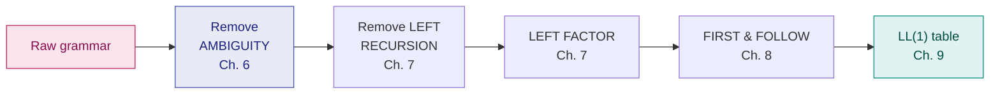

# 6. Grammars & Eliminating Ambiguity

> ✅ **Checked against the class notes** (`Compiler notes.pdf`). Definitions, rules and notation match. The teacher's own worked examples are in [Ch. 10](10-class-notes-worked-examples.md).
> **Syllabus:** *eliminating ambiguity*

---

## 🎯 In one line

A grammar is **ambiguous** if some string has **two or more parse trees** — and you remove the ambiguity by **encoding precedence and associativity into the grammar's levels**.

---

## 1. Context-Free Grammar (CFG) ⭐⭐

A CFG is a **4-tuple**:

$$\boxed{G = (V,\ T,\ P,\ S)}$$

| Symbol | Name | Meaning |
|---|---|---|
| $V$ | **Variables / Non-terminals** | Syntactic categories, written as capitals ($E$, $T$, $F$) |
| $T$ | **Terminals** | The actual tokens from the lexer (`id`, `+`, `*`, `(`, `)`) |
| $P$ | **Productions** | Rules of the form $A \to \alpha$ where $A \in V$ and $\alpha \in (V\cup T)^*$ |
| $S$ | **Start symbol** | $S \in V$ |

**Example — a grammar for arithmetic expressions:**

$$E \to E + E \mid E * E \mid (E) \mid \texttt{id}$$

Here $V = \{E\}$, $T = \{+, *, (, ), \texttt{id}\}$, $S = E$.

---

## 2. Derivations ⭐⭐

A **derivation** repeatedly replaces a non-terminal using a production until only terminals remain.

| Type | Rule |
|---|---|
| **Leftmost derivation (LMD)** | Always expand the **leftmost** non-terminal |
| **Rightmost derivation (RMD)** | Always expand the **rightmost** non-terminal |

### Example — derive `id + id * id`

**Leftmost derivation:**

$$E \Rightarrow E + E \Rightarrow \texttt{id} + E \Rightarrow \texttt{id} + E * E \Rightarrow \texttt{id} + \texttt{id} * E \Rightarrow \texttt{id} + \texttt{id} * \texttt{id}$$

**Rightmost derivation:**

$$E \Rightarrow E + E \Rightarrow E + E * E \Rightarrow E + E * \texttt{id} \Rightarrow E + \texttt{id} * \texttt{id} \Rightarrow \texttt{id} + \texttt{id} * \texttt{id}$$

### Notation

| Symbol | Meaning |
|---|---|
| $\Rightarrow$ | derives in **one** step |
| $\Rightarrow^*$ | derives in **zero or more** steps |
| $\Rightarrow^+$ | derives in **one or more** steps |

---

## 3. Parse Trees ⭐

A **parse tree** is a graphical representation of a derivation:

- The **root** is the start symbol
- **Internal nodes** are non-terminals
- **Leaves** are terminals (or $\varepsilon$), and read left-to-right they give the **yield** — the derived string

> 📌 A parse tree **discards the order** in which productions were applied. That is why a leftmost and a rightmost derivation of the same string can produce the **same** parse tree.

---

## 4. Ambiguity ⭐⭐⭐

> **A grammar is AMBIGUOUS if there exists at least one string that has two or more distinct parse trees** (equivalently, two or more distinct leftmost derivations, or two or more distinct rightmost derivations).

### Proving ambiguity — the standard method ⭐⭐

To prove a grammar is ambiguous, **exhibit one string with two different parse trees**. That is sufficient; you do not need to say anything about other strings.

### Worked proof — $E \to E + E \mid E * E \mid (E) \mid \texttt{id}$

Take the string **`id + id * id`**.

**Parse tree 1** — treats it as `id + (id * id)` ✅ *mathematically correct*

```
                E
             ╱  │  ╲
           E    +    E
           │       ╱ │ ╲
          id      E  *  E
                  │     │
                 id    id
```

**Parse tree 2** — treats it as `(id + id) * id` ❌ *mathematically wrong*

```
                E
             ╱  │  ╲
           E    *    E
        ╱  │  ╲      │
      E    +    E   id
      │         │
     id        id
```

**Two distinct parse trees for the same string ⇒ the grammar is ambiguous.** ∎

> ⚠️ **Why this matters so much in a compiler.** The parse tree determines the **generated code**. If the grammar is ambiguous, the compiler could legitimately compute `2 + 3 * 4` as either **14** or **20**. A compiler must be **deterministic**, so ambiguity must be eliminated before parsing.

### Other classic ambiguous grammars

| Grammar | Ambiguous string | Why |
|---|---|---|
| $S \to SS \mid a$ | `aaa` | Can group as `(aa)a` or `a(aa)` |
| $S \to aS \mid Sa \mid a$ | `aa` | Two derivations |
| $S \to a \mid Sa \mid bSS \mid SSb \mid SbS$ | several | Multiple routes |

---

## 5. Eliminating ambiguity — precedence and associativity ⭐⭐⭐

The standard cure is to **restructure the grammar into one level per precedence class**.

### The two rules

| Property | How to encode it |
|---|---|
| **Precedence** | Give each operator its **own non-terminal level**. **Lower precedence = higher (nearer the start symbol) in the grammar.** The tighter-binding operator goes **deeper**. |
| **Associativity** | **Left-associative** → make the production **left-recursive** ($E \to E + T$). **Right-associative** → make it **right-recursive** ($E \to T + E$). |

### The unambiguous expression grammar ⭐⭐⭐

**Memorise this grammar — it is used in nearly every parsing question.**

$$
\begin{aligned}
E &\to E + T \mid T &&\text{level 1: } + \text{ (lowest precedence, left-assoc)} \\
T &\to T * F \mid F &&\text{level 2: } * \text{ (higher precedence, left-assoc)} \\
F &\to (E) \mid \texttt{id} &&\text{level 3: primaries (highest)}
\end{aligned}
$$

**Why this works:**

| Design choice | Effect |
|---|---|
| $+$ at the **top** level, $*$ **below** it | $*$ binds tighter — it must be reduced first, so it sits **deeper** in the tree |
| $E \to E + T$ is **left**-recursive | $+$ is **left**-associative: `a-b-c` groups as `(a-b)-c` |
| $F \to (E)$ | Parentheses let you **override** the precedence by re-entering at the top |

**Now `id + id * id` has only ONE parse tree:**

```
                 E
              ╱  │  ╲
            E    +    T
            │      ╱ │ ╲
            T     T  *  F
            │     │     │
            F     F    id
            │     │
           id    id
```

✅ Unique, and it correctly means `id + (id * id)`.

### Extending to more operators

For the usual precedence ladder (lowest → highest):

$$
\begin{aligned}
E &\to E + T \mid E - T \mid T &&\text{additive, left-assoc} \\
T &\to T * F \mid T / F \mid F &&\text{multiplicative, left-assoc} \\
F &\to G\ \hat{}\ F \mid G &&\text{exponentiation, \textbf{RIGHT}-assoc} \\
G &\to (E) \mid \texttt{id} \mid \texttt{num}
\end{aligned}
$$

> 💡 **Note the exponentiation level:** $F \to G\ \hat{}\ F$ is **right**-recursive because `2^3^2` means `2^(3^2)`, not `(2^3)^2`. Compare with the left-recursive levels above. **The direction of recursion is exactly the associativity.**

---

## 6. The Dangling-Else problem ⭐⭐⭐

The most famous real-world ambiguity — and a very common exam question.

### The ambiguous grammar

$$stmt \to \textbf{if } expr \textbf{ then } stmt \mid \textbf{if } expr \textbf{ then } stmt \textbf{ else } stmt \mid other$$

### The ambiguous string

```
if E1 then if E2 then S1 else S2
```

**Which `if` does the `else` belong to?**

**Interpretation 1** — `else` binds to the **inner** `if` ✅ *what every real language chooses*

```
if E1 then
    if E2 then S1
    else S2
```

**Interpretation 2** — `else` binds to the **outer** `if` ❌

```
if E1 then
    if E2 then S1
else S2
```

Two parse trees for one string ⇒ **ambiguous**.

### The fix ⭐⭐

**Rule adopted by all real languages: match each `else` with the CLOSEST unmatched `then`.**

To encode this in the grammar, split statements into **matched** (fully closed, with an `else`) and **unmatched** (open, no `else`):

$$
\begin{aligned}
stmt &\to matched\_stmt \mid unmatched\_stmt \\
matched\_stmt &\to \textbf{if } expr \textbf{ then } matched\_stmt \textbf{ else } matched\_stmt \mid other \\
unmatched\_stmt &\to \textbf{if } expr \textbf{ then } stmt \\
&\ \ \mid \textbf{if } expr \textbf{ then } matched\_stmt \textbf{ else } unmatched\_stmt
\end{aligned}
$$

> ⭐ **The trick in one sentence:** a statement between `then` and `else` is forced to be a **matched** statement — so it can never be an `if` that is still waiting for its own `else`. That single restriction makes the closest-`then` rule the only possible parse.

---

## 7. Ambiguous vs Inherently Ambiguous ⭐

| Term | Meaning |
|---|---|
| **Ambiguous grammar** | *This particular grammar* has a string with two parse trees. Often **fixable** by rewriting. |
| **Inherently ambiguous language** | **Every** grammar for the language is ambiguous — it **cannot** be fixed. |

**Example of an inherently ambiguous language:**

$$L = \{a^nb^nc^md^m \mid n,m \ge 1\} \cup \{a^nb^mc^md^n \mid n,m \ge 1\}$$

> ⚠️ Also worth knowing: **ambiguity is undecidable** — there is **no algorithm** that can decide, for an arbitrary CFG, whether it is ambiguous. That is why we rely on standard patterns (precedence levels, the matched/unmatched split) rather than an automatic test.

---

## 8. Other grammar clean-ups ⭐

Before a grammar can be parsed, several other simplifications are usually applied:

| Problem | Meaning | Fix |
|---|---|---|
| **Ambiguity** | Two parse trees for one string | Precedence/associativity levels · matched/unmatched split — **this chapter** |
| **Left recursion** | $A \Rightarrow^+ A\alpha$ — a top-down parser loops forever | [Ch. 7](07-left-recursion-and-left-factoring.md) |
| **Common prefixes** | $A \to \alpha\beta_1 \mid \alpha\beta_2$ — parser cannot choose | **Left factoring**, [Ch. 7](07-left-recursion-and-left-factoring.md) |
| **Useless symbols** | Non-terminals that derive no terminal string, or are unreachable | Remove them |
| **$\varepsilon$-productions** | $A \to \varepsilon$ | Eliminate where required |
| **Unit productions** | $A \to B$ | Eliminate where required |



> ⭐ **This pipeline is the shape of the whole second half of your syllabus.** Exam questions frequently run the entire chain on one grammar.

---

## 9. Common exam questions

1. **Define a CFG (4-tuple).** ⭐⭐
2. **What is a leftmost / rightmost derivation? Give both for a string.** ⭐⭐
3. **Define an ambiguous grammar. Show that the given grammar is ambiguous.** ⭐⭐⭐ *(draw **two** parse trees for one string — that is the whole proof)*
4. **Remove the ambiguity from the given grammar.** ⭐⭐⭐ → introduce precedence levels + correct recursion direction.
5. **Write an unambiguous grammar for arithmetic expressions.** ⭐⭐⭐ → the $E, T, F$ grammar.
6. **Explain the dangling-else problem and how it is resolved.** ⭐⭐⭐
7. **How are precedence and associativity handled in a grammar?** ⭐⭐ → lower precedence higher up; left-assoc ⇒ left recursion, right-assoc ⇒ right recursion.
8. **What is an inherently ambiguous language?** ⭐
9. **Is ambiguity decidable?** → **No**, it is undecidable for arbitrary CFGs.

---

## ⚡ Quick revision

- **CFG = $(V, T, P, S)$** — non-terminals, terminals, productions, start symbol.
- **LMD** expands the **leftmost** non-terminal; **RMD** the **rightmost**.
- ⭐ **A grammar is ambiguous if some string has ≥ 2 distinct parse trees** (equivalently ≥ 2 LMDs or ≥ 2 RMDs).
- **To prove ambiguity: draw TWO parse trees for ONE string.** That is a complete proof.
- **Why it matters:** the parse tree decides the generated code — `2+3*4` could become 14 or 20.
- **Fix ambiguity with precedence + associativity:**
  - **Lower precedence = higher in the grammar**; tighter-binding operators go **deeper**.
  - **Left-associative ⇒ left-recursive** ($E \to E+T$) · **Right-associative ⇒ right-recursive** ($F \to G\,\hat{}\,F$).
- ⭐ **Memorise the standard unambiguous grammar:**
  $$E \to E+T \mid T \qquad T \to T*F \mid F \qquad F \to (E) \mid \texttt{id}$$
- **Dangling else:** `if E1 then if E2 then S1 else S2` — the `else` could bind to either `if`.
  - **Rule: match each `else` with the CLOSEST unmatched `then`.**
  - **Fix:** split into **matched** and **unmatched** statements; force the statement between `then` and `else` to be **matched**.
- **Inherently ambiguous language** = every grammar for it is ambiguous — unfixable.
- **Ambiguity is undecidable** for arbitrary CFGs.
- **Pipeline:** ambiguity → left recursion → left factoring → FIRST/FOLLOW → LL(1) table.

---

**Previous:** [← 5. Lexical Analysis & Lex](05-lexical-analysis-and-lex.md) · **Next:** [7. Left Recursion & Left Factoring →](07-left-recursion-and-left-factoring.md)
