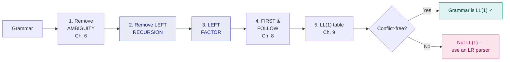

# 7. Eliminating Left Recursion & Left Factoring

> ⚠️ **Written from standard course knowledge.** No class material was supplied for Compiler Design.
> **Syllabus:** *eliminating left recursion*

---

## 🎯 In one line

**Left recursion** makes a top-down parser loop forever — remove it by flipping to right recursion; **common prefixes** make it unable to choose — remove them by **left factoring**.

---

## 1. What is left recursion? ⭐⭐

A grammar is **left-recursive** if a non-terminal $A$ can derive a string that **begins with $A$ itself**:

$$A \Rightarrow^+ A\alpha$$

| Type | Form | Example |
|---|---|---|
| **Direct (immediate)** | $A \to A\alpha$ — the recursion appears in **one** production | $E \to E + T$ |
| **Indirect** | $A \Rightarrow^+ A\alpha$ via **two or more** steps | $S \to Aa$, $A \to Sd$ |

### Why it is fatal for top-down parsing ⭐⭐

A **recursive-descent** or **predictive** parser (see [Ch. 9](09-predictive-parsing-ll1.md)) works by expanding the leftmost non-terminal. With $E \to E + T$:

```
   Parse E  →  expand to E + T
                 └─ parse E  →  expand to E + T
                                  └─ parse E  →  expand to E + T
                                                   └─ …  ∞ INFINITE LOOP
```

**The parser never consumes a single input symbol** before recursing again — so it loops forever without making progress.

> ⭐ **The one-line answer to "why eliminate left recursion?":** *A top-down parser expanding a left-recursive production calls itself without consuming any input, causing infinite recursion. Left recursion must therefore be removed before predictive parsing.*
>
> 📌 Note that **bottom-up (LR) parsers handle left recursion perfectly well** — in fact they *prefer* it. Removal is needed only for **top-down** parsing.

---

## 2. Eliminating DIRECT left recursion ⭐⭐⭐

### The general rule

Given productions where $\beta_i$ do **not** begin with $A$:

$$A \to A\alpha_1 \mid A\alpha_2 \mid \cdots \mid A\alpha_m \mid \beta_1 \mid \beta_2 \mid \cdots \mid \beta_n$$

Replace them with:

$$\boxed{
\begin{aligned}
A &\to \beta_1 A' \mid \beta_2 A' \mid \cdots \mid \beta_n A' \\
A' &\to \alpha_1 A' \mid \alpha_2 A' \mid \cdots \mid \alpha_m A' \mid \varepsilon
\end{aligned}}
$$

### The simple two-production case

$$A \to A\alpha \mid \beta \qquad\Longrightarrow\qquad A \to \beta A' \ , \quad A' \to \alpha A' \mid \varepsilon$$

### Why this works

Both versions generate exactly the same language: $\beta$ followed by **zero or more** $\alpha$'s, i.e. $\beta\alpha^*$.

```
   LEFT-recursive               RIGHT-recursive (after removal)

         A                            A
       ╱   ╲                        ╱   ╲
      A     α                      β     A'
    ╱   ╲                              ╱   ╲
   A     α                             α     A'
   │                                        ╱   ╲
   β                                       α     A'
                                                 │
   grows LEFTWARD                                ε
   (parser can't start)          grows RIGHTWARD
                                 (β is consumed immediately ✓)
```

> 💡 **The insight:** after the rewrite, $A$ **immediately consumes $\beta$** before any recursion happens. Progress is guaranteed, so no infinite loop.

> ⚠️ **The cost:** the new grammar is **no longer left-associative** in its *structure*. For a calculator you must handle associativity in the **semantic actions** instead. The *language* is unchanged; the *parse tree shape* is not.

---

## 3. Worked Example 1 — the standard expression grammar ⭐⭐⭐

**Eliminate left recursion from:**

$$E \to E + T \mid T \qquad T \to T * F \mid F \qquad F \to (E) \mid \texttt{id}$$

### For $E$

$$E \to \underbrace{E + T}_{A\alpha_1} \mid \underbrace{T}_{\beta_1} \qquad \alpha_1 = {+T}, \quad \beta_1 = T$$

$$E \to T E' \qquad E' \to + T E' \mid \varepsilon$$

### For $T$

$$T \to \underbrace{T * F}_{A\alpha_1} \mid \underbrace{F}_{\beta_1} \qquad \alpha_1 = {*F}, \quad \beta_1 = F$$

$$T \to F T' \qquad T' \to * F T' \mid \varepsilon$$

### For $F$

$F \to (E) \mid \texttt{id}$ — **no left recursion**, leave unchanged.

### ✅ Final grammar

$$
\boxed{
\begin{aligned}
E &\to T E' \\
E' &\to + T E' \mid \varepsilon \\
T &\to F T' \\
T' &\to * F T' \mid \varepsilon \\
F &\to (E) \mid \texttt{id}
\end{aligned}}
$$

> ⭐ **Memorise this result.** This exact grammar is used for the FIRST/FOLLOW computation in [Ch. 8](08-first-and-follow.md) and the LL(1) parsing table in [Ch. 9](09-predictive-parsing-ll1.md). It is the single most-used grammar in compiler-design exams.

---

## 4. Eliminating INDIRECT left recursion ⭐⭐

### The algorithm

1. **Arrange** the non-terminals in some order $A_1, A_2, \dots, A_n$.
2. **For** $i = 1$ **to** $n$:
   - **For** $j = 1$ **to** $i-1$:
     - Replace each production $A_i \to A_j\gamma$ by $A_i \to \delta_1\gamma \mid \delta_2\gamma \mid \cdots$, where $A_j \to \delta_1 \mid \delta_2 \mid \cdots$ are all the current $A_j$-productions. *(substitution)*
   - Eliminate the **direct** left recursion among the $A_i$-productions.

> 💡 **What the algorithm is really doing:** substitution converts *hidden* (indirect) left recursion into *visible* (direct) left recursion, which you already know how to remove.

### Worked Example 2 ⭐⭐

**Eliminate left recursion from:**

$$S \to Aa \mid b \qquad\qquad A \to Ac \mid Sd \mid \varepsilon$$

**Spot the indirect recursion:** $A \Rightarrow Sd \Rightarrow Aad$ — so $A \Rightarrow^+ A\,(ad)$. Hidden left recursion ✓

**Order the non-terminals:** $A_1 = S$, $A_2 = A$.

---

**Step $i=1$ ($S$):** no $j$ to consider. $S \to Aa \mid b$ has **no direct** left recursion (it starts with $A$, not $S$). Leave it.

---

**Step $i=2$ ($A$), $j=1$ ($S$):** substitute the $S$-productions into $A \to Sd$.

Since $S \to Aa \mid b$:

$$A \to Sd \quad\text{becomes}\quad A \to Aad \mid bd$$

So the $A$-productions are now:

$$A \to Ac \mid Aad \mid bd \mid \varepsilon$$

**The recursion is now DIRECT** ✓

---

**Step $i=2$, eliminate direct left recursion on $A$:**

$$\alpha_1 = c, \quad \alpha_2 = ad \qquad\qquad \beta_1 = bd, \quad \beta_2 = \varepsilon$$

Applying the rule:

$$A \to bd\,A' \mid \varepsilon A' \qquad A' \to cA' \mid adA' \mid \varepsilon$$

Since $\varepsilon A' = A'$:

### ✅ Final grammar

$$
\boxed{
\begin{aligned}
S &\to Aa \mid b \\
A &\to bd\,A' \mid A' \\
A' &\to cA' \mid adA' \mid \varepsilon
\end{aligned}}
$$

> ⚠️ **Watch the $\beta = \varepsilon$ case.** When one of the $\beta$'s is $\varepsilon$, the new production is $A \to \varepsilon A'$, which simplifies to **$A \to A'$** — not $A \to \varepsilon$. Dropping the $A'$ here is a common and costly mistake.

---

## 5. Left Factoring ⭐⭐⭐

### The problem

A predictive parser looks at **one** lookahead token to choose a production. If two productions for the same non-terminal **start with the same symbols**, one token is not enough:

$$A \to \alpha\beta_1 \mid \alpha\beta_2$$

Seeing the first token of $\alpha$, the parser **cannot tell which production to use**.

### The rule

$$\boxed{A \to \alpha\beta_1 \mid \alpha\beta_2 \qquad\Longrightarrow\qquad A \to \alpha A' \ , \quad A' \to \beta_1 \mid \beta_2}$$

**General form** — if the productions are $A \to \alpha\beta_1 \mid \cdots \mid \alpha\beta_n \mid \gamma_1 \mid \cdots \mid \gamma_m$ where the $\gamma$'s do not start with $\alpha$:

$$A \to \alpha A' \mid \gamma_1 \mid \cdots \mid \gamma_m \qquad A' \to \beta_1 \mid \cdots \mid \beta_n$$

> ⭐ **Always factor the LONGEST common prefix**, and repeat until no two productions of any non-terminal share a first symbol.

> 💡 **The idea:** delay the decision. Consume the common prefix $\alpha$ first, and only then — with more input visible — decide between $\beta_1$ and $\beta_2$.

---

## 6. Worked Example 3 — left factoring the dangling-else grammar ⭐⭐

$$S \to iEtS \mid iEtSeS \mid a \qquad\qquad E \to b$$

*(Here $i$ = `if`, $t$ = `then`, $e$ = `else`.)*

**Common prefix:** $iEtS$ is shared by the first two productions.

$$\beta_1 = \varepsilon \ \text{(nothing after } iEtS), \qquad \beta_2 = eS$$

### ✅ Result

$$
\boxed{
\begin{aligned}
S &\to iEtS\,S' \mid a \\
S' &\to eS \mid \varepsilon \\
E &\to b
\end{aligned}}
$$

> 📌 This grammar is still **ambiguous** (it is the dangling-else grammar from [Ch. 6](06-cfg-and-ambiguity-elimination.md)) — left factoring fixes the **common-prefix** problem, not the **ambiguity**. They are two separate defects needing two separate fixes.

---

## 7. Worked Example 4 — nested left factoring ⭐⭐

**Left factor:**

$$A \to abB \mid aB \mid cdg \mid cdeB \mid cdfB$$

**Pass 1 — factor `a`** (from $abB$ and $aB$):

$$A \to aA' \mid cdg \mid cdeB \mid cdfB \qquad A' \to bB \mid B$$

**Pass 2 — factor `cd`** (from $cdg$, $cdeB$, $cdfB$):

$$A \to aA' \mid cdA'' \qquad A'' \to g \mid eB \mid fB$$

### ✅ Result

$$
\boxed{
\begin{aligned}
A &\to aA' \mid cdA'' \\
A' &\to bB \mid B \\
A'' &\to g \mid eB \mid fB
\end{aligned}}
$$

**Check:** no two productions of $A$, $A'$ or $A''$ begin with the same symbol ✓

---

## 8. Left recursion vs Left factoring ⭐⭐

| | **Left Recursion Removal** | **Left Factoring** |
|---|---|---|
| **Problem solved** | $A \Rightarrow^+ A\alpha$ — parser **loops forever** | $A \to \alpha\beta_1 \mid \alpha\beta_2$ — parser **cannot choose** |
| **Symptom** | Infinite recursion, no input consumed | Ambiguous choice with 1 lookahead token |
| **Transformation** | $A \to \beta A'$, $A' \to \alpha A' \mid \varepsilon$ | $A \to \alpha A'$, $A' \to \beta_1 \mid \beta_2$ |
| **New non-terminal has** | $\varepsilon$ **and** the $\alpha$'s | **only** the $\beta$'s (may contain $\varepsilon$) |
| Needed for | **Top-down** parsers only | **Top-down** parsers |
| Needed for LR parsers? | ❌ No — LR handles left recursion | Not required |

> ⚠️ **Do not confuse the two rewrites.** Both introduce a primed non-terminal, but:
> - **Left recursion:** the $\varepsilon$ goes in the **new** non-terminal, along with the $\alpha$'s. The $\beta$ stays with the **original**.
> - **Left factoring:** the common prefix $\alpha$ stays with the **original**; the differing tails $\beta_i$ go to the **new** one.

---

## 9. The order of operations ⭐



> ⭐ **Remove left recursion BEFORE left factoring.** Removing left recursion introduces new productions that can themselves create common prefixes, so factoring afterwards catches those too.
>
> ⚠️ **Even after both transformations, a grammar may still not be LL(1).** These steps are **necessary but not sufficient** — the real test is a conflict-free parsing table ([Ch. 9](09-predictive-parsing-ll1.md)).

---

## 10. Common exam questions

1. **What is left recursion? Why must it be eliminated?** ⭐⭐⭐ → infinite recursion in top-down parsing, no input consumed.
2. **Differentiate direct and indirect left recursion.** ⭐⭐
3. **Eliminate left recursion from the given grammar.** ⭐⭐⭐ *(the standard $E,T,F$ grammar is the most likely)*
4. **Eliminate indirect left recursion** from $S \to Aa \mid b$, $A \to Ac \mid Sd \mid \varepsilon$. ⭐⭐⭐
5. **State the general rule for eliminating left recursion.** ⭐⭐
6. **What is left factoring? Why is it needed?** ⭐⭐⭐
7. **Left factor the given grammar.** ⭐⭐⭐
8. **Differentiate left recursion removal and left factoring.** ⭐⭐
9. **Do LR parsers require left recursion removal?** → **No**, only top-down parsers do.

---

## ⚡ Quick revision

- **Left recursion:** $A \Rightarrow^+ A\alpha$. **Direct** = $A \to A\alpha$ in one production; **indirect** = via two or more steps.
- ⭐ **Why remove it:** a top-down parser expands $A$ to $A\alpha$ **without consuming any input** → **infinite recursion**.
- **LR (bottom-up) parsers do NOT need it removed** — they handle left recursion fine.
- ⭐ **Direct removal rule:**
  $$A \to A\alpha_1 \mid \cdots \mid A\alpha_m \mid \beta_1 \mid \cdots \mid \beta_n$$
  $$\Longrightarrow \quad A \to \beta_1A' \mid \cdots \mid \beta_nA' \qquad A' \to \alpha_1A' \mid \cdots \mid \alpha_mA' \mid \varepsilon$$
- **Simple case:** $A \to A\alpha \mid \beta \ \Longrightarrow\ A \to \beta A'$, $A' \to \alpha A' \mid \varepsilon$. Both generate $\beta\alpha^*$.
- ⭐ **Memorise the result for the standard grammar:**
  $$E \to TE' \quad E' \to +TE' \mid \varepsilon \quad T \to FT' \quad T' \to *FT' \mid \varepsilon \quad F \to (E) \mid \texttt{id}$$
- **Indirect removal:** order the non-terminals, **substitute** earlier ones into later ones to expose direct recursion, then remove it.
- ⚠️ If $\beta = \varepsilon$, the new production is $A \to \varepsilon A'$ = **$A \to A'$** — don't drop the $A'$.
- ⭐ **Left factoring:** $A \to \alpha\beta_1 \mid \alpha\beta_2 \ \Longrightarrow\ A \to \alpha A'$, $A' \to \beta_1 \mid \beta_2$. Factor the **longest** common prefix, and **repeat**.
- **Left recursion** fixes *looping*; **left factoring** fixes *choosing*. Different problems, different rewrites.
- **Order: ambiguity → left recursion → left factoring → FIRST/FOLLOW → LL(1) table.**
- These steps are **necessary but not sufficient** for LL(1).

---

**Previous:** [← 6. Grammars & Ambiguity](06-cfg-and-ambiguity-elimination.md) · **Next:** [8. FIRST & FOLLOW →](08-first-and-follow.md)
