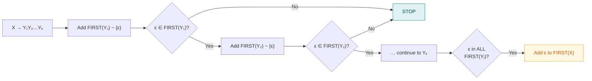

# 8. FIRST & FOLLOW

> ⚠️ **Written from standard course knowledge.** No class material was supplied for Compiler Design.
> **Syllabus:** *FIRST & FOLLOW*

---

## 🎯 In one line

**FIRST($\alpha$)** = the terminals that can **begin** a string derived from $\alpha$; **FOLLOW($A$)** = the terminals that can appear **immediately after** $A$ — together they decide which production a predictive parser picks.

---

## 1. Why we need them

A predictive parser sees non-terminal $A$ on the stack and one **lookahead token** $a$, and must choose a production.

| Situation | Which set answers it |
|---|---|
| "Can production $A \to \alpha$ start with $a$?" | **FIRST($\alpha$)** |
| "$A$ can vanish ($A \to \varepsilon$) — is it legal for $a$ to come next?" | **FOLLOW($A$)** |

> ⭐ **FOLLOW exists entirely because of ε-productions.** If a non-terminal can derive nothing, the parser must know which tokens legitimately follow it in order to decide whether to erase it. Without ε-productions, FIRST alone would be enough.

---

## 2. FIRST — definition and rules ⭐⭐⭐

> **FIRST($\alpha$)** is the set of **terminals** that begin the strings derivable from $\alpha$. If $\alpha \Rightarrow^* \varepsilon$, then $\varepsilon$ is also in FIRST($\alpha$).

### The rules

| # | Rule |
|---|---|
| **1** | If $X$ is a **terminal**, then $FIRST(X) = \{X\}$. |
| **2** | If $X \to \varepsilon$ is a production, add $\varepsilon$ to $FIRST(X)$. |
| **3** | If $X \to Y_1Y_2\dots Y_k$: add $FIRST(Y_1)\setminus\{\varepsilon\}$. If $\varepsilon \in FIRST(Y_1)$, also add $FIRST(Y_2)\setminus\{\varepsilon\}$; if $\varepsilon \in FIRST(Y_2)$ too, also add $FIRST(Y_3)\setminus\{\varepsilon\}$, and so on. **If $\varepsilon \in FIRST(Y_i)$ for ALL $i$, add $\varepsilon$ to $FIRST(X)$.** |

> 💡 **The mental model:** walk left to right through the right-hand side. **Keep going only while the symbol can vanish.** The moment you hit a symbol that cannot derive $\varepsilon$, stop.

---

## 3. FOLLOW — definition and rules ⭐⭐⭐

> **FOLLOW($A$)** is the set of **terminals** that can appear **immediately to the right of $A$** in some derivation from the start symbol. If $A$ can be the rightmost symbol, then **`$`** (end of input) is in FOLLOW($A$).

### The rules

| # | Rule |
|---|---|
| **1** | Place **`$`** in $FOLLOW(S)$, where $S$ is the **start symbol**. |
| **2** | If $A \to \alpha B \beta$, add $FIRST(\beta)\setminus\{\varepsilon\}$ to $FOLLOW(B)$. |
| **3** | If $A \to \alpha B$ (B at the **end**), **or** $A \to \alpha B\beta$ where $\varepsilon \in FIRST(\beta)$, then add **$FOLLOW(A)$** to $FOLLOW(B)$. |

### ⚠️ The three rules that stop most mistakes

> 1. **$\varepsilon$ is NEVER in a FOLLOW set.** Always strip it when copying from a FIRST set.
> 2. **FOLLOW is only computed for non-terminals** — never for terminals.
> 3. **Rule 3 applies even when $\beta$ is non-empty**, as long as $\beta$ can derive $\varepsilon$. This is the most commonly missed case.

### Order of work ⭐

**Always compute ALL the FIRST sets before starting FOLLOW** — rule 2 needs them. Then compute FOLLOW **iteratively** until nothing changes (rule 3 can propagate backwards, so one pass may not be enough).

---

## 4. Worked Example 1 — the standard expression grammar ⭐⭐⭐

**Grammar** (after left-recursion removal from [Ch. 7](07-left-recursion-and-left-factoring.md)):

$$
\begin{aligned}
E &\to T E' \\
E' &\to + T E' \mid \varepsilon \\
T &\to F T' \\
T' &\to * F T' \mid \varepsilon \\
F &\to (E) \mid \texttt{id}
\end{aligned}
$$

### Step 1 — FIRST sets (work from the "bottom" up)

**$FIRST(F)$:** $F \to (E) \mid \texttt{id}$. Both RHS start with terminals.
$$FIRST(F) = \{\ (\ ,\ \texttt{id}\ \}$$

**$FIRST(T')$:** $T' \to *FT' \mid \varepsilon$. First production starts with `*`; second is $\varepsilon$.
$$FIRST(T') = \{\ *\ ,\ \varepsilon\ \}$$

**$FIRST(T)$:** $T \to FT'$. Add $FIRST(F)\setminus\{\varepsilon\}$. Is $\varepsilon \in FIRST(F)$? **No** → stop.
$$FIRST(T) = \{\ (\ ,\ \texttt{id}\ \}$$

**$FIRST(E')$:** $E' \to +TE' \mid \varepsilon$.
$$FIRST(E') = \{\ +\ ,\ \varepsilon\ \}$$

**$FIRST(E)$:** $E \to TE'$. Add $FIRST(T)\setminus\{\varepsilon\}$. Is $\varepsilon \in FIRST(T)$? **No** → stop.
$$FIRST(E) = \{\ (\ ,\ \texttt{id}\ \}$$

### Step 2 — FOLLOW sets

**$FOLLOW(E)$:**
- Rule 1: $E$ is the start symbol → add **`$`**
- From $F \to (E)$: $E$ is followed by `)` → add **`)`**

$$FOLLOW(E) = \{\ \$\ ,\ )\ \}$$

**$FOLLOW(E')$:**
- From $E \to TE'$: $E'$ is at the **end** → rule 3 → add $FOLLOW(E) = \{\$, )\}$
- From $E' \to +TE'$: $E'$ at the end → add $FOLLOW(E')$ (no new information)

$$FOLLOW(E') = \{\ \$\ ,\ )\ \}$$

**$FOLLOW(T)$:**
- From $E \to TE'$: $T$ is followed by $E'$ → rule 2 → add $FIRST(E')\setminus\{\varepsilon\} = \{+\}$
- **Since $\varepsilon \in FIRST(E')$** → rule 3 → also add $FOLLOW(E) = \{\$, )\}$ ⭐
- From $E' \to +TE'$: same situation → $\{+\}$ and $FOLLOW(E') = \{\$, )\}$

$$FOLLOW(T) = \{\ +\ ,\ \$\ ,\ )\ \}$$

**$FOLLOW(T')$:**
- From $T \to FT'$: $T'$ at the **end** → add $FOLLOW(T) = \{+, \$, )\}$
- From $T' \to *FT'$: $T'$ at the end → add $FOLLOW(T')$ (nothing new)

$$FOLLOW(T') = \{\ +\ ,\ \$\ ,\ )\ \}$$

**$FOLLOW(F)$:**
- From $T \to FT'$: $F$ is followed by $T'$ → add $FIRST(T')\setminus\{\varepsilon\} = \{*\}$
- **Since $\varepsilon \in FIRST(T')$** → also add $FOLLOW(T) = \{+, \$, )\}$ ⭐
- From $T' \to *FT'$: same → nothing new

$$FOLLOW(F) = \{\ *\ ,\ +\ ,\ \$\ ,\ )\ \}$$

### ✅ The answer table ⭐⭐⭐

| Non-terminal | **FIRST** | **FOLLOW** |
|---|---|---|
| $E$ | $\{\ (\ ,\ \texttt{id}\ \}$ | $\{\ \$\ ,\ )\ \}$ |
| $E'$ | $\{\ +\ ,\ \varepsilon\ \}$ | $\{\ \$\ ,\ )\ \}$ |
| $T$ | $\{\ (\ ,\ \texttt{id}\ \}$ | $\{\ +\ ,\ \$\ ,\ )\ \}$ |
| $T'$ | $\{\ *\ ,\ \varepsilon\ \}$ | $\{\ +\ ,\ \$\ ,\ )\ \}$ |
| $F$ | $\{\ (\ ,\ \texttt{id}\ \}$ | $\{\ *\ ,\ +\ ,\ \$\ ,\ )\ \}$ |

> ⭐ **Memorise this table.** It is used directly to build the LL(1) parsing table in [Ch. 9](09-predictive-parsing-ll1.md), and this exact grammar appears in exam after exam.
>
> 💡 **A useful sanity pattern:** FOLLOW sets **grow as you go deeper** — $FOLLOW(E) \subseteq FOLLOW(T) \subseteq FOLLOW(F)$. That is because $F$ sits inside $T$, which sits inside $E$, so $F$ inherits everything that can follow the others plus `*`. If your sets don't nest like this, recheck rule 3.

---

## 5. Worked Example 2 — a grammar full of ε ⭐⭐

**Grammar:**

$$S \to ABC \qquad A \to a \mid \varepsilon \qquad B \to b \mid \varepsilon \qquad C \to c$$

### FIRST sets

$$FIRST(A) = \{a, \varepsilon\} \qquad FIRST(B) = \{b, \varepsilon\} \qquad FIRST(C) = \{c\}$$

**$FIRST(S)$:** $S \to ABC$ — walk left to right:
- Add $FIRST(A)\setminus\{\varepsilon\} = \{a\}$
- $\varepsilon \in FIRST(A)$ ✓ → continue. Add $FIRST(B)\setminus\{\varepsilon\} = \{b\}$
- $\varepsilon \in FIRST(B)$ ✓ → continue. Add $FIRST(C) = \{c\}$
- $\varepsilon \notin FIRST(C)$ → **stop**, and do **not** add $\varepsilon$

$$FIRST(S) = \{a, b, c\}$$

### FOLLOW sets

**$FOLLOW(S)$:** start symbol → $\{\$\}$

**$FOLLOW(A)$:** from $S \to ABC$, $A$ is followed by $BC$:
- Add $FIRST(B)\setminus\{\varepsilon\} = \{b\}$
- $\varepsilon \in FIRST(B)$ → also add $FIRST(C) = \{c\}$
- $\varepsilon \notin FIRST(C)$ → stop

$$FOLLOW(A) = \{b, c\}$$

**$FOLLOW(B)$:** from $S \to ABC$, $B$ is followed by $C$: add $FIRST(C) = \{c\}$. $\varepsilon \notin FIRST(C)$, so rule 3 does not apply.

$$FOLLOW(B) = \{c\}$$

**$FOLLOW(C)$:** from $S \to ABC$, $C$ is at the **end** → add $FOLLOW(S) = \{\$\}$

$$FOLLOW(C) = \{\$\}$$

### ✅ Answer

| Non-terminal | **FIRST** | **FOLLOW** |
|---|---|---|
| $S$ | $\{a, b, c\}$ | $\{\$\}$ |
| $A$ | $\{a, \varepsilon\}$ | $\{b, c\}$ |
| $B$ | $\{b, \varepsilon\}$ | $\{c\}$ |
| $C$ | $\{c\}$ | $\{\$\}$ |

> ⭐ **This example is the one to study for the ε-chaining rule.** Because both $A$ and $B$ can vanish, $FIRST(S)$ had to absorb from all three symbols, and $FOLLOW(A)$ had to look past $B$ to reach $C$.

---

## 6. Worked Example 3 — a grammar where ε reaches the end ⭐

**Grammar:**

$$S \to aAB \qquad A \to bA \mid \varepsilon \qquad B \to c \mid \varepsilon$$

### FIRST

$$FIRST(A) = \{b, \varepsilon\} \qquad FIRST(B) = \{c, \varepsilon\} \qquad FIRST(S) = \{a\}$$

*(For $S \to aAB$ the first symbol is the terminal `a`, so we stop immediately.)*

### FOLLOW

**$FOLLOW(S) = \{\$\}$**

**$FOLLOW(A)$:** from $S \to aAB$, $A$ is followed by $B$:
- Add $FIRST(B)\setminus\{\varepsilon\} = \{c\}$
- **$\varepsilon \in FIRST(B)$** → also add $FOLLOW(S) = \{\$\}$ ⭐
- From $A \to bA$: $A$ at the end → add $FOLLOW(A)$ (nothing new)

$$FOLLOW(A) = \{c, \$\}$$

**$FOLLOW(B)$:** from $S \to aAB$, $B$ is at the **end** → add $FOLLOW(S) = \{\$\}$

$$FOLLOW(B) = \{\$\}$$

| Non-terminal | **FIRST** | **FOLLOW** |
|---|---|---|
| $S$ | $\{a\}$ | $\{\$\}$ |
| $A$ | $\{b, \varepsilon\}$ | $\{c, \$\}$ |
| $B$ | $\{c, \varepsilon\}$ | $\{\$\}$ |

---

## 7. FIRST vs FOLLOW ⭐⭐

| | **FIRST($\alpha$)** | **FOLLOW($A$)** |
|---|---|---|
| Defined for | Any string $\alpha$ of grammar symbols | **Non-terminals only** |
| Meaning | Terminals that can **begin** $\alpha$ | Terminals that can come **immediately after** $A$ |
| Can contain $\varepsilon$? | ✅ **Yes** (if $\alpha \Rightarrow^* \varepsilon$) | ❌ **Never** |
| Can contain `$`? | ❌ No | ✅ **Yes** |
| Computed | Bottom-up through the grammar | Iteratively, **after** all FIRST sets |
| Used in the LL(1) table for | Every production $A \to \alpha$ | Only when $\varepsilon \in FIRST(\alpha)$ |

---

## 8. A reliable procedure for exams ⭐

**FIRST:**
1. Start with non-terminals whose productions begin with **terminals** — these are immediate.
2. Work **upward** to the non-terminals that depend on them.
3. For each production, walk the RHS **left to right**, continuing only while symbols can derive $\varepsilon$.
4. Add $\varepsilon$ to $FIRST(X)$ **only** if some production of $X$ derives $\varepsilon$ entirely.

**FOLLOW:**
1. Put **`$`** in $FOLLOW(\text{start symbol})$ — do this first, always.
2. Scan **every production** and, for each non-terminal $B$ on a RHS, look at what comes **after** it.
3. Apply rule 2 (add $FIRST(\beta)$ minus $\varepsilon$), then check rule 3 (at end, or $\beta$ derives $\varepsilon$ → add $FOLLOW(A)$).
4. **Repeat the whole scan** until no set changes.
5. **Strip every $\varepsilon$** from your FOLLOW sets before writing the answer.

---

## 9. Common exam questions

1. **Define FIRST and FOLLOW.** ⭐⭐
2. **State the rules for computing FIRST and FOLLOW.** ⭐⭐⭐
3. **Compute FIRST and FOLLOW for the given grammar.** ⭐⭐⭐ *(the most likely question — the $E,T,F$ grammar especially)*
4. **Why is FOLLOW needed?** ⭐⭐ → to decide whether to apply an **ε-production**.
5. **Can $\varepsilon$ be in a FOLLOW set?** ⭐ → **No, never.**
6. **Can `$` be in a FIRST set?** → No.
7. **Compute FIRST and FOLLOW, then construct the LL(1) parsing table.** ⭐⭐⭐ *(chains into [Ch. 9](09-predictive-parsing-ll1.md))*

---

## ⚡ Quick revision

- **FIRST($\alpha$)** = terminals that can **begin** a string derived from $\alpha$; includes $\varepsilon$ if $\alpha \Rightarrow^* \varepsilon$.
- **FOLLOW($A$)** = terminals that can appear **immediately after** $A$; includes **`$`** if $A$ can be last.
- **FIRST rules:** terminal → itself · $X \to \varepsilon$ → add $\varepsilon$ · $X \to Y_1\dots Y_k$ → add $FIRST(Y_1)$ minus $\varepsilon$, **continue past $Y_i$ only while $\varepsilon \in FIRST(Y_i)$**; add $\varepsilon$ only if **all** of them derive $\varepsilon$.
- **FOLLOW rules:** **`$`** in $FOLLOW(S)$ · $A \to \alpha B\beta$ → add $FIRST(\beta)$ minus $\varepsilon$ · $A \to \alpha B$, **or** $\varepsilon \in FIRST(\beta)$ → add $FOLLOW(A)$.
- ⚠️ **$\varepsilon$ is NEVER in FOLLOW.** **`$` is never in FIRST.** FOLLOW is for **non-terminals only**.
- ⚠️ **Rule 3 applies even when $\beta$ is non-empty**, provided $\beta$ can derive $\varepsilon$ — the most-missed case.
- **Compute all FIRST sets first**, then FOLLOW **iteratively** until stable.
- ⭐ **The standard grammar's answer:**
  - $FIRST$: $E, T, F = \{(, \texttt{id}\}$ · $E' = \{+, \varepsilon\}$ · $T' = \{*, \varepsilon\}$
  - $FOLLOW$: $E, E' = \{\$, )\}$ · $T, T' = \{+, \$, )\}$ · $F = \{*, +, \$, )\}$
- **Sanity check:** FOLLOW sets **nest** as you go deeper — $FOLLOW(E) \subseteq FOLLOW(T) \subseteq FOLLOW(F)$.
- **FOLLOW exists because of ε-productions** — it tells the parser when erasing a non-terminal is legal.

---

**Previous:** [← 7. Left Recursion & Left Factoring](07-left-recursion-and-left-factoring.md) · **Next:** [9. Predictive Parsing →](09-predictive-parsing-ll1.md)
