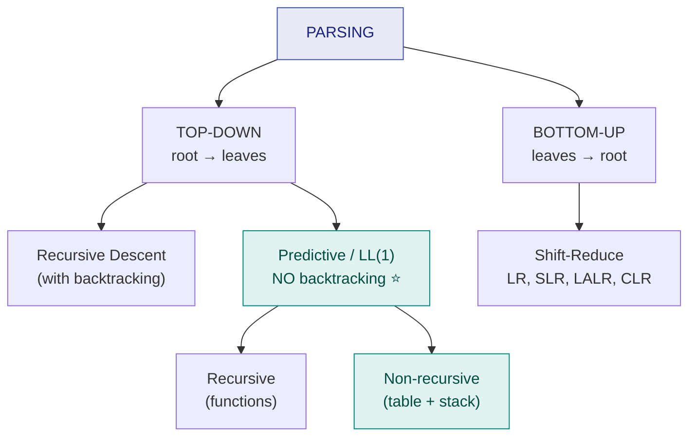
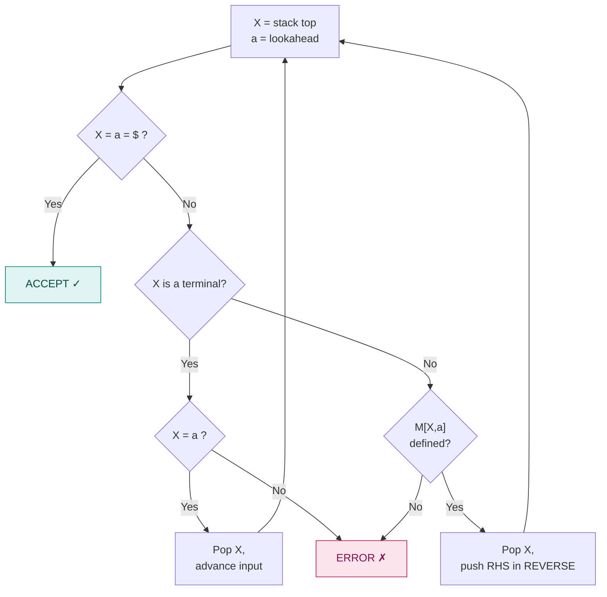

# 9. Predictive Parsing — LL(1)

> ⚠️ **Written from standard course knowledge.** No class material was supplied for Compiler Design.
> **Syllabus:** *predictive parsing*

---

## 🎯 In one line

A **predictive parser** uses a **stack**, an **input buffer** and a **parsing table** built from FIRST and FOLLOW — and it needs **no backtracking** because one lookahead token always determines the production.

---

## 1. Where predictive parsing sits



### What "LL(1)" means ⭐⭐

| Letter | Meaning |
|---|---|
| **First L** | Scan the input **L**eft to right |
| **Second L** | Produce a **L**eftmost derivation |
| **(1)** | Use **1** lookahead symbol to decide |

---

## 2. Components of a table-driven predictive parser ⭐⭐

```
                 INPUT BUFFER
        ┌───┬───┬───┬───┬───┬───┬───┐
        │id │ + │id │ * │id │ $ │   │   ← $ marks end of input
        └───┴───┴───┴───┴───┴───┴───┘
                  │ lookahead
                  ▼
   STACK      ┌──────────────┐
   ┌────┐     │              │
   │ E  │◄───►│  PREDICTIVE  │────►  OUTPUT
   │ E' │     │    PARSING    │       (productions used =
   │ $  │     │    PROGRAM    │        leftmost derivation)
   └────┘     └───────┬──────┘
   top at top         │
                      ▼
              ┌────────────────┐
              │ PARSING TABLE  │
              │    M[A, a]     │
              └────────────────┘
```

| Component | Role |
|---|---|
| **Input buffer** | The token stream, terminated by **`$`** |
| **Stack** | Holds grammar symbols; initialised with **`$`** then the **start symbol** (so the start symbol is on top) |
| **Parsing table** | A 2-D array $M[A, a]$ — for non-terminal $A$ and terminal $a$, it holds a production or **error** |
| **Output** | The sequence of productions applied = the leftmost derivation |

---

## 3. Constructing the LL(1) parsing table ⭐⭐⭐

> **For each production $A \to \alpha$:**
> 1. For each terminal $a \in FIRST(\alpha)$, set $M[A, a] = A \to \alpha$.
> 2. **If $\varepsilon \in FIRST(\alpha)$:** for each terminal $b \in FOLLOW(A)$, set $M[A, b] = A \to \alpha$. If **`$`** $\in FOLLOW(A)$, also set $M[A, \$] = A \to \alpha$.
> 3. Every **remaining blank** entry is an **error**.

### The LL(1) condition ⭐⭐

> **If any cell $M[A,a]$ receives MORE THAN ONE production, the grammar is NOT LL(1).**

A conflict means one lookahead token is not enough to choose — and the table-driven parser cannot work.

**A grammar is LL(1) if and only if**, for every pair of distinct productions $A \to \alpha \mid \beta$:

| Condition | Meaning |
|---|---|
| $FIRST(\alpha) \cap FIRST(\beta) = \emptyset$ | The two alternatives cannot start with the same terminal |
| At most one of $\alpha, \beta$ derives $\varepsilon$ | Only one alternative can vanish |
| If $\beta \Rightarrow^* \varepsilon$, then $FIRST(\alpha) \cap FOLLOW(A) = \emptyset$ | The non-vanishing option must not clash with what follows $A$ |

> ⚠️ **An ambiguous grammar or a left-recursive grammar can NEVER be LL(1).** That is why Chapters 6 and 7 come first. But note the reverse is not guaranteed — removing ambiguity and left recursion is **necessary but not sufficient**; the table is the real test.

---

## 4. Worked Example — building the table ⭐⭐⭐

**Grammar:**

$$
\begin{aligned}
E &\to T E' & E' &\to + T E' \mid \varepsilon \\
T &\to F T' & T' &\to * F T' \mid \varepsilon \\
F &\to (E) \mid \texttt{id}
\end{aligned}
$$

**FIRST and FOLLOW** (from [Ch. 8](08-first-and-follow.md)):

| Non-terminal | FIRST | FOLLOW |
|---|---|---|
| $E$ | $\{(, \texttt{id}\}$ | $\{\$, )\}$ |
| $E'$ | $\{+, \varepsilon\}$ | $\{\$, )\}$ |
| $T$ | $\{(, \texttt{id}\}$ | $\{+, \$, )\}$ |
| $T'$ | $\{*, \varepsilon\}$ | $\{+, \$, )\}$ |
| $F$ | $\{(, \texttt{id}\}$ | $\{*, +, \$, )\}$ |

### Filling the cells, production by production

| Production | $FIRST(\alpha)$ | Cells filled |
|---|---|---|
| $E \to TE'$ | $\{(, \texttt{id}\}$ | $M[E,\texttt{id}]$, $M[E,(\,]$ |
| $E' \to +TE'$ | $\{+\}$ | $M[E',+]$ |
| $E' \to \varepsilon$ | $\{\varepsilon\}$ → use $FOLLOW(E') = \{\$,)\}$ | $M[E',)\,]$, $M[E',\$]$ |
| $T \to FT'$ | $\{(, \texttt{id}\}$ | $M[T,\texttt{id}]$, $M[T,(\,]$ |
| $T' \to *FT'$ | $\{*\}$ | $M[T',*]$ |
| $T' \to \varepsilon$ | $\{\varepsilon\}$ → use $FOLLOW(T') = \{+,\$,)\}$ | $M[T',+]$, $M[T',)\,]$, $M[T',\$]$ |
| $F \to (E)$ | $\{(\}$ | $M[F,(\,]$ |
| $F \to \texttt{id}$ | $\{\texttt{id}\}$ | $M[F,\texttt{id}]$ |

### ✅ The LL(1) Parsing Table

| | **id** | **+** | ***** | **(** | **)** | **$** |
|---|---|---|---|---|---|---|
| **E** | $E \to TE'$ | | | $E \to TE'$ | | |
| **E'** | | $E' \to +TE'$ | | | $E' \to \varepsilon$ | $E' \to \varepsilon$ |
| **T** | $T \to FT'$ | | | $T \to FT'$ | | |
| **T'** | | $T' \to \varepsilon$ | $T' \to *FT'$ | | $T' \to \varepsilon$ | $T' \to \varepsilon$ |
| **F** | $F \to \texttt{id}$ | | | $F \to (E)$ | | |

**No cell contains two productions ⇒ the grammar IS LL(1)** ✓

> ⭐ **Memorise this table.** It is the canonical example and appears constantly.
>
> 💡 **Note how $\varepsilon$-productions fill the "empty" columns.** $T' \to \varepsilon$ appears under `+`, `)` and `$` — precisely $FOLLOW(T')$. This is the parser being told *"if you see one of these, the `*F T'` part is finished — erase $T'$ and move on."*

---

## 5. The parsing algorithm ⭐⭐

**Initialise:** stack = `$` then the start symbol on top; input = the token string followed by `$`.

**Repeat**, letting $X$ = symbol on top of stack and $a$ = current lookahead:

| Case | Action |
|---|---|
| $X = a = \$$ | **ACCEPT** — parsing complete ✅ |
| $X = a$ (a matching **terminal**) | **Pop** $X$, **advance** the input pointer |
| $X$ is a terminal but $X \ne a$ | **ERROR** ❌ |
| $X$ is a **non-terminal**, $M[X,a] = X \to Y_1Y_2\dots Y_k$ | **Pop** $X$, **push** $Y_k, \dots, Y_2, Y_1$ (so $Y_1$ ends up on **top**). Output the production. |
| $X$ is a non-terminal, $M[X,a] = $ **blank** | **ERROR** ❌ |
| $M[X,a] = X \to \varepsilon$ | **Pop** $X$, push **nothing** |

> ⚠️ **Push in REVERSE order.** For $E \to TE'$ you push $E'$ first, then $T$ — so $T$ is on top and gets processed first. Pushing in the wrong order is the most common error in a hand trace.



---

## 6. Full parse trace — `id + id * id` ⭐⭐⭐

Stack is written with the **top on the left**.

| # | Stack | Input | Action |
|---|---|---|---|
| 1 | `E $` | `id + id * id $` | $M[E,\texttt{id}]$: $E \to TE'$ |
| 2 | `T E' $` | `id + id * id $` | $M[T,\texttt{id}]$: $T \to FT'$ |
| 3 | `F T' E' $` | `id + id * id $` | $M[F,\texttt{id}]$: $F \to \texttt{id}$ |
| 4 | `id T' E' $` | `id + id * id $` | **match `id`** |
| 5 | `T' E' $` | `+ id * id $` | $M[T',+]$: $T' \to \varepsilon$ |
| 6 | `E' $` | `+ id * id $` | $M[E',+]$: $E' \to +TE'$ |
| 7 | `+ T E' $` | `+ id * id $` | **match `+`** |
| 8 | `T E' $` | `id * id $` | $M[T,\texttt{id}]$: $T \to FT'$ |
| 9 | `F T' E' $` | `id * id $` | $M[F,\texttt{id}]$: $F \to \texttt{id}$ |
| 10 | `id T' E' $` | `id * id $` | **match `id`** |
| 11 | `T' E' $` | `* id $` | $M[T',*]$: $T' \to *FT'$ |
| 12 | `* F T' E' $` | `* id $` | **match `*`** |
| 13 | `F T' E' $` | `id $` | $M[F,\texttt{id}]$: $F \to \texttt{id}$ |
| 14 | `id T' E' $` | `id $` | **match `id`** |
| 15 | `T' E' $` | `$` | $M[T',\$]$: $T' \to \varepsilon$ |
| 16 | `E' $` | `$` | $M[E',\$]$: $E' \to \varepsilon$ |
| 17 | `$` | `$` | ✅ **ACCEPT** |

### The leftmost derivation produced

$$E \Rightarrow TE' \Rightarrow FT'E' \Rightarrow \texttt{id}\,T'E' \Rightarrow \texttt{id}\,E' \Rightarrow \texttt{id}+TE' \Rightarrow \texttt{id}+FT'E'$$
$$\Rightarrow \texttt{id}+\texttt{id}\,T'E' \Rightarrow \texttt{id}+\texttt{id}*FT'E' \Rightarrow \texttt{id}+\texttt{id}*\texttt{id}\,T'E' \Rightarrow \texttt{id}+\texttt{id}*\texttt{id}$$

> 💡 **Watch steps 5 and 11 — they show why FOLLOW matters.** At step 5 the lookahead is `+`; since `+` $\in FOLLOW(T')$, the parser correctly erases $T'$ (there is no multiplication here). At step 11 the lookahead is `*`, which is in $FIRST(T')$, so it expands instead. **One token, two different correct decisions — that is the whole point of LL(1).**

---

## 7. A grammar that is NOT LL(1) ⭐⭐

**The dangling-else grammar** (after left factoring, from [Ch. 7](07-left-recursion-and-left-factoring.md)):

$$S \to iEtS\,S' \mid a \qquad S' \to eS \mid \varepsilon \qquad E \to b$$

**FIRST and FOLLOW:**

| | FIRST | FOLLOW |
|---|---|---|
| $S$ | $\{i, a\}$ | $\{\$, e\}$ |
| $S'$ | $\{e, \varepsilon\}$ | $\{\$, e\}$ |
| $E$ | $\{b\}$ | $\{t\}$ |

**Filling the $S'$ row:**

- $S' \to eS$: $FIRST = \{e\}$ → $M[S', e] = S' \to eS$
- $S' \to \varepsilon$: use $FOLLOW(S') = \{\$, e\}$ → $M[S', e] = S' \to \varepsilon$ **and** $M[S',\$] = S' \to \varepsilon$

| | **a** | **b** | **e** | **i** | **t** | **$** |
|---|---|---|---|---|---|---|
| **S** | $S \to a$ | | | $S \to iEtSS'$ | | |
| **S'** | | | ⚠️ $S' \to eS$ **AND** $S' \to \varepsilon$ | | | $S' \to \varepsilon$ |
| **E** | | $E \to b$ | | | | |

> ⚠️ **$M[S', e]$ has TWO entries ⇒ the grammar is NOT LL(1).**
>
> This is the dangling-else ambiguity showing up as a **table conflict**. In practice the conflict is resolved by preferring $S' \to eS$ — which implements *"match each `else` with the closest unmatched `then`"* ([Ch. 6](06-cfg-and-ambiguity-elimination.md)).

---

## 8. Recursive-descent predictive parsing ⭐

The same logic, written as **one function per non-terminal** instead of a table:

```c
void E(void)  { T();  E_prime(); }

void E_prime(void) {
    if (lookahead == '+') { match('+'); T(); E_prime(); }
    /* else: epsilon-production — do nothing and return */
}

void T(void)  { F();  T_prime(); }

void T_prime(void) {
    if (lookahead == '*') { match('*'); F(); T_prime(); }
    /* else: epsilon */
}

void F(void) {
    if (lookahead == '(')       { match('('); E(); match(')'); }
    else if (lookahead == ID)   { match(ID); }
    else                        error();
}

void match(int t) {
    if (lookahead == t) lookahead = nextToken();
    else                error();
}
```

> ⭐ **Notice the structure mirrors the grammar exactly** — that is why left recursion is fatal here: $E \to E + T$ would compile to `void E() { E(); ... }`, an immediate infinite recursion with no input consumed.

### Recursive vs Non-recursive

| | **Recursive descent** | **Table-driven (non-recursive)** |
|---|---|---|
| Implementation | One **function** per non-terminal | **Table + explicit stack** |
| Stack | The **program's** call stack | An **explicit** stack |
| Ease of writing by hand | ✅ Easier | Harder |
| Ease of **generating** automatically | Harder | ✅ Easier |
| Changing the grammar | Requires rewriting code | Just regenerate the **table** |

---

## 9. Error recovery in predictive parsing ⭐

A blank table cell means an error. Two strategies:

### Panic-mode recovery

**Skip input tokens** until one appears that belongs to a chosen **synchronising set**.

| Synchronising set for $A$ | Rationale |
|---|---|
| $FOLLOW(A)$ | Skip input until something that can follow $A$ appears, then **pop $A$** and continue |
| $FIRST(A)$ | If a token in $FIRST(A)$ appears, resume parsing $A$ |
| Statement terminators like `;`, `}` | Natural recovery points in real languages |

### Phrase-level recovery

Fill the blank entries with **specific error routines** that **insert, delete or change** a token — e.g. inserting a missing `;` — and then continue parsing.

---

## 10. LL(1) vs LR — the summary ⭐

| | **LL(1)** — top-down | **LR** — bottom-up |
|---|---|---|
| Derivation | **L**eftmost | **R**ightmost (in reverse) |
| Builds the tree | Root → leaves | Leaves → root |
| **Left recursion** | ❌ **Must be removed** | ✅ **Handled fine** |
| Common prefixes | ❌ Must be left-factored | ✅ Handled |
| Class of grammars | **Smaller** | **Larger** — strictly more powerful |
| Table size | Small | Large |
| Written by hand | ✅ Feasible | Impractical |
| Used by | Hand-written parsers, ANTLR | **Yacc/Bison** |

---

## 11. Common exam questions

1. **What is predictive parsing? What does LL(1) stand for?** ⭐⭐
2. **Explain the components of a table-driven predictive parser** with a diagram. ⭐⭐
3. **Construct the LL(1) parsing table for the given grammar.** ⭐⭐⭐ *(the most likely long question)*
4. **Parse the string `id + id * id` using the table — show the stack trace.** ⭐⭐⭐
5. **State the conditions for a grammar to be LL(1).** ⭐⭐
6. **Show that the given grammar is not LL(1).** ⭐⭐ → exhibit a **cell with two entries**.
7. **Write a recursive-descent parser for the given grammar.** ⭐⭐
8. **Explain panic-mode error recovery.** ⭐
9. **Why can a left-recursive grammar not be parsed top-down?** ⭐⭐
10. **Differentiate LL(1) and LR parsing.** ⭐

---

## ⚡ Quick revision

- **LL(1):** **L**eft-to-right scan · **L**eftmost derivation · **1** lookahead symbol. **No backtracking.**
- **Components:** input buffer (ends with **`$`**), **stack** (starts as `$` + start symbol), **parsing table** $M[A,a]$, output.
- ⭐ **Table construction — for each $A \to \alpha$:**
  1. For each $a \in FIRST(\alpha)$: $M[A,a] = A \to \alpha$.
  2. If $\varepsilon \in FIRST(\alpha)$: for each $b \in FOLLOW(A)$ (including **`$`**): $M[A,b] = A \to \alpha$.
  3. Blanks = **errors**.
- ⭐ **Two entries in one cell ⇒ NOT LL(1).**
- **LL(1) conditions:** $FIRST(\alpha) \cap FIRST(\beta) = \emptyset$ · at most one alternative derives $\varepsilon$ · if $\beta \Rightarrow^* \varepsilon$ then $FIRST(\alpha) \cap FOLLOW(A) = \emptyset$.
- **Ambiguous or left-recursive ⇒ never LL(1).** Removing both is **necessary but not sufficient**.
- **Algorithm:** top = input terminal → **match and advance** · top is a non-terminal → **pop and push RHS in REVERSE** · $X \to \varepsilon$ → **pop, push nothing** · `$` on both → **ACCEPT**.
- ⚠️ **Push the RHS in reverse** so the leftmost symbol ends up on top.
- **$\varepsilon$-productions get their table entries from FOLLOW** — that is what tells the parser when to erase a non-terminal.
- **Recursive descent** = one function per non-terminal, uses the program's call stack; **table-driven** = explicit stack, easier to generate.
- **Error recovery:** **panic mode** (skip to a token in $FOLLOW(A)$, then pop $A$) or **phrase-level** (insert/delete/change a token).
- **LR is strictly more powerful** and handles left recursion — but LL(1) is writable by hand.

---

**Previous:** [← 8. FIRST & FOLLOW](08-first-and-follow.md) · **Back to:** [Compiler Design index](../README.md)
