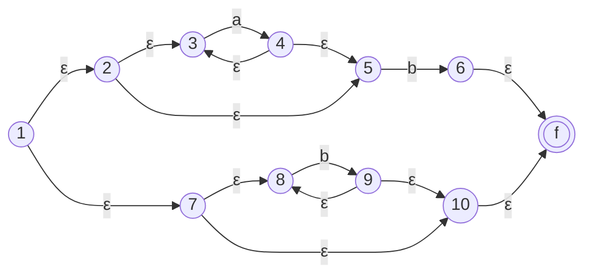
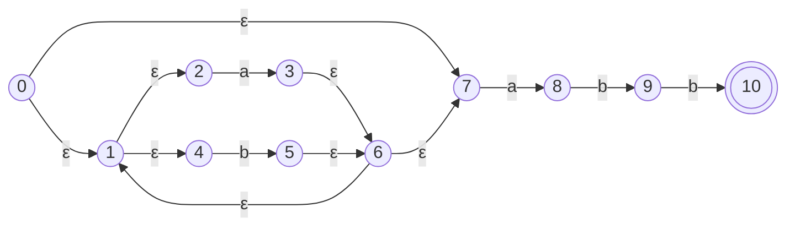
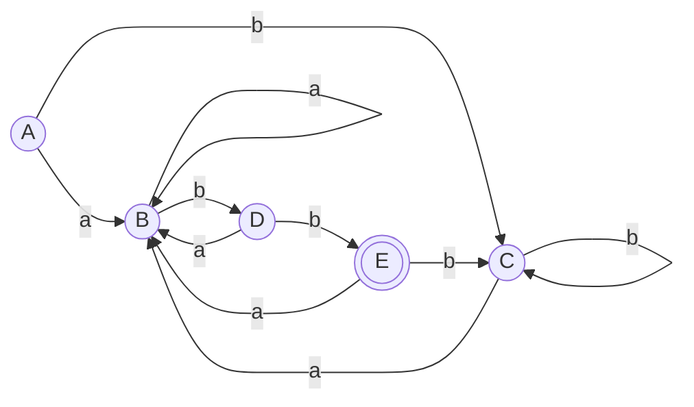
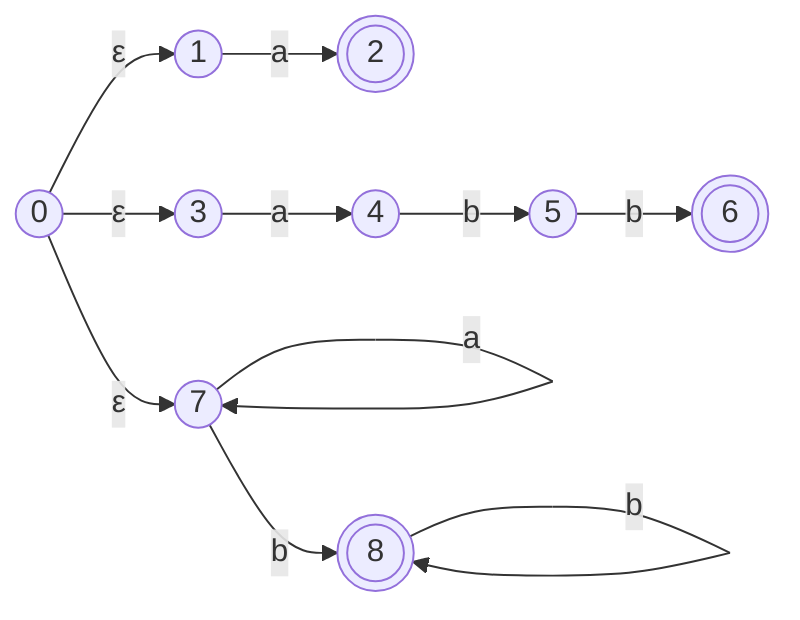

# 10. Class Notes — The Teacher's Worked Examples

> **Source:** `Compiler notes.pdf`, pages 1–20. These are handwritten class notes.
> **Why this chapter exists:** Chapters 1–9 were written from standard theory before any class material arrived. The class notes use **the same definitions, rules and notation** (`ε-closure`, `move`, `D-Tran`), so nothing in Ch. 1–9 needs correcting. What the class notes add are **the teacher's own examples**. Those are the ones most likely to reappear in the exam, so they are collected here, checked and completed.

| § | Topic | Class-notes page | Main chapter |
|---|---|---|---|
| 1 | Language processing system | p1 | [Ch. 1](01-compiler-phases-overview.md) |
| 2 | Grouping phases into passes | p2 | [Ch. 1](01-compiler-phases-overview.md) |
| 3 | Tokens, regular expressions, regular definitions | p3–4 | [Ch. 5](05-lexical-analysis-and-lex.md) |
| 4 | The class Lex program | p4–5 | [Ch. 5](05-lexical-analysis-and-lex.md) |
| 5 | Thompson's construction: `a*b \| b*` and `(a\|b)*abb` | p6–7 | [Ch. 4](04-automata-construction-from-strings.md) |
| 6 | Subset construction: `(a\|b)*abb` → DFA | p8–9 | [Ch. 3](03-nfa-to-dfa-conversion.md) |
| 7 | Structure of the generated lexical analyser | p10 | [Ch. 5](05-lexical-analysis-and-lex.md) |
| 8 | Derivations, ambiguity, dangling else | p11–12, p19 | [Ch. 6](06-cfg-and-ambiguity-elimination.md) |
| 9 | Left recursion and left factoring | p13, p19–20 | [Ch. 7](07-left-recursion-and-left-factoring.md) |
| 10 | FIRST, FOLLOW, predictive parsing | p14–17 | [Ch. 8](08-first-and-follow.md), [Ch. 9](09-predictive-parsing-ll1.md) |
| 11 | Bottom-up parsing, reduction, handles | p17–18 | *beyond the mid syllabus* |

---

## 1. Language processing system ⭐

> **Compiler:** a program that reads a program in one language (the **source**) and translates it into an equivalent program in another language (the **target**). It also **reports any errors** in the source program.
> **Interpreter:** instead of producing a target program, it **directly executes the source program line by line**.
> **Language processors:** compiler, interpreter, loader.

```
  Source program
        │
        ▼
  ┌──────────────┐
  │ Preprocessor │   expands macros, #include, strips comments
  └──────┬───────┘
         ▼
  Modified source program
         │
         ▼
  ┌──────────────┐
  │   Compiler   │
  └──────┬───────┘
         ▼
  Target assembly program
         │
         ▼
  ┌──────────────┐
  │  Assembler   │
  └──────┬───────┘
         ▼
  Relocatable machine code
         │
         ▼
  ┌──────────────┐     library files,
  │Linker/Loader │ ◄── other relocatable object files
  └──────┬───────┘
         ▼
  Target machine code
```

| | **Compiler** | **Interpreter** |
|---|---|---|
| Output | A **target program** (executable) | **No target program**; it executes directly |
| Unit of work | Whole program at once | **Line by line** |
| Execution speed | **Faster**, because translation happens once | Slower, because it re-translates on every run |
| Error reporting | All errors reported after analysing the whole program | Stops at the **first** error |
| Examples | C, C++ (gcc) | Python, JavaScript, shell |

---

## 2. Grouping of phases into passes ⭐⭐

The class diagram of the phases matches [Ch. 1 §2](01-compiler-phases-overview.md):

**character stream** → Lexical Analysis → **tokens** → Syntax Analyser → **syntax tree** → Semantic Analyser → **modified syntax tree** → Intermediate Code Generation → **IR** → Code Optimizer → **optimized IR** → Code Generator → **target machine code**

> 📌 Class note: *"[the front end] analyses language till here."* Everything up to the optimizer depends on the **source language**. Only the code generator depends on the **machine**.

**How phases are grouped:**
- **Lexical analysis, syntax analysis, semantic analysis and intermediate code generation** are grouped into **one pass**, the **front-end pass**. It is specific to a **particular language**.
- **Code optimization** may be an **optional** pass.
- **Code generation** forms the **back-end pass**. It is specific to a **certain target machine**.

**Advantage.** The front end does not need to be rewritten for each machine.

$$\text{Without the split: } m \times n \text{ compilers} \qquad \text{With the split: } m \text{ front ends} + n \text{ back ends}$$

Here $m$ is the number of source languages and $n$ the number of target machines. For example, 5 languages and 4 machines need **20** separate compilers, but only **5 + 4 = 9** components once the phases are split into front and back ends.

> ⚠️ The class note writes *"Total compiler = m × n"*. That is the number of **language–machine combinations** you get. The saving is that you *build* only $m + n$ pieces. Say both numbers in an answer.

**Other advantages of fewer passes:** less reading and writing of intermediate files, so compilation is faster. **Advantages of more passes:** each pass is simpler, needs less memory, and is easier to retarget.

---

## 3. Tokens, regular expressions, regular definitions ⭐

**Token:** a symbol representing a kind of lexical unit. **Lexeme:** a sequence of characters in the source program that matches the pattern for a token.

| Lexeme | Token |
|---|---|
| `<=`, `==`, `>=` | comparison (`relop`) |
| `result`, `sum` (variables) | `id` |
| `21`, `25`, `9.5` | `number` |

**Regular expression operations.** Let $r$ and $s$ be regular expressions.

| # | Operation | Definition |
|---|---|---|
| 1 | **Union** $L \cup M$ | $\{s \mid s \in L \text{ or } s \in M\}$ |
| 2 | **Concatenation** $LM$ | $\{st \mid s \in L,\ t \in M\}$ |
| 3 | **Kleene closure** $r^*$ | zero or more repetitions |
| 4 | **Positive closure** $r^+$ | one or more repetitions |

**Class examples** with $\Sigma = \{a, b\}$:

| # | Regular expression | Language |
|---|---|---|
| 1 | $(a\mid b)(a\mid b)$ | $\{aa, ab, ba, bb\}$ |
| 2 | $a^*$ | $\{\varepsilon, a, aa, aaa, \dots\}$ |
| 3 | $(a\mid b)^*$ | $\{\varepsilon, a, b, aa, ab, ba, bb, \dots\}$, i.e. all strings over $\{a,b\}$ |
| 4 | $a \mid b$ | $\{a, b\}$ |
| 5 | $a \mid a^*b$ | $\{a, b, ab, aab, aaab, \dots\}$ |
| 6 | $(a\mid b)^*abb$ | $\{abb, aabb, babb, \dots\}$, i.e. strings ending in $abb$ |

**Regular definitions** give names to regular expressions and reuse those names:

```
letter  → A | B | … | Z | a | b | … | z       i.e. [A-Za-z]
digit   → 0 | 1 | … | 9                       i.e. [0-9]
id      → letter ( letter | digit )*
number  → digit+
```

---

## 4. The class Lex program ⭐⭐

**How Lex is used:**

```
  filename.l ──► [ Lex compiler ] ──► lex.yy.c      ① turns the .l file into a C program
  lex.yy.c   ──► [ C compiler  ] ──► a.out          ② a.out is the lexical analyser
  input stream ──► [ a.out ] ──► sequence of tokens
```

**Structure of a Lex program:**

```
declarations            ← constants, variables, regular definitions
%%
translation rules       ← pattern   { action }
%%
auxiliary functions     ← extra functions called from the actions
```

- **Pattern:** a regular expression.
- **Action:** a fragment of C code, run when the pattern matches. It typically sets an attribute value or returns a token.

**Class example: print tokens for input strings using some patterns**

```lex
%{
    /* NUM, ID, RELOP, LT, GT, LE, GE, IF, ELSE */
%}
digit    [0-9]
letter   [A-Za-z]
number   {digit}+
id       {letter}({letter}|{digit})*
relop    "<"|">"|"<="|">="|"=="|"!="

%%
"if"       { printf("IF ");    }
"else"     { printf("ELSE ");  }
{number}   { printf("NUM ");   }
{id}       { printf("ID ");    }
{relop}    { printf("RELOP "); }
[ \t\n]    { /* skip whitespace */ }
%%

int main()   { yylex(); return 0; }
int yywrap() { return 1; }
```

> ⚠️ **Two fixes to the version in the class notes:**
> 1. The notes define no `relop` pattern, so `{relop}` would fail to compile. It is defined above.
> 2. The notes list `{id}` **before** `if`/`else`. Lex breaks ties between equal-length matches by taking the **first rule**, so `if` would be printed as `ID`. **Keywords must come before `{id}`**. See [Ch. 5 §4](05-lexical-analysis-and-lex.md).

---

## 5. Thompson's construction ⭐⭐⭐

**Input:** a regular expression $r$ over $\Sigma$. **Output:** an NFA $N(r)$ accepting $L(r)$.

A finite automaton is the 5-tuple $(Q, \Sigma, \delta, q_0, F)$: the set of states, the input alphabet, the transition function, the start state, and the set of final states.
- **NFA:** on one input, a state can move to **more than one** state. It may contain ε-transitions.
- **DFA:** on one input, a state moves to **exactly one** state. It has no ε-transitions.

**The five rules** ($i$ = new start state, $f$ = new final state):

| Case | Construction |
|---|---|
| (i) $r = \varepsilon$ | $i \xrightarrow{\varepsilon} f$ |
| (ii) $r = a$ | $i \xrightarrow{a} f$ |
| (iii) $r = s \mid t$ | $i \xrightarrow{\varepsilon}$ start of $N(s)$ and $N(t)$; both of their finals $\xrightarrow{\varepsilon} f$ |
| (iv) $r = st$ | **Merge** the final state of $N(s)$ with the start of $N(t)$. The start of $N(s)$ becomes the start of $N(r)$, and the final of $N(t)$ becomes the final of $N(r)$. |
| (v) $r = s^*$ | $i \xrightarrow{\varepsilon}$ start of $N(s)$; final of $N(s) \xrightarrow{\varepsilon}$ start of $N(s)$ (the loop); final of $N(s) \xrightarrow{\varepsilon} f$; $i \xrightarrow{\varepsilon} f$ (skip) |

### Class example A: $r = a^*b \mid b^*$



- **Upper branch, $a^*b$:** $2 \to 3 \xrightarrow{a} 4$ with loop $4 \to 3$ and skip $2 \to 5$, then $5 \xrightarrow{b} 6$.
- **Lower branch, $b^*$:** $7 \to 8 \xrightarrow{b} 9$ with loop $9 \to 8$ and skip $7 \to 10$.
- Both branches join at $f$.

### Class example B: $r = (a\mid b)^*abb$ ⭐⭐⭐ *(the standard textbook example)*

This is the numbering used in the class subset construction (§6):



| From | ε | a | b |
|---|---|---|---|
| 0 | 1, 7 | | |
| 1 | 2, 4 | | |
| 2 | | 3 | |
| 3 | 6 | | |
| 4 | | | 5 |
| 5 | 6 | | |
| 6 | 1, 7 | | |
| 7 | | 8 | |
| 8 | | | 9 |
| 9 | | | 10 |
| **10** *(final)* | | | |

---

## 6. Subset construction: $(a\mid b)^*abb$ → DFA ⭐⭐⭐

**The three operations** (as in the class notes):
- $\varepsilon\text{-closure}(s)$ = the states reachable from $s$ on ε-transitions alone.
- $\varepsilon\text{-closure}(T)$ = the states reachable from any $s \in T$ on ε-transitions alone.
- $move(T, a)$ = the states with a transition on input $a$ from some $s \in T$.

**Steps:**
1. $A = \varepsilon\text{-closure}(s_0)$.
2. Mark $A$ and compute $D\text{-Tran}[A, a] = \varepsilon\text{-closure}(move(A, a))$ for each $a \in \Sigma$.
3. Repeat for every unmarked set of states until **all states of D are marked**.

**Working** *(verified by script)*:

$$A = \varepsilon\text{-closure}(0) = \{0, 1, 2, 4, 7\} \quad \leftarrow \text{start}$$

| DFA state | NFA states | $move(\cdot, a)$ | on **a** | $move(\cdot, b)$ | on **b** |
|---|---|---|---|---|---|
| **→ A** | {0, 1, 2, 4, 7} | {3, 8} | **B** | {5} | **C** |
| **B** | {1, 2, 3, 4, 6, 7, 8} | {3, 8} | B | {5, 9} | **D** |
| **C** | {1, 2, 4, 5, 6, 7} | {3, 8} | B | {5} | C |
| **D** | {1, 2, 4, 5, 6, 7, 9} | {3, 8} | B | {5, 10} | **E** |
| **\*E** | {1, 2, 4, 5, 6, 7, **10**} | {3, 8} | B | {5} | C |

**E is final** because it contains NFA state 10.



> 💡 **Check with a string.** On `abb` the DFA goes A →a B →b D →b E, which is final ✓. On `ab` it stops at D, which is not final ✓.
> 📌 **A and C are equivalent**, so the minimal DFA has 4 states. See [Ch. 3 §7](03-nfa-to-dfa-conversion.md).

---

## 7. Structure of the generated lexical analyser ⭐⭐

```
                 INPUT ──► [ lexeme ] ──► TOKENS
                                ▲
                                │
                       ┌──────────────────┐
                       │    Automaton     │
                       │    simulator     │
                       └────────┬─────────┘
                                │ uses
   ┌─────────┐   ┌──────────┐   ▼
   │   Lex   │──►│   Lex    │──►┌────────────────────┐
   │ program │   │ compiler │   │ Transition table   │
   └─────────┘   └──────────┘   │     + actions      │
                                └────────────────────┘
```

- The lexical analyser is **a fixed program that simulates an automaton**.
- The automaton can be **deterministic or non-deterministic**, depending on the Lex implementation.
- The Lex program is turned into a **transition table and actions**. The simulator never changes; only the table does.
- **Each regular-expression pattern** in the Lex program is converted to an NFA, and **all the NFAs are combined into one**. A new start state $s_0$ gets an ε-edge to the start of each $N(p_i)$.

**Class example.** A Lex program with three patterns:

```
a      { action A1 for pattern p1 }
abb    { action A2 for pattern p2 }
a*b+   { action A3 for pattern p3 }
```



- Final state **2** recognises `a` → action $A_1$.
- Final state **6** recognises `abb` → action $A_2$.
- Final state **8** recognises `a*b+` → action $A_3$.

> ⭐ **Conflict rules** (from [Ch. 5 §4](05-lexical-analysis-and-lex.md)): the simulator keeps reading until no move is possible. Then it takes the **longest prefix** that reached a final state. If two patterns match that same longest prefix, the pattern **listed first** wins. For example, on `abb` both $p_2$ and $p_3$ match all three characters, so $p_2$ (`abb`) wins because it is listed first.

---

## 8. Derivations, ambiguity, dangling else ⭐⭐

**Syntax analysis** obtains a string of tokens from the lexical analyser, **verifies that the grammar can generate it**, builds a **parse tree** and passes it on.

**CFG components:** **terminals** (basic symbols or tokens, e.g. `if`, `else`) · **non-terminals** (syntactic variables that stand for sets of strings, e.g. `stmt`, `expr`) · **productions** (a non-terminal head on the left → a body on the right) · **start symbol**.

**Types of parser:** **top-down**, which builds a *derivation*, and **bottom-up**, which performs *reductions*.

### Class example: derive `-(id+id)` from $E \to E+E \mid E*E \mid -E \mid (E) \mid \texttt{id}$

| Leftmost derivation (replace the leftmost NT) | Rightmost derivation (replace the rightmost NT) |
|---|---|
| $E \Rightarrow -E$ | $E \Rightarrow -E$ |
| $\Rightarrow -(E)$ | $\Rightarrow -(E)$ |
| $\Rightarrow -(E+E)$ | $\Rightarrow -(E+E)$ |
| $\Rightarrow -(\texttt{id}+E)$ | $\Rightarrow -(E+\texttt{id})$ |
| $\Rightarrow -(\texttt{id}+\texttt{id})$ | $\Rightarrow -(\texttt{id}+\texttt{id})$ |

**Parse tree:**
```
        E
       / \
      -   E
        / | \
       (  E  )
        / | \
       E  +  E
       |     |
       id    id
```

A **parse tree** is a graphical representation of a derivation that **filters out the order** in which productions are applied.

### Ambiguity

> A grammar is **ambiguous** if it produces **more than one parse tree** for some sentence, or equivalently **more than one leftmost (or rightmost) derivation**.

**Class example:** $E \to E+E \mid E*E \mid (E) \mid \texttt{id}$ with the string `id + id * id`:

| LMD 1 (`+` at the root) | LMD 2 (`*` at the root) |
|---|---|
| $E \Rightarrow E+E$ | $E \Rightarrow E*E$ |
| $\Rightarrow \texttt{id}+E$ | $\Rightarrow E+E*E$ |
| $\Rightarrow \texttt{id}+E*E$ | $\Rightarrow \texttt{id}+E*E$ |
| $\Rightarrow \texttt{id}+\texttt{id}*E$ | $\Rightarrow \texttt{id}+\texttt{id}*E$ |
| $\Rightarrow \texttt{id}+\texttt{id}*\texttt{id}$ | $\Rightarrow \texttt{id}+\texttt{id}*\texttt{id}$ |

**Two distinct leftmost derivations ⇒ ambiguous grammar.** The fix is in [Ch. 6](06-cfg-and-ambiguity-elimination.md): the unambiguous E-T-F grammar.

### Dangling else ⭐⭐⭐

$$stmt \to \textbf{if } expr \textbf{ then } stmt \mid \textbf{if } expr \textbf{ then } stmt \textbf{ else } stmt \mid \textbf{other}$$

The string `if E1 then if E2 then S1 else S2` has **two parse trees**:

```
  Tree 1 — else belongs to the INNER if ✅      Tree 2 — else belongs to the OUTER if ❌

  stmt                                          stmt
   ├ if E1 then                                  ├ if E1 then
   └ stmt                                        │   stmt
       ├ if E2 then S1                           │    └ if E2 then S1
       └ else S2                                 └ else S2
```

Two parse trees, so the grammar is ambiguous. **Fix:** match each `else` with the **closest unmatched `then`**. Between a `then` and an `else` there may only be a **matched** statement:

$$
\begin{aligned}
stmt &\to matched\_stmt \mid open\_stmt \\
matched\_stmt &\to \textbf{if } expr \textbf{ then } matched\_stmt \textbf{ else } matched\_stmt \mid \textbf{other} \\
open\_stmt &\to \textbf{if } expr \textbf{ then } stmt \\
&\mid \textbf{if } expr \textbf{ then } matched\_stmt \textbf{ else } open\_stmt
\end{aligned}
$$

---

## 9. Left recursion and left factoring ⭐⭐⭐

**Left recursion.** $G$ is left-recursive if it has $A \to A\alpha \mid \beta$. **Top-down parsers cannot handle left recursion**, because they loop forever. Eliminate it with:

$$A \to \beta A' \qquad A' \to \alpha A' \mid \varepsilon$$

**Class example:**

| Before | After |
|---|---|
| $E \to E + T \mid T$ | $E \to TE'$ <br> $E' \to +TE' \mid \varepsilon$ |
| $T \to T * F \mid F$ | $T \to FT'$ <br> $T' \to *FT' \mid \varepsilon$ |
| $F \to (E) \mid \texttt{id}$ | $F \to (E) \mid \texttt{id}$ *(unchanged)* |

**Left factoring** makes a grammar suitable for top-down parsing when a production has the form $A \to \alpha\beta_1 \mid \alpha\beta_2 \mid \gamma$. The parser cannot immediately tell whether to expand $A$ to $\alpha\beta_1$ or $\alpha\beta_2$. After left factoring:

$$A \to \alpha A' \mid \gamma \qquad A' \to \beta_1 \mid \beta_2$$

**Class example:** $S \to bSSaaS \mid bSSaSb \mid bSb \mid a$

**Step 1.** The common prefix of the first three alternatives is $bS$:
$$S \to bSS' \mid a \qquad S' \to SaaS \mid SaSb \mid b$$

> ⚠️ **The class notes stop here, but the grammar is not fully left-factored yet.** $SaaS$ and $SaSb$ still share the prefix $Sa$.

**Step 2.** Factor $S'$:
$$S \to bSS' \mid a \qquad S' \to SaS'' \mid b \qquad S'' \to aS \mid Sb$$

Now no two alternatives of any non-terminal share a prefix ✓. **Always repeat until no common prefix remains.** Examiners check for this.

---

## 10. FIRST, FOLLOW, predictive parsing ⭐⭐⭐

The class uses **the same grammar, rules and answers** as [Ch. 8](08-first-and-follow.md) and [Ch. 9](09-predictive-parsing-ll1.md). Here is the class summary, which is worth memorising exactly.

**Top-down parsing:** build the parse tree from the root, creating nodes in **pre-order**. Equivalently, find a **leftmost derivation** of the input.

| NT | FIRST | FOLLOW | How the class justified FOLLOW |
|---|---|---|---|
| $E$ | $\{(, \texttt{id}\}$ | $\{), \$\}$ | `)` from $F \to (E)$, rule 2 · `$` because $E$ is the start symbol |
| $E'$ | $\{+, \varepsilon\}$ | $\{), \$\}$ | from $E \to TE'$, rule 4 ($E'$ at the end) |
| $T$ | $\{(, \texttt{id}\}$ | $\{+, ), \$\}$ | `+` from $E' \to +TE'$, rule 2 · `)`, `$` via rule 3 because $E'$ is nullable |
| $T'$ | $\{*, \varepsilon\}$ | $\{+, ), \$\}$ | from $T \to FT'$, rule 4 |
| $F$ | $\{(, \texttt{id}\}$ | $\{*, +, ), \$\}$ | `*` from $T' \to *FT'$, rule 2 · the rest via rule 3 because $T'$ is nullable |

**Class FOLLOW rules** (numbered as in the notes):
1. Place `$` in FOLLOW(S).
2. $A \to \alpha B\beta$: everything in FIRST(β) except ε goes into FOLLOW(B).
3. $A \to \alpha B\beta$ where FIRST(β) contains ε: everything in FOLLOW(A) goes into FOLLOW(B).
4. $A \to \alpha B$: everything in FOLLOW(A) goes into FOLLOW(B).

**Predictive parsing algorithm** (class version):
```
input buffer: w$      stack: S$ (start symbol on top)
ip → first symbol of w;   X = top of stack
while (X != $) {
    if (X == a)                          // a = current input symbol
        pop; advance ip;
    else if (M[X,a] == X → Y1 Y2 … Yk) {
        output X → Y1 Y2 … Yk;
        pop;
        push Yk, Yk-1, …, Y1;            // Y1 ends on top
    }
    else error();
}
```

The class trace of `id + id * id` is identical to the one in [Ch. 9 §6](09-predictive-parsing-ll1.md). It ends with stack `$` and input `$`, so **parsing is successful**. The moves produce the **leftmost derivation**.

---

## 11. Bottom-up parsing, reduction, handles

> ⚠️ **Beyond the mid-term syllabus**, which ends at predictive parsing. It is in the class notes, so here it is in brief.

**Bottom-up parsing** constructs the parse tree for an input string **starting at the leaves and working up towards the root**.

**Reduction:** bottom-up parsing is the process of **reducing** a string $w$ to the start symbol.
- At each step, a substring matching the **body** (right side) of a production is replaced by its **head** (the non-terminal on the left).
- A reduction is the **reverse of a derivation step**.
- The goal is to construct a **rightmost derivation in reverse**.

With $E \to E+T \mid T$, $T \to T*F \mid F$, $F \to (E) \mid \texttt{id}$:

$$\underbrace{E \Rightarrow T \Rightarrow T*F \Rightarrow T*\texttt{id} \Rightarrow F*\texttt{id} \Rightarrow \texttt{id}*\texttt{id}}_{\text{rightmost derivation } \longrightarrow \qquad \longleftarrow \text{ reductions}}$$

**Handle:** the substring that is replaced at each reduction step. For $\texttt{id}_1 * \texttt{id}_2$:

| Right-sentential form | Handle | Reducing production |
|---|---|---|
| $\texttt{id}_1 * \texttt{id}_2$ | $\texttt{id}_1$ | $F \to \texttt{id}$ |
| $F * \texttt{id}_2$ | $F$ | $T \to F$ |
| $T * \texttt{id}_2$ | $\texttt{id}_2$ | $F \to \texttt{id}$ |
| $T * F$ | $T * F$ | $T \to T * F$ |
| $T$ | $T$ | $E \to T$ |

> 💡 In $T * \texttt{id}_2$ the handle is $\texttt{id}_2$, **not** $T$. Reducing $T \to E$ there would leave $E * \texttt{id}$, which cannot be reduced to the start symbol. A handle is a substring whose reduction leads back towards $S$ along a rightmost derivation.

---

## ⚡ Quick revision

- **Language processing:** preprocessor → compiler → assembler → linker/loader.
- **Front end** (lexical → ICG) is **language**-specific; **back end** (code generation) is **machine**-specific. Building $m$ front ends plus $n$ back ends replaces $m \times n$ separate compilers.
- **Thompson:** 5 rules (ε, a, s|t, st, s*). Union and star add 2 new states; concatenation merges one.
- **(a|b)\*abb → DFA:** A={0,1,2,4,7} · B={1,2,3,4,6,7,8} · C={1,2,4,5,6,7} · D={1,2,4,5,6,7,9} · **E={1,2,4,5,6,7,10}** is final.
- **Generated lexer** = fixed automaton simulator + transition table/actions. Combine the pattern NFAs through a new $s_0$ with ε-edges.
- **Lex:** keywords **before** `{id}`. Longest match wins; on a tie, the first rule wins.
- **Ambiguous** = two parse trees, or two LMDs, for one sentence. Dangling else is fixed with the **matched/open** grammar.
- **Left factoring:** repeat until no common prefix remains.
- **Bottom-up** = reductions = a rightmost derivation in reverse. **Handle** = the substring reduced at each step.

---

**Previous:** [← 9. Predictive Parsing](09-predictive-parsing-ll1.md) · **Next:** [11. Mid-Sem Paper 2026 — Solved →](11-mid-sem-2026-paper-solved.md)
