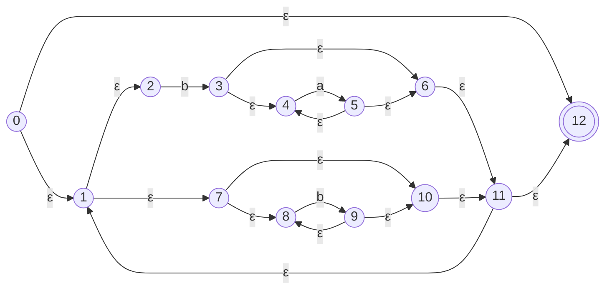
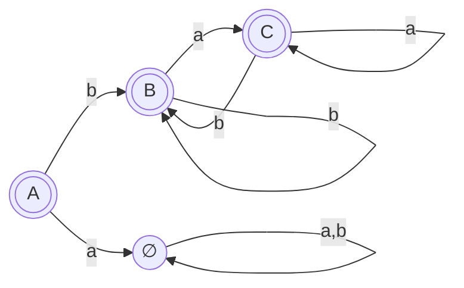

# 11. Mid-Semester Paper (Jan–June 2026) — Solved

> **Source:** `Compiler notes.pdf`, pages 21–22. *NIT Manipur, B.Tech Sem VI (CSE), Mid Semester, Jan–June 2026, Compiler Design (CS 3503). Full marks 30, 1:30 hours.*
> **Why this chapter exists:** it is the **most recent actual CD mid-sem paper**. Almost every long question maps directly onto a chapter in these notes.
> **Instructions on the paper:** *"Attempt question 1 and any __ question from the rest."* The number is unreadable in the scan. Five questions of 6 marks make 30, so assume **all five** unless told otherwise.

## Paper at a glance

| Q | Question | Marks | Chapter |
|---|---|---|---|
| 1 | 6 MCQ / very short answers | 1 × 6 | Mixed |
| 2a | Thompson NFA for `(ba* \| b*)*`, then subset construction to a DFA | 4 | [Ch. 3](03-nfa-to-dfa-conversion.md), [Ch. 4](04-automata-construction-from-strings.md), [Ch. 10 §5–6](10-class-notes-worked-examples.md) |
| 2b | Left factor `A → eb \| ebcS \| a`, `S → c` | 2 | [Ch. 7](07-left-recursion-and-left-factoring.md) |
| 3a | Lex program: count lines, words, characters | 3 | [Ch. 5 §7](05-lexical-analysis-and-lex.md) |
| 3b | Eliminate left recursion | 2 | [Ch. 7](07-left-recursion-and-left-factoring.md) |
| 3c | Role of the lexical and syntax analysers | 1 | [Ch. 1 §4](01-compiler-phases-overview.md) |
| 4a | Is `A → AA+ \| AA* \| b` ambiguous? Use `bb+b*` | 2 | [Ch. 6](06-cfg-and-ambiguity-elimination.md) |
| 4b | Structure of the lexical analyser (automaton simulator), with a diagram | 2 | [Ch. 10 §7](10-class-notes-worked-examples.md) |
| 4c | Grouping phases into passes, with advantages | 2 | [Ch. 10 §2](10-class-notes-worked-examples.md) |
| 5 | FIRST, FOLLOW and LL(1) table for `S→AB, A→Ca\|ε, B→BaAC\|c, C→b\|ε` | 6 | [Ch. 8](08-first-and-follow.md), [Ch. 9](09-predictive-parsing-ll1.md) |

> 📌 **Pattern:** Q2 to Q5 are exactly the mid-term syllabus. Q1 also asks about optimisation, register allocation, three-address code and the symbol table, which are later topics. They are one-liners, answered below.

All automata, FIRST/FOLLOW sets and the LL(1) table below were **verified by script**.

---

## Q1. Short answers (1 × 6)

**[i] Which of the following is a machine-independent optimization?** → **(a) Constant folding**
Constant folding evaluates constant expressions at compile time (for example `2*3` becomes `6`) and works on the intermediate code whatever the target. Peephole optimisation, register allocation and instruction scheduling all depend on the target machine.

**[ii] Register allocation is done during:** → **(d) Code generation**
Deciding which values live in which CPU registers needs knowledge of the target machine, so it happens in the back end.

**[iii] Explain the difference between compiler and interpreter with examples.**
A **compiler** translates the **whole** source program into a target (machine-code) program, which is then executed. Examples: C and C++ with `gcc`. An **interpreter** produces **no target program**. It executes the source directly, **line by line**. Examples: Python, JavaScript, shell. Compiled code runs faster; an interpreter gives better diagnostics and stops at the first error. → [Ch. 10 §1](10-class-notes-worked-examples.md)

**[iv] Three-address code is an example of:** → **(c) Intermediate code**
Each instruction has at most three operands, for example `t1 = b * c`.

**[v] What is a context-free grammar (CFG)?**
A 4-tuple $G = (V, T, P, S)$: **non-terminals** $V$, **terminals** $T$, **productions** $P$ of the form $A \to \alpha$ (a single non-terminal on the left), and a **start symbol** $S$. It is used to specify the syntax of programming languages. → [Ch. 6 §1](06-cfg-and-ambiguity-elimination.md)

**[vi] What is a symbol table?**
A data structure the compiler uses to store **information about every identifier** in the source program: its name, type, scope, memory location, and, for functions, the number and types of parameters. The lexical analyser creates the entries and later phases read and update them. It must support fast **insert** and **lookup**, so it is usually a hash table.

---

## Q2(a). Construct an NFA for `(ba* | b*)*` using Thompson's algorithm and convert it to a DFA using subset construction. (4)

> The scan prints the stars as small superscript marks. They are read here as Kleene stars: $(ba^* \mid b^*)^*$.

### Thompson's NFA

Build from the inside out: $a^*$, then $ba^*$ by concatenation; $b^*$; the union; and finally the outer star.



| Part | States |
|---|---|
| $ba^*$ | $2 \xrightarrow{b} 3$, then $a^*$ on 3–6: $3 \to 4 \xrightarrow{a} 5$, loop $5 \to 4$, exit $5 \to 6$, skip $3 \to 6$ |
| $b^*$ | on 7–10: $7 \to 8 \xrightarrow{b} 9$, loop $9 \to 8$, exit $9 \to 10$, skip $7 \to 10$ |
| Union | $1 \to 2$, $1 \to 7$; $6 \to 11$, $10 \to 11$ |
| Outer star | $0 \to 1$; loop $11 \to 1$; exit $11 \to 12$; skip $0 \to 12$ |
| Start / Final | **0** / **12** |

### Subset construction

$$A = \varepsilon\text{-closure}(0) = \{0, 1, 2, 7, 8, 10, 11, 12\}$$

| DFA state | NFA states | $move(\cdot,a)$ | on **a** | $move(\cdot,b)$ | on **b** | Final? |
|---|---|---|---|---|---|---|
| **→ A** | {0, 1, 2, 7, 8, 10, 11, 12} | ∅ | **∅** (dead) | {3, 9} | **B** | ✅ contains 12 |
| **B** | {1, 2, 3, 4, 6, 7, 8, 9, 10, 11, 12} | {5} | **C** | {3, 9} | B | ✅ |
| **C** | {1, 2, 4, 5, 6, 7, 8, 10, 11, 12} | {5} | C | {3, 9} | B | ✅ |

$$\varepsilon\text{-closure}(\{3, 9\}) = B \qquad \varepsilon\text{-closure}(\{5\}) = C$$



**All three DFA states are final.** The language is $\{\varepsilon\} \cup \{\text{every string starting with } b\}$.

> 💡 **Sanity check:** `a` is rejected (A goes to dead on `a`), and `ba`, `bb`, `bab` are all accepted. B and C have identical rows, so the minimal DFA merges them: A →b BC, with BC looping on a and b.

---

## Q2(b). Left factor $A \to eb \mid ebcS \mid a$, $\ S \to c$. (2)

The common prefix of $eb$ and $ebcS$ is $eb$:

$$
\begin{aligned}
A &\to ebA' \mid a \\
A' &\to cS \mid \varepsilon \\
S &\to c
\end{aligned}
$$

($eb = eb\cdot\varepsilon$, so one alternative of $A'$ is $\varepsilon$.)

---

## Q3(a). Write a Lex program to count the number of lines, words and characters in the input. (3)

```lex
%{
#include <stdio.h>
int lines = 0, words = 0, chars = 0;
%}

%%
\n          { lines++; chars++; }
[^ \t\n]+   { words++; chars += yyleng; }
.           { chars++; }
%%

int main() {
    yylex();
    printf("Lines = %d\nWords = %d\nCharacters = %d\n", lines, words, chars);
    return 0;
}
int yywrap() { return 1; }
```

**How it works:**
- A word is any run of non-blank characters, so `[^ \t\n]+` counts one word per match and adds its length (`yyleng`) to the character count.
- `\n` counts a line and one character.
- `.` catches the remaining single characters (spaces and tabs).
- Write the three sections (declarations, rules, user code) clearly, because the marks are split across them. → [Ch. 5 §4](05-lexical-analysis-and-lex.md)

---

## Q3(b). Eliminate left recursion from $S \to A$, $A \to Ad \mid Ae \mid aB \mid aC$, $B \to bBC \mid f$, $C \to g$. (2)

Only $A$ is left-recursive. Using $A \to A\alpha_1 \mid A\alpha_2 \mid \beta_1 \mid \beta_2$ with $\alpha_1 = d$, $\alpha_2 = e$, $\beta_1 = aB$, $\beta_2 = aC$:

$$
\begin{aligned}
S &\to A \\
A &\to aBA' \mid aCA' \\
A' &\to dA' \mid eA' \mid \varepsilon \\
B &\to bBC \mid f \\
C &\to g
\end{aligned}
$$

> 💡 **Bonus for a full-marks answer:** $A$ still has two alternatives starting with $a$. Left-factoring it gives $A \to aA''$ and $A'' \to BA' \mid CA'$. The grammar is then ready for predictive parsing.

---

## Q3(c). Explain briefly the role of the lexical analyser and the syntax analyser. (1)

- **Lexical analyser:** reads the character stream, groups it into **lexemes**, and emits a stream of **tokens**. It removes whitespace and comments and enters identifiers into the symbol table.
- **Syntax analyser (parser):** takes the tokens, checks that they can be generated by the **grammar**, and builds a **parse tree**. It reports syntax errors.

---

## Q4(a). Given $A \to AA+ \mid AA* \mid b$, check whether $G$ is ambiguous using the string `bb+b*`. (2)

To be ambiguous, the string would need **two** distinct parse trees (or two leftmost derivations).

**Try to split the string.** The last symbol is `*`, so the root must be $A \to AA*$, with the two $A$'s together deriving `bb+b`. Every string derived from $A$ ends in `b`, `+` or `*`, and the only string of length 1 is `b`.

| First A | Second A | Possible? |
|---|---|---|
| `b` | `b+b` | ❌ `b+b` ends in `b`, so it would have to be exactly `b` |
| `bb` | `+b` | ❌ `bb` does not end in `+`/`*`, and `+b` is not derivable |
| `bb+` | `b` | ✅ `bb+` comes from $A \to AA+$ with both $A \to b$ |

**Exactly one split works, so there is only one parse tree.** It was verified by script: the parse-tree count is 1.

**The unique leftmost derivation:**
$$A \Rightarrow AA* \Rightarrow AA+A* \Rightarrow bA+A* \Rightarrow bb+A* \Rightarrow bb+b*$$

```
            A
         /  |  \
        A   A   *
      / | \  \
     A  A  +  b
     |  |
     b  b
```

**Conclusion:** `bb+b*` has a single parse tree, so it gives **no evidence of ambiguity**. $G$ is the grammar of **postfix expressions**, and it is **unambiguous**. Postfix notation needs no parentheses or precedence rules, because the operator always comes after both of its operands.

> ⚠️ It is, however, **left-recursive** ($A \to AA+$), so it cannot be used directly by a predictive parser.

---

## Q4(b). Explain the structure and functions of a lexical analyser, including the automaton simulator, with a diagram. (2)

→ Full answer with the diagram in [Ch. 10 §7](10-class-notes-worked-examples.md). Exam-length version:

```
   Lex program ──► Lex compiler ──► Transition table + actions
                                            │
                                            ▼
   Input buffer ──► [ Automaton simulator ] ──► lexeme ──► token
```

- The generated lexical analyser is **a fixed program that simulates an automaton**, driven by a **transition table** that the Lex compiler builds from the Lex program.
- Each pattern $p_i$ becomes an NFA $N(p_i)$. These are **combined** through a new start state with ε-edges, and are either simulated directly or converted to a DFA.
- The simulator reads input until no further move is possible. It then selects the **longest** prefix that reached an accepting state, runs the **action** of the matching pattern (the first-listed pattern if there is a tie), and returns the token.
- **Functions:** produce tokens, strip whitespace and comments, keep track of line numbers for error messages, and enter identifiers into the symbol table.

---

## Q4(c). Explain the grouping of phases of a compiler into passes, with their advantages. (2)

→ [Ch. 10 §2](10-class-notes-worked-examples.md).
- **Front-end pass:** lexical, syntax and semantic analysis, and intermediate code generation. It is **language-dependent** and machine-independent.
- **Optional optimisation pass** on the intermediate representation.
- **Back-end pass:** code generation. It is **machine-dependent**.

**Advantages:**
1. **Retargeting.** To support $m$ languages on $n$ machines, you write $m$ front ends and $n$ back ends, instead of $m \times n$ complete compilers.
2. **Reuse.** A new machine needs only a new back end; a new language needs only a new front end.
3. **Fewer passes** mean less intermediate I/O and faster compilation. **More passes** mean simpler, smaller passes and less memory per pass.

---

## Q5. Given $S \to AB$, $A \to Ca \mid \varepsilon$, $B \to BaAC \mid c$, $C \to b \mid \varepsilon$: find FIRST and FOLLOW and construct the top-down predictive parsing table. Transform $G$ first if required. (6)

### Step 1: transform

$B \to BaAC \mid c$ is **left-recursive**, with $\alpha = aAC$ and $\beta = c$:

$$
\begin{aligned}
S &\to AB \\
A &\to Ca \mid \varepsilon \\
B &\to cB' \\
B' &\to aACB' \mid \varepsilon \\
C &\to b \mid \varepsilon
\end{aligned}
$$

### Step 2: FIRST

| NT | Working | FIRST |
|---|---|---|
| $C$ | $b$, $\varepsilon$ | $\{b, \varepsilon\}$ |
| $A$ | $Ca$: FIRST(C) minus ε gives $b$; $C$ is nullable, so add $a$. Plus $\varepsilon$ from $A \to \varepsilon$ | $\{a, b, \varepsilon\}$ |
| $B$ | $cB'$ | $\{c\}$ |
| $B'$ | $a$, $\varepsilon$ | $\{a, \varepsilon\}$ |
| $S$ | $AB$: FIRST(A) minus ε gives $a, b$; $A$ is nullable, so add FIRST(B) = $c$ | $\{a, b, c\}$ |

### Step 3: FOLLOW

| NT | Working | FOLLOW |
|---|---|---|
| $S$ | start symbol | $\{\$\}$ |
| $B$ | $S \to AB$: $B$ is at the end, so add FOLLOW(S) | $\{\$\}$ |
| $B'$ | $B \to cB'$: add FOLLOW(B). $B' \to aACB'$ adds only itself | $\{\$\}$ |
| $A$ | $S \to AB$: FIRST(B) = $c$. $B' \to aACB'$: FIRST(CB') gives $b$, and $a$ because $C$ is nullable; $CB'$ is nullable, so add FOLLOW(B') = $\$$ | $\{a, b, c, \$\}$ |
| $C$ | $A \to Ca$: $a$. $B' \to aACB'$: FIRST(B') minus ε = $a$; $B'$ is nullable, so add FOLLOW(B') = $\$$ | $\{a, \$\}$ |

### Step 4: parsing table

| | **a** | **b** | **c** | **$** |
|---|---|---|---|---|
| **S** | $S \to AB$ | $S \to AB$ | $S \to AB$ | |
| **A** | ⚠️ $A \to Ca$ **and** $A \to \varepsilon$ | ⚠️ $A \to Ca$ **and** $A \to \varepsilon$ | $A \to \varepsilon$ | $A \to \varepsilon$ |
| **B** | | | $B \to cB'$ | |
| **B'** | $B' \to aACB'$ | | | $B' \to \varepsilon$ |
| **C** | $C \to \varepsilon$ | $C \to b$ | | $C \to \varepsilon$ |

**How the entries were placed:** $A \to Ca$ goes under FIRST(Ca) = {a, b}. $A \to \varepsilon$ goes under FOLLOW(A) = {a, b, c, \$}. These **collide at a and b**.

### Step 5: conclusion ⭐

> **$M[A,a]$ and $M[A,b]$ each contain two productions, so the grammar is NOT LL(1)**, even after removing the left recursion. Write this conclusion explicitly; it is worth marks.

**Why no transformation can fix it:** the grammar is **ambiguous**. Take the string `caa`, derived as $S \Rightarrow AB$ with $A \Rightarrow \varepsilon$, $B \Rightarrow cB'$, and $B' \Rightarrow aACB'$:
- **Tree 1:** $A \Rightarrow Ca \Rightarrow a$, $C \Rightarrow \varepsilon$, $B' \Rightarrow \varepsilon$, giving $c\,a\,\underline{a}$.
- **Tree 2:** $A \Rightarrow \varepsilon$, $C \Rightarrow \varepsilon$, $B' \Rightarrow aACB' \Rightarrow a$, giving $c\,a\,\underline{a}$.

Two parse trees for one string mean the grammar is ambiguous, and **no ambiguous grammar is LL(1)**.

---

## Answering strategy

- **Q2a** is the biggest single item (4 marks). Draw the Thompson NFA **neatly with numbered states**, then give the ε-closure **table**, then the DFA diagram, and **mark the final states**.
- **Q5** looks routine, but the table has conflicts. **Always say "not LL(1)" when a cell has two entries.** Filling in one production and moving on loses the marks.
- One-mark questions need one or two lines, not a paragraph.

---

## ⚡ Quick revision

- Machine-independent optimisation = **constant folding** · register allocation = **code generation** · three-address code = **intermediate code**.
- **Symbol table** = identifier name, type, scope and location; supports fast insert and lookup.
- `(ba*|b*)*` → a 3-state DFA, **all accepting**; `a` as the first symbol goes to the dead state. Language = ε or strings starting with `b`.
- Left factoring $eb \mid ebcS$ gives $ebA'$ with $A' \to cS \mid \varepsilon$.
- **Postfix grammar** $A \to AA+ \mid AA* \mid b$ is **unambiguous**: `bb+b*` has one tree.
- **Q5:** remove the left recursion in B, then find that $M[A,a]$ and $M[A,b]$ conflict. The grammar is **not LL(1)** and is in fact ambiguous (`caa`).

---

**Previous:** [← 10. Class Notes — Worked Examples](10-class-notes-worked-examples.md) · **Back to:** [Compiler Design index](../README.md)
