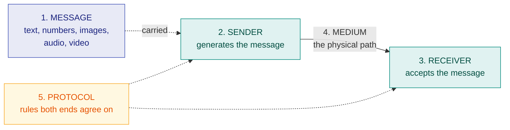

# 1. Fundamentals of Data Communication

> **Syllabus:** Unit 1 — Fundamentals of Digital Communication
> **Source:** `1. DataCommu.pdf`

---

## 🎯 In one line

Data communication is the **exchange of data between two or more devices** through a transmission medium, and its effectiveness rests on **four characteristics** and **five components**.

---

## 1. Concept

**Data** means information in digital format. **Communication** means to exchange information between two or many users — by speaking, texting, or any other mode of the medium.

So **data communication** is simply the exchange of data between two or many users through a transmission medium such as twisted pair cable, coaxial cable, optical fibre, radio wave or satellite microwave.

- The user/device that **sends** the data is the **source (sender)**.
- The user/device that **receives** the data is the **receiver**.

For data interchange to take place, the communicating devices must be part of a system comprising a **combination of hardware and software**.

---

## 2. Four fundamental characteristics ⭐

The effectiveness of a data communication system depends on four characteristics:

| # | Characteristic | Meaning |
|---|---|---|
| 1 | **Delivery** | The system must deliver data to the **correct destination**. |
| 2 | **Accuracy** | The system must deliver data **without error**, accurately. |
| 3 | **Timeliness** | The system must deliver data in a **timely manner**. Late-delivered data is useless. |
| 4 | **Jitter** | The **variation in packet arrival time**. Uneven delays distort audio/video even if all packets arrive. |

> 💡 **Timeliness vs Jitter.** Timeliness is about *how late*; jitter is about *how uneven*. In a video call, arriving 2 s late is a timeliness failure; arriving at irregular intervals (10 ms, 40 ms, 5 ms …) is jitter — the picture stutters.

---

## 3. Five components of a data communication system ⭐



| # | Component | Description |
|---|---|---|
| 1 | **Message** | The information/data to be communicated: text, numbers, pictures, sound, video, or any combination. |
| 2 | **Sender** | The device/computer that generates and sends the message. |
| 3 | **Receiver** | The device/computer that receives the message. Its location is generally different from the sender's; the distance depends on the type of network used. |
| 4 | **Medium** | The channel or physical path through which the message travels. **Wired:** twisted pair, coaxial, fibre-optic. **Wireless:** laser, radio waves, microwaves. |
| 5 | **Protocol** | A set of rules that govern communication between devices. Both sender and receiver follow the **same** protocol. Without agreed rules, two connected devices still cannot communicate. |

---

## 4. Functions of a protocol

A protocol performs the following functions:

| Function | What it does |
|---|---|
| **Data sequencing** | Breaks a long message into smaller **fixed-size packets** and defines how to number them — so loss or duplication can be detected and packets of the same message correctly identified. |
| **Data routing** | Defines the **most efficient path** between sender and receiver. |
| **Flow control** | Regulates the **rate** of transmission so a fast sender does not overwhelm a slow receiver. |
| **Error control** | Detects (and where possible corrects) errors, so the data delivered is accurate. |

### Key elements of a protocol

| Element | Meaning |
|---|---|
| **Syntax** | The **format** of the data — structure and order in which it is presented |
| **Semantics** | The **meaning** of each section of bits — how a pattern is to be interpreted and what action to take |
| **Timing** | **When** data should be sent and **how fast** |

---

## 5. Data flow (transmission modes) ⭐

```
 SIMPLEX          ┌────────┐  ──────────────→  ┌──────────┐
 one direction    │ Sender │                   │ Receiver │      e.g. keyboard, monitor
 only             └────────┘                   └──────────┘

 HALF-DUPLEX      ┌────────┐  ──────────────→  ┌──────────┐
 both ways, but   │Device A│  ←──────────────   │ Device B │      e.g. walkie-talkie
 one at a time    └────────┘   (not together)   └──────────┘

 FULL-DUPLEX      ┌────────┐  ──────────────→  ┌──────────┐
 both ways,       │Device A│  ←──────────────   │ Device B │      e.g. telephone
 simultaneously   └────────┘   (at once)       └──────────┘
```

| Mode | Direction | Example |
|---|---|---|
| **Simplex** | One direction only; one device sends, the other only receives | Keyboard → CPU, CPU → monitor |
| **Half-duplex** | Both directions, but **only one at a time** — the full channel capacity goes to whichever device is sending | Walkie-talkie |
| **Full-duplex** | Both directions **simultaneously** — capacity is shared, or the link has separate paths | Telephone |

---

## 6. Common exam questions

1. **What is data communication?** → Definition + source/receiver + hardware-software system.
2. **State and explain the four fundamental characteristics of data communication.** ⭐ *(Delivery, Accuracy, Timeliness, Jitter — give one line each.)*
3. **Explain the five components of a data communication system** with a diagram. ⭐
4. **What is a protocol? State its functions / key elements.**
5. **Differentiate simplex, half-duplex and full-duplex** with examples.
6. **Define jitter.** → Variation in packet arrival time.

---

## ⚡ Quick revision

- **Data communication** = exchange of data between devices through a transmission medium.
- **Four characteristics:** **D**elivery, **A**ccuracy, **T**imeliness, **J**itter.
- **Five components:** **M**essage, **S**ender, **R**eceiver, **M**edium, **P**rotocol.
- **Protocol elements:** Syntax (format), Semantics (meaning), Timing (when/how fast).
- **Protocol functions:** data sequencing, data routing, flow control, error control.
- **Jitter** = variation in packet arrival time (not the same as plain delay).
- **Data flow:** Simplex (one way) · Half-duplex (both ways, one at a time) · Full-duplex (both at once).

---

**Next:** [2. Signals and Noise →](02-signals-and-noise.md)
