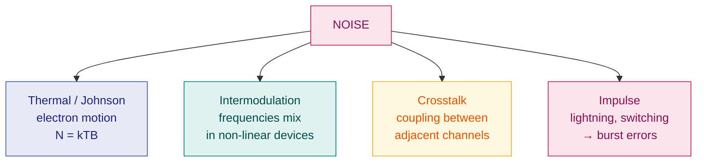

# 2. Signals and Noise

> **Syllabus:** Unit 1 — *Signals and noise*
> **Source:** `Signals and Noise.docx`, `1. DataCommu.pdf`

---

## 🎯 In one line

A **signal** is any physical quantity that carries information; **noise** is any unwanted signal that distorts it — and the ratio between them (**SNR**) decides how much data a channel can carry.

---

## 1. What is a Signal?

A **signal** is any physical quantity (voltage, current, time) that **carries information**. In communication systems, signals carry information from one point to another.

---

## 2. Types of Signals ⭐

| | **Analog Signal** | **Digital Signal** |
|---|---|---|
| Variation | Varies **continuously** with time | Has **discrete** values (usually 0 and 1) |
| Values | Infinitely many | Finite, fixed set |
| Example | Voice, music, video | Computer data, binary codes |
| Representation | $s(t) = A\sin(2\pi f t + \phi)$ | Square-wave levels |
| Noise effect | Degrades gradually, hard to restore | Can be **regenerated** exactly |

```
  ANALOG — continuous                DIGITAL — discrete levels
       ╱‾╲      ╱‾╲                   ┌───┐   ┌───────┐
      ╱   ╲    ╱   ╲             1 ───┘   └───┘       └───
  ───╱─────╲──╱─────╲──          0
            ╲╱                        1   0   1   1   0
```

### The sinusoid and its three parameters

$$s(t) = A\sin(2\pi f t + \phi)$$

| Parameter | Name | Meaning |
|---|---|---|
| $A$ | **Amplitude** | Height / strength of the signal |
| $f$ | **Frequency** | Cycles per second (Hz); $f = 1/T$ |
| $\phi$ | **Phase** | Position of the waveform relative to time zero |

> 💡 These same three parameters are exactly what the three modulation techniques each change — **A**→ASK/AM, **f**→FSK/FM, **φ**→PSK/PM. See [Ch. 6](06-digital-to-analog-modulation.md).

---

## 3. Noise — definition

**Noise** is any **unwanted electrical signal** that distorts or interferes with the transmission of information.

---

## 4. Types of Noise ⭐⭐

This is a guaranteed exam question. Learn all four with their causes.

| # | Type | Cause | Notes |
|---|---|---|---|
| 1 | **Thermal Noise** (Johnson noise) | Random motion of **electrons in conductors** | Present in **all** media at any temperature above absolute zero. Cannot be eliminated — only reduced by cooling or narrowing bandwidth. |
| 2 | **Intermodulation Noise** | Signals at **different frequencies mix** and produce new frequencies | Occurs when transmitter/receiver/medium is **non-linear**. Produces sums and differences ($f_1+f_2$, $f_1-f_2$). |
| 3 | **Crosstalk** | **Unwanted coupling between adjacent channels** | e.g. hearing another conversation on a telephone line. Caused by electrical coupling between nearby wires. |
| 4 | **Impulse Noise** | **Sudden disturbances** — lightning, switching, power surges | Irregular spikes of short duration and high amplitude. Minor for analog voice, but **the main cause of burst errors in digital data**. |

### Thermal noise formula ⭐

$$\boxed{N = kTB}$$

| Symbol | Meaning | Value / Unit |
|---|---|---|
| $N$ | Noise power | watts (W) |
| $k$ | **Boltzmann's constant** | $1.38 \times 10^{-23}$ J/K |
| $T$ | Temperature | **kelvin (K)** |
| $B$ | Bandwidth | hertz (Hz) |

> ⚠️ **Always convert °C to K** before using it: $T(K) = T(°C) + 273$.
> 📌 Notice that thermal noise **increases with bandwidth** — a wider channel picks up more noise. This is the hidden cost behind Shannon's formula in [Ch. 3](03-nyquist-rate-and-shannon-capacity.md).



---

## 5. Signal-to-Noise Ratio (SNR) ⭐

$$\text{SNR} = \frac{\text{average signal power}}{\text{average noise power}} = \frac{P_{signal}}{P_{noise}}$$

Because this ratio spans a huge range, it is usually expressed in **decibels**:

$$\boxed{\text{SNR}_{dB} = 10\log_{10}(\text{SNR})}$$

| SNR (ratio) | SNR (dB) | Quality |
|---|---|---|
| 1 | 0 dB | Signal = noise — unusable |
| 10 | 10 dB | Poor |
| 100 | 20 dB | Fair |
| 1000 | 30 dB | Good |
| 10000 | 40 dB | Excellent |

> 💡 **Rule of thumb:** every $\times 10$ in power ratio = $+10$ dB. A high SNR means the signal dominates the noise, so more bits per symbol can be distinguished → higher capacity.

---

## 6. Other transmission impairments

Besides noise, two other impairments degrade a signal:

| Impairment | Meaning | Effect |
|---|---|---|
| **Attenuation** | Loss of **energy** as the signal travels | Signal gets weaker → needs **amplifiers** (analog) or **repeaters** (digital) |
| **Distortion** | The signal **changes shape** | Different frequency components travel at different speeds and arrive with different delays |
| **Noise** | Unwanted signals added | The four types above |

$$\text{Attenuation}_{dB} = 10\log_{10}\frac{P_2}{P_1} \qquad (\text{negative} = \text{loss},\ \text{positive} = \text{gain})$$

---

## 7. Worked examples

### Example 1 — thermal noise

**Calculate the thermal noise power for a bandwidth of 10 kHz at a temperature of 27 °C.**

$$T = 27 + 273 = 300\ \text{K}, \qquad B = 10\times10^3 = 10^4\ \text{Hz}$$

$$N = kTB = (1.38\times10^{-23})(300)(10^4)$$

$$N = 1.38 \times 300 \times 10^{-23+4} = 414 \times 10^{-19} = \boxed{4.14 \times 10^{-17}\ \text{W}}$$

---

### Example 2 — SNR in decibels

**The signal power is 10 mW and the noise power is 1 µW. Find the SNR and SNR in dB.**

$$\text{SNR} = \frac{10\times10^{-3}}{1\times10^{-6}} = 10^4 = 10{,}000$$

$$\text{SNR}_{dB} = 10\log_{10}(10^4) = 10 \times 4 = \boxed{40\ \text{dB}}$$

---

### Example 3 — attenuation

**A signal travels through a transmission medium and its power is reduced to one-half. Calculate the attenuation in dB.**

$$\text{Attenuation}_{dB} = 10\log_{10}\frac{P_2}{P_1} = 10\log_{10}\left(\frac12\right) = 10 \times (-0.3) = \boxed{-3\ \text{dB}}$$

> 📌 **$-3$ dB always means "half the power".** Worth memorising — it appears constantly.

---

## 8. Common exam questions

1. **What is a signal? Differentiate analog and digital signals.** ⭐
2. **Define noise. Explain the different types of noise.** ⭐⭐ *(Thermal, Intermodulation, Crosstalk, Impulse — cause + effect for each.)*
3. **Write the formula for thermal noise and explain each term.** → $N = kTB$
4. **Numerical:** calculate thermal noise power given $T$ and $B$.
5. **Define SNR. Express it in decibels.** → $\text{SNR}_{dB} = 10\log_{10}(\text{SNR})$
6. **Numerical:** find SNR in dB given signal and noise powers.
7. **Explain the transmission impairments.** → attenuation, distortion, noise.

---

## ⚡ Quick revision

- **Signal** = physical quantity carrying information. **Analog** = continuous; **Digital** = discrete.
- $s(t) = A\sin(2\pi ft + \phi)$ — **amplitude, frequency, phase**; these are what modulation changes.
- **Noise** = unwanted signal that distorts transmission.
- **Four noise types:**
  - **Thermal (Johnson)** — random electron motion — $N = kTB$
  - **Intermodulation** — different frequencies mix in non-linear devices
  - **Crosstalk** — coupling between adjacent channels
  - **Impulse** — lightning/switching → **burst errors**
- $N = kTB$; $k = 1.38\times10^{-23}$ J/K; **$T$ in kelvin** ($°C + 273$).
- $\text{SNR} = P_{signal}/P_{noise}$; $\text{SNR}_{dB} = 10\log_{10}(\text{SNR})$.
- $-3$ dB = half the power.
- **Three impairments:** attenuation (energy loss), distortion (shape change), noise.

---

**Previous:** [← 1. Fundamentals](01-fundamentals-of-data-communication.md) · **Next:** [3. Nyquist Rate & Shannon Capacity →](03-nyquist-rate-and-shannon-capacity.md)
