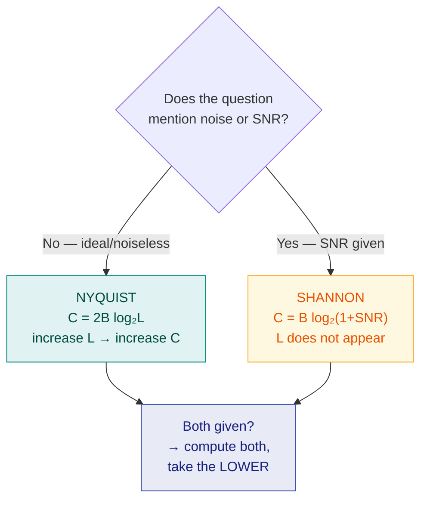

# 3. Nyquist Rate & Shannon Capacity

> **Syllabus:** Unit 1 — *Nyquist rate · Shannon capacity*
> **Source:** `Signals and Noise.docx`, `bit_baudRate.docx`

---

## 🎯 In one line

**Nyquist** gives the maximum bit rate of a **noiseless** channel (limited by bandwidth and number of levels); **Shannon** gives the maximum capacity of a **noisy** channel (limited by bandwidth and SNR).

---

## 1. Concept — the two limits

Every channel has a ceiling on how fast data can flow. There are two different ceilings, and **which formula you use depends on whether noise is mentioned**:



> ⭐ **The single most important exam skill in this chapter:** read the question and decide *which* formula applies. "Noiseless" / "ideal" → Nyquist. "SNR" / "noisy" → Shannon.

---

## 2. Nyquist Bit Rate — noiseless channel ⭐

For a **noiseless** channel:

$$\boxed{C = 2B\log_2 L}$$

| Symbol | Meaning | Unit |
|---|---|---|
| $C$ | Maximum bit rate (channel capacity) | bits per second (bps) |
| $B$ | Bandwidth of the channel | hertz (Hz) |
| $L$ | Number of **signal levels** used to represent data | — |

### What it says

- Doubling the bandwidth doubles the bit rate.
- Increasing the number of levels $L$ increases the bit rate — but only **logarithmically**.

> ⚠️ **The practical catch:** Nyquist suggests you can push the bit rate as high as you like by increasing $L$. In reality, more levels means the levels sit closer together, so the receiver confuses them more easily — noise sets the real limit. That is exactly what Shannon's formula captures.

### Nyquist Sampling Theorem — the related result

For converting an **analog signal to digital** (see [Ch. 7, PCM](07-pcm-and-adpcm.md)):

$$\boxed{f_s \ge 2f_{max}}$$

The sampling rate must be **at least twice the highest frequency** of the original signal to allow perfect reconstruction. $2f_{max}$ is called the **Nyquist rate**.

- Sampling **below** the Nyquist rate causes **aliasing** — different signals become indistinguishable after sampling.

> 📌 **Do not confuse the two "Nyquist" results.** $C = 2B\log_2L$ is about *bit rate over a channel*; $f_s \ge 2f_{max}$ is about *sampling an analog signal*. Both are Nyquist's, both involve a factor of 2, and exams test both.

---

## 3. Shannon Capacity — noisy channel ⭐

For a **noisy** channel:

$$\boxed{C = B\log_2(1 + \text{SNR})}$$

| Symbol | Meaning | Unit |
|---|---|---|
| $C$ | Channel capacity — theoretical **maximum** bit rate | bps |
| $B$ | Bandwidth | Hz |
| SNR | Signal-to-noise **ratio** (not in dB!) | — |

### What it says

- The number of signal levels $L$ **does not appear** — noise, not levels, sets the ceiling.
- $C$ is a **theoretical upper bound**. No coding scheme can beat it; practical systems achieve less.
- If SNR $= 0$ (signal = noise), then $C = B\log_2(1) = 0$ — no data can be sent.

> ⚠️ **If the SNR is given in dB, convert it first:**
> $$\text{SNR} = 10^{\text{SNR}_{dB}/10}$$

---

## 4. The two formulas compared ⭐

| | **Nyquist** | **Shannon** |
|---|---|---|
| Formula | $C = 2B\log_2L$ | $C = B\log_2(1+\text{SNR})$ |
| Channel | **Noiseless** (ideal) | **Noisy** (real) |
| Depends on | Bandwidth, **number of levels** | Bandwidth, **SNR** |
| Tells you | How many levels you need | The absolute ceiling |
| Nature | Achievable with enough levels | Theoretical upper bound |

### Using them together

When a question gives **both** bandwidth/levels **and** SNR:

1. Compute the **Shannon** capacity → the absolute ceiling.
2. Use **Nyquist** with that capacity to find how many **levels** are needed.
3. The usable rate is the **lower** of the two.

---

## 5. Bit Rate vs Baud Rate ⭐

| | **Bit rate (data rate)** | **Baud rate (signal rate)** |
|---|---|---|
| Measures | Number of **bits** transmitted per second | Number of **signal changes** (symbols/pulses) per second |
| Unit | bps (bits/second) | baud (symbols/second) |
| Focus | Data volume, processing efficiency | Physical channel capacity / bandwidth needed |
| Relation | Usually **higher** | Usually **lower** |

$$\boxed{\text{Bit rate} = \text{Baud rate} \times \log_2 L = \text{Baud rate} \times \text{bits per symbol}}$$

**Why they differ:** a single signal change can carry **multiple bits** if the scheme has more than two levels. In 4-QAM each symbol carries 2 bits; in 8-PSK each symbol carries 3 bits.

```
 Bit rate = Baud rate            Bit rate = 2 × Baud rate
 (2 levels, 1 bit/symbol)        (4 levels, 2 bits/symbol)

  1   0   1   1                   11    01    10    00
 ┌─┐   ┌─┐ ┌─┐                   ┌──┐  ┌──┐        ┌──┐
 │ │   │ │ │ │                ───┘  └──┘  └────────┘  └──
─┘ └───┘ └─┘ └─                  4 symbols = 8 bits
  4 symbols = 4 bits
```

> 💡 **Analogy.** Baud rate is how often you speak a *word*; bit rate is how much *meaning* you convey per second. Using longer words (more levels) conveys more meaning at the same speaking rate — but they get easier to mishear (noise).

> 📌 **Bandwidth depends on the baud rate, not the bit rate.** That is why engineers care about baud: it determines how much spectrum you need.

---

## 6. Worked examples ⭐

### Example 1 — Nyquist, noiseless, binary

**A noiseless channel has a bandwidth of 3000 Hz transmitting a signal with two signal levels. What is the maximum bit rate?**

$$C = 2B\log_2L = 2 \times 3000 \times \log_2 2 = 2 \times 3000 \times 1 = \boxed{6000\ \text{bps}}$$

---

### Example 2 — Nyquist, more levels

**Same channel (B = 3000 Hz, noiseless) but with four signal levels.**

$$C = 2 \times 3000 \times \log_2 4 = 2 \times 3000 \times 2 = \boxed{12{,}000\ \text{bps}}$$

> Doubling the levels from 2 to 4 doubled the bit rate — because $\log_2 4 = 2$.

---

### Example 3 — Shannon, noisy channel

**Calculate the capacity of a channel with bandwidth 3000 Hz and SNR = 3162.**

$$C = B\log_2(1+\text{SNR}) = 3000\log_2(1+3162) = 3000\log_2(3163)$$

$$\log_2(3163) = \frac{\log_{10}3163}{\log_{10}2} = \frac{3.5001}{0.3010} \approx 11.627$$

$$C = 3000 \times 11.627 \approx \boxed{34{,}881\ \text{bps} \approx 34.9\ \text{kbps}}$$

> 💡 In an exam, rounding $\log_2(3163)$ to $11.63$ gives $34{,}890$ — close enough. **State your rounding** and the examiner will accept either; the expected answer is "about 35 kbps".

> 📌 This is the classic telephone-line calculation — it is why dial-up modems topped out near 33.6 kbps.

---

### Example 4 — SNR given in dB

**A channel has bandwidth 1 MHz and SNR = 30 dB. Find the capacity.**

**Step 1 — convert dB to ratio:**
$$\text{SNR} = 10^{30/10} = 10^3 = 1000$$

**Step 2 — apply Shannon:**
$$C = 10^6 \times \log_2(1+1000) = 10^6 \times \log_2(1001)$$

$$\log_2(1001) \approx \frac{3.0004}{0.301} \approx 9.97$$

$$C \approx 9.97 \times 10^6 \approx \boxed{9.97\ \text{Mbps} \approx 10\ \text{Mbps}}$$

---

### Example 5 — using both formulas together ⭐

**A channel has bandwidth 1 MHz and SNR = 63. What are the appropriate bit rate and signal level?**

**Step 1 — Shannon gives the ceiling:**
$$C = 10^6 \times \log_2(1+63) = 10^6 \times \log_2 64 = 10^6 \times 6 = 6\ \text{Mbps}$$

**Step 2 — choose a bit rate at or below the ceiling.** Take $C = 6$ Mbps.

**Step 3 — Nyquist gives the number of levels needed:**
$$6 \times 10^6 = 2 \times 10^6 \times \log_2 L \quad\Longrightarrow\quad \log_2 L = 3 \quad\Longrightarrow\quad \boxed{L = 8 \text{ levels}}$$

---

### Example 6 — bit rate and baud rate

**An analog signal carries 4 bits per signal element. If 1000 signal elements are sent per second, find the bit rate.**

$$\text{Bit rate} = \text{Baud rate} \times \text{bits per symbol} = 1000 \times 4 = \boxed{4000\ \text{bps}}$$

**Conversely:** the bit rate is 3000 bps and each signal element carries 6 bits. Find the baud rate.

$$\text{Baud rate} = \frac{3000}{6} = \boxed{500\ \text{baud}}$$

---

## 7. Common exam questions

1. **State the Nyquist formula for a noiseless channel.** → $C = 2B\log_2L$
2. **State the Shannon capacity formula.** → $C = B\log_2(1+\text{SNR})$
3. **Differentiate between the Nyquist and Shannon formulas.** ⭐ → the comparison table.
4. **Numerical: find the maximum bit rate** of a noiseless channel given $B$ and $L$.
5. **Numerical: find the channel capacity** given $B$ and SNR (sometimes in dB — convert first).
6. **Numerical: find the appropriate bit rate and signal level** — use Shannon, then Nyquist.
7. **Differentiate bit rate and baud rate.** ⭐ → definition + relation + why bit rate ≥ baud rate.
8. **State the Nyquist sampling theorem.** → $f_s \ge 2f_{max}$; what happens below it (aliasing).

---

## ⚡ Quick revision

- **Nyquist (noiseless):** $C = 2B\log_2L$ — bandwidth and **levels**.
- **Shannon (noisy):** $C = B\log_2(1+\text{SNR})$ — bandwidth and **SNR**; $L$ does **not** appear.
- **Which one?** No noise mentioned → Nyquist. SNR given → Shannon. Both → compute both, take the **lower**.
- **SNR in dB?** Convert: $\text{SNR} = 10^{\text{SNR}_{dB}/10}$.
- Shannon is a **theoretical upper bound** — unachievable in practice, never exceeded.
- **Nyquist sampling:** $f_s \ge 2f_{max}$; sampling too slowly causes **aliasing**.
- **Bit rate** = bits/s · **Baud rate** = signal changes/s.
- $\text{Bit rate} = \text{Baud rate} \times \log_2L$. Bit rate ≥ baud rate.
- **Bandwidth depends on baud rate**, not bit rate.
- Handy logs: $\log_2 2 = 1$, $\log_2 4 = 2$, $\log_2 8 = 3$, $\log_2 16 = 4$, $\log_2 64 = 6$, $\log_2 256 = 8$.

---

**Previous:** [← 2. Signals and Noise](02-signals-and-noise.md) · **Next:** [4. Analog Transmission & Modulation →](04-analog-transmission-and-modulation-overview.md)
