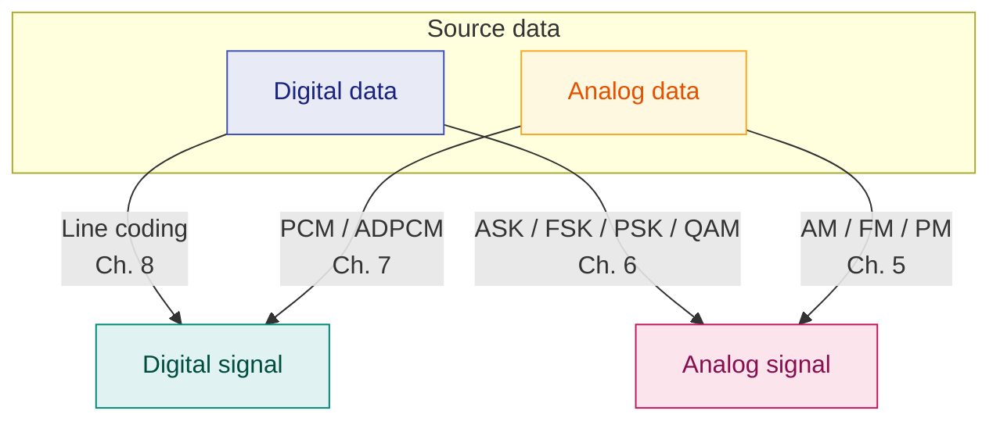

# 4. Analog Transmission & Modulation — Overview

> **Syllabus:** Unit 2 — *Analog transmission techniques · Modulation techniques*
> **Source:** `4. Analog_Analog Transmission.pdf`

---

## 🎯 In one line

**Modulation** superimposes information onto a high-frequency **carrier** — it is what makes long-distance, interference-free, multi-user transmission physically possible.

---

## 1. Concept — why modulate at all? ⭐

Why not just send the original (baseband) signal directly? Four reasons:

| # | Reason | Explanation |
|---|---|---|
| 1 | **Antenna size** | Antenna length must be about $\lambda/4$. A 3 kHz voice signal needs an antenna ~25 km long. Modulating onto a 3 MHz carrier reduces it to ~25 m. |
| 2 | **Multiplexing** | Many signals can share one medium if each is shifted to a **different carrier frequency** (see [FDM, Ch. 11](11-multiplexing-and-tdm.md)). Without modulation, all signals would occupy the same band and collide. |
| 3 | **Long distance** | High-frequency signals travel further and suffer less attenuation. |
| 4 | **Noise reduction** | Some modulation schemes (notably **FM**) are far more resistant to noise. |

### Key terms

| Term | Meaning |
|---|---|
| **Modulating signal** (baseband / message) | The original information signal, $m(t)$ |
| **Carrier signal** | A high-frequency sinusoid, $c(t) = A_c\sin(2\pi f_ct + \phi)$ |
| **Modulated signal** | The carrier after being altered by the message |
| **Modulation** | Superimposing the message onto the carrier |
| **Demodulation** | Recovering the message from the modulated carrier at the receiver |

---

## 2. Bandpass and Low-pass

| Term | Meaning |
|---|---|
| **Bandpass** | A **band of frequencies** which can pass the filter. Filters are used to filter and pass frequencies of interest. |
| **Low-pass** | A filter that passes **low-frequency** signals. |

- When **digital data** is converted into a **bandpass analog signal**, it is called **digital-to-analog conversion**.
- When a **low-pass analog signal** is converted into a **bandpass analog signal**, it is called **analog-to-analog conversion**.

---

## 3. The four conversion types ⭐⭐

This table organises the whole of Units 2 and 3. Know which chapter each belongs to.

| Conversion | Techniques | Where |
|---|---|---|
| **Digital → Digital** | Line coding (NRZ, Manchester, AMI…), block coding | [Ch. 8](08-line-coding.md) |
| **Analog → Digital** | **PCM**, DPCM, ADPCM, Delta modulation | [Ch. 7](07-pcm-and-adpcm.md) |
| **Digital → Analog** | **ASK, FSK, PSK, QAM** | [Ch. 6](06-digital-to-analog-modulation.md) |
| **Analog → Analog** | **AM, FM, PM** | [Ch. 5](05-am-fm-fundamentals.md) |



> 💡 **How to remember which is which.** Look at the *destination*:
> - Destination is a **digital signal** → line coding (from digital) or PCM (from analog).
> - Destination is an **analog signal** → shift keying (from digital) or AM/FM (from analog).

---

## 4. The three modulatable parameters ⭐

A carrier is $c(t) = A_c\sin(2\pi f_c t + \phi)$. It has exactly **three** parameters that can be altered — which is why there are exactly **three** basic modulation families:

| Parameter changed | Analog source | Digital source |
|---|---|---|
| **Amplitude** $A$ | **AM** — Amplitude Modulation | **ASK** — Amplitude Shift Keying |
| **Frequency** $f$ | **FM** — Frequency Modulation | **FSK** — Frequency Shift Keying |
| **Phase** $\phi$ | **PM** — Phase Modulation | **PSK** — Phase Shift Keying |

```
 CARRIER (unmodulated)
   ╱╲╱╲╱╲╱╲╱╲╱╲╱╲╱╲    constant A, f, φ

 AMPLITUDE changed (AM / ASK)
   ╱╲    ╱╲╱╲╱╲    ╱╲   height varies
   ──╲╱──────────╲╱───

 FREQUENCY changed (FM / FSK)
   ╱╲╱╲  ╱╲  ╱╲╱╲╱╲╱╲   spacing varies
   ────  ──  ────────

 PHASE changed (PM / PSK)
   ╱╲╱╲╱│╲╱╲╱╲│╱╲╱╲     abrupt shifts at
   ─────┘─────┘────      symbol boundaries
```

> ⭐ **This single idea unifies Units 2 and 3.** There are only three things you can change about a sine wave; every modulation scheme in the syllabus is some combination of them. **QAM** is special because it changes **amplitude *and* phase together**.

---

## 5. Analog-to-Analog conversion — the three types

When a low-pass analog signal is converted into a bandpass analog signal:

| Type | What changes | Notes |
|---|---|---|
| **Amplitude Modulation (AM)** | Carrier **amplitude** follows the message | Simple, cheap; noise-prone |
| **Frequency Modulation (FM)** | Carrier **frequency** follows the message | Noise-resistant; needs more bandwidth |
| **Phase Modulation (PM)** | Carrier **phase** follows the message | Closely related to FM |

Detailed treatment in [Ch. 5](05-am-fm-fundamentals.md).

---

## 6. Digital-to-Analog conversion — the three types

When data from one computer is sent to another via an analog carrier, it is first converted into analog signals; the analog signal is modified to reflect the digital data.

| Technique | What changes | What stays the same |
|---|---|---|
| **Amplitude Shift Keying (ASK)** | The **amplitude** of the carrier is modified to reflect binary data. When binary data represents digit 1 the amplitude is held; otherwise it is set to 0. | Frequency and phase |
| **Frequency Shift Keying (FSK)** | The **frequency** is modified. Two frequencies $f_1$ and $f_2$ are used — one represents binary 1, the other binary 0. | Amplitude and phase |
| **Phase Shift Keying (PSK)** | The **phase** of the carrier is altered. When a new binary symbol is encountered, the phase is altered. | Amplitude and frequency |
| **Quadrature PSK (QPSK)** | Alters the phase to reflect **two binary digits at once**, in two different phases. The main binary stream is divided equally into two sub-streams. | Amplitude |

Detailed treatment in [Ch. 6](06-digital-to-analog-modulation.md).

---

## 7. Common exam questions

1. **What is modulation? Why is modulation necessary?** ⭐ → the four reasons in §1.
2. **Define carrier signal, modulating signal, modulated signal.**
3. **Explain the four types of conversion** with examples of each. ⭐
4. **What are the three parameters of a carrier that can be modulated?** → amplitude, frequency, phase → AM/FM/PM and ASK/FSK/PSK.
5. **Differentiate bandpass and low-pass.**
6. **What is digital-to-analog conversion? Name its types.**
7. **Define demodulation.**

---

## ⚡ Quick revision

- **Modulation** = superimposing a message onto a high-frequency carrier. **Demodulation** = recovering it.
- **Why modulate:** smaller antenna · multiplexing · longer distance · less noise.
- **Four conversions:** Digital→Digital (line coding) · Analog→Digital (PCM) · Digital→Analog (ASK/FSK/PSK) · Analog→Analog (AM/FM/PM).
- A carrier has only **three** changeable parameters: **A, f, φ** — hence three modulation families.
- **Analog source:** AM (amplitude), FM (frequency), PM (phase).
- **Digital source:** ASK (amplitude), FSK (frequency), PSK (phase), QAM (amplitude **and** phase).
- **Bandpass** = band of frequencies passed by a filter · **Low-pass** = passes low frequencies.
- Digital data → **bandpass** analog = digital-to-analog conversion.
- Low-pass analog → bandpass analog = analog-to-analog conversion.

---

**Previous:** [← 3. Nyquist & Shannon](03-nyquist-rate-and-shannon-capacity.md) · **Next:** [5. AM & FM Fundamentals →](05-am-fm-fundamentals.md)
