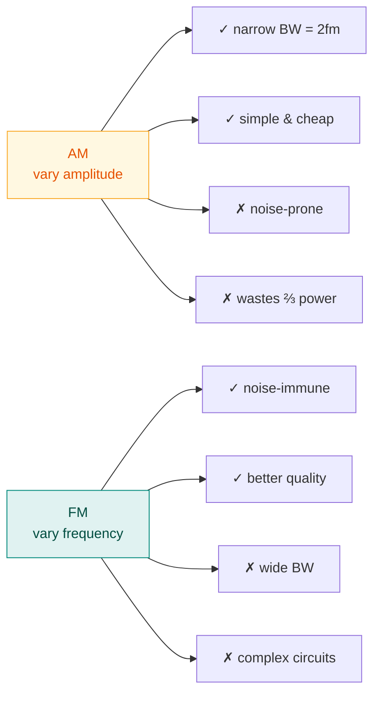

# 5. Fundamentals of AM and FM

> **Syllabus:** Unit 2 — *Fundamentals of AM and FM*
> **Source:** `4. Analog_Analog Transmission.pdf`

---

## 🎯 In one line

**AM** varies the carrier's **amplitude** with the message (simple but noise-prone, $BW = 2f_m$); **FM** varies its **frequency** (noise-resistant but bandwidth-hungry, $BW = 2(\Delta f + f_m)$).

---

## 1. Amplitude Modulation (AM)

The **amplitude** of the carrier signal is varied in proportion to the instantaneous amplitude of the modulating (message) signal. The **frequency and phase of the carrier remain unchanged**.

### Waveform

```
  MESSAGE m(t)        ╱‾‾╲          ╱‾‾╲
   (low frequency)   ╱    ╲        ╱    ╲
                ────╱      ╲──────╱      ╲────

  CARRIER c(t)     ╱╲╱╲╱╲╱╲╱╲╱╲╱╲╱╲╱╲╱╲╱╲╱╲
   (high frequency)

  AM SIGNAL         ⌒ ⌒            ⌒ ⌒         ← envelope follows
                  ╱╲│╱│╲          ╱╲│╱│╲          the message
                 ╱╲╱╲╱╲╱╲        ╱╲╱╲╱╲╱╲
                ─╲╱╲╱╲╱╲╱─────── ╲╱╲╱╲╱╲╱──
                  ╲ ╲│╱ ╱          ╲ ╲│╱ ╱
                    ⌄ ⌄              ⌄ ⌄      ← mirror envelope
```

The outline traced by the peaks is the **envelope** — it is a copy of the message signal. This is why AM can be demodulated with a simple **envelope detector** (a diode and a capacitor), which is why AM radios are cheap.

### Mathematical form

Let the message be $m(t) = A_m\cos(2\pi f_m t)$ and the carrier $c(t) = A_c\cos(2\pi f_c t)$. Then

$$s(t) = \left[A_c + A_m\cos(2\pi f_mt)\right]\cos(2\pi f_ct)$$

$$s(t) = A_c\left[1 + \mu\cos(2\pi f_mt)\right]\cos(2\pi f_ct)$$

### Modulation index ⭐

$$\boxed{\mu = \frac{A_m}{A_c}}$$

Also computable from the envelope's maximum and minimum:

$$\mu = \frac{A_{max} - A_{min}}{A_{max} + A_{min}}$$

| Value | Name | What happens |
|---|---|---|
| $\mu < 1$ | **Under-modulation** | Correct, but the carrier is under-used — weak signal |
| $\mu = 1$ | **100% / Perfect modulation** | Maximum power transfer without distortion — **ideal** |
| $\mu > 1$ | **Over-modulation** | Envelope is clipped → **distortion**; the message cannot be recovered correctly |

> ⚠️ **$\mu > 1$ is the classic exam trap.** Over-modulation causes phase reversal and envelope distortion, so the original message is irrecoverable by envelope detection. Always check whether $\mu$ exceeds 1.

### Bandwidth and sidebands

The AM signal contains three components:

$$f_c - f_m \quad\ \ f_c\ \quad\ f_m + f_c$$
$$\text{(LSB)} \qquad \text{(carrier)} \qquad \text{(USB)}$$

```
  Power
    │         ║ carrier (fc)
    │         ║
    │    ┃    ║    ┃        LSB = fc − fm
    │    ┃    ║    ┃        USB = fc + fm
    └────┴────┴────┴──────── frequency
      fc−fm  fc  fc+fm
      └──────────────┘
         BW = 2fm
```

$$\boxed{BW_{AM} = 2f_m}$$

where $f_m$ is the **highest frequency** of the modulating signal.

### Power distribution

$$P_{total} = P_c\left(1 + \frac{\mu^2}{2}\right)$$

- At $\mu = 1$: $P_{total} = 1.5P_c$, so the two sidebands carry only $0.5P_c$ — **one-third** of the total.
- **Two-thirds of AM transmit power is wasted on the carrier**, which carries no information. This inefficiency is why SSB (single sideband) exists.

---

## 2. Frequency Modulation (FM)

The **frequency** of the carrier is varied in proportion to the instantaneous amplitude of the modulating signal. The **amplitude of the carrier remains constant**.

### Waveform

```
  MESSAGE            ╱‾‾╲          ╱‾‾╲
                ────╱    ╲────────╱    ╲────
                    high  low      high  low

  FM SIGNAL    ╱╲╱╲╱╲╱╲ ╱ ╲ ╱ ╲ ╱╲╱╲╱╲╱╲ ╱ ╲
               ││││││││ │ │ │ │ ││││││││ │ │
               tight    spread     tight  spread
               ↑                   ↑
        high message amplitude → higher frequency
        low message amplitude  → lower frequency
                    AMPLITUDE STAYS CONSTANT
```

> ⭐ **The constant amplitude is the key to FM's noise immunity.** Most noise adds *amplitude* variation. Since FM carries no information in the amplitude, the receiver can pass the signal through a **limiter** that clips it to a fixed height — stripping the noise away without losing any information. AM cannot do this, because clipping would destroy the message.

### Frequency deviation and modulation index

$$\Delta f = \text{maximum frequency deviation from the carrier}$$

$$\boxed{\beta = \frac{\Delta f}{f_m}} \qquad \text{(FM modulation index)}$$

### Bandwidth — Carson's Rule ⭐

$$\boxed{BW_{FM} = 2(\Delta f + f_m) = 2f_m(\beta + 1)}$$

| FM type | Condition | Bandwidth |
|---|---|---|
| **Narrowband FM (NBFM)** | $\beta \ll 1$ | $\approx 2f_m$ (same as AM) |
| **Wideband FM (WBFM)** | $\beta \gg 1$ | $\approx 2\Delta f$ |

> 📌 **Commercial FM radio:** $\Delta f = 75$ kHz, $f_m = 15$ kHz → $BW = 2(75+15) = 180$ kHz, rounded to a **200 kHz** channel allocation. Compare AM radio's 10 kHz channels — FM uses 20× the spectrum, which is exactly what buys the better quality.

---

## 3. Phase Modulation (PM)

The **phase** of the carrier is varied in proportion to the instantaneous amplitude of the modulating signal. Amplitude stays constant.

PM and FM are closely related: **FM is PM of the integral of the message**, and **PM is FM of the derivative of the message**. In PM, the modulation index is $\beta_{PM} = k_pA_m$.

---

## 4. AM vs FM — the comparison table ⭐⭐

This is a guaranteed question.

| Feature | **AM** | **FM** |
|---|---|---|
| **Parameter varied** | Amplitude | Frequency |
| **Parameter constant** | Frequency, phase | **Amplitude**, phase |
| **Bandwidth** | $2f_m$ — narrow | $2(\Delta f + f_m)$ — **wide** |
| **Noise immunity** | **Poor** — noise adds to amplitude | **Excellent** — limiter removes amplitude noise |
| **Sound quality** | Lower | **Higher** |
| **Modulation index** | $\mu = A_m/A_c$; must be $\le 1$ | $\beta = \Delta f/f_m$; can exceed 1 |
| **Number of sidebands** | 2 (USB, LSB) | **Infinite** (practically limited by Carson's rule) |
| **Power efficiency** | Poor — carrier wastes ⅔ of power | Better — all power carries information |
| **Transmitter/receiver** | Simple, cheap | Complex, costlier |
| **Frequency range** | 535 kHz – 1605 kHz (MW) | 88 MHz – 108 MHz |
| **Propagation range** | Longer (ground/sky wave) | Shorter (line of sight) |



---

## 5. Worked examples

### Example 1 — AM modulation index and bandwidth

**A carrier of amplitude 10 V is amplitude-modulated by a 5 kHz signal of amplitude 6 V. Find the modulation index and the bandwidth.**

$$\mu = \frac{A_m}{A_c} = \frac{6}{10} = \boxed{0.6} \quad (60\% \text{ modulation, under-modulated} \ \checkmark)$$

$$BW_{AM} = 2f_m = 2 \times 5\ \text{kHz} = \boxed{10\ \text{kHz}}$$

---

### Example 2 — modulation index from the envelope

**An AM waveform has $A_{max} = 12$ V and $A_{min} = 4$ V. Find $\mu$.**

$$\mu = \frac{A_{max}-A_{min}}{A_{max}+A_{min}} = \frac{12-4}{12+4} = \frac{8}{16} = \boxed{0.5}$$

---

### Example 3 — FM bandwidth (Carson's rule)

**An FM signal has a frequency deviation of 75 kHz and the highest modulating frequency is 15 kHz. Find the modulation index and bandwidth.**

$$\beta = \frac{\Delta f}{f_m} = \frac{75}{15} = \boxed{5}$$

$$BW_{FM} = 2(\Delta f + f_m) = 2(75 + 15) = 2 \times 90 = \boxed{180\ \text{kHz}}$$

---

### Example 4 — AM power

**An AM transmitter has a carrier power of 100 W and is modulated to a depth of 80%. Find the total power.**

$$P_{total} = P_c\left(1+\frac{\mu^2}{2}\right) = 100\left(1 + \frac{0.8^2}{2}\right) = 100\left(1 + \frac{0.64}{2}\right) = 100(1.32) = \boxed{132\ \text{W}}$$

Sideband power $= 132 - 100 = 32$ W — only **24%** of the total carries information.

---

## 6. Common exam questions

1. **What is amplitude modulation? Explain with a waveform.** ⭐
2. **Define modulation index of AM. What happens when $\mu > 1$?** ⭐ → over-modulation, distortion.
3. **Derive/state the bandwidth of an AM signal.** → $BW = 2f_m$, with the sideband diagram.
4. **What is frequency modulation? Explain with a waveform.** ⭐
5. **State Carson's rule.** → $BW_{FM} = 2(\Delta f + f_m)$
6. **Compare AM and FM.** ⭐⭐ → the full table.
7. **Why is FM more noise-immune than AM?** ⭐ → information is in frequency, not amplitude; a limiter strips amplitude noise.
8. **Numericals:** find $\mu$, $\beta$, bandwidth, total power.

---

## ⚡ Quick revision

- **AM:** amplitude varies, frequency & phase constant. $\mu = A_m/A_c$ (or $\frac{A_{max}-A_{min}}{A_{max}+A_{min}}$).
- $\mu < 1$ under-modulation · $\mu = 1$ ideal · **$\mu > 1$ over-modulation → distortion**.
- $\boxed{BW_{AM} = 2f_m}$; components at $f_c-f_m$, $f_c$, $f_c+f_m$ (LSB, carrier, USB).
- $P_{total} = P_c(1+\mu^2/2)$; **⅔ of AM power is wasted on the carrier**.
- **FM:** frequency varies, **amplitude constant**. $\beta = \Delta f/f_m$.
- **Carson's rule:** $\boxed{BW_{FM} = 2(\Delta f + f_m)}$.
- **FM beats AM on noise** because information is in frequency — a limiter clips amplitude noise away.
- FM needs **more bandwidth** and **more complex circuits** — that is the trade-off.
- AM: 535–1605 kHz · FM: 88–108 MHz.
- **PM** varies phase; FM and PM are mathematically related (integral/derivative).

---

**Previous:** [← 4. Modulation Overview](04-analog-transmission-and-modulation-overview.md) · **Next:** [6. Digital-to-Analog Modulation →](06-digital-to-analog-modulation.md)
