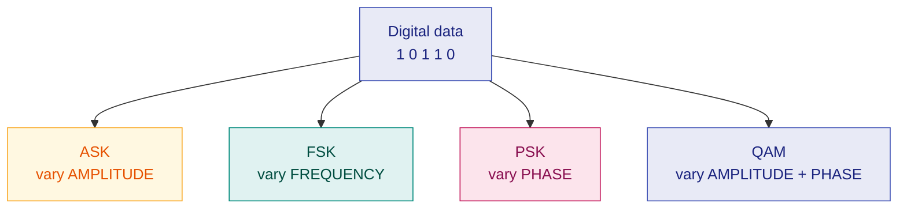

# 6. Digital-to-Analog Modulation — ASK, FSK, PSK, QAM

> **Syllabus:** Unit 2 — *Modulation techniques*
> **Source:** `4. Analog_Analog Transmission.pdf`, `bit_baudRate.docx`

---

## 🎯 In one line

To send **digital data** over an **analog** carrier, alter one of the carrier's three parameters: amplitude (**ASK**), frequency (**FSK**), phase (**PSK**) — or amplitude *and* phase together (**QAM**).

---

## 1. Concept

When data from one computer is sent to another via an analog carrier, it must first be converted into analog signals; the analog signal is then **modified to reflect the digital data**. An analog signal is characterised by its **amplitude, frequency and phase** — so there are three basic kinds of digital-to-analog conversion, plus their combination.



---

## 2. Amplitude Shift Keying (ASK)

The **amplitude** of the analog carrier signal is modified to reflect binary data. When binary data represents digit **1**, the amplitude is **held**; otherwise it is **set to 0**. Both **frequency and phase remain the same** as in the original carrier.

The two-level form is called **On-Off Keying (OOK)** — the carrier is simply switched on for 1 and off for 0.

```
 Data:    1       0       1       1       0
        ┌───┐           ┌───┐   ┌───┐
        │   │           │   │   │   │
 ASK:  ╱╲╱╲╱╲         ╱╲╱╲╱╲ ╱╲╱╲╱╲
       ╲╱╲╱╲╱  ─────  ╲╱╲╱╲╱ ╲╱╲╱╲╱  ─────
        carrier   OFF   carrier carrier  OFF
         ON             ON      ON
        └─ amplitude changes, frequency & phase constant ─┘
```

| | |
|---|---|
| ✅ **Advantages** | Simplest to implement; low bandwidth requirement |
| ❌ **Disadvantages** | **Highly susceptible to noise** — noise directly corrupts amplitude, which is exactly where the information is |

$$BW_{ASK} = (1+d) \times \text{baud rate}$$

---

## 3. Frequency Shift Keying (FSK)

The **frequency** of the analog carrier signal is modified to reflect binary data. This technique uses **two frequencies $f_1$ and $f_2$** — one (say $f_1$) represents binary **1**, the other represents binary **0**. Both **amplitude and phase** of the carrier wave are kept **intact**.

```
 Data:    1       0       1       1       0
        ┌───┐           ┌───┐   ┌───┐
        │   │           │   │   │   │

 FSK:  ╱╲╱╲╱╲  ╱  ╲  ╱ ╱╲╱╲╱╲ ╱╲╱╲╱╲  ╱  ╲  ╱
       ╲╱╲╱╲╱   ╲  ╱ ╲  ╲╱╲╱╲╱ ╲╱╲╱╲╱   ╲  ╱ ╲
        f1(fast)  f2(slow)  f1     f1     f2
        └─ frequency changes, amplitude & phase constant ─┘
```

| | |
|---|---|
| ✅ **Advantages** | **Much less susceptible to noise** than ASK (information is in frequency, and a limiter can strip amplitude noise) |
| ❌ **Disadvantages** | Requires **more bandwidth** than ASK |

$$BW_{FSK} = (1+d)\times\text{baud rate} + (f_2 - f_1)$$

---

## 4. Phase Shift Keying (PSK)

The **phase** of the original carrier signal is **altered** to reflect the binary data. **When a new binary symbol is encountered, the phase of the signal is altered.** Amplitude and frequency of the original carrier signal are kept **intact**.

```
 Data:    1       0       1       1       0
                  ↕ phase flips 180°
 PSK:  ╱╲╱╲╱╲ │╲╱╲╱╲│ ╱╲╱╲╱╲ ╱╲╱╲╱╲ │╲╱╲╱╲│
       ╲╱╲╱╲╱ │╱╲╱╲╱│ ╲╱╲╱╲╱ ╲╱╲╱╲╱ │╱╲╱╲╱│
         0°     180°     0°      0°    180°
        └─ phase changes, amplitude & frequency constant ─┘
```

**BPSK (Binary PSK)** uses two phases: $0°$ for one bit value and $180°$ for the other.

| | |
|---|---|
| ✅ **Advantages** | **Most noise-resistant** of the three basic schemes; bandwidth-efficient |
| ❌ **Disadvantages** | More complex detection — the receiver must track the carrier phase |

---

## 5. Quadrature Phase Shift Keying (QPSK)

QPSK alters the phase to reflect **two binary digits at once**. This is done in two different phases: the main stream of binary data is **divided equally** into two sub-streams, each modulating a carrier that is 90° out of phase with the other.

Four phases → each symbol carries **2 bits**:

| Dibit | Phase |
|---|---|
| 00 | 45° |
| 01 | 135° |
| 11 | 225° |
| 10 | 315° |

> ⭐ **This is the key benefit:** QPSK sends **twice the data in the same bandwidth** as BPSK, because each signal change carries 2 bits instead of 1.

### Constellation diagram

A **constellation diagram** plots each symbol as a point: distance from the origin = **amplitude**, angle = **phase**.

```
      BPSK (2 symbols)          QPSK (4 symbols)         8-PSK (8 symbols)
          Q                          Q                        Q
          │                          │                        │
          │                    ●     │     ●              ●   │   ●
          │                 (01)     │  (00)                  │
   ───●───┼───●───  I      ─────────┼─────────  I      ●─────┼─────●  I
     (1)  │  (0)                     │                        │
          │                    ●     │     ●              ●   │   ●
          │                 (11)     │  (10)                  │
      1 bit/symbol             2 bits/symbol            3 bits/symbol
```

> 💡 **Reading a constellation:** more points = more bits per symbol = higher bit rate at the same baud rate. But the points sit **closer together**, so a smaller amount of noise can push a received point into the wrong region. This is the fundamental trade-off — and it is exactly what Shannon's formula quantifies ([Ch. 3](03-nyquist-rate-and-shannon-capacity.md)).

---

## 6. Quadrature Amplitude Modulation (QAM) ⭐

QAM changes **both amplitude and phase** simultaneously. This gives many more distinguishable symbols than phase alone.

```
              16-QAM constellation (4 bits/symbol)
                          Q
                 ●    ●   │   ●    ●
                          │
                 ●    ●   │   ●    ●
              ────────────┼────────────  I
                 ●    ●   │   ●    ●
                          │
                 ●    ●   │   ●    ●

        16 points → log₂16 = 4 bits per symbol
```

| Scheme | Symbols | Bits/symbol | Bit rate at 1000 baud |
|---|---|---|---|
| BPSK / 2-ASK | 2 | 1 | 1,000 bps |
| QPSK / 4-QAM | 4 | 2 | 2,000 bps |
| 8-PSK | 8 | 3 | 3,000 bps |
| 16-QAM | 16 | 4 | 4,000 bps |
| 64-QAM | 64 | 6 | 6,000 bps |
| 256-QAM | 256 | 8 | 8,000 bps |

**Used in:** cable modems, Wi-Fi, DSL ([Ch. 12](12-xdsl.md)), digital TV.

---

## 7. Bit rate vs baud rate here ⭐

$$\boxed{\text{Bit rate} = \text{Baud rate} \times \log_2 L}$$

where $L$ is the number of signal elements (constellation points).

| Scheme | $L$ | $\log_2 L$ | Bit rate vs baud rate |
|---|---|---|---|
| ASK, FSK, BPSK | 2 | 1 | Equal |
| QPSK / 4-QAM | 4 | 2 | Bit rate = 2 × baud |
| 8-PSK | 8 | 3 | Bit rate = 3 × baud |
| 16-QAM | 16 | 4 | Bit rate = 4 × baud |

> 📌 **Bandwidth depends on the baud rate, not the bit rate.** That is precisely why higher-order QAM is so valuable — more bits squeezed through the same spectrum.

---

## 8. Comparison of all four ⭐⭐

| Feature | **ASK** | **FSK** | **PSK** | **QAM** |
|---|---|---|---|---|
| Parameter varied | Amplitude | Frequency | Phase | **Amplitude + Phase** |
| Parameters constant | $f$, $\phi$ | $A$, $\phi$ | $A$, $f$ | $f$ |
| Noise immunity | **Poor** | Good | **Very good** | Moderate (dense constellations) |
| Bandwidth need | Low | **High** | Low | Low |
| Complexity | Simplest | Moderate | Complex | Most complex |
| Bandwidth efficiency | Low | **Lowest** | Good | **Highest** |
| Typical use | Optical fibre, IR | Low-speed modems, Bluetooth | Wi-Fi, satellite | Cable, DSL, Wi-Fi, digital TV |

---

## 9. Worked examples

### Example 1 — bit rate from baud rate

**An analog signal carries 4 bits per signal element. If 1000 signal elements are sent per second, find the bit rate.**

$$\text{Bit rate} = 1000 \times 4 = \boxed{4000\ \text{bps}}$$

### Example 2 — baud rate from bit rate

**A digital signal has a bit rate of 2000 bps using 16-QAM. Find the baud rate.**

16-QAM → $L = 16$ → $\log_2 16 = 4$ bits per symbol.

$$\text{Baud rate} = \frac{2000}{4} = \boxed{500\ \text{baud}}$$

### Example 3 — constellation points needed

**A channel supports a baud rate of 2000 baud. What modulation scheme gives a bit rate of 8000 bps?**

$$\log_2 L = \frac{8000}{2000} = 4 \quad\Longrightarrow\quad L = 2^4 = 16 \quad\Longrightarrow\quad \boxed{\text{16-QAM}}$$

---

## 10. Common exam questions

1. **Explain ASK, FSK and PSK with waveforms.** ⭐⭐
2. **Compare ASK, FSK, PSK and QAM.** ⭐ → the comparison table.
3. **Why is ASK more susceptible to noise than FSK and PSK?** → noise directly affects amplitude, which is where ASK stores the information.
4. **What is QPSK? How many bits per symbol?** → alters phase to reflect two binary digits at once; 2 bits/symbol; 4 phases.
5. **What is a constellation diagram?** → plot of symbols; distance = amplitude, angle = phase.
6. **What is QAM? Where is it used?** → varies amplitude and phase together; cable, DSL, Wi-Fi, digital TV.
7. **Numericals:** bit rate ↔ baud rate ↔ number of levels.

---

## ⚡ Quick revision

- Digital→Analog: **ASK** (amplitude) · **FSK** (frequency) · **PSK** (phase) · **QAM** (amplitude + phase).
- **ASK:** 1 → carrier held, 0 → amplitude 0. Simplest but **most noise-prone**.
- **FSK:** two frequencies $f_1$ (for 1) and $f_2$ (for 0). Noise-resistant but **needs more bandwidth**.
- **PSK:** phase altered when a new symbol arrives. BPSK uses 0°/180°. **Most noise-resistant** of the three.
- **QPSK:** 4 phases, **2 bits per symbol** — double the data in the same bandwidth.
- **QAM:** amplitude **and** phase; 16-QAM = 4 bits/symbol, 64-QAM = 6, 256-QAM = 8.
- **Constellation diagram:** distance = amplitude, angle = phase. More points = more bits but **less noise margin**.
- $\text{Bit rate} = \text{Baud rate} \times \log_2 L$.
- **Bandwidth depends on baud rate**, not bit rate.

---

**Previous:** [← 5. AM & FM](05-am-fm-fundamentals.md) · **Next:** [7. PCM & ADPCM →](07-pcm-and-adpcm.md)
