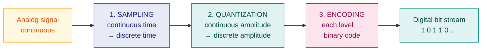

# 7. PCM and ADPCM

> **Syllabus:** Unit 3 — *PCM, ADPCM*
> **Source:** `2. ModulationDemodulation.docx`

---

## 🎯 In one line

**PCM** converts an analog signal to digital in three steps — **sampling → quantization → encoding**; **DPCM** transmits only the *difference* between samples, and **ADPCM** makes that difference step size *adaptive*.

---

## 1. Concept

Data can be stored in two ways: analog and digital. For a computer to use data, it must be in **discrete digital form**. To transmit analog data (like your voice) digitally, it must first be converted.

**Pulse Code Modulation (PCM)** is the standard technique for **analog-to-digital conversion**. Five processes work together to convert continuous analog signals into a stream of 1s and 0s that can be reliably transmitted and processed by computers.



---

## 2. Step 1 — Sampling ⭐

**What it is:** the process of taking instantaneous measurements (**samples**) of a continuous analog signal at **regular time intervals**.

**Role:** it converts the signal from the **continuous time domain** into the **discrete time domain**.

### Nyquist Sampling Theorem

> According to the Nyquist theorem, the **sampling rate must be at least twice the highest frequency** of the original signal to ensure it can be perfectly reconstructed later.

$$\boxed{f_s \ge 2f_{max}}$$

$2f_{max}$ is called the **Nyquist rate**.

| Case | Condition | Result |
|---|---|---|
| **Correct sampling** | $f_s \ge 2f_{max}$ | Signal can be perfectly reconstructed |
| **Under-sampling** | $f_s < 2f_{max}$ | **Aliasing** — high frequencies masquerade as low ones; the original cannot be recovered |
| **Over-sampling** | $f_s \gg 2f_{max}$ | Works, but wastes bandwidth and storage |

```
  Original analog signal          Sampled at regular intervals
        ╱‾‾╲    ╱‾╲                  │  │  │     │  │
       ╱    ╲  ╱   ╲                 │ ││ ││    ││ ││
   ───╱      ╲╱     ╲──          ────┴─┴┴─┴┴────┴┴─┴┴───
                                      ↑  ↑  ↑  ↑
                                      Ts Ts Ts Ts   (Ts = 1/fs)
```

> 💡 **Telephone example:** human voice is band-limited to ~4 kHz, so $f_s = 2 \times 4000 = 8000$ samples/s. With 8 bits per sample, that gives the familiar **64 kbps** digital voice channel.

**Three sampling methods:** ideal (impulse), natural, and **flat-top (sample-and-hold)** — the last is what practical PCM uses.

---

## 3. Step 2 — Quantization ⭐

**What it is:** the process of mapping the sampled continuous values to the **nearest predetermined discrete levels**.

**Role:** it **rounds off** each sample to the nearest available step. This creates an *approximation* of the actual signal, converting a **continuous amplitude into a discrete amplitude**.

```
  Level 7 ─────────────────────────────
  Level 6 ────────────●────────────────   sample = 6.3 → rounds to 6
  Level 5 ─────●───────────────────────
  Level 4 ─────────────────────●───────
  Level 3 ──●──────────────────────────
  Level 2 ─────────────────────────────
  Level 1 ─────────────────────────────
  Level 0 ─────────────────────────────
              ↑     ↑      ↑      ↑
           the gap between the true value
           and the chosen level = QUANTIZATION ERROR
```

### Quantization error (quantization noise)

Because rounding discards information, the reconstructed signal is never *exactly* the original. The difference is **quantization error** — and unlike channel noise, **it can never be removed later**.

$$\text{Quantization error} \le \frac{\Delta}{2}, \qquad \Delta = \frac{V_{max}-V_{min}}{L} = \text{step size}$$

### Signal-to-quantization-noise ratio

$$\boxed{\text{SNR}_{dB} = 6.02n + 1.76}$$

where $n$ = number of bits per sample.

> ⭐ **Every extra bit buys about 6 dB of quality.** This is worth remembering — it is the classic one-line answer to "what is the effect of increasing bits per sample?"

### Uniform vs non-uniform quantization

| | **Uniform** | **Non-uniform (companding)** |
|---|---|---|
| Step size | Same everywhere | **Small for weak signals, large for strong** |
| Problem | Weak signals suffer a poor SNR | Fixes that — equalises SNR across amplitudes |
| Used in | Simple systems | **Telephony** — μ-law (North America/Japan), A-law (Europe/India) |

---

## 4. Step 3 — Encoding ⭐

**What it is:** the process of representing each quantized value with a **unique sequence of binary digits (bits)**.

**Role:** it assigns a definite binary code word to each quantization level.

$$\boxed{\text{Number of bits per sample } n = \log_2 L}$$

where $L$ = number of quantization levels.

| Levels $L$ | Bits/sample $n$ |
|---|---|
| 2 | 1 |
| 4 | 2 |
| 8 | 3 |
| 16 | 4 |
| 256 | 8 |

### PCM bit rate ⭐

$$\boxed{\text{Bit rate} = f_s \times n = f_s \times \log_2 L}$$

And by Nyquist, the minimum bandwidth needed for the resulting digital signal is

$$B_{min} = \frac{\text{bit rate}}{2}$$

---

## 5. The complete PCM chain

```
 TRANSMITTER                                         RECEIVER
 ┌────────┐  ┌─────────┐  ┌──────────┐  ┌────────┐  ┌──────────┐  ┌────────────┐
 │ Analog │→ │ Sampler │→ │Quantizer │→ │Encoder │→ │ Decoder  │→ │Reconstruct │→ Analog
 │  input │  │ (S/H)   │  │          │  │        │  │          │  │ low-pass   │   output
 └────────┘  └─────────┘  └──────────┘  └────────┘  └──────────┘  └────────────┘
              fs ≥ 2fmax    L levels     n=log₂L      binary →      smoothing
                            ↑ADDS ERROR   bits        levels        filter
```

At the receiver, **PCM demodulation** reverses the process: decode the bits back to levels, then pass through a **low-pass filter** to reconstruct a smooth analog signal.

---

## 6. DPCM — Differential PCM

**Idea:** in most real signals (speech, music, video), **consecutive samples are very similar**. So instead of transmitting the full value of each sample, transmit only the **difference** from the previous one.

$$d[n] = x[n] - \hat{x}[n-1]$$

Because the difference is small, it needs **fewer bits** than the full sample → less bandwidth for the same quality.

| | |
|---|---|
| ✅ **Advantage** | Reduced bit rate compared to PCM |
| ❌ **Problem** | A **fixed** step size cannot cope with both slowly- and rapidly-changing signals — see slope overload below |

---

## 7. ADPCM — Adaptive Differential PCM ⭐

**ADPCM** improves DPCM by making the quantization step size **adaptive** — it changes dynamically according to the characteristics of the signal.

- When the signal changes **rapidly** → step size **increases**
- When the signal changes **slowly** → step size **decreases**

This solves DPCM's two failure modes:

| Problem | Cause | ADPCM's fix |
|---|---|---|
| **Slope overload distortion** | Step size **too small** to follow a fast-changing signal — the encoder can't keep up | Enlarge the step |
| **Granular noise** | Step size **too large** for a slowly-changing (or flat) signal — output oscillates around the true value | Shrink the step |

```
  SLOPE OVERLOAD                    GRANULAR NOISE
  (steps too small)                 (steps too large)

  actual ╱                          actual ──────────
        ╱                                  ┌─┐ ┌─┐
       ╱  ┌─┘                          ────┘ └─┘ └──  output
      ╱┌──┘  ← output can't            oscillates around
     ╱─┘       keep up                 a flat signal
```

**Result:** ADPCM achieves roughly the **same quality as PCM at about half the bit rate** (typically 32 kbps vs PCM's 64 kbps for telephone voice).

### PCM vs DPCM vs ADPCM ⭐

| Feature | **PCM** | **DPCM** | **ADPCM** |
|---|---|---|---|
| Transmits | Full sample value | **Difference** between samples | Difference, **adaptively quantized** |
| Step size | Fixed | Fixed | **Adaptive** |
| Bit rate (voice) | 64 kbps | ~48 kbps | **~32 kbps** |
| Complexity | Simple | Moderate | Higher |
| Quality | Reference | Slightly lower | ≈ PCM quality at half the rate |

---

## 8. Worked examples ⭐

### Example 1 — full PCM calculation

**An analog signal has a bandwidth of 4 kHz. It is sampled at the Nyquist rate and each sample is quantized into 256 levels. Find the sampling rate, bits per sample, and bit rate.**

**Sampling rate:**
$$f_s = 2f_{max} = 2 \times 4000 = \boxed{8000\ \text{samples/s}}$$

**Bits per sample:**
$$n = \log_2 L = \log_2 256 = \boxed{8\ \text{bits}}$$

**Bit rate:**
$$\text{Bit rate} = f_s \times n = 8000 \times 8 = \boxed{64{,}000\ \text{bps} = 64\ \text{kbps}}$$

> 📌 This is the standard telephone PCM channel.

---

### Example 2 — bandwidth required

**For the signal above, what minimum bandwidth is needed to transmit the digital signal?**

$$B_{min} = \frac{\text{bit rate}}{2} = \frac{64000}{2} = \boxed{32\ \text{kHz}}$$

> 💡 Note the cost of going digital: a 4 kHz analog voice signal needs **32 kHz** once digitised. You pay in bandwidth and get back noise immunity and regeneration.

---

### Example 3 — quantization SNR

**A PCM system uses 8 bits per sample. Find the signal-to-quantization-noise ratio in dB.**

$$\text{SNR}_{dB} = 6.02n + 1.76 = 6.02(8) + 1.76 = 48.16 + 1.76 = \boxed{49.92\ \text{dB}}$$

If we increase to 10 bits: $6.02(10)+1.76 = 61.96$ dB — **about 12 dB better for 2 extra bits** ✓ (6 dB per bit).

---

### Example 4 — step size

**A signal ranges from $-4$ V to $+4$ V and is quantized into 16 levels. Find the step size and maximum quantization error.**

$$\Delta = \frac{V_{max}-V_{min}}{L} = \frac{4-(-4)}{16} = \frac{8}{16} = \boxed{0.5\ \text{V}}$$

$$\text{Max quantization error} = \frac{\Delta}{2} = \boxed{0.25\ \text{V}}$$

---

## 9. Common exam questions

1. **What is PCM? Explain its steps with a block diagram.** ⭐⭐ *(sampling → quantization → encoding)*
2. **State the Nyquist sampling theorem. What is aliasing?** ⭐
3. **What is quantization error / quantization noise?** → the rounding difference; cannot be removed later.
4. **What is companding? Why is non-uniform quantization used?** → equalises SNR for weak and strong signals; μ-law and A-law.
5. **Differentiate PCM, DPCM and ADPCM.** ⭐⭐ → the comparison table.
6. **What is slope overload distortion and granular noise?** ⭐ → step too small / too large; how ADPCM fixes both.
7. **Numericals:** sampling rate, bits per sample, bit rate, bandwidth, SNR, step size.

---

## ⚡ Quick revision

- **PCM = Sampling → Quantization → Encoding.** (Analog → Digital)
- **Sampling:** $f_s \ge 2f_{max}$ (Nyquist rate). Too slow ⇒ **aliasing**.
- Sampling converts **continuous time → discrete time**.
- **Quantization:** rounds each sample to the nearest level. Converts **continuous amplitude → discrete amplitude**. Introduces **quantization error** which can **never** be removed.
- **Encoding:** each level → a binary code. $n = \log_2 L$.
- $\boxed{\text{Bit rate} = f_s \times \log_2 L}$; $B_{min} = \text{bit rate}/2$.
- $\text{SNR}_{dB} = 6.02n + 1.76$ — roughly **6 dB per extra bit**.
- **Telephone standard:** 4 kHz → 8000 samples/s × 8 bits = **64 kbps**.
- **Companding** (μ-law / A-law) = non-uniform quantization; small steps for weak signals.
- **DPCM** sends the *difference* between samples → fewer bits.
- **ADPCM** makes the step size **adaptive** → ~32 kbps at PCM-like quality.
- **Slope overload** = step too small for a fast signal · **Granular noise** = step too large for a slow signal.

---

**Previous:** [← 6. Digital-to-Analog Modulation](06-digital-to-analog-modulation.md) · **Next:** [8. Line Coding →](08-line-coding.md)
