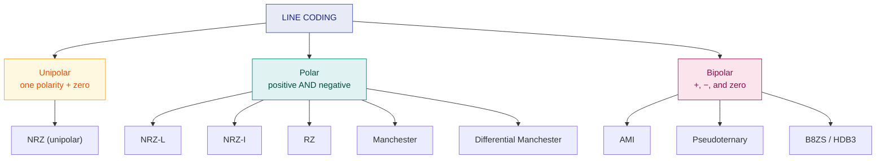

# 8. Line Coding

> **Syllabus:** Unit 3 — *Line coding*
> **Source:** `3. DataEncoding.pptx`, `5. DataEncoding.pdf`

---

## 🎯 In one line

**Line coding** converts digital **data** into a digital **signal** — and the schemes differ in how well they carry a clock, avoid DC bias, and survive polarity reversal.

---

## 1. Concept

Data or information can be stored in two ways, analog and digital. For a computer to use data it must be in discrete digital form. Similarly, signals can be analog or digital. **To transmit data digitally, it needs to be first converted to digital form.**

**Digital-to-digital conversion** can be done two ways:

| | Purpose | Required? |
|---|---|---|
| **Line coding** | Converting digital **data** into a digital **signal** | **Necessary** for all communications |
| **Block coding** | Adding redundancy for error detection and synchronisation | **Optional** |

**Line Coding:** the process of converting digital data into a digital signal. Digital data is found in binary format, represented (stored) internally as a series of 1s and 0s.

> 💡 **Real-world example:** sending a document from a computer to a printer via a local cable uses **Manchester encoding**, where voltage transitions embed clock timing.

---

## 2. What makes a line code "good"? ⭐

Every scheme is judged on these criteria — and every exam comparison question is really asking about them:

| Criterion | Why it matters |
|---|---|
| **Self-synchronisation** | The receiver must recover the **clock** from the signal itself. A long run of identical bits with no transitions causes the receiver's clock to drift out of step. |
| **DC component** | A non-zero average voltage cannot pass through transformers or AC-coupled equipment. Good codes have **zero DC**. |
| **Signal (baseline) wandering** | Long runs of the same level make the receiver's running average drift, causing mis-decoding. |
| **Error detection** | Some codes (like AMI) can detect errors from violations of their own rule. |
| **Bandwidth** | Fewer transitions → lower bandwidth needed. |
| **Noise/interference immunity** | Differential schemes are immune to polarity reversal. |

---

## 3. Classification



| Category | Voltage levels used |
|---|---|
| **Unipolar** | One polarity only (e.g. $+V$ and $0$) |
| **Polar** | Both **positive and negative** ($+V$ and $-V$) |
| **Bipolar** | Three levels: $+V$, $0$, and $-V$ |

---

## 4. The schemes — rules and waveforms ⭐⭐

Throughout, the example bit stream is:

$$\textbf{1 \quad 0 \quad 1 \quad 1 \quad 0 \quad 0 \quad 1}$$

---

### 4.1 Unipolar NRZ

**Rule:** 1 → positive voltage, 0 → zero voltage. ("NRZ" = **N**on-**R**eturn to **Z**ero: the level is held for the *whole* bit period.)

```
        1     0     1     1     0     0     1
      ┌────┐       ┌───────────┐             ┌────┐
 +V   │    │       │           │             │    │
      │    │       │           │             │    │
  0 ──┘    └───────┘           └─────────────┘    └──
```

| ✅ | Simplest to implement |
|---|---|
| ❌ | **Large DC component** (average is non-zero) · **no synchronisation** on long runs · poor noise immunity |

---

### 4.2 Polar NRZ-L (Non-Return to Zero — Level)

**Rule:** the **level** of the voltage determines the bit. 1 → $+V$, 0 → $-V$ (or the reverse).

```
        1     0     1     1     0     0     1
      ┌────┐       ┌───────────┐             ┌────
 +V   │    │       │           │             │
  0 ──┼────┼───────┼───────────┼─────────────┼────
 -V   │    └───────┘           └─────────────┘
```

| ✅ | Better DC balance than unipolar; simple |
|---|---|
| ❌ | **Long runs of identical bits ⇒ no transitions ⇒ loss of synchronisation** · **polarity reversal inverts all data** |

---

### 4.3 Polar NRZ-I (Non-Return to Zero — Inverted) ⭐

**Rule:** the **presence or absence of a transition at the start of the bit** determines the bit.
- **1 → transition (invert the level)**
- **0 → no transition (keep the level)**

| Bit | 1 | 0 | 1 | 1 | 0 | 0 | 1 |
|---|---|---|---|---|---|---|---|
| Action | invert | hold | invert | invert | hold | hold | invert |
| Level (starting low) | $+V$ | $+V$ | $-V$ | $+V$ | $+V$ | $+V$ | $-V$ |

```
        1     0     1     1     0     0     1
      ┌──────────┐       ┌─────────────────┐
 +V   │          │       │                 │
  0 ──┼──────────┼───────┼─────────────────┼────
 -V   │          └───────┘                 └────
       invert hold invert invert hold hold invert
```

> ⭐ **The big advantage:** because the *change*, not the *level*, carries the meaning, NRZ-I is **immune to polarity reversal**. If someone swaps the two wires, the data still decodes correctly.
>
> ❌ **Still fails on long runs of 0s** — no transitions, so synchronisation is lost.

---

### 4.4 RZ (Return to Zero)

**Rule:** the signal **returns to zero in the middle of every bit**. 1 → positive for the first half then zero; 0 → negative for the first half then zero.

```
        1     0     1     1     0     0     1
      ┌─┐         ┌─┐   ┌─┐               ┌─┐
 +V   │ │         │ │   │ │               │ │
  0 ──┘ └──┬──────┘ └───┘ └───┬─────┬─────┘ └──
 -V        └─┘                └─┘   └─┘
```

| ✅ | **Excellent synchronisation** — there is a transition in *every* bit |
|---|---|
| ❌ | **Needs twice the bandwidth** (two signal changes per bit) · uses three levels |

---

### 4.5 Manchester ⭐⭐

**Rule:** **always a transition in the middle of the bit.** The mid-bit transition provides both the clock *and* the data.
- **0 → high-to-low** transition in the middle
- **1 → low-to-high** transition in the middle

*(Some textbooks use the opposite convention — state whichever you use in the exam.)*

```
        1     0     1     1     0     0     1
        ┌─┐  ┌─┐    ┌─┐   ┌─┐  ┌─┐  ┌─┐    ┌─┐
 +V     │ │  │ │    │ │   │ │  │ │  │ │    │ │
  0  ───┘ │  │ └────┘ │   │ └──┘ │  │ └────┘ │
 -V    ┌──┘  └─┐    ┌─┘   └─┐  ┌─┘  └─┐    ┌─┘
        ↑L→H  ↑H→L  ↑L→H  ↑L→H ↑H→L ↑H→L  ↑L→H
```

Reading it: for each bit look **only at the direction of the mid-bit transition**.

| ✅ | **Self-synchronising** (transition in every bit) · **no DC component** · error detection possible (a missing transition = error) |
|---|---|
| ❌ | **Requires twice the bandwidth** of NRZ |

**Used in:** Ethernet (10BASE-T), and printer cables as noted in the source.

---

### 4.6 Differential Manchester ⭐

**Rule:** there is **always a mid-bit transition** (for the clock), and the bit value is decided by whether there is *also* a transition **at the start** of the bit.
- **0 → transition at the start** of the bit
- **1 → no transition at the start**

```
        1     0     1     1     0     0     1
        no   yes    no    no   yes  yes    no     ← transition at START?
      ┌─┐   ┌─┐    ┌─┐   ┌─┐   ┌─┐  ┌─┐   ┌─┐
 +V   │ │   │ │    │ │   │ │   │ │  │ │   │ │
  0 ──┘ └───┘ └────┘ └───┘ └───┘ └──┘ └───┘ └──
        ↑     ↑      ↑     ↑     ↑    ↑     ↑
        always a transition in the MIDDLE (clock)
```

| ✅ | Self-synchronising · **no DC component** · **immune to polarity reversal** (like NRZ-I) |
|---|---|
| ❌ | Twice the bandwidth |

**Used in:** Token Ring.

---

### 4.7 AMI — Alternate Mark Inversion (Bipolar) ⭐

**Rule:** 0 → **zero voltage**. 1 → **alternating** positive and negative voltage (the first 1 is $+V$, the next 1 is $-V$, the next $+V$, and so on).

| Bit | 1 | 0 | 1 | 1 | 0 | 0 | 1 |
|---|---|---|---|---|---|---|---|
| Level | $+V$ | $0$ | $-V$ | $+V$ | $0$ | $0$ | $-V$ |

```
        1     0     1     1     0     0     1
      ┌────┐             ┌────┐
 +V   │    │             │    │
  0 ──┘    └─────┬───────┘    └─────────┬─────
 -V              └────┐                 └────┐
                      │                      │
        +      0    −     +     0     0    −
```

| ✅ | **No DC component** (the +/− alternation averages to zero) · **built-in error detection** — two consecutive pulses of the same polarity is an *AMI violation*, meaning an error |
|---|---|
| ❌ | **Long strings of 0s lose synchronisation** (zero voltage = no transitions) |

**Pseudoternary** is AMI with the roles swapped: **1 → zero voltage**, **0 → alternating polarity**.

---

### 4.8 Scrambling — B8ZS and HDB3 ⭐

These fix AMI's one weakness: **long runs of zeros**. They substitute a special pattern containing deliberate **violations** that the receiver recognises and removes.

| Scheme | Full name | Replaces | How |
|---|---|---|---|
| **B8ZS** | Bipolar with 8-Zero Substitution | **8 consecutive 0s** | Replaced by `000VB0VB`, where **V** = violation pulse (same polarity as the previous pulse) and **B** = valid pulse (opposite polarity). Used in **North America**. |
| **HDB3** | High-Density Bipolar 3-zero | **4 consecutive 0s** | Replaced by `000V` or `B00V`, chosen so the number of pulses between violations stays **odd**. Used in **Europe and Japan**. |

> 💡 **The trick:** a violation is illegal under normal AMI rules, so it cannot be confused with real data. The receiver sees the violation pattern, knows it was substituted, and restores the original zeros — synchronisation preserved, DC balance preserved.

---

## 5. Master comparison table ⭐⭐

| Scheme | Category | DC component | Self-sync | Polarity-reversal immune | Bandwidth |
|---|---|---|---|---|---|
| **Unipolar NRZ** | Unipolar | ❌ High | ❌ No | ❌ No | Low |
| **NRZ-L** | Polar | ⚠️ Some | ❌ No | ❌ No | Low |
| **NRZ-I** | Polar | ⚠️ Some | ⚠️ Only on 1s | ✅ **Yes** | Low |
| **RZ** | Polar | ✅ None | ✅ **Yes** | ❌ No | **High (2×)** |
| **Manchester** | Polar | ✅ **None** | ✅ **Yes** | ❌ No | **High (2×)** |
| **Diff. Manchester** | Polar | ✅ **None** | ✅ **Yes** | ✅ **Yes** | **High (2×)** |
| **AMI** | Bipolar | ✅ **None** | ⚠️ Fails on 0s | ❌ No | Low |
| **B8ZS / HDB3** | Bipolar | ✅ **None** | ✅ **Yes** | ❌ No | Low |

> ⭐ **The pattern to notice:** you buy synchronisation with bandwidth. NRZ schemes are bandwidth-cheap but sync-poor; Manchester schemes sync perfectly but cost double the bandwidth; AMI + scrambling (B8ZS/HDB3) is the clever compromise that gets both — which is why telephone networks use it.

---

## 6. Worked example ⭐

**Draw the NRZ-L, NRZ-I, Manchester, Differential Manchester and AMI waveforms for the bit stream `0 1 0 0 1 1 0`.**

| Bit | 0 | 1 | 0 | 0 | 1 | 1 | 0 |
|---|---|---|---|---|---|---|---|
| **NRZ-L** (1=+V, 0=−V) | $-V$ | $+V$ | $-V$ | $-V$ | $+V$ | $+V$ | $-V$ |
| **NRZ-I** (1=invert; start $+V$) | $+V$ | $-V$ | $-V$ | $-V$ | $+V$ | $-V$ | $-V$ |
| **Manchester** (0=H→L, 1=L→H) | H→L | L→H | H→L | H→L | L→H | L→H | H→L |
| **Diff. Manchester** (0 = transition at start) | start-trans | none | start-trans | start-trans | none | none | start-trans |
| **AMI** (1 alternates, 0 = zero) | $0$ | $+V$ | $0$ | $0$ | $-V$ | $+V$ | $0$ |

**How to check your AMI answer:** read only the 1s — their polarities must alternate strictly: $+, -, +$ ✓

---

## 7. Common exam questions

1. **What is line coding? Differentiate line coding and block coding.** ⭐
2. **Draw the waveform for a given bit stream** using NRZ-L / NRZ-I / Manchester / Differential Manchester / AMI. ⭐⭐ *(This is the most commonly asked question — practise it.)*
3. **Compare the line coding schemes.** ⭐ → the master table.
4. **What is the DC component problem? Which schemes avoid it?**
5. **What is self-synchronisation? Which schemes provide it?** ⭐
6. **Differentiate NRZ-L and NRZ-I.** → level vs transition; NRZ-I survives polarity reversal.
7. **Differentiate Manchester and Differential Manchester.** → direction of mid-bit transition vs presence of a start-of-bit transition.
8. **What are B8ZS and HDB3? Why are they needed?** ⭐ → they fix AMI's long-zero-run problem; 8 zeros vs 4 zeros; North America vs Europe.
9. **What is an AMI violation?** → two consecutive pulses of the same polarity — signals an error, or a deliberate substitution marker.

---

## ⚡ Quick revision

- **Line coding** = digital data → digital signal (**necessary**). **Block coding** = adds redundancy (**optional**).
- **Judged on:** self-synchronisation, DC component, baseline wandering, error detection, bandwidth.
- **Categories:** Unipolar (one polarity) · Polar (+ and −) · Bipolar (+, 0, −).
- **NRZ-L** — the **level** carries the bit. Simple, but no sync on long runs, and polarity-sensitive.
- **NRZ-I** — **1 = transition, 0 = no transition**. ✅ Polarity-reversal immune; ❌ fails on long runs of 0s.
- **RZ** — returns to zero mid-bit. Great sync, **2× bandwidth**.
- **Manchester** — **always a mid-bit transition**; 0 = H→L, 1 = L→H. No DC, self-syncing, 2× bandwidth. **Ethernet.**
- **Differential Manchester** — mid-bit transition for clock; **0 = transition at start**, 1 = none. Also polarity-immune. **Token Ring.**
- **AMI** — 0 = zero volts, 1 = **alternating** +/−. No DC, detects errors via violations, but fails on long 0 runs.
- **B8ZS** replaces **8 zeros** (North America); **HDB3** replaces **4 zeros** (Europe/Japan).
- **Trade-off:** synchronisation costs bandwidth. AMI + scrambling gets both.

---

**Previous:** [← 7. PCM & ADPCM](07-pcm-and-adpcm.md) · **Next:** [9. Error Detection →](09-error-detection.md)
