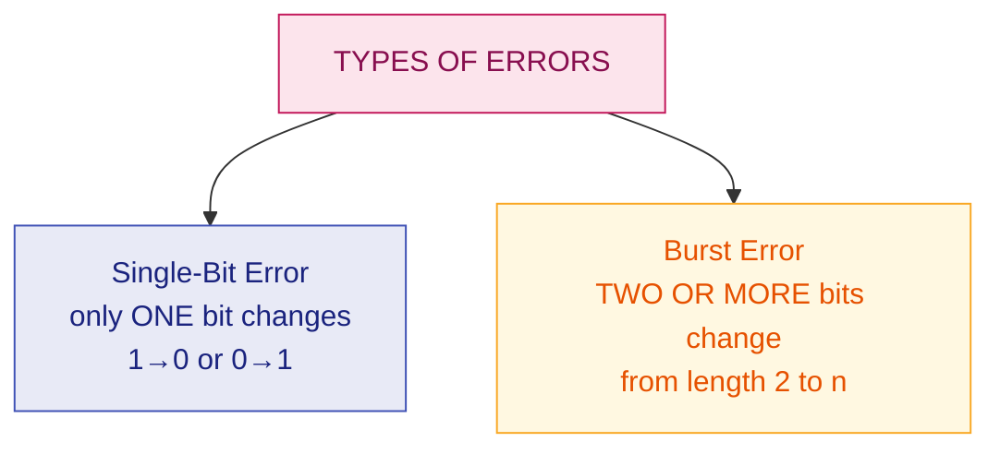
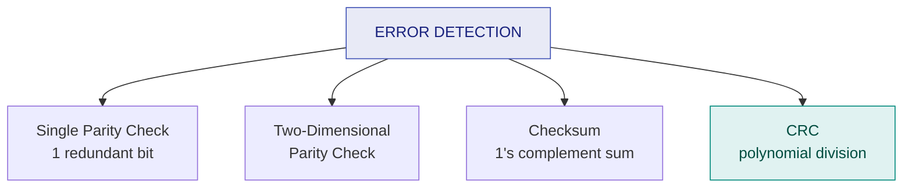
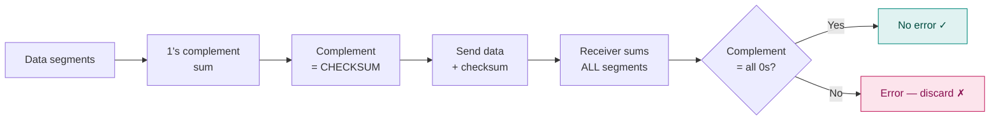

# 9. Error Detection

> **Syllabus:** Unit 3 — *Error handling techniques*. Teacher's note: **"Error detection is also included."**
> **Source:** `6. Error_detection.pdf`

---

## 🎯 In one line

Add **redundant bits** to the data so the receiver can tell whether what arrived is what was sent — via **parity**, **2D parity**, **checksum**, or (most powerfully) **CRC**.

---

## 1. Concept

When data is transmitted from one device to another, the system does not guarantee whether the data received by the device is identical to the data transmitted by the other device.

> **An Error is a situation when the message received at the receiver end is not identical to the message transmitted.**

All error detection works on one principle: **redundancy** — send extra bits alongside the data that let the receiver check consistency.

---

## 2. Types of Errors ⭐



### Single-Bit Error

**Only one bit** of a given data unit is changed from 1 to 0 or from 0 to 1.

```
   Sent:      0 0 0 0 0 0 1 0
                      ↓ 0 changed to 1
   Received:  0 0 0 0 1 0 1 0
```

> 📌 Single-bit errors are **least likely** in serial transmission, because noise would have to last less than one bit time. They are more common in **parallel** transmission.

### Burst Error

**Two or more bits** in the data unit have changed. The length of a burst error is measured **from the first corrupted bit to the last**, and bits *inside* that span need not all be corrupted.

```
   Sent:      0 1 0 0 0 1 0 0 0 1 1 0
                  ↓ ↓   ↓ ↓
   Received:  0 1 1 1 0 0 1 0 0 1 1 0
                └─── burst length = 5 ───┘
```

> 📌 Burst errors are **most likely in serial transmission** — a noise spike (impulse noise, see [Ch. 2](02-signals-and-noise.md)) lasting a few milliseconds corrupts many consecutive bits.

---

## 3. The four techniques



---

## 4. Single Parity Check ⭐

One **redundant bit** (the parity bit) is appended to the data so that the **total number of 1s becomes even (even parity) or odd (odd parity)**.

| Scheme | Rule |
|---|---|
| **Even parity** | If the number of 1s is **even**, the parity bit is **0**. If **odd**, the parity bit is **1**. *(Total 1s becomes even.)* |
| **Odd parity** | If the number of 1s is **even**, the parity bit is **1**. If **odd**, the parity bit is **0**. *(Total 1s becomes odd.)* |

### Example (even parity)

| Data | Number of 1s | Parity bit | Transmitted |
|---|---|---|---|
| `1000001` | 2 (even) | **0** | `10000010` |
| `1101000` | 3 (odd) | **1** | `11010001` |
| `1010101` | 4 (even) | **0** | `10101010` |

**At the receiver:** count the 1s in the received unit. For even parity, if the count is **odd**, an error has occurred.

| ✅ | Simplest technique; detects **all single-bit errors**; detects odd numbers of errors |
|---|---|
| ❌ | **Cannot detect an even number of errors** — if 2 bits flip, the parity is unchanged and the error slips through · **cannot locate or correct** the error |

---

## 5. Two-Dimensional Parity Check ⭐

Data is organised into a **table of rows**. A parity bit is computed for **each row** *and* for **each column**. Both the row parities and the column parities are sent with the data.

### Example (from the source)

Original data: `11001110  10111010  01110010  01010010`

```
                          Row
   1 1 0 0 1 1 1 0   →     1     ← row parity
   1 0 1 1 1 0 1 0   →     1
   0 1 1 1 0 0 1 0   →     0
   0 1 0 1 0 0 1 0   →     1
   ─────────────────       ─
   0 1 0 1 0 1 0         1      ← column parities
   ↑ column parity row
```

**At the receiver:** recompute both. The **intersection** of the failing row and failing column pinpoints the corrupted bit — so 2D parity can even **correct** a single-bit error.

| ✅ | Detects **all single-bit errors**, most burst errors, and can **locate** a single-bit error |
|---|---|
| ❌ | **Drawback:** if **two bits in one data unit are corrupted and two bits in exactly the same position in another data unit are also corrupted**, the 2D parity checker **will not detect the error**. This technique cannot detect 4-bit errors (or more) in some cases. |

---

## 6. Checksum ⭐

A **Checksum** is an error detection technique based on the concept of **redundancy**. It is divided into two parts:

### Checksum Generator (sender side)

1. The data is subdivided into **equal segments of $n$ bits** each.
2. All these segments are **added together using 1's complement arithmetic** (any carry out of the MSB is added back — "end-around carry").
3. The sum is **complemented** and appended to the original data as the **checksum field**.
4. The extended data is transmitted across the network.

If $L$ is the total sum of the data segments, the checksum is $\overline{L}$ (the complement).

### Checksum Checker (receiver side)

1. Divide the received data into the same $n$-bit segments (**including** the checksum).
2. Add all segments using 1's complement arithmetic.
3. **Complement the result.**
4. **If the result is all zeros → no error.** Otherwise, the data is discarded.



### Worked example ⭐

**Data (four 8-bit segments):** `10011001  11100010  00100100  10000100`

**Sender:**

| Step | Binary | Decimal |
|---|---|---|
| Segment 1 | `10011001` | 153 |
| Segment 2 | `11100010` | 226 |
| Sum 1+2 | 379 → carry out, wrap | $379-256=123$, $+1$ carry $= 124$ → `01111100` |
| Segment 3 | `00100100` | 36 |
| Running sum | $124+36 = 160$ | `10100000` |
| Segment 4 | `10000100` | 132 |
| Running sum | $160+132 = 292$ → carry, wrap | $292-256=36$, $+1 = 37$ → `00100101` |

$$\text{Sum} = \texttt{00100101} \quad\Longrightarrow\quad \textbf{Checksum} = \overline{\texttt{00100101}} = \boxed{\texttt{11011010}}$$

**Transmitted:** `10011001 11100010 00100100 10000100 11011010`

**Receiver:** sum all five segments: $37 + 218 = 255 = \texttt{11111111}$. Complement $= \texttt{00000000}$ → **all zeros → no error** ✓

| ✅ | Simple; detects most errors; used in TCP/IP, UDP |
|---|---|
| ❌ | Cannot detect errors where one segment's increase is cancelled by another's decrease; weaker than CRC |

---

## 7. Cyclic Redundancy Check (CRC) ⭐⭐

The **most powerful** of the four techniques, and the most commonly examined.

**Idea:** treat the bit string as a **polynomial** and perform **binary division** (modulo-2, i.e. XOR, with **no carries or borrows**).

### Procedure

**Sender:**
1. Let the generator (divisor) have $k+1$ bits. **Append $k$ zeros** to the data.
2. **Divide** the extended data by the generator using **modulo-2 (XOR)** division.
3. The **remainder** ($k$ bits) is the **CRC**.
4. **Replace** the appended zeros with the CRC and transmit.

**Receiver:**
1. Divide the received frame by the **same** generator.
2. **Remainder = 0 → no error.** Remainder ≠ 0 → error, discard the frame.

> 💡 **Why it works:** appending the remainder makes the transmitted frame *exactly divisible* by the generator. Any change to the bits almost certainly destroys that divisibility.

### Modulo-2 arithmetic — the only rule you need

$$0 \oplus 0 = 0 \qquad 0 \oplus 1 = 1 \qquad 1 \oplus 0 = 1 \qquad 1 \oplus 1 = 0$$

**No carries, no borrows.** Subtraction and addition are both just XOR.

### Fully worked CRC example ⭐⭐

**Data = `1001101`, Generator = `1011`**

The generator has 4 bits, so $k = 3$ → **append 3 zeros**: `1001101` + `000` = **`1001101000`**

**Modulo-2 division:**

```
                 1 0 1 0 0 1 1     ← quotient (not needed)
            ┌────────────────────
   1 0 1 1  │ 1 0 0 1 1 0 1 0 0 0
              1 0 1 1 ↓
              ───────
              0 0 1 0 1            ← 1001 ⊕ 1011 = 0010, bring down 1
                0 0 0 0
                ───────
                1 0 1 0            ← bring down 0
                1 0 1 1
                ───────
                0 0 0 1 1          ← bring down 1
                  0 0 0 0
                  ───────
                  0 1 1 0          ← bring down 0
                    0 0 0 0
                    ───────
                    1 1 0 0        ← bring down 0
                    1 0 1 1
                    ───────
                    0 1 1 1 0      ← bring down 0
                      1 0 1 1
                      ───────
                      0 1 0 1
                        ↑
                    remainder = 101
```

**Step-by-step register trace** (easier to follow — keep a 4-bit window, XOR whenever the leading bit is 1):

| Step | Register | Leading bit | Action | Result | Bring down |
|---|---|---|---|---|---|
| 1 | `1001` | 1 | ⊕ `1011` | `0010` | `1` → `0101` |
| 2 | `0101` | 0 | ⊕ `0000` | `0101` | `0` → `1010` |
| 3 | `1010` | 1 | ⊕ `1011` | `0001` | `1` → `0011` |
| 4 | `0011` | 0 | ⊕ `0000` | `0011` | `0` → `0110` |
| 5 | `0110` | 0 | ⊕ `0000` | `0110` | `0` → `1100` |
| 6 | `1100` | 1 | ⊕ `1011` | `0111` | `0` → `1110` |
| 7 | `1110` | 1 | ⊕ `1011` | `0101` | — (done) |

$$\textbf{Remainder (CRC)} = \boxed{\texttt{101}}$$

**Transmitted frame** = data + CRC = `1001101` + `101` = **`1001101101`**

### Verification at the receiver ⭐

Divide `1001101101` by `1011`:

| Step | Register | Leading | Action | Result | Bring down |
|---|---|---|---|---|---|
| 1 | `1001` | 1 | ⊕ `1011` | `0010` | `1` → `0101` |
| 2 | `0101` | 0 | — | `0101` | `0` → `1010` |
| 3 | `1010` | 1 | ⊕ `1011` | `0001` | `1` → `0011` |
| 4 | `0011` | 0 | — | `0011` | `1` → `0111` |
| 5 | `0111` | 0 | — | `0111` | `0` → `1110` |
| 6 | `1110` | 1 | ⊕ `1011` | `0101` | `1` → `1011` |
| 7 | `1011` | 1 | ⊕ `1011` | `0000` | — (done) |

$$\textbf{Remainder} = \texttt{000} \quad\Longrightarrow\quad \textbf{No error} \ ✓$$

### Polynomial representation

A bit string maps to a polynomial: bit $i$ (from the right, starting at 0) is the coefficient of $x^i$.

$$\texttt{1011} \ \longrightarrow\ x^3 + x + 1 \qquad\qquad \texttt{1001101} \ \longrightarrow\ x^6+x^3+x^2+1$$

**Standard generator polynomials:**

| Name | Polynomial | Bits |
|---|---|---|
| CRC-8 | $x^8+x^2+x+1$ | 9 |
| CRC-12 | $x^{12}+x^{11}+x^3+x^2+x+1$ | 13 |
| CRC-16 | $x^{16}+x^{15}+x^2+1$ | 17 |
| CRC-CCITT | $x^{16}+x^{12}+x^5+1$ | 17 |

### CRC detection power

| ✅ | Detects **all** single-bit errors · **all** double-bit errors (with a suitable generator) · **any odd number** of errors · **all burst errors shorter than the generator length** · very high probability on longer bursts |
|---|---|
| ❌ | More computationally complex than parity or checksum |

---

## 8. Comparison of all four ⭐⭐

| Technique | Redundant bits | Detects | Misses | Used in |
|---|---|---|---|---|
| **Single parity** | 1 | Single-bit, odd numbers of errors | **Even** numbers of errors | Simple serial links |
| **2D parity** | $r+c$ | Single-bit (and locates it), most bursts | 4 errors in a rectangle pattern | Older systems |
| **Checksum** | 16 typically | Most errors | Compensating errors | **TCP/IP, UDP** |
| **CRC** | $k$ (generator length − 1) | Almost everything, incl. bursts < generator length | Very rare cases | **Ethernet, Wi-Fi, HDLC, USB** |

---

## 9. Common exam questions

1. **What is an error? Explain the types of errors.** ⭐ → single-bit vs burst, with diagrams and which is likelier in serial transmission.
2. **Explain single parity check. What is its drawback?** ⭐ → cannot detect an even number of errors.
3. **Explain two-dimensional parity check and its drawback.** ⭐
4. **Explain the checksum method with an example.** ⭐ → generator + checker, 1's complement arithmetic.
5. **Explain CRC. Given data and a generator, find the CRC and the transmitted frame.** ⭐⭐ *(The single most likely numerical — practise the XOR division.)*
6. **Verify at the receiver whether the received frame has an error.** ⭐
7. **Compare parity, checksum and CRC.**
8. **Write the polynomial for a given bit pattern** and vice versa.

---

## ⚡ Quick revision

- **Error** = received message ≠ transmitted message. All detection relies on **redundancy**.
- **Single-bit error** = one bit flips (common in **parallel** transmission).
- **Burst error** = 2+ bits; length = first to last corrupted bit (common in **serial** transmission).
- **Parity:** one bit makes the total number of 1s even/odd. ❌ **Misses an even number of errors.**
- **2D parity:** row + column parities; **locates** single-bit errors. ❌ Misses 4 errors in a rectangle.
- **Checksum:** 1's complement sum of segments, then **complement it**. Receiver sums everything — **all zeros = no error**.
- **CRC:** append $k$ zeros ($k$ = generator length − 1), divide **modulo-2 (XOR)**, remainder = CRC, replace the zeros with it.
- **Receiver: remainder 0 → no error.**
- Modulo-2: **XOR only, no carries or borrows**. $1\oplus1=0$.
- CRC detects **all bursts shorter than the generator length** — which is why Ethernet and Wi-Fi use it.
- Bit string → polynomial: `1011` = $x^3+x+1$.

---

**Previous:** [← 8. Line Coding](08-line-coding.md) · **Next:** [10. Error Correction →](10-error-correction.md)
