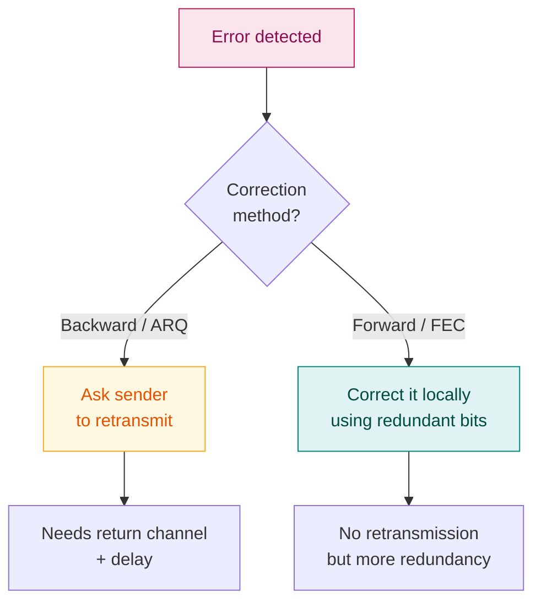

# 10. Error Correction — Hamming Code

> **Syllabus:** Unit 3 — *Error handling techniques*
> **Source:** `7. Error_Correction.pdf`

---

## 🎯 In one line

Detection only tells you *something* is wrong; **correction** needs enough redundant bits to reveal **exactly which bit** is wrong — Hamming code does this with $r$ parity bits where $2^r \ge d+r+1$.

---

## 1. Concept

Error Correction codes are used to **detect and correct** errors when data is transmitted from the sender to the receiver.

> **A single additional bit can detect the error, but cannot correct it.** For correcting errors, one has to know the **exact position** of the error.

For example, to correct a single-bit error in a 7-bit unit, the error-correcting code must determine **which one of seven bits** is in error. To achieve this, we add some additional redundant bits.

---

## 2. Two ways to handle correction ⭐

| Method | How it works | Trade-off |
|---|---|---|
| **Backward Error Correction** (ARQ) | Once the error is discovered, the receiver **requests the sender to retransmit** the entire data unit. | Simple, but needs a **return channel** and adds delay |
| **Forward Error Correction** (FEC) | The receiver uses an **error-correcting code** which **automatically corrects** the errors. | No retransmission needed — essential where a return path is impossible (deep-space, broadcast, storage) |

---

## 3. Number of redundant bits ⭐⭐

Let $r$ = number of redundant bits and $d$ = number of data bits. Then $r$ is the **smallest** value satisfying:

$$\boxed{2^r \ge d + r + 1}$$

> 💡 **Why this formula?** With $r$ parity bits there are $2^r$ possible syndrome patterns. We need one pattern for "no error" plus one for each of the $d+r$ possible single-bit error positions — hence $2^r \ge (d+r) + 1$.

### Table of common values

| Data bits $d$ | Redundant bits $r$ | Total $d+r$ | Check |
|---|---|---|---|
| 1 | 2 | 3 | $2^2 = 4 \ge 4$ ✓ |
| **4** | **3** | **7** | $2^3 = 8 \ge 8$ ✓ |
| 8 | 4 | 12 | $2^4 = 16 \ge 13$ ✓ |
| 16 | 5 | 21 | $2^5 = 32 \ge 22$ ✓ |
| 32 | 6 | 38 | $2^6 = 64 \ge 39$ ✓ |

**Example:** if $d = 4$, the smallest $r$ satisfying $2^r \ge 4+r+1$ is $r = 3$, since $2^3 = 8 \ge 8$ ✓ (while $r=2$ gives $4 \ge 7$ ✗).

---

## 4. Hamming Code — the algorithm ⭐⭐

Developed by **R. W. Hamming**. It can be applied to any length of data unit and uses the relationship between data units and redundant units.

### Parity bits recap

The bit appended to the original data so that the total number of 1s is even or odd.

| | Rule |
|---|---|
| **Even parity** | If the total number of 1s is even → parity bit = **0**. If odd → parity bit = **1**. |
| **Odd parity** | If the total number of 1s is even → parity bit = **1**. If odd → parity bit = **0**. |

### Algorithm

1. Information of **$d$ bits** is added to the redundant bits **$r$** to form $d+r$ bits.
2. The location of each of the $(d+r)$ digits is assigned a **decimal value** (positions $1, 2, 3, \dots$).
3. The **$r$ bits are placed in positions $1, 2, 4, 8, \dots$** — i.e. positions $2^k$ (**powers of 2**).
4. Data bits fill all the remaining positions.
5. Each parity bit $r_i$ checks all positions whose **binary representation has a 1 in bit-position $i$**.
6. At the receiving end, the parity bits are **recalculated**. The decimal value of the recalculated parity bits gives the **position of the error**.

### Which positions does each parity bit check? ⭐

| Parity bit | Position | Checks positions | Pattern |
|---|---|---|---|
| $r_1$ | 1 | **1**, 3, 5, 7, 9, 11, … | check 1, skip 1 |
| $r_2$ | 2 | **2**, 3, 6, 7, 10, 11, … | check 2, skip 2 |
| $r_4$ | 4 | **4**, 5, 6, 7, 12, 13, 14, 15, … | check 4, skip 4 |
| $r_8$ | 8 | **8**, 9, …, 15, 24, … | check 8, skip 8 |

> 💡 **The elegant part:** position 5 in binary is $101$, so it is checked by $r_1$ and $r_4$ — exactly the parity bits whose positions ($1$ and $4$) appear as 1s in $101$. That is why the failing parity bits, read as a binary number, spell out the error position.

---

## 5. Fully worked example ⭐⭐

**Suppose the original data is `1010` which is to be sent.**

### Step 1 — find $r$

$$d = 4, \qquad 2^r \ge d+r+1 \ \Rightarrow\ 2^r \ge 4+r+1$$

- $r = 2$: $4 \ge 7$ ✗
- $r = 3$: $8 \ge 8$ ✓

$$\boxed{r = 3} \qquad \text{Total bits} = d+r = 4+3 = 7$$

### Step 2 — position the bits

The three redundant bits $r_1, r_2, r_4$ go at positions **1, 2, 4** (powers of 2: $2^0, 2^1, 2^2$). The data bits `1 0 1 0` fill positions **3, 5, 6, 7**.

| Position | 7 | 6 | 5 | 4 | 3 | 2 | 1 |
|---|---|---|---|---|---|---|---|
| Bit type | $d_4$ | $d_3$ | $d_2$ | $r_4$ | $d_1$ | $r_2$ | $r_1$ |
| Value | **0** | **1** | **0** | ? | **1** | ? | ? |

### Step 3 — calculate the parity bits (even parity)

**$r_1$ checks positions 1, 3, 5, 7:**
Values at 3, 5, 7 = $1, 0, 0$ → one 1 (odd) → $r_1 = \mathbf{1}$ to make it even.

**$r_2$ checks positions 2, 3, 6, 7:**
Values at 3, 6, 7 = $1, 1, 0$ → two 1s (even) → $r_2 = \mathbf{0}$.

**$r_4$ checks positions 4, 5, 6, 7:**
Values at 5, 6, 7 = $0, 1, 0$ → one 1 (odd) → $r_4 = \mathbf{1}$.

### Step 4 — the transmitted codeword

| Position | 7 | 6 | 5 | 4 | 3 | 2 | 1 |
|---|---|---|---|---|---|---|---|
| Value | 0 | 1 | 0 | **1** | 1 | **0** | **1** |

$$\textbf{Transmitted codeword} = \boxed{\texttt{0 1 0 1 1 0 1}} \quad\text{(positions 7 → 1)}$$

**Verification:**

| Parity | Positions checked | Values | Count of 1s | Even? |
|---|---|---|---|---|
| $r_1$ | 1, 3, 5, 7 | 1, 1, 0, 0 | 2 | ✓ |
| $r_2$ | 2, 3, 6, 7 | 0, 1, 1, 0 | 2 | ✓ |
| $r_4$ | 4, 5, 6, 7 | 1, 0, 1, 0 | 2 | ✓ |

---

## 6. Detecting and correcting an error at the receiver ⭐⭐

**Suppose the bit at position 5 gets corrupted during transmission** ($0 \to 1$).

| Position | 7 | 6 | 5 | 4 | 3 | 2 | 1 |
|---|---|---|---|---|---|---|---|
| Sent | 0 | 1 | **0** | 1 | 1 | 0 | 1 |
| **Received** | 0 | 1 | **1** ⚠️ | 1 | 1 | 0 | 1 |

**Recalculate each parity check (even parity expected):**

| Check | Positions | Received values | Count of 1s | Parity | Result bit |
|---|---|---|---|---|---|
| $r_1$ | 1, 3, 5, 7 | 1, 1, **1**, 0 | 3 | **odd** ✗ | **1** |
| $r_2$ | 2, 3, 6, 7 | 0, 1, 1, 0 | 2 | even ✓ | **0** |
| $r_4$ | 4, 5, 6, 7 | 1, **1**, 1, 0 | 3 | **odd** ✗ | **1** |

**Form the error position** by writing the result bits as a binary number, **$r_4 r_2 r_1$** (most significant first):

$$r_4\,r_2\,r_1 = \mathbf{1\ 0\ 1}_2 = 4 + 0 + 1 = \boxed{5}$$

**The error is at position 5.** To correct it, simply **flip that bit**: $1 \to 0$.

$$\text{Corrected codeword} = \texttt{0 1 0 1 1 0 1} \ ✓$$

Extract the data bits from positions 7, 6, 5, 3 → $0, 1, 0, 1$ → the original data **`1010`** is recovered ✓

> ⭐ **If all three checks pass, the result is $000$ = position 0, which means no error.** That is the spare pattern the $+1$ in the formula accounted for.

---

## 7. Hamming Distance ⭐

The **Hamming distance** $d(x, y)$ between two codewords is the **number of bit positions in which they differ** — computed as the number of 1s in $x \oplus y$.

**Example:** $d(\texttt{10101}, \texttt{11110})$:

$$\texttt{10101} \oplus \texttt{11110} = \texttt{01011} \quad\Rightarrow\quad \text{three 1s} \quad\Rightarrow\quad d = 3$$

The **minimum Hamming distance $d_{min}$** of a code is the smallest distance between any two of its valid codewords.

### The two key rules ⭐⭐

| Goal | Requirement |
|---|---|
| **Detect** up to $s$ errors | $d_{min} \ge s + 1$ |
| **Correct** up to $t$ errors | $d_{min} \ge 2t + 1$ |

> 💡 **Why correction needs more distance.** To *detect*, a corrupted word merely has to fall outside the set of valid codewords. To *correct*, it must fall **closer to the original codeword than to any other** — which needs roughly twice the separation.

**Example:** a code with $d_{min} = 3$ can **detect 2 errors** ($3 \ge 2+1$) **or correct 1 error** ($3 \ge 2(1)+1$). Standard Hamming code has $d_{min} = 3$.

---

## 8. Detection vs Correction — comparison

| | **Error Detection** | **Error Correction** |
|---|---|---|
| Purpose | Find *whether* an error occurred | Find *where* the error is and fix it |
| Redundant bits | Few | **Many more** |
| Complexity | Low | High |
| Needs retransmission? | Yes (ARQ) | No (FEC) |
| Example | Parity, checksum, **CRC** | **Hamming code**, Reed-Solomon |

---

## 9. Common exam questions

1. **What is error correction? Explain backward and forward error correction.** ⭐
2. **Derive/state the formula for the number of redundant bits.** ⭐ → $2^r \ge d+r+1$, with the reasoning.
3. **Given data, generate the Hamming code.** ⭐⭐ *(The classic numerical — find $r$, place bits at powers of 2, compute each parity.)*
4. **Given a received Hamming codeword, detect and correct the error.** ⭐⭐ *(Recalculate parities, read $r_4r_2r_1$ as binary → the error position.)*
5. **Define Hamming distance. Find $d(x,y)$ for two given codewords.** ⭐
6. **How many errors can a code with $d_{min} = k$ detect/correct?** → $s = d_{min}-1$ detect; $t = \lfloor (d_{min}-1)/2 \rfloor$ correct.
7. **Why can a single parity bit detect but not correct an error?** → it reveals that a bit is wrong but not **which** one.

---

## ⚡ Quick revision

- **A single additional bit can detect an error but cannot correct it** — correction needs the exact **position**.
- **Backward (ARQ)** = ask for retransmission · **Forward (FEC)** = correct locally.
- **Redundant bits:** $\boxed{2^r \ge d+r+1}$. For $d=4$ → $r=3$, total 7 bits.
- **Redundant bits sit at positions 1, 2, 4, 8, …** (powers of 2); data fills the rest.
- **$r_1$** checks 1,3,5,7 · **$r_2$** checks 2,3,6,7 · **$r_4$** checks 4,5,6,7 (check $n$, skip $n$).
- **At the receiver:** recalculate the parities; read the failing checks as binary **$r_4r_2r_1$** → that decimal value **is the error position**. Flip that bit.
- **All checks pass → $000$ → no error.**
- **Hamming distance** = number of differing bit positions = number of 1s in $x \oplus y$.
- **Detect $s$ errors:** $d_{min} \ge s+1$. **Correct $t$ errors:** $d_{min} \ge 2t+1$.
- Standard Hamming code: $d_{min} = 3$ → detects 2, corrects 1.

---

**Previous:** [← 9. Error Detection](09-error-detection.md) · **Next:** [11. Multiplexing & TDM →](11-multiplexing-and-tdm.md)
