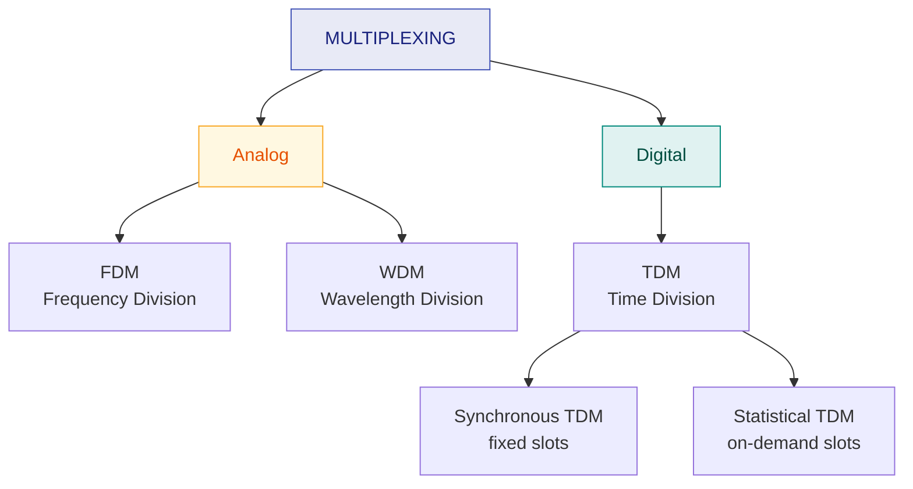

# 11. Multiplexing & TDM

> **Syllabus:** Unit 3 — *TDM, xDSL*
> **Source:** `multiplexing.pdf`

---

## 🎯 In one line

**Multiplexing** combines several data streams onto one medium — by splitting **frequency** (FDM), **wavelength** (WDM), or **time** (TDM).

---

## 1. Concept

**Multiplexing** is a technique used to **combine and send multiple data streams over a single medium**.

- The process of combining the data streams is **multiplexing**; the hardware is a **multiplexer (MUX)**.
- A MUX combines $n$ input lines to generate a **single output line** — a **many-to-one** relationship.
- **Demultiplexing** is achieved by a **demultiplexer (DEMUX)** at the receiving end, which separates a signal into its component signals — **one-to-many**.

```
   n inputs                                              n outputs
   ────────┐                                          ┌────────
   ────────┤                                          ├────────
   ────────┤  MUX  ├──── single shared link ────┤ DEMUX ├────────
   ────────┤                                          ├────────
   ────────┘                                          └────────
        many-to-one                                 one-to-many
```

### Why multiplex? ⭐

| Reason | Explanation |
|---|---|
| **One signal at a time** | The transmission medium can only carry one signal at a time. If multiple signals must share it, the medium must be divided so each gets a portion of the available bandwidth. |
| **Bandwidth efficiency** | If there are 10 signals and the medium's bandwidth is 100 units, each signal gets 10 units. |
| **Avoiding collisions** | When multiple signals share a common medium there is a possibility of **collision**; multiplexing avoids it. |
| **Cost** | Transmission services are **very expensive** — sharing one high-capacity link beats installing many. |

### History

Multiplexing originated in **telegraphy in the early 1870s** and is now widely used in communication. **George Owen Squier** developed telephone carrier multiplexing in **1910**. It is widely used in telecommunications, where several telephone calls are carried through a single wire.

---

## 2. Classification ⭐



---

## 3. Frequency Division Multiplexing (FDM)

**Analog** technique. The available **bandwidth is divided into frequency bands**, and each signal is modulated onto a different **carrier frequency**. All signals travel **simultaneously**, each in its own band.

```
  Frequency
     ▲
     │ ┌────────┐  ┌────────┐  ┌────────┐
     │ │Channel1│▓▓│Channel2│▓▓│Channel3│      ▓ = guard band
     │ └────────┘  └────────┘  └────────┘
     └──────────────────────────────────────► time
       All channels transmit AT THE SAME TIME
       but in DIFFERENT frequency bands
```

- **Guard bands** — unused strips of frequency between channels — prevent **crosstalk** (signals bleeding into each other).
- **Used in:** radio and TV broadcasting, first-generation cellular, cable TV.

---

## 4. Wavelength Division Multiplexing (WDM)

Conceptually the same as FDM, but for **optical fibre**: different signals are carried on different **wavelengths (colours) of light**. A prism or diffraction grating combines and separates them.

- **DWDM (Dense WDM)** packs many closely-spaced wavelengths onto one fibre — enormous capacity.
- **Used in:** long-haul fibre-optic backbones.

---

## 5. Time Division Multiplexing (TDM) ⭐⭐

**Digital** technique. The **entire bandwidth** is given to each signal, but only for a **short slice of time**. Channels take turns.

```
  Channel
     ▲
     │ ┌──┐      ┌──┐      ┌──┐
   3 │ │  │      │  │      │  │
     │ └──┘      └──┘      └──┘
     │    ┌──┐      ┌──┐      ┌──┐
   2 │    │  │      │  │      │  │
     │    └──┘      └──┘      └──┘
     │       ┌──┐      ┌──┐      ┌──┐
   1 │       │  │      │  │      │  │
     │       └──┘      └──┘      └──┘
     └──────────────────────────────────► time
       │←── frame ──→│←── frame ──→│
       Each channel gets the FULL bandwidth
       but only in ITS OWN time slot
```

> ⭐ **FDM vs TDM in one sentence:** FDM divides the **bandwidth** (everyone transmits all the time, in different bands); TDM divides the **time** (everyone uses all the bandwidth, but takes turns).

### 5.1 Synchronous TDM

Each input is allotted a **fixed, pre-assigned time slot** in every frame — **whether or not it has data to send**.

```
  Inputs:   A: [a1][a2]      B: [b1][  ]      C: [c1][c2]
                                    ↑ B has nothing to send

  Frame 1: │ a1 │ b1 │ c1 │     Frame 2: │ a2 │ ⌀  │ c2 │
                                                ↑
                                          EMPTY SLOT — wasted
```

| ✅ | Simple; no addressing needed — the slot position identifies the sender |
|---|---|
| ❌ | **Wastes capacity** whenever a source has nothing to send |

**Key terms:**

| Term | Meaning |
|---|---|
| **Frame** | One complete round of slots — one slot per input |
| **Interleaving** | Taking data from each input in turn (bit-by-bit or byte-by-byte) |
| **Framing bits** | Extra bits added at the start of each frame so the receiver can stay synchronised |
| **Pulse stuffing / bit padding** | When input rates differ slightly, extra dummy bits are added to the slower streams to equalise the rates |

### 5.2 Statistical (Asynchronous) TDM

Slots are allocated **dynamically, on demand** — only inputs that actually have data get a slot.

```
  Inputs:   A: [a1][a2]      B: [b1][  ]      C: [c1][c2]

  Frame 1: │A│a1│B│b1│C│c1│    Frame 2: │A│a2│C│c2│
            ↑                             ↑
        ADDRESS needed              no empty slot — efficient
```

| ✅ | **Much more efficient** — no empty slots; supports more devices than there are slots |
|---|---|
| ❌ | Each slot must carry an **address** (overhead); more complex; needs buffering |

### Synchronous vs Statistical TDM ⭐

| Feature | **Synchronous TDM** | **Statistical TDM** |
|---|---|---|
| Slot allocation | **Fixed / pre-assigned** | **Dynamic / on demand** |
| Empty slots | Yes — wasted if idle | **No** |
| Addressing | Not needed (position identifies source) | **Required** in each slot |
| Number of slots per frame | = number of inputs | ≤ number of inputs |
| Efficiency | Lower | **Higher** |
| Complexity | Simple | Complex |

---

## 6. TDM numericals ⭐

The standard formulas:

$$\text{Output bit rate} = n \times \text{input bit rate} \qquad\quad \text{(ignoring framing bits)}$$

$$\text{Frame duration} = \frac{1}{\text{input frame rate}} \qquad\quad \text{Slot duration} = \frac{\text{Frame duration}}{n}$$

### Worked example 1

**Four channels are multiplexed using TDM. If each channel sends 100 bytes/s and we multiplex 1 byte per channel, find the frame size, the frame duration, the frame rate and the bit rate of the link.**

- **Frame size** = 1 byte per channel × 4 channels = **4 bytes = 32 bits**
- Each channel sends **100 frames/s** worth of data → **frame rate = 100 frames/s**
- **Frame duration** = $1/100 = 0.01$ s = **10 ms**
- **Link bit rate** = frame rate × frame size = $100 \times 32 = \boxed{3200\ \text{bps}}$

Alternatively: each channel = $100 \times 8 = 800$ bps; $4 \times 800 = 3200$ bps ✓

### Worked example 2

**Four 1-kbps connections are multiplexed. Each output slot carries 1 bit. Find (a) the slot duration, (b) the frame duration, (c) the frame rate, (d) the output bit rate.**

- Each input: 1 kbps = 1000 bps → **1000 frames/s** → **(c) frame rate = 1000 fps**
- **(b) Frame duration** = $1/1000 = 1$ ms
- Each frame has 4 slots → **(a) slot duration** = $1\ \text{ms}/4 = 250\ \mu s$
- **(d) Output bit rate** = $4 \times 1000 = \boxed{4000\ \text{bps} = 4\ \text{kbps}}$

---

## 7. The digital hierarchy (context for xDSL)

TDM is how telephone networks aggregate voice channels:

| Level | Channels | Bit rate | Region |
|---|---|---|---|
| **DS-0** | 1 | 64 kbps | one voice channel ([Ch. 7](07-pcm-and-adpcm.md)) |
| **DS-1 / T-1** | 24 | 1.544 Mbps | North America |
| **E-1** | 30 | 2.048 Mbps | Europe / India |
| **DS-3 / T-3** | 672 | 44.736 Mbps | North America |

> 📌 **T-1 arithmetic:** $24 \times 64\ \text{kbps} = 1536$ kbps, plus **8 kbps of framing bits** = **1.544 Mbps** ✓ That extra 8 kbps is one framing bit per frame at 8000 frames/s.

---

## 8. FDM vs TDM — the comparison ⭐⭐

| Feature | **FDM** | **TDM** |
|---|---|---|
| Divides | **Frequency** (bandwidth) | **Time** |
| Signal type | **Analog** | **Digital** (and analog via PAM) |
| Each channel gets | Part of the bandwidth, **all** of the time | **All** the bandwidth, part of the time |
| Separation needed | **Guard bands** | **Framing/sync bits** |
| Crosstalk | Possible — needs guard bands | Minimal |
| Interference | More susceptible | Less susceptible |
| Circuit complexity | Simpler | More complex (needs synchronisation) |
| Used in | Radio, TV, cable, 1G cellular | Telephone (T-1/E-1), digital networks |

---

## 9. Common exam questions

1. **What is multiplexing? Why is it needed?** ⭐ → definition, MUX/DEMUX, the four reasons.
2. **Explain the types of multiplexing** with diagrams. ⭐
3. **Compare FDM and TDM.** ⭐⭐ → the full table.
4. **Explain TDM. Differentiate synchronous and statistical TDM.** ⭐⭐
5. **What are guard bands? Why are they needed?** → prevent crosstalk between adjacent FDM channels.
6. **What is pulse stuffing / bit padding?** → equalises slightly different input rates in synchronous TDM.
7. **What is WDM? How does it differ from FDM?** → same idea, but for light wavelengths on fibre.
8. **Numericals:** frame size, frame duration, frame rate, slot duration, output bit rate.

---

## ⚡ Quick revision

- **Multiplexing** = combine multiple streams onto one medium. **MUX** = many-to-one; **DEMUX** = one-to-many.
- **Why:** medium carries one signal at a time · bandwidth efficiency · avoid collisions · links are expensive.
- **FDM** (analog): divides **bandwidth** into frequency bands; all transmit **simultaneously**; needs **guard bands**.
- **WDM**: FDM for **optical fibre** — different wavelengths of light. **DWDM** = dense version.
- **TDM** (digital): divides **time**; each channel gets **full bandwidth in its own slot**.
- **Synchronous TDM:** fixed pre-assigned slots → **empty slots wasted**, no addressing needed.
- **Statistical TDM:** dynamic on-demand slots → **no waste**, but each slot needs an **address**.
- **Framing bits** keep the receiver synchronised; **pulse stuffing** equalises unequal input rates.
- $\text{Output bit rate} = n \times \text{input bit rate}$; $\text{slot duration} = \text{frame duration}/n$.
- **T-1** = 24 × 64 kbps + 8 kbps framing = **1.544 Mbps**; **E-1** = 30 channels = **2.048 Mbps**.
- **One-liner:** FDM splits **bandwidth**, TDM splits **time**.

---

**Previous:** [← 10. Error Correction](10-error-correction.md) · **Next:** [12. xDSL →](12-xdsl.md)
