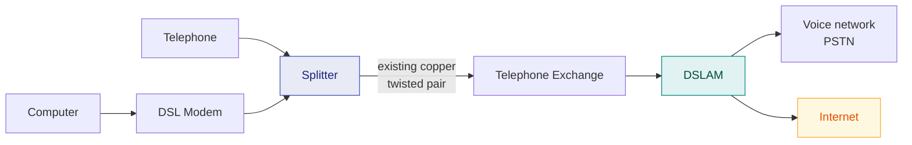

# 12. xDSL — Digital Subscriber Line

> **Syllabus:** Unit 3 — *TDM, xDSL*
> **Source:** `DSL.pdf`, `DSL_notes.docx`

---

## 🎯 In one line

**DSL** delivers high-speed internet over the **existing telephone copper line** by using the frequencies **above** the voice band — so you can browse and talk at the same time.

---

## 1. What is DSL?

**DSL (Digital Subscriber Line)** is an Internet access technology that uses **existing telephone lines** to transmit digital data. Both homes and businesses can access broadband data over the Internet using typical phone lines.

It uses the **same physical metallic wire cables** originally installed to homes and businesses for traditional landline phone service.

> ⭐ **The significant feature of DSL is that it can carry Internet and voice data simultaneously over the same line.** This makes it a unique type of broadband Internet.

**Broadband Internet** refers to any Internet connection that is **always on** — this includes not just DSL, but also cable and fibre-optic options.

One of the advantages of DSL is that it **transfers data at high frequencies**, which allows you to stay connected to the Internet while making phone calls.

Although it may not be the fastest choice anymore, DSL connections remain among the most widely used Internet access technologies.

---

## 2. How DSL works — the frequency split ⭐⭐

A telephone line physically supports frequencies up to about **1.1 MHz**, but ordinary voice telephony uses only **0–4 kHz**. **The rest of that capacity was simply sitting unused.** DSL exploits it.

```
  Power
    ▲
    │ ┌────┐
    │ │VOICE│   ┌──────────┐   ┌──────────────────────────┐
    │ │0–4k │   │ UPSTREAM │   │        DOWNSTREAM        │
    │ └────┘   └──────────┘   └──────────────────────────┘
    └──┬────────┬──────────┬──────────────────────────────► frequency
       0      4 kHz     25–138 kHz              138 kHz – 1.1 MHz

       └─ POTS ─┘  └─ upload ─┘  └────── download (much wider) ──────┘
                        ↑
          downstream band is far wider than upstream
          → that is exactly why ADSL is "asymmetric"
```

| Band | Frequency | Use |
|---|---|---|
| **Voice (POTS)** | 0 – 4 kHz | Ordinary telephone calls |
| **Upstream** | ~25 – 138 kHz | Data from you to the Internet |
| **Downstream** | ~138 kHz – 1.1 MHz | Data from the Internet to you |

### Key equipment

| Device | Role |
|---|---|
| **DSL modem / transceiver** | At the customer's end — modulates and demodulates the data |
| **Splitter / microfilter** | Separates the low-frequency voice band from the high-frequency data bands |
| **DSLAM** (DSL Access Multiplexer) | At the telephone exchange — **multiplexes** many DSL lines onto a high-speed backbone |



---

## 3. DMT — Discrete Multitone modulation ⭐

ADSL uses **DMT**, which divides the available bandwidth into **256 sub-channels of 4.3125 kHz each**. Each sub-channel is modulated independently using **QAM** ([Ch. 6](06-digital-to-analog-modulation.md)).

> 💡 **Why this is clever:** copper lines attenuate high frequencies more, and interference affects some frequencies more than others. DMT measures the quality of **each** sub-channel separately and loads **more bits onto the good ones, fewer (or none) onto the bad ones**. The line adapts itself to its own physical condition — which is why DSL speeds vary so much between households.

---

## 4. The xDSL family ⭐⭐

The "**x**" is a placeholder for the different variants.

| Type | Full name | Downstream | Upstream | Symmetric? | Typical use |
|---|---|---|---|---|---|
| **ADSL** | **Asymmetric** DSL | up to ~8 Mbps | up to ~1 Mbps | ❌ Asymmetric | **Home users** — browsing, streaming |
| **ADSL2+** | Extended ADSL | up to ~24 Mbps | up to ~1 Mbps | ❌ Asymmetric | Home users |
| **SDSL** | **Symmetric** DSL | up to ~2 Mbps | up to ~2 Mbps | ✅ Symmetric | Businesses; **no voice** on the line |
| **HDSL** | **High-bit-rate** DSL | ~1.544 / 2.048 Mbps | same | ✅ Symmetric | T-1/E-1 replacement; uses **2 pairs** |
| **VDSL** | **Very-high-bit-rate** DSL | up to ~52 Mbps | up to ~16 Mbps | ❌ Asymmetric | Short distances only (~300 m–1.5 km) |

### Why is ADSL asymmetric? ⭐

Home users **download far more than they upload** — web pages, video, files come *in*; only clicks and requests go *out*. ADSL therefore allocates a **much wider frequency band to downstream** than upstream. Businesses hosting servers need equal capacity in both directions, so they use **SDSL/HDSL**.

---

## 5. Advantages and disadvantages ⭐

| ✅ Advantages | ❌ Disadvantages |
|---|---|
| Uses the **existing telephone infrastructure** — no new cabling | **Distance-sensitive:** speed falls sharply as the distance from the exchange grows (practical limit ~5.5 km) |
| **Simultaneous voice and data** on one line | Slower than cable and fibre |
| **Always-on** connection (no dial-up) | **Asymmetric** — upload much slower than download (ADSL) |
| **Dedicated line** — bandwidth not shared with neighbours (unlike cable) | Quality depends on the **condition and gauge of the copper** |
| Relatively inexpensive | Not available everywhere |

> ⭐ **The dedicated-line point is a favourite exam contrast.** Cable internet shares bandwidth among everyone in a neighbourhood, so it slows down in the evening. DSL gives each subscriber their **own** line to the exchange, so performance is steady — but it is distance-limited in a way cable is not.

---

## 6. DSL vs Cable vs Fibre

| Feature | **DSL** | **Cable** | **Fibre** |
|---|---|---|---|
| Medium | Telephone **twisted pair** | **Coaxial** cable | **Optical fibre** |
| Speed | Low–moderate | Moderate–high | **Highest** |
| Bandwidth sharing | **Dedicated** per subscriber | **Shared** in a neighbourhood | Dedicated |
| Distance sensitivity | **High** | Moderate | **Very low** |
| Availability | Very wide | Wide | Limited |

---

## 7. Common exam questions

1. **What is DSL? How does it work?** ⭐⭐ → definition + the frequency-split diagram.
2. **Why can DSL carry voice and data simultaneously?** ⭐ → voice uses only 0–4 kHz; data uses the unused higher frequencies, separated by a splitter.
3. **Explain the types of xDSL.** ⭐⭐ → the family table, with ADSL vs SDSL emphasised.
4. **Why is ADSL asymmetric?** ⭐ → home users download much more than they upload.
5. **What is DMT?** → 256 sub-channels of 4.3125 kHz, each QAM-modulated, bits loaded per sub-channel quality.
6. **What is a DSLAM?** → multiplexes many DSL lines at the exchange onto a high-speed backbone.
7. **State the advantages and disadvantages of DSL.** ⭐
8. **Compare DSL and cable internet.** → dedicated vs shared bandwidth; distance sensitivity.

---

## ⚡ Quick revision

- **DSL** = high-speed Internet over the **existing telephone copper line**.
- **Key feature:** carries **Internet and voice simultaneously** on the same line.
- **Broadband** = any always-on connection (DSL, cable, fibre).
- **Frequency split:** voice **0–4 kHz** · upstream **~25–138 kHz** · downstream **~138 kHz–1.1 MHz**.
- **Splitter/microfilter** separates voice from data; **DSLAM** aggregates lines at the exchange.
- **DMT:** 256 sub-channels × 4.3125 kHz, each QAM-modulated; more bits on the better sub-channels.
- **ADSL** = asymmetric (download ≫ upload) — for **homes**.
- **SDSL / HDSL** = symmetric (equal both ways) — for **businesses**. HDSL uses **2 pairs**.
- **VDSL** = very high speed, but only over **short distances**.
- ✅ Uses existing wiring · always on · **dedicated** bandwidth.
- ❌ **Distance-sensitive** (~5.5 km limit) · slower than fibre · asymmetric upload.
- **DSL = dedicated line; cable = shared.**

---

**Previous:** [← 11. Multiplexing & TDM](11-multiplexing-and-tdm.md) · **Next:** [13. Spread Spectrum →](13-spread-spectrum.md)
