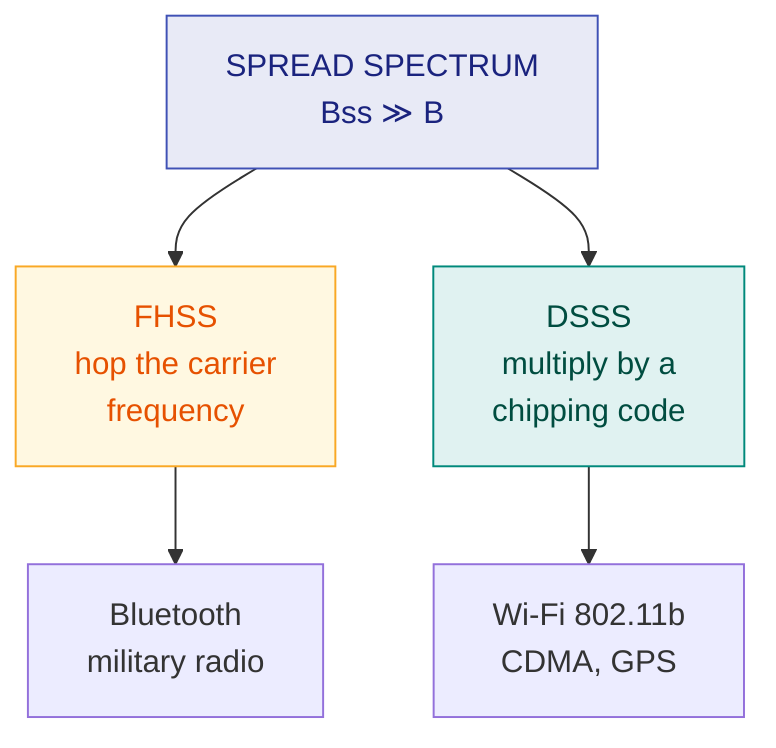

# 13. Spread Spectrum

> **Syllabus:** Unit 3 — *Spread spectrum*
> **Source:** `Spread_Spectrum.pdf`

---

## 🎯 In one line

Spread spectrum **deliberately widens** a signal over far more bandwidth than it needs — sacrificing bandwidth efficiency to gain **security, jamming resistance and interference immunity** in wireless systems.

---

## 1. Concept — how it differs from multiplexing ⭐

**Multiplexing** combines signals from several sources to achieve **bandwidth efficiency** — the available bandwidth of a link is divided between the sources.

In **spread spectrum** we *also* combine signals from different sources to fit into a larger bandwidth, **but our goals are different**.

Spread spectrum is designed for **wireless applications (LANs and WANs)**. In these applications all stations use **air (or vacuum)** as the medium, and we have concerns that **outweigh bandwidth efficiency**:

- Stations must share the medium **without interception by an eavesdropper**.
- They must operate **without being subject to jamming** from a malicious intruder (in military operations, for example).

To achieve these goals, spread spectrum techniques **add redundancy** — they **spread** the original spectrum needed for each station.

$$\text{If the required bandwidth for each station is } B, \text{ spread spectrum expands it to } B_{ss} \text{ such that } \boxed{B_{ss} \gg B}$$

The expanded bandwidth allows the source to wrap its message in a **protective envelope** for more secure transmission.

> 💡 **The textbook analogy:** sending a delicate, expensive gift. We insert the gift in a **special box** to prevent damage during transportation, and use a **superior delivery service** to guarantee the safety of the package. The extra bandwidth is the packaging.

### Multiplexing vs Spread Spectrum ⭐

| | **Multiplexing** | **Spread Spectrum** |
|---|---|---|
| **Goal** | **Bandwidth efficiency** | **Security & anti-jamming** |
| Bandwidth | Divided among sources | **Expanded** for each source |
| Redundancy | Minimised | **Deliberately added** |
| Medium | Usually wired | **Wireless** (LANs, WANs) |

---

## 2. The two principles

Spread spectrum achieves its goals through two principles:

1. A collective class of signalling techniques is employed **before transmitting** a signal to provide secure communication — known as **Spread Spectrum Modulation**. The main advantage is to prevent **interference**, whether intentional or unintentional.

2. Signals modulated with these techniques are **hard to interfere with and cannot be jammed**. An intruder with no official access is never allowed to crack them. Hence these techniques are used for **military purposes**. Spread spectrum signals transmit at **low power density** over a **wide spread** of frequencies.

### Pseudo-Noise (PN) Sequence ⭐

A coded sequence of 1s and 0s with certain **auto-correlation properties**, called a **Pseudo-Noise coding sequence**, is used in spread spectrum techniques. It is a **maximum-length sequence**, a type of **cyclic code**.

> 📌 "Pseudo-noise" means it **looks** random to anyone who does not know the generating rule — but it is completely **deterministic and reproducible** at the receiver. That is the whole trick: the receiver can regenerate the identical sequence and undo the spreading, while an eavesdropper sees only noise.

---

## 3. Narrowband vs Spread-spectrum signals

```
   NARROWBAND                        SPREAD SPECTRUM
   Power                              Power
     ▲                                  ▲
     │    ██                            │
     │    ██   high power               │  ▁▁▁▁▁▁▁▁▁▁▁▁  low power
     │    ██   density                  │  ▁▁▁▁▁▁▁▁▁▁▁▁  density,
     │    ██   in a narrow band         │  ▁▁▁▁▁▁▁▁▁▁▁▁  wide band
     └────┴┴─────────► freq            └──┴────────────┴──► freq
          │←B→│                           │←──── Bss ────→│

   Easy to detect, easy to jam       Hidden below the noise floor,
                                     hard to detect, hard to jam
```

The **same total power** is spread over a much wider band, so the **power density** (power per Hz) drops — often **below the noise floor**. An eavesdropper scanning the spectrum cannot even tell a transmission is taking place.

---

## 4. Frequency Hopping Spread Spectrum (FHSS) ⭐⭐

**Idea:** the source signal **hops from one carrier frequency to another** at fixed intervals, in a pseudo-random order determined by the **PN sequence**.

```
  Frequency
     ▲
  f6 │              ███
  f5 │    ███                    ███
  f4 │                     ███
  f3 │ ███                              ███
  f2 │         ███
  f1 │                                        ███
     └──────────────────────────────────────────► time
       t1   t2   t3   t4   t5   t6   t7   t8
       └── hop order set by the PN sequence ──┘
```

**How it works:**
1. A **pseudo-random code generator** produces a $k$-bit pattern for every hopping period $T_h$.
2. A **frequency table** maps each pattern to a carrier frequency.
3. A **frequency synthesiser** creates that carrier; the signal is modulated onto it for that period.
4. The receiver, using the **same PN sequence**, hops in perfect synchrony.

If there are $M = 2^k$ possible hop frequencies, the total bandwidth is $B_{ss} = M \times B$.

| ✅ Advantages | ❌ Disadvantages |
|---|---|
| **Resistant to narrowband jamming** — only the hops landing on the jammed frequency are lost | Needs **precise synchronisation** between sender and receiver |
| **Hard to intercept** — an eavesdropper doesn't know the hop sequence | Higher complexity |
| Allows many users to share the band (each with a different hop pattern) | Overhead during hop transitions |

**Used in:** **Bluetooth** (1600 hops/s across 79 channels), military radio, older 802.11.

---

## 5. Direct Sequence Spread Spectrum (DSSS) ⭐⭐

**Idea:** each data bit is **multiplied (XORed) by a much faster PN sequence** called the **chipping code**. Each resulting bit of the code is a **chip**.

```
  Data bit:      │──────  1  ──────│──────  0  ──────│
                 
  Chipping code: │1 0 1 1 0 1 0 0 0│1 0 1 1 0 1 0 0 0│   (Barker: 10110100 0)
                 
  Transmitted:   │1 0 1 1 0 1 0 0 0│0 1 0 0 1 0 1 1 1│
                  ↑ same as code    ↑ inverted code
                  (data = 1)        (data = 0)

  One bit becomes 11 chips → bandwidth spreads 11×
```

**How it works:**
- Data bit **1** → transmit the chipping code as-is.
- Data bit **0** → transmit the **inverted** chipping code.
- The receiver **correlates** the incoming signal with the same code. A strong positive correlation = 1; strong negative = 0.

> 💡 **Why it resists interference:** the correlation process at the receiver **concentrates** the wanted signal back into a narrow band while **spreading** any interference out. The wanted signal jumps above the noise; the interference is smeared thin.

### Processing gain ⭐

$$\boxed{G_p = \frac{B_{ss}}{B} = \text{number of chips per bit}}$$

$$G_p \text{ (dB)} = 10\log_{10}\left(\frac{B_{ss}}{B}\right)$$

Processing gain measures **how much interference rejection the spreading buys you**.

**Used in:** **802.11b Wi-Fi** (11-chip Barker code), **CDMA** cellular, GPS.

---

## 6. FHSS vs DSSS ⭐⭐

| Feature | **FHSS** | **DSSS** |
|---|---|---|
| **Method** | Hops the **carrier frequency** pseudo-randomly | Multiplies each bit by a fast **chipping code** |
| Spreading element | Hop sequence | **Chips** |
| Bandwidth use | Uses one narrow band at a time, but many over time | Uses the **whole wide band continuously** |
| Synchronisation | **Critical** — both ends must hop together | Needs code phase lock |
| Resistance to **narrowband** jamming | **Excellent** — hops away from it | Good — correlation spreads it out |
| Resistance to **wideband** noise | Moderate | **Excellent** |
| Complexity | Simpler transmitter | More complex |
| Data rate | Generally lower | **Generally higher** |
| Examples | **Bluetooth**, military radio | **Wi-Fi 802.11b**, **CDMA**, GPS |



---

## 7. Worked examples

### Example 1 — processing gain

**A DSSS system uses an 11-chip Barker code. The data rate is 1 Mbps. Find the chip rate and the processing gain in dB.**

$$\text{Chip rate} = 11 \times 1\ \text{Mbps} = \boxed{11\ \text{Mchips/s}}$$

$$G_p = 11 \quad\Longrightarrow\quad G_p\text{(dB)} = 10\log_{10}(11) = \boxed{10.41\ \text{dB}}$$

### Example 2 — FHSS bandwidth

**An FHSS system uses a 4-bit PN sequence. If each hop occupies a bandwidth of 100 kHz, find the number of hop frequencies and the total spread bandwidth.**

$$M = 2^k = 2^4 = \boxed{16 \text{ frequencies}}$$

$$B_{ss} = M \times B = 16 \times 100\ \text{kHz} = \boxed{1600\ \text{kHz} = 1.6\ \text{MHz}}$$

---

## 8. Common exam questions

1. **What is spread spectrum? How does it differ from multiplexing?** ⭐⭐ → goals differ: efficiency vs security.
2. **Why is spread spectrum used in wireless applications?** ⭐ → shared air medium; eavesdropping and jamming concerns outweigh bandwidth efficiency.
3. **What is a PN sequence?** ⭐ → coded sequence of 1s and 0s with auto-correlation properties; maximum-length sequence, a type of cyclic code.
4. **Explain FHSS with a diagram.** ⭐⭐
5. **Explain DSSS with a diagram.** ⭐⭐
6. **Compare FHSS and DSSS.** ⭐⭐ → the comparison table.
7. **What is processing gain?** → $G_p = B_{ss}/B$ = chips per bit.
8. **Define chip and chipping code.**
9. **Numericals:** chip rate, processing gain, number of hop frequencies, spread bandwidth.

---

## ⚡ Quick revision

- **Spread spectrum** deliberately expands bandwidth: $B_{ss} \gg B$, **adding redundancy on purpose**.
- **Goal is NOT efficiency** — it is **security, anti-jamming, anti-interception**. That is the key contrast with multiplexing.
- Designed for **wireless** (LANs/WANs) where all stations share the **air**.
- Signals transmit at **low power density** over a **wide spread** — often hidden below the noise floor.
- **PN (Pseudo-Noise) sequence:** coded 1s/0s with auto-correlation properties; a **maximum-length sequence**, a type of **cyclic code**. Looks random, but is deterministic and reproducible.
- **FHSS:** hops the **carrier frequency** pseudo-randomly. $B_{ss} = M \times B$ where $M = 2^k$. → **Bluetooth**.
- **DSSS:** multiplies each bit by a fast **chipping code**; 1 → code, 0 → inverted code. → **Wi-Fi 802.11b, CDMA, GPS**.
- **Processing gain** $G_p = B_{ss}/B$ = **chips per bit**; in dB, $10\log_{10}(B_{ss}/B)$.
- **FHSS** beats narrowband jamming; **DSSS** beats wideband noise and gives higher data rates.

---

**Previous:** [← 12. xDSL](12-xdsl.md) · **Back to:** [Data Communication index](../README.md)
