# Operating Systems — Mid-Term Notes

> **Mid syllabus:** Types of OS · Process, process states & schedulers · CPU scheduling (FCFS, SJF, burst-time prediction, SRTF, priority, Round Robin) · System calls, user & kernel mode · PCB & context switching · Process creation, `fork()` & `exec()` · Threads & multithreading models · IPC, race conditions & the critical section · Synchronization mechanisms · Producer–Consumer · Semaphores & mutex · Deadlock, Banker's algorithm, RAG, detection & recovery.
> *(Full topic list: [`source/midterm-syllabus.txt`](source/midterm-syllabus.txt))*

> ⚠️ **No class material was supplied for this subject** — the `source/` folder contains only the topic list. These notes are written from **standard, well-established operating-systems theory** covering exactly those topics. Every chapter carries a banner saying so.
>
> When you upload your class notes, these can be checked against them — the theory is stable, but your teacher's **notation, priority convention and preferred worked examples** may differ. Two things in particular to verify: whether your course uses **lower number = higher priority** (these notes do) and the **queue-ordering convention in Round Robin**.

## Chapters

| # | Chapter | Syllabus topic |
|---|---|---|
| 1 | [Types of Operating Systems](notes/01-types-of-operating-systems.md) | **Types of OS** (one-sentence definitions) |
| 2 | [Process, Process States & Schedulers](notes/02-process-and-process-states.md) | **Process · 5-state & 7-state diagrams · scheduler** |
| 3 | [CPU Scheduling — Parameters & Terminology](notes/03-cpu-scheduling-terminology.md) | **Important parameters and terminologies** |
| 4 | [FCFS Scheduling](notes/04-fcfs-scheduling.md) | **FCFS · Gantt chart · FCFS with overhead · convoy effect** |
| 5 | [SJF — Shortest Job First](notes/05-sjf-scheduling.md) | **SJF** |
| 6 | [Burst Time Prediction](notes/06-burst-time-prediction.md) | **Static (size, type) · dynamic (simple & exponential average, aging)** |
| 7 | [SRTF — Shortest Remaining Time First](notes/07-srtf-scheduling.md) | **SRTF** |
| 8 | [Priority Scheduling](notes/08-priority-scheduling.md) | **Preemptive priority scheduling** |
| 9 | [Round Robin Scheduling](notes/09-round-robin.md) | **Round Robin algorithm** |
| 10 | [System Calls, User & Kernel Mode](notes/10-system-calls-user-kernel-mode.md) | **System call · user mode (safe mode) · kernel mode** |
| 11 | [PCB & Context Switching](notes/11-pcb-and-context-switching.md) | **Process Control Block · context switching** |
| 12 | [Process Creation — `fork()` & `exec()`](notes/12-process-creation-fork-exec.md) | **Parent/child · resource-sharing & execution alternatives · fork() · exec()** |
| 13 | [Threads & Multithreading](notes/13-threads-and-multithreading.md) | **Thread · user & kernel threads · many-to-one, one-to-one, many-to-many** |
| 14 | [IPC, Race Conditions & Critical Section](notes/14-race-condition-and-critical-section.md) | **Race condition · critical section · primary & secondary requirements · busy waiting** |
| 15 | [Synchronization Mechanisms](notes/15-synchronization-mechanisms.md) | **Lock variable · TSL · turn variable · interested variable · priority inversion · sleep and wake** |
| 16 | [Producer–Consumer Problem](notes/16-producer-consumer-problem.md) | **Producer consumer problem (bounded buffer)** |
| 17 | [Semaphores & Mutex](notes/17-semaphores-and-mutex.md) | **Semaphore · binary & counting · two operations · mutex** |
| 18 | [Producer–Consumer Using Semaphores](notes/18-producer-consumer-using-semaphores.md) | **Producer and consumer implementation using semaphores** |
| 19 | [Deadlock & Necessary Conditions](notes/19-deadlock-and-necessary-conditions.md) | **Deadlock (with diagram) · necessary conditions · ignorance · prevention** |
| 20 | [Deadlock Avoidance — Banker's Algorithm](notes/20-deadlock-avoidance-bankers.md) | **Deadlock avoidance · Banker's algorithm** |
| 21 | [RAG, Detection & Recovery](notes/21-rag-detection-and-recovery.md) | **Resource allocation graph · deadlock detection and recovery** |
| 22 | [**Numerical Problem Bank**](notes/22-numerical-problem-bank.md) | *All numerical types, fully solved* |

## How the chapters connect

The syllabus is **four blocks**, each building on the last:

```mermaid
graph LR
    subgraph "PROCESS & SCHEDULING"
    A["Ch 1–2<br/>OS types, process states"] --> B["Ch 3<br/>TAT, WT, Gantt"]
    B --> C["Ch 4–9<br/>FCFS → SJF → SRTF<br/>→ Priority → RR"]
    end
    subgraph "PROCESS MACHINERY"
    D["Ch 10–11<br/>system calls, PCB,<br/>context switch"] --> E["Ch 12–13<br/>fork/exec, threads"]
    end
    subgraph "SYNCHRONISATION"
    F["Ch 14<br/>race condition,<br/>critical section"] --> G["Ch 15<br/>lock var, TSL,<br/>turn, interested"]
    G --> H["Ch 16–18<br/>Producer–Consumer<br/>→ semaphores"]
    end
    subgraph "DEADLOCK"
    I["Ch 19<br/>4 conditions,<br/>prevention"] --> J["Ch 20<br/>Banker's"]
    J --> K["Ch 21<br/>RAG, detection,<br/>recovery"]
    end
    C -.-> D
    E -.->|"shared data"| F
    H -.->|"wrong lock order"| I
    K --> L["Ch 22<br/>Problem bank"]
    style A fill:#e8eaf6,stroke:#3f51b5,color:#1a237e
    style L fill:#e0f2f1,stroke:#00897b,color:#004d40
```

> ⭐ **Chapters 14 → 15 → 16 → 17 → 18 are one continuous story:** a race condition motivates the critical section, four broken mechanisms motivate Peterson's, busy waiting motivates sleep-and-wake, the lost wakeup motivates semaphores, and semaphores finally solve Producer–Consumer. **Revise them in order — exam questions chain them.**

## Revision checklist

**Process & scheduling**
- [ ] One-sentence definitions of all **seven OS types**
- [ ] Differentiate **multiprogramming vs time-sharing**, **network vs distributed OS**
- [ ] **Five-state** and **seven-state** process diagrams; why suspension exists
- [ ] **Long / short / medium-term** schedulers; degree of multiprogramming
- [ ] $TAT = CT - AT$, $WT = TAT - BT$, response time
- [ ] **Gantt charts** for FCFS, SJF, SRTF, Priority (both), RR
- [ ] **FCFS with overhead** + CPU efficiency; the **convoy effect**
- [ ] **Exponential averaging**; the $\alpha = 0$ and $\alpha = 1$ cases
- [ ] **Starvation and aging**; time-quantum effects ($q \to \infty$, $q \to 0$)

**Process machinery**
- [ ] **System call** mechanism; **user vs kernel mode**; privileged instructions
- [ ] **PCB fields**; **context switch vs mode switch**
- [ ] **`fork()` return values**; $2^n$ counting; **`fork()` vs `exec()`**; zombie vs orphan
- [ ] **Resource-sharing** and **execution** alternatives
- [ ] Thread vs process; **ULT vs KLT**; the **three multithreading models**

**Synchronisation**
- [ ] **Race condition** with the `count++`/`count--` interleaving
- [ ] Critical section structure; **primary vs secondary requirements**
- [ ] **Lock variable / TSL / turn variable / interested variable** — which requirement each one fails
- [ ] **Peterson's solution** and why `turn = j` works
- [ ] **Priority inversion** → priority inheritance; **lost wakeup** → semaphores
- [ ] Semaphore `wait`/`signal`; **negative value = blocked processes**
- [ ] **Mutex vs binary semaphore** (ownership)
- [ ] **Producer–Consumer with `mutex`/`empty`/`full`**, and the **deadlock if the `wait`s are swapped**

**Deadlock**
- [ ] **Four necessary conditions**; deadlock vs starvation
- [ ] The **four handling strategies**; why UNIX/Windows use **ignorance**
- [ ] **Prevention** — how each condition is broken, and which is practical
- [ ] **Safe vs unsafe**; *unsafe ≠ deadlocked*
- [ ] **Banker's:** Need matrix, safety algorithm, request algorithm
- [ ] **RAG:** cycle rules for single vs multiple instances
- [ ] **Detection algorithm** (uses **Request**, not Need); **recovery** by termination and preemption (**victim, rollback, starvation**)

## The formulas worth memorising

**Scheduling**
$$TAT = CT - AT \qquad WT = TAT - BT \qquad RT = (\text{first CPU allocation}) - AT$$
$$\text{CPU efficiency} = \frac{\sum BT}{\sum BT + (\text{switches})\times\delta} \qquad \text{RR per slice} = \frac{q}{q+\delta}$$

**Burst-time prediction**
$$\tau_{n+1} = \alpha\, t_n + (1-\alpha)\,\tau_n \qquad \alpha = 0 \Rightarrow \tau_{n+1} = \tau_n \qquad \alpha = 1 \Rightarrow \tau_{n+1} = t_n$$

**Processes**
$$n \text{ calls to fork()} \Rightarrow 2^n \text{ processes}, \ 2^n - 1 \text{ children}$$

**Semaphores**
$$S_{final} = S_{initial} - n_P + n_V \qquad S < 0 \Rightarrow |S| \text{ processes are blocked}$$
$$\texttt{mutex} = 1, \quad \texttt{empty} = n, \quad \texttt{full} = 0 \quad \text{(and } \texttt{empty} + \texttt{full} = n)$$

**Deadlock**
$$\textbf{Need} = \textbf{Max} - \textbf{Allocation} \qquad \text{Available}_j = \text{Total}_j - \sum_i \text{Allocation}[i][j]$$

**The four necessary conditions (all must hold):** **M**utual exclusion · **H**old and wait · **N**o preemption · **C**ircular wait — *My House Needs Cleaning.*

**The four requirements of a synchronisation mechanism:** *primary* — mutual exclusion, progress; *secondary* — bounded waiting, architectural neutrality.

---

**Back to:** [5th Semester index](../README.md)
