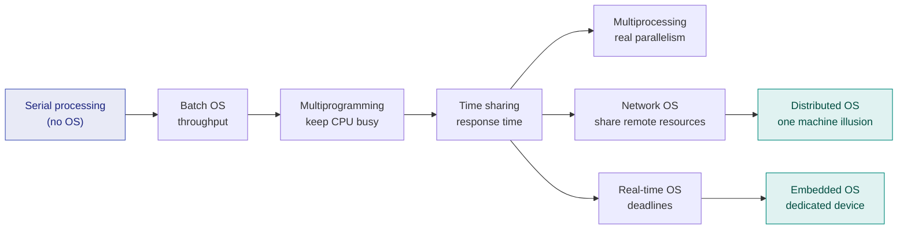

# 1. Types of Operating Systems

> ⚠️ **Written from standard course knowledge.** No class material was supplied for Operating Systems.
> **Syllabus:** *Types of OS (only brief one sentence definition) — Batch, Time sharing/Multiprogramming, Multiprocessing, Distributed, Network, Real-time, Embedded*

---

## 🎯 In one line

An operating system is the **resource manager** sitting between hardware and user programs, and the seven types differ only in **what they optimise for** — throughput, response time, reliability, or deadlines.

---

## 0. What an OS is (one paragraph of context)

An **operating system** is the system software that manages hardware resources (CPU, memory, I/O, files) and provides an environment in which user programs can run conveniently and efficiently.

Two views worth quoting in an exam:

| View | The OS is… |
|---|---|
| **Resource manager** | It allocates CPU time, memory, and devices among competing processes |
| **Extended / virtual machine** | It hides messy hardware behind a clean interface (`read()` instead of disk head movement) |

---

## 1. The seven types — one-line definitions ⭐⭐⭐

These are the exact one-sentence answers to memorise.

| # | Type | One-line definition |
|---|---|---|
| **1** | **Batch OS** | Jobs with similar needs are **collected into batches** and executed one after another **without any user interaction** during execution. |
| **2** | **Time-sharing / Multiprogramming OS** | The CPU is **switched rapidly between multiple jobs** so that each user gets a small time slice and *appears* to have the machine to themselves. |
| **3** | **Multiprocessing OS** | An OS that manages **two or more CPUs (processors)** sharing the same memory and bus, so several processes truly execute **at the same instant**. |
| **4** | **Distributed OS** | An OS that makes a **collection of independent, networked computers appear to the user as one single machine**. |
| **5** | **Network OS** | An OS that runs on a **server** and lets users **explicitly** access shared remote resources (files, printers) while still being aware that those machines are separate. |
| **6** | **Real-time OS (RTOS)** | An OS in which the correctness of a result depends not only on the computation but on **meeting a strict time deadline**. |
| **7** | **Embedded OS** | A small, specialised OS **built into a dedicated device**, running a fixed set of tasks with very limited memory and power. |

> ⭐ **Exam trick:** if the question says *"define in one sentence"*, write exactly one sentence — **and include the distinguishing keyword**: batch → *no interaction*, time-sharing → *time slice*, multiprocessing → *multiple CPUs*, distributed → *appears as one machine*, network → *user is aware of remote machines*, real-time → *deadline*, embedded → *dedicated device*.

---

## 2. Each type in slightly more detail

### 2.1 Batch OS

Jobs were punched onto cards, an operator grouped similar jobs into a **batch**, and the OS ran them **sequentially**. No interaction is possible once a job starts.

| Advantage | Disadvantage |
|---|---|
| Very high CPU utilisation for long jobs | **No interaction** — you cannot fix a mistake mid-run |
| Simple, low overhead | **Starvation / long turnaround** — a short job behind a long one waits forever |
| Suits repetitive work (payroll, billing) | CPU idles during a job's I/O |

> 📌 **Examples:** IBM's early mainframe monitors, payroll and bank statement processing.

### 2.2 Time-Sharing / Multiprogramming OS

Two ideas that are often taught together but are **not identical** — a very common exam distinction:

| | **Multiprogramming** | **Time sharing (multitasking)** |
|---|---|---|
| **Switch happens when** | The running process **blocks for I/O** | A **time quantum expires** (and also on I/O) |
| **Goal** | Maximise **CPU utilisation** | Minimise **response time** |
| **Preemption** | Not required | **Required** (timer interrupt) |
| **User feel** | Batch-like | Interactive |

> ⭐ **Time sharing is multiprogramming + a timer.** That one line answers "differentiate multiprogramming and time sharing."

| Advantage | Disadvantage |
|---|---|
| Quick response, many interactive users | **Context-switch overhead** |
| CPU rarely idle | Needs memory protection & security between users |

> 📌 **Examples:** UNIX, Linux, Windows.

### 2.3 Multiprocessing OS

More than one **physical CPU** shares memory and I/O. Genuine **parallel** execution, not just interleaving.

| Type | Meaning |
|---|---|
| **Symmetric (SMP)** | All processors are peers; each runs a copy of the OS — *Linux, Windows* |
| **Asymmetric (AMP)** | One master processor schedules work for the slaves |

| Advantage | Disadvantage |
|---|---|
| **True parallelism**, higher throughput | Complex — needs synchronisation between CPUs |
| **Graceful degradation**: if one CPU fails, the rest continue | Costly hardware |

### 2.4 Distributed OS

Many independent machines, **no shared memory**, connected by a network — but the OS hides all of that. The user does not know (or care) which machine runs their job. This property is called **transparency**.

| Advantage | Disadvantage |
|---|---|
| Resource sharing, **speed-up**, **no single point of failure** | Network failure cripples the system |
| Scales by adding machines | Very hard to build (clock sync, consistency) |

### 2.5 Network OS ⭐

> ⭐ **The classic exam question is "Distributed OS vs Network OS."** Learn this table.

| | **Network OS** | **Distributed OS** |
|---|---|---|
| **Transparency** | **Low** — the user knows the remote machine exists and names it | **High** — the whole system looks like **one machine** |
| **Autonomy** | Each node has its **own OS**, runs independently | Nodes run a **common, tightly coupled** OS |
| **Access** | **Explicit** (log in / map a drive) | **Implicit** (OS decides where work runs) |
| **Fault tolerance** | Server failure stops the service | Work can migrate to another node |
| **Examples** | Windows Server, Novell NetWare | Amoeba, LOCUS, Plan 9 |

### 2.6 Real-Time OS (RTOS)

The key word is **deadline**.

| Sub-type | Rule | Example |
|---|---|---|
| **Hard real-time** | Missing a deadline is a **total system failure** | Airbag deployment, pacemaker, nuclear plant control |
| **Soft real-time** | Missing a deadline **degrades quality** but is tolerable | Video streaming, online gaming, VoIP |

| Advantage | Disadvantage |
|---|---|
| **Predictable**, bounded response time | Low multitasking, expensive, very specialised |
| Maximum resource utilisation for critical tasks | Algorithms must be simple to stay predictable |

> ⚠️ **Real-time ≠ fast.** A real-time system is one whose response time is **guaranteed and bounded**, even if that bound is a whole second.

### 2.7 Embedded OS

Runs **inside a device** that is not thought of as a computer: a washing machine, a router, a smartwatch, an ECU in a car. Fixed function, tiny footprint, often stored in ROM/flash, frequently **also real-time**.

| Advantage | Disadvantage |
|---|---|
| Small, fast, low power, cheap | Cannot be repurposed — fixed function |
| Very reliable (does one job) | Difficult to upgrade in the field |

> 📌 **Examples:** FreeRTOS, VxWorks, Embedded Linux, Android (a specialised case).

---

## 3. Comparison at a glance ⭐⭐

| Type | Main goal | Interaction | Processors | Best-known example |
|---|---|---|---|---|
| **Batch** | Throughput | None | 1 | Early mainframe monitors |
| **Time sharing** | Response time | High | 1 (logical) | UNIX, Linux, Windows |
| **Multiprocessing** | Parallelism, throughput | High | **Many, shared memory** | Linux SMP |
| **Distributed** | Transparency, resource sharing | High | Many, **networked, no shared memory** | Amoeba, LOCUS |
| **Network** | Shared remote resources | Explicit by user | Many, autonomous | Windows Server, NetWare |
| **Real-time** | **Meeting deadlines** | Task-driven | 1 or more | VxWorks, RTLinux |
| **Embedded** | Small footprint, dedicated job | Usually none/minimal | 1, small | FreeRTOS, embedded Linux |

---

## 4. How the types evolved

> 💡 **The story in one sentence:** each type was invented to fix the previous one's biggest weakness — batch wasted the CPU during I/O, multiprogramming fixed that but felt unresponsive, time sharing fixed that, and then the pressure moved to *more machines* (multiprocessing/distributed) and *stricter timing* (real-time/embedded).

---

## 5. Common exam questions

1. **Define any five types of OS in one sentence each.** ⭐⭐⭐ *(exactly what the syllabus asks)*
2. **Differentiate multiprogramming and time-sharing OS.** ⭐⭐⭐
3. **Differentiate Network OS and Distributed OS.** ⭐⭐⭐
4. **What is a real-time OS? Distinguish hard and soft real-time with examples.** ⭐⭐
5. **What are the advantages and disadvantages of a batch OS?** ⭐⭐
6. **What is an embedded OS? Give two examples.** ⭐
7. **Define an operating system and list its functions.** ⭐⭐

---

## ⚡ Quick revision

- **Batch** → grouped jobs, **no interaction**, high throughput, long turnaround.
- **Multiprogramming** → switch on **I/O block**; goal = CPU utilisation.
- **Time sharing** → switch on **time quantum**; goal = response time. *Time sharing = multiprogramming + timer.*
- **Multiprocessing** → **multiple CPUs, shared memory**, true parallelism, graceful degradation.
- **Distributed** → networked, **no shared memory**, looks like **one machine** (transparency).
- **Network** → user **knows** about the remote machine and accesses it explicitly; each node has its own OS.
- **Real-time** → **deadline** is part of correctness. Hard = failure, soft = degradation. Real-time means *predictable*, not *fast*.
- **Embedded** → tiny OS inside a dedicated device; often also real-time.
- The distinguishing keyword per type is what earns the mark — write it in the sentence.

---

**Next:** [2. Process & Process State Diagrams →](02-process-and-process-states.md)
