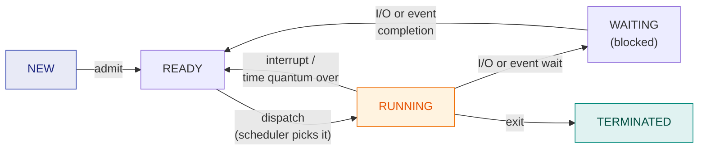
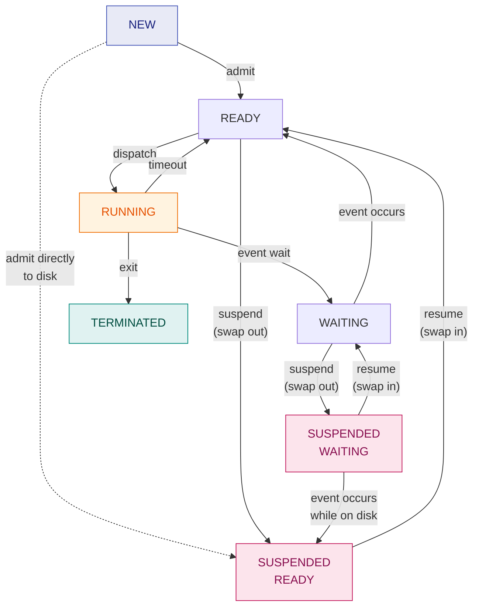
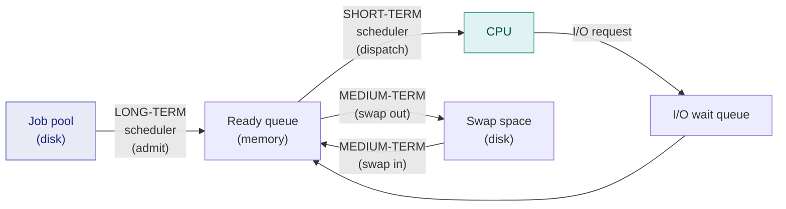

# 2. Process, Process State Diagrams & Schedulers

> ⚠️ **Written from standard course knowledge.** No class material was supplied for Operating Systems.
> **Syllabus:** *Process · Process state diagram (five state, seven state) · Scheduler*

---

## 🎯 In one line

A **process is a program in execution** — a program is a dead file on disk, a process is the live thing with a state, a program counter and resources — and the OS moves it between a small number of **states** using three **schedulers**.

---

## 1. Program vs Process ⭐⭐

| | **Program** | **Process** |
|---|---|---|
| **Nature** | **Passive** — a file of instructions | **Active** — an instruction sequence being executed |
| **Lives in** | Secondary storage (disk) | Main memory |
| **Lifetime** | Permanent until deleted | Temporary — dies when it terminates |
| **Resources** | None | CPU time, memory, files, devices |
| **Relationship** | One program → **many** processes | Each process comes from one program |

> ⭐ **One-liner:** *A process is a program in execution.* Opening the same text editor three times gives **one program and three processes**, each with its own program counter and memory.

### The memory layout of a process

```
        high address
        ┌───────────────────┐
        │      STACK        │  ← local variables, function calls, return addresses
        │        ↓          │     (grows downward)
        ├───────────────────┤
        │                   │
        │    (free space)   │
        │                   │
        ├───────────────────┤
        │        ↑          │     (grows upward)
        │       HEAP        │  ← dynamically allocated memory (malloc/new)
        ├───────────────────┤
        │       DATA        │  ← global and static variables
        ├───────────────────┤
        │       TEXT        │  ← the program code itself
        └───────────────────┘
        low address
```

> 💡 **Stack and heap grow towards each other** — they collide only when memory runs out. Text and data have fixed size, fixed at load time.

---

## 2. The Five-State Process Model ⭐⭐⭐



| State | Meaning |
|---|---|
| **New** | The process is being **created**; its PCB exists but it is not yet admitted to main memory |
| **Ready** | It has **everything it needs except the CPU**; it sits in the **ready queue** |
| **Running** | Its instructions are being executed on the CPU |
| **Waiting / Blocked** | It **cannot proceed** until some event happens (I/O completion, a signal, a resource) |
| **Terminated** | Execution has finished; the OS is reclaiming its resources |

### The five transitions — know these by name ⭐⭐

| Transition | Trigger | Who causes it |
|---|---|---|
| New → Ready | **Admit** | Long-term scheduler |
| Ready → Running | **Dispatch** | Short-term scheduler + dispatcher |
| Running → Ready | **Timeout / preemption** (quantum expired, higher-priority arrival) | Timer interrupt |
| Running → Waiting | **Event wait** (issues an I/O request) | The process itself |
| Waiting → Ready | **Event completion** | I/O interrupt |
| Running → Terminated | **Exit** | The process itself, or the OS kills it |

> ⚠️ **There is no Waiting → Running transition.** A process that finishes its I/O *must* go back to **Ready** and be scheduled again. This is a very common exam trap.

> ⚠️ **There is no Ready → Waiting transition either.** A process can only block while it is *running*, because only a running process can issue an I/O request.

---

## 3. The Seven-State Model (with Suspension) ⭐⭐⭐

**Why we need two more states:** if *all* processes in memory are blocked on I/O, the CPU has nothing to run. The fix is to **swap** a process out of main memory onto the disk (the **swap space**), freeing memory to admit a new process. A swapped-out process is **suspended**.

The two new states:

| New state | Meaning |
|---|---|
| **Suspended Ready** (ready-suspended) | The process is **ready to run but is not in main memory** — it has been swapped out to disk |
| **Suspended Waiting/Blocked** (blocked-suspended) | The process is **both waiting for an event and swapped out** to disk |



### The extra transitions ⭐

| Transition | When it happens |
|---|---|
| **Ready → Suspended Ready** | Memory is needed; the OS swaps out a ready process |
| **Waiting → Suspended Waiting** | Memory is needed; a blocked process is the best victim (it wasn't going to run anyway) |
| **Suspended Waiting → Suspended Ready** | The I/O it was waiting for **completes while it is still on disk** |
| **Suspended Ready → Ready** | The OS swaps it back into memory (**resume**) |
| **Suspended Waiting → Waiting** | Swapped back in while still blocked (rare — only if memory is now plentiful) |
| **New → Suspended Ready** | Admitted but placed straight on disk because memory is full |
| **Running → Suspended Ready** | A running process is preempted *and* swapped out (some textbooks include this) |

> ⭐ **The most-asked follow-up:** *"Which is the preferred victim to swap out?"* → a **blocked** process, because it cannot run anyway. Hence **Waiting → Suspended Waiting** is the most common suspension.

> ⚠️ **Suspended Ready → Suspended Waiting does not exist.** A suspended process is not executing, so it cannot issue a new I/O request and become blocked.

---

## 4. Schedulers ⭐⭐⭐

Three schedulers, each moving processes across a different boundary.



| | **Long-term** (job scheduler) | **Short-term** (CPU scheduler) | **Medium-term** (swapper) |
|---|---|---|---|
| **Moves a process** | New → Ready | Ready → Running | Ready/Waiting ↔ Suspended |
| **Decides** | **Which jobs enter the system** | **Which ready process gets the CPU** | **Which process to swap out/in** |
| **Speed** | **Slowest** (seconds/minutes) | **Fastest** (milliseconds) | In between |
| **Frequency** | Rare | **Very frequent** | Occasional |
| **Controls** | **Degree of multiprogramming** | — | **Reduces** degree of multiprogramming |
| **Present in** | Batch systems (minimal/absent in time-sharing) | **All** systems | Time-sharing systems |

> ⭐ **Degree of multiprogramming = the number of processes in main memory.** The **long-term scheduler controls it** (by admitting), and the **medium-term scheduler reduces it** (by swapping out).

### The dispatcher — not a scheduler ⭐⭐

| | **Scheduler** | **Dispatcher** |
|---|---|---|
| **Role** | **Decides** which process runs next (policy) | **Carries out** that decision (mechanism) |
| **Work done** | Runs a scheduling algorithm | Context switch, switch to user mode, jump to the right instruction |
| **Type** | Software (a decision module) | Software (an action module) |

**Dispatch latency** = the time the dispatcher takes to stop one process and start another. It is **pure overhead** — minimise it.

### Job mix — why the long-term scheduler cares ⭐

| Process type | Spends most time | Problem if you admit too many |
|---|---|---|
| **CPU-bound** | Computing | Ready queue is full, I/O devices sit idle |
| **I/O-bound** | Waiting for I/O | CPU sits idle, device queues are full |

> ⭐ **The long-term scheduler must admit a *balanced mix*** of CPU-bound and I/O-bound processes so that neither the CPU nor the devices go idle. This is a standard 2-mark question.

---

## 5. The queues a process passes through

| Queue | Holds |
|---|---|
| **Job queue** | All processes in the system |
| **Ready queue** | Processes in memory, ready and waiting for the CPU |
| **Device / I/O queue** | Processes waiting for a particular device (one queue per device) |

---

## 6. Common exam questions

1. **Define a process. Differentiate a program and a process.** ⭐⭐⭐
2. **Draw and explain the five-state process state diagram.** ⭐⭐⭐
3. **Draw and explain the seven-state process diagram. Why are the suspended states needed?** ⭐⭐⭐
4. **Explain the three types of scheduler and differentiate them.** ⭐⭐⭐
5. **Differentiate scheduler and dispatcher. What is dispatch latency?** ⭐⭐
6. **What is the degree of multiprogramming? Which scheduler controls it?** ⭐⭐
7. **Why is there no transition from Waiting to Running?** ⭐⭐
8. **Draw the memory layout of a process (text, data, heap, stack).** ⭐

---

## ⚡ Quick revision

- **Process = program in execution.** Program is passive/on disk; process is active/in memory.
- **Process memory:** text, data, heap ↑ … ↓ stack.
- **Five states:** New, **Ready**, **Running**, **Waiting**, Terminated.
- **Transitions:** admit, **dispatch**, **timeout**, **event wait**, **event completion**, exit.
- ⚠️ **No Waiting → Running** (must go via Ready). ⚠️ **No Ready → Waiting.**
- **Seven states** = five + **Suspended Ready** + **Suspended Waiting**, created by **swapping** to disk.
- The **preferred swap victim is a blocked process**.
- ⚠️ **No Suspended Ready → Suspended Waiting.**
- **Long-term** = admit (controls **degree of multiprogramming**, slowest, batch).
  **Short-term** = dispatch (fastest, everywhere).
  **Medium-term** = swap (reduces degree of multiprogramming).
- **Scheduler decides, dispatcher does.** Dispatch latency is pure overhead.
- The long-term scheduler must keep a **balanced mix** of CPU-bound and I/O-bound jobs.

---

**Previous:** [← 1. Types of Operating Systems](01-types-of-operating-systems.md) · **Next:** [3. CPU Scheduling — Terminology →](03-cpu-scheduling-terminology.md)
