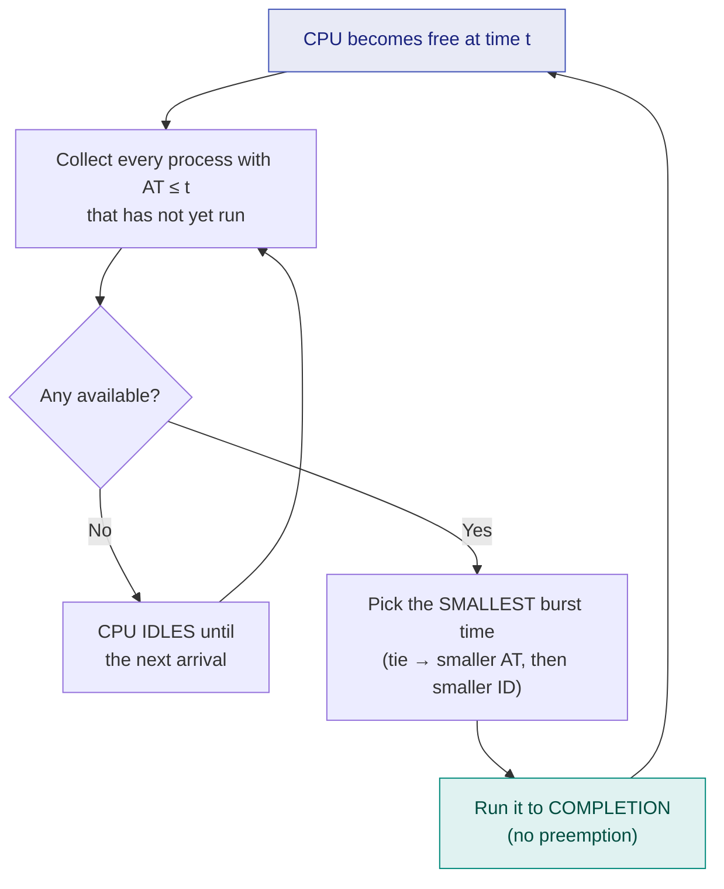
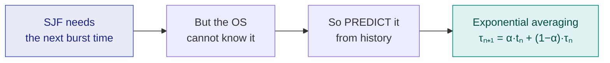

# 5. SJF — Shortest Job First

> ⚠️ **Written from standard course knowledge.** No class material was supplied for Operating Systems.
> **Syllabus:** *SJF*

---

## 🎯 In one line

Always run the **shortest available job next** — this gives the **provably minimum average waiting time**, but you have to know the burst times in advance and long jobs can **starve**.

---

## 1. The algorithm

> **Among all processes that have arrived and are waiting, give the CPU to the one with the smallest burst time.**

| Property | Value |
|---|---|
| **Type** | **Non-preemptive** (the preemptive version is **SRTF**, chapter 7) |
| **Selection criterion** | Smallest **burst time** among the **arrived** processes |
| **Tie-break** | Smaller arrival time, then smaller process ID (equivalently: FCFS among ties) |
| **Also called** | **SPN** — Shortest Process Next |



> ⚠️ **The decision is made only when the CPU becomes free** — at $t=0$ and at every completion. A shorter job arriving mid-burst **cannot** interrupt. That is the whole difference from SRTF.

> ⚠️ **"Shortest among the ARRIVED processes."** Comparing against a job that has not arrived yet is the most common SJF mistake.

---

## 2. Worked Example 1 — the master process set ⭐⭐⭐

| Process | AT | BT |
|---|---|---|
| P1 | 0 | 5 |
| P2 | 1 | 3 |
| P3 | 2 | 8 |
| P4 | 3 | 6 |

### Decision-by-decision trace

| Time CPU is free | Arrived & waiting (BT) | Shortest → chosen | Runs |
|---|---|---|---|
| **t = 0** | P1 (5) only | **P1** | 0 → 5 |
| **t = 5** | P2 (3), P3 (8), P4 (6) | **P2** (3) | 5 → 8 |
| **t = 8** | P3 (8), P4 (6) | **P4** (6) | 8 → 14 |
| **t = 14** | P3 (8) | **P3** | 14 → 22 |

### Gantt chart

```
 ┌──────────┬────────┬─────────────┬──────────────┐
 │    P1    │   P2   │     P4      │      P3      │
 └──────────┴────────┴─────────────┴──────────────┘
 0          5        8            14             22
```

### The table

| Process | AT | BT | CT | TAT = CT−AT | WT = TAT−BT |
|---|---|---|---|---|---|
| P1 | 0 | 5 | 5 | 5 | 0 |
| P2 | 1 | 3 | 8 | 7 | 4 |
| P3 | 2 | 8 | **22** | **20** | **12** |
| P4 | 3 | 6 | **14** | **11** | **5** |
| | | | | **43** | **21** |

$$\text{Average TAT} = \frac{43}{4} = \mathbf{10.75} \qquad \text{Average WT} = \frac{21}{4} = \mathbf{5.25}$$

**Compare with FCFS on the same set** (chapter 4): avg TAT $11.25$, avg WT $5.75$.

> ✅ **SJF beat FCFS** on both metrics — but notice *who* paid: P3, the longest job, went from WT 6 to WT 12. **SJF helps short jobs by hurting long ones.**

---

## 3. Worked Example 2 — SJF is optimal (all arrive at t = 0) ⭐⭐

When every process arrives at $t=0$, SJF is simply "run them in increasing order of burst time", and the optimality is easy to see.

| Process | AT | BT |
|---|---|---|
| P1 | 0 | 6 |
| P2 | 0 | 8 |
| P3 | 0 | 7 |
| P4 | 0 | 3 |

**SJF order:** P4 (3) → P1 (6) → P3 (7) → P2 (8)

```
 ┌──────┬────────────┬──────────────┬────────────────┐
 │  P4  │     P1     │      P3      │       P2       │
 └──────┴────────────┴──────────────┴────────────────┘
 0      3            9             16                24
```

| Process | BT | CT | TAT | WT |
|---|---|---|---|---|
| P4 | 3 | 3 | 3 | 0 |
| P1 | 6 | 9 | 9 | 3 |
| P3 | 7 | 16 | 16 | 9 |
| P2 | 8 | 24 | 24 | 16 |

$$\text{Avg WT}_{SJF} = \frac{0+3+9+16}{4} = \mathbf{7.0} \qquad \text{Avg TAT}_{SJF} = \frac{52}{4} = \mathbf{13.0}$$

**FCFS on the same set** (order P1, P2, P3, P4):

```
 ┌────────────┬────────────────┬──────────────┬──────┐
 │     P1     │       P2       │      P3      │  P4  │
 └────────────┴────────────────┴──────────────┴──────┘
 0            6                14             21     24
```

$$WT = 0,\ 6,\ 14,\ 21 \ \Rightarrow\ \text{Avg WT}_{FCFS} = \frac{41}{4} = \mathbf{10.25}$$

> ✅ $7.0 < 10.25$. **No other ordering of these four jobs can beat 7.0.**

### Why SJF is optimal — the exchange argument ⭐⭐

If a job with burst $b$ is scheduled at position $k$, then **every one of the $n-k$ jobs after it waits an extra $b$ units**. So the total waiting time is

$$\sum WT = (n-1)\,b_{(1)} + (n-2)\,b_{(2)} + \dots + 1\cdot b_{(n-1)} + 0\cdot b_{(n)}$$

The largest multiplier $(n-1)$ is attached to the job placed **first**. To minimise the sum, the **smallest burst** must get the **largest multiplier** — i.e. run the jobs in increasing order of burst time. Swapping any adjacent out-of-order pair always reduces the total. ∎

> ⭐ **The exam sentence:** *"SJF is provably optimal — it gives the minimum possible average waiting time for a given set of processes."*
>
> ⚠️ **But add the caveat:** this is only guaranteed when **all processes arrive at the same time**. With staggered arrivals, non-preemptive SJF is no longer globally optimal — **SRTF** is.

---

## 4. The two problems with SJF ⭐⭐⭐

### Problem 1 — Starvation (indefinite blocking)

If short jobs keep arriving, a long job may **never** be selected.

| Process | AT | BT |
|---|---|---|
| P1 | 0 | 20 |
| P2 | 1 | 2 |
| P3 | 2 | 2 |
| P4 | 3 | 2 |
| … a new 2-unit job every 2 units … | | |

P1 runs first (it is alone at $t=0$), but if it had arrived at $t=1$ it would sit behind an endless stream of 2-unit jobs.

> **Cure: aging** — gradually decrease a waiting process's *effective* burst time (or raise its priority) the longer it waits, so it is eventually selected. See [chapter 8](08-priority-scheduling.md).

### Problem 2 — Burst time is not known in advance ⭐⭐⭐

**This is the fundamental objection.** The OS cannot know how long a process will compute — that would require solving the halting problem.

> **SJF is therefore not directly implementable.** It is used as a **benchmark** (the theoretical best), and real schedulers **predict** the next burst from past behaviour. That prediction is the subject of the **next chapter**.



---

## 5. Advantages and disadvantages ⭐⭐

| Advantages | Disadvantages |
|---|---|
| **Minimum average waiting time** (provably optimal) | **Burst time is unknown** — not directly implementable |
| Minimum average turnaround time | **Starvation** of long processes |
| Maximises **throughput** (more jobs finish per unit time) | Unfair to CPU-bound jobs |
| Good for batch systems where estimates exist | Non-preemptive ⇒ poor response time for a job arriving just after a long one starts |

---

## 6. Common exam questions

1. **Explain SJF scheduling with a Gantt chart for the given processes; find avg TAT and WT.** ⭐⭐⭐
2. **Prove/argue that SJF gives minimum average waiting time.** ⭐⭐⭐
3. **Why is SJF not implementable in practice?** ⭐⭐⭐
4. **What is starvation? How does SJF cause it and how is it cured?** ⭐⭐⭐
5. **Compare FCFS and SJF for the same process set.** ⭐⭐⭐
6. **Differentiate SJF and SRTF.** ⭐⭐⭐ *(see chapter 7)*
7. **Is SJF optimal when arrival times differ?** → not globally; SRTF is. ⭐⭐

---

## ⚡ Quick revision

- **SJF = non-preemptive; pick the smallest burst among the *arrived* processes.**
- Decisions happen **only when the CPU is free** (t = 0 and at each completion).
- **Provably optimal** for average waiting time — the exchange argument: give the largest multiplier $(n-1)$ to the smallest burst.
- Optimality is exact when **all arrivals are simultaneous**; with staggered arrivals **SRTF** is the optimal one.
- Master set result: **avg TAT 10.75, avg WT 5.25** — better than FCFS's 11.25 / 5.75.
- **Two flaws: (i) starvation of long jobs — cured by aging; (ii) burst time is unknown — cured by prediction.**
- Tie-break: smaller AT, then smaller ID. **Always state it.**
- SJF helps short jobs *at the expense of* long ones — say who pays.

---

**Previous:** [← 4. FCFS Scheduling](04-fcfs-scheduling.md) · **Next:** [6. Burst Time Prediction →](06-burst-time-prediction.md)
