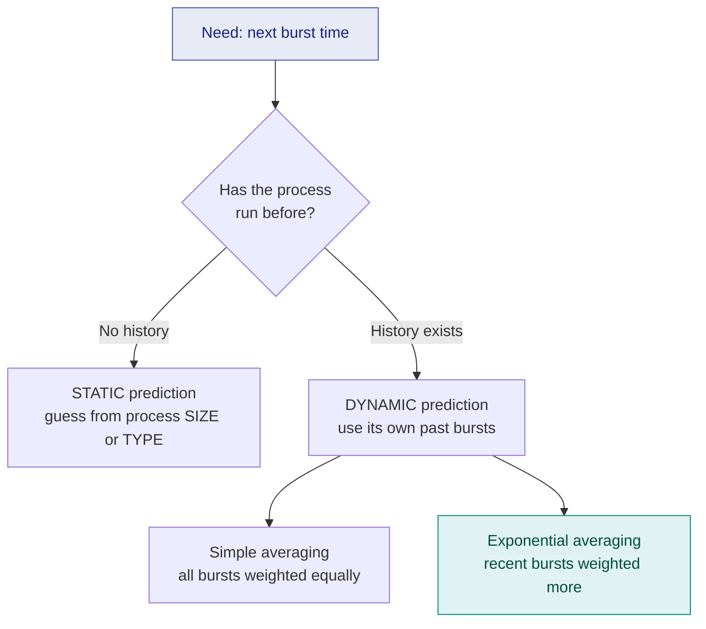

# 6. Burst Time Prediction Techniques

> ⚠️ **Written from standard course knowledge.** No class material was supplied for Operating Systems.
> **Syllabus:** *BT prediction technique — Static (process size, process type) · Dynamic (simple average, exponential average / aging)*

---

## 🎯 In one line

SJF and SRTF need a burst time the OS cannot know, so it **estimates the next burst** — crudely from the process's *size or type* (**static**), or properly from its own *past bursts* (**dynamic**), the standard method being **exponential averaging**: $\tau_{n+1} = \alpha t_n + (1-\alpha)\tau_n$.

---

## 1. The problem

[SJF](05-sjf-scheduling.md) is optimal but needs $BT$ **before** the process runs. No OS can know that. So it **predicts**:

$$\tau_{n+1} = \text{predicted length of the } (n{+}1)^{th} \text{ CPU burst}$$
$$t_n = \text{actual length of the } n^{th} \text{ CPU burst (now known, it already happened)}$$

> ⭐ **The key insight that makes prediction work:** a process's CPU bursts are **not random** — an editor's bursts are consistently short, a matrix multiplication's are consistently long. **The recent past predicts the near future.**

---

## 2. Static techniques ⭐⭐

Used when the process has **no execution history** — typically the very first burst, right after creation. The estimate comes from **properties known before execution**.

### 2.1 Based on process SIZE

> **Assumption:** a process whose memory image is similar in size to a previously executed process will need a similar CPU burst.

**How it works:** the OS keeps a record of the burst times of previously executed processes along with their sizes. For a new process of size $S$, it finds the recorded processes of comparable size and uses their burst time (or their average) as the estimate.

| Example record | | | New process |
|---|---|---|---|
| Process | Size | Actual BT | P(new), size 4 MB |
| A | 3 MB | 5 ms | → estimate ≈ **6 ms** |
| B | 5 MB | 7 ms | (the 3 MB and 5 MB neighbours |
| C | 10 MB | 15 ms | averaged: $(5+7)/2 = 6$) |

| Advantage | Disadvantage |
|---|---|
| Works with **zero execution history** | **Size ≠ time.** A 1 KB infinite loop runs forever; a 100 MB data file is read and printed in milliseconds |
| Cheap — size is known at load time | Very rough; many processes of the same size behave completely differently |

### 2.2 Based on process TYPE

> **Assumption:** processes of the same *kind* have similar CPU burst requirements.

| Process type | Typical burst | Reason |
|---|---|---|
| **OS / system process** | Very small | Short service routines |
| **Interactive / user process** | Small | Compute a little, then wait for input |
| **Foreground process** | Small–medium | Must stay responsive |
| **Background / batch process** | **Large** | Runs uninterrupted, CPU-bound |

| Advantage | Disadvantage |
|---|---|
| Better than size — type genuinely correlates with behaviour | Still coarse; two "user processes" can differ by orders of magnitude |
| No history needed | Requires the OS to classify processes correctly |

> ⭐ **Both static techniques are only a starting estimate.** As soon as the process has executed even one burst, the OS switches to **dynamic** prediction.

---

## 3. Dynamic techniques ⭐⭐⭐

Use the process's **own measured history**.

### 3.1 Simple averaging

> **Predict the next burst as the plain average of all previous bursts.**

$$\boxed{\tau_{n+1} = \frac{1}{n}\sum_{i=1}^{n} t_i}$$

**Worked example.** Actual bursts: $t = 6, 4, 6, 4, 13, 13, 13$

| $n$ | $t_n$ (actual) | $\tau_{n+1} = \frac{1}{n}\sum t_i$ | Value |
|---|---|---|---|
| 1 | 6 | $6/1$ | **6.00** |
| 2 | 4 | $(6+4)/2$ | **5.00** |
| 3 | 6 | $16/3$ | **5.33** |
| 4 | 4 | $20/4$ | **5.00** |
| 5 | **13** | $33/5$ | **6.60** |
| 6 | **13** | $46/6$ | **7.67** |
| 7 | **13** | $59/7$ | **8.43** |

> ⚠️ **The flaw is visible in the last three rows.** The process changed behaviour at burst 5 — it is now firmly a 13-unit job — but the prediction is still stuck at **8.43**, dragged down by ancient 4s and 6s. **Simple averaging gives a burst from an hour ago the same weight as the one that just finished.**

| Advantage | Disadvantage |
|---|---|
| Easy; uses all information | **Adapts far too slowly** to a change in behaviour |
| | Must store **all** $n$ past bursts (or a running sum and count) |

### 3.2 Exponential averaging (exponential moving average) ⭐⭐⭐

> **Weight the most recent burst heavily and let older bursts fade away exponentially.**

$$\boxed{\tau_{n+1} = \alpha\, t_n + (1-\alpha)\, \tau_n} \qquad 0 \le \alpha \le 1$$

| Symbol | Meaning |
|---|---|
| $t_n$ | **Actual** length of the most recent (the $n^{th}$) burst |
| $\tau_n$ | The value we **predicted** for that burst |
| $\tau_{n+1}$ | The **new prediction** |
| $\alpha$ | **Smoothing factor** — how much we trust the latest measurement |
| $\tau_1$ | The **initial guess** (a constant, or a static estimate from §2) |

**Read the formula as:** *new prediction = (some of what just happened) + (the rest of what we used to believe).*

### The role of $\alpha$ ⭐⭐⭐

| $\alpha$ | Formula becomes | Behaviour |
|---|---|---|
| $\alpha = 0$ | $\tau_{n+1} = \tau_n$ | **History never changes** — the prediction stays at $\tau_1$ forever; recent behaviour is ignored completely |
| $\alpha = 1$ | $\tau_{n+1} = t_n$ | **Only the last burst matters** — history is ignored completely |
| $\alpha = 0.5$ | $\tau_{n+1} = \frac{t_n + \tau_n}{2}$ | **The usual choice** — equal trust in the last actual burst and the accumulated history |

> ⭐ **The two extremes are guaranteed exam questions.** $\alpha = 0$ ⇒ *only the initial estimate counts*; $\alpha = 1$ ⇒ *only the most recent burst counts*.

### Why it is called "aging" ⭐⭐

Expand the recurrence:

$$\tau_{n+1} = \alpha t_n + (1-\alpha)\alpha t_{n-1} + (1-\alpha)^2\alpha t_{n-2} + \dots + (1-\alpha)^{n-1}\alpha t_1 + (1-\alpha)^n \tau_1$$

Each older burst carries the factor $(1-\alpha)^k$. Since $(1-\alpha) < 1$, those factors **shrink geometrically** — an old burst's influence **decays (ages) away**. That is exactly why the technique is also called **aging**.

With $\alpha = 0.5$ the weights are $\frac12, \frac14, \frac18, \frac1{16}, \dots$ — the last burst counts for half the prediction, the one before it a quarter, and so on.

> ⚠️ **Do not confuse the two "agings":**
> | | Meaning |
> |---|---|
> | **Aging in burst prediction** (this chapter) | Older bursts lose weight exponentially in $\tau_{n+1}$ |
> | **Aging in priority scheduling** ([ch. 8](08-priority-scheduling.md)) | A waiting process's **priority is raised over time** to prevent starvation |
>
> They are unrelated ideas that share a name. Read the question carefully.

---

## 4. Worked Example — exponential averaging ⭐⭐⭐

**Given:** $\tau_1 = 10$, $\alpha = 0.5$, and actual bursts $t = 6, 4, 6, 4, 13, 13, 13$.
**Find:** the predicted burst before each one.

$$\tau_2 = 0.5(6) + 0.5(10) = 3 + 5 = \mathbf{8}$$
$$\tau_3 = 0.5(4) + 0.5(8) = 2 + 4 = \mathbf{6}$$
$$\tau_4 = 0.5(6) + 0.5(6) = 3 + 3 = \mathbf{6}$$
$$\tau_5 = 0.5(4) + 0.5(6) = 2 + 3 = \mathbf{5}$$
$$\tau_6 = 0.5(13) + 0.5(5) = 6.5 + 2.5 = \mathbf{9}$$
$$\tau_7 = 0.5(13) + 0.5(9) = 6.5 + 4.5 = \mathbf{11}$$
$$\tau_8 = 0.5(13) + 0.5(11) = 6.5 + 5.5 = \mathbf{12}$$

### The answer table — present it exactly like this

| Burst # $n$ | Actual $t_n$ | Predicted $\tau_n$ | Error $\lvert t_n - \tau_n \rvert$ |
|---|---|---|---|
| 1 | 6 | 10 *(initial guess)* | 4 |
| 2 | 4 | 8 | 4 |
| 3 | 6 | 6 | **0** |
| 4 | 4 | 6 | 2 |
| 5 | 13 | 5 | 8 |
| 6 | 13 | 9 | 4 |
| 7 | 13 | 11 | 2 |
| 8 | — | **12** | — |

**Reading the result:** the process was a "4–6" job, then jumped to 13. The prediction **chased it: 5 → 9 → 11 → 12**, closing in on 13. Compare with simple averaging on the same data, which only reached **8.43**. ✅

> ⭐ **The comparison sentence for full marks:** *"Exponential averaging converged to 12 within three bursts while simple averaging was still at 8.43, because exponential averaging weights recent bursts more heavily."*

---

## 5. Comparison ⭐⭐

| | **Static** | **Simple averaging** | **Exponential averaging** |
|---|---|---|---|
| **Uses** | Size / type | All past bursts, equally | Past bursts, **decaying weights** |
| **History needed** | **None** | All $n$ bursts | Only $\tau_n$ and $t_n$ — **O(1) storage** ⭐ |
| **Adapts to change** | Not at all | **Slowly** | **Quickly** |
| **Accuracy** | Poor | Moderate | **Best** |
| **Used for** | The **first** burst | Rarely, in theory | **Real schedulers** |

> ⭐ **The practical winner is exponential averaging**, and the deciding reason is often the storage one: it needs only **two numbers** per process, kept in the PCB, no matter how long the process has been running.

---

## 6. Common exam questions

1. **Given $\tau_1$, $\alpha$ and a list of actual bursts, compute the predicted bursts.** ⭐⭐⭐ *(the standard numerical)*
2. **State and explain the exponential averaging formula. What do $t_n$, $\tau_n$ and $\alpha$ mean?** ⭐⭐⭐
3. **What happens when $\alpha = 0$ and when $\alpha = 1$?** ⭐⭐⭐
4. **Why is exponential averaging called aging? Expand the formula to show it.** ⭐⭐
5. **Explain static burst-time prediction based on process size and process type, with their limitations.** ⭐⭐
6. **Compare simple averaging and exponential averaging.** ⭐⭐
7. **Why does SJF need burst-time prediction at all?** ⭐⭐

---

## ⚡ Quick revision

- **Static** (no history): by **process size** (similar size ⇒ similar burst) and by **process type** (system/interactive/foreground = small, background/batch = large). Both are crude.
- **Dynamic** (own history): **simple averaging** $\tau_{n+1} = \frac1n\sum t_i$ — adapts too slowly, stores everything.
- **Exponential averaging:** $\ \boxed{\tau_{n+1} = \alpha t_n + (1-\alpha)\tau_n}$
- $\alpha = 0$ ⇒ prediction never changes (**only history**). $\alpha = 1$ ⇒ $\tau_{n+1} = t_n$ (**only the last burst**). $\alpha = 0.5$ ⇒ the usual half-and-half.
- **Aging** = old bursts carry weight $(1-\alpha)^k$, which **decays geometrically**.
- Standard numerical: $\tau_1=10, \alpha=0.5$, bursts $6,4,6,4,13,13,13$ → predictions $10, 8, 6, 6, 5, 9, 11, 12$.
- Exponential averaging needs **only two numbers** in the PCB — O(1) storage — which is why real schedulers use it.
- ⚠️ **Aging here ≠ aging in priority scheduling** (that one fixes starvation).

---

**Previous:** [← 5. SJF Scheduling](05-sjf-scheduling.md) · **Next:** [7. SRTF Scheduling →](07-srtf-scheduling.md)
