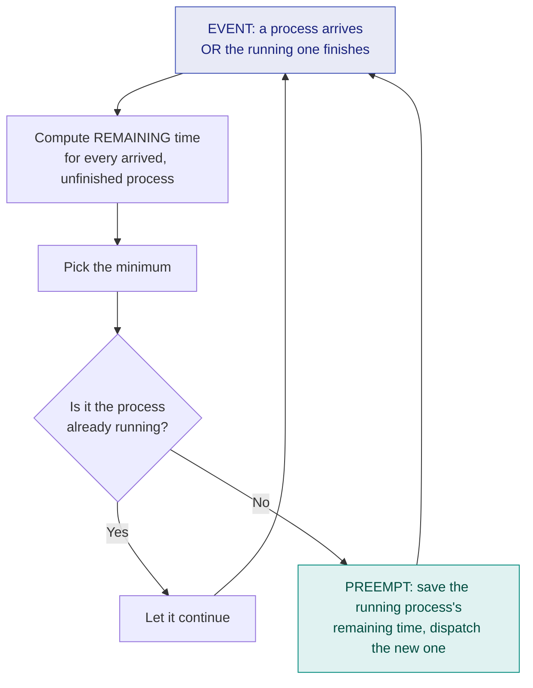

# 7. SRTF — Shortest Remaining Time First

> ⚠️ **Written from standard course knowledge.** No class material was supplied for Operating Systems.
> **Syllabus:** *SRTF*

---

## 🎯 In one line

SRTF is **preemptive SJF**: at **every arrival** the scheduler re-checks who has the least *remaining* time, and preempts the running process if a newcomer is shorter.

---

## 1. The algorithm ⭐⭐⭐

> **Give the CPU to the process with the smallest REMAINING burst time. Re-evaluate whenever a new process arrives or the running one finishes.**

| Property | Value |
|---|---|
| **Type** | **Preemptive** |
| **Selection criterion** | Smallest **remaining** time among arrived processes |
| **Also called** | **SRTN** (Shortest Remaining Time Next), **preemptive SJF** |
| **Decision points** | ⭐ **every arrival** and every completion |
| **Tie-break** | **Do not preempt** — if the newcomer's burst equals the running process's remaining time, the running one continues (switching costs overhead for no gain) |



> ⚠️ **The mistake that loses the most marks:** checking only at completions. **SRTF must be re-evaluated at every single arrival time.** Before you draw anything, list the arrival instants — those are exactly the times you must check.

> ⭐ **Method that never fails:** maintain a **remaining-time table** and step through the arrival instants one by one. Only after that, draw the Gantt chart.

---

## 2. Worked Example 1 — the master process set ⭐⭐⭐

| Process | AT | BT |
|---|---|---|
| P1 | 0 | 5 |
| P2 | 1 | 3 |
| P3 | 2 | 8 |
| P4 | 3 | 6 |

**Decision points:** $t = 0, 1, 2, 3$ (arrivals) and every completion.

### The remaining-time trace

| Time | Event | Remaining times (arrived only) | Minimum | Action |
|---|---|---|---|---|
| **0** | P1 arrives | P1 = 5 | P1 | Run **P1** |
| **1** | P2 arrives | P1 = **4**, P2 = **3** | **P2** | ⚡ **Preempt P1**, run **P2** |
| **2** | P3 arrives | P1 = 4, P2 = **2**, P3 = 8 | P2 | Continue P2 |
| **3** | P4 arrives | P1 = 4, P2 = **1**, P3 = 8, P4 = 6 | P2 | Continue P2 |
| **4** | **P2 completes** | P1 = **4**, P3 = 8, P4 = 6 | **P1** | Run **P1** |
| **8** | **P1 completes** | P3 = 8, P4 = **6** | **P4** | Run **P4** |
| **14** | **P4 completes** | P3 = 8 | P3 | Run **P3** |
| **22** | **P3 completes** | — | — | Done |

### Gantt chart

```
 ┌────┬──────────┬────────────┬─────────────┬──────────────┐
 │ P1 │    P2    │     P1     │     P4      │      P3      │
 └────┴──────────┴────────────┴─────────────┴──────────────┘
 0    1          4            8            14             22
```

### The table

| Process | AT | BT | CT | TAT = CT−AT | WT = TAT−BT | RT |
|---|---|---|---|---|---|---|
| P1 | 0 | 5 | 8 | 8 | **3** | 0 |
| P2 | 1 | 3 | **4** | **3** | **0** | 0 |
| P3 | 2 | 8 | 22 | 20 | 12 | 12 |
| P4 | 3 | 6 | 14 | 11 | 5 | 5 |
| | | | | **42** | **20** | |

$$\text{Average TAT} = \frac{42}{4} = \mathbf{10.5} \qquad \text{Average WT} = \frac{20}{4} = \mathbf{5.0}$$

**Verification checks:** ✅
- CPU-time audit: P1 gets $(0\text{–}1) + (4\text{–}8) = 1 + 4 = 5$ ✓, P2 gets $3$ ✓, P4 gets $6$ ✓, P3 gets $8$ ✓ — each matches its BT.
- Chart length $22 = \sum BT$, no idle time ✓
- $RT \le WT$ for every process — correct for a preemptive algorithm ✓ (P1: RT 0 < WT 3)

---

## 3. The three algorithms compared on the same set ⭐⭐⭐

| Algorithm | Avg TAT | Avg WT | Order of execution |
|---|---|---|---|
| **FCFS** | 11.25 | 5.75 | P1, P2, P3, P4 |
| **SJF** | 10.75 | 5.25 | P1, P2, P4, P3 |
| **SRTF** | **10.50** | **5.00** | P1, P2, P1, P4, P3 |

> ✅ **SRTF wins.** With staggered arrivals, **SRTF — not SJF — is the algorithm that minimises average waiting time.** That is the headline fact of this chapter.

> ⚠️ But the table hides the cost: SRTF used **one extra context switch** (P1 was preempted). With a real overhead $\delta$ the gap narrows, and for many small preemptions SRTF can end up **worse** than SJF.

---

## 4. Worked Example 2 — heavier preemption ⭐⭐

| Process | AT | BT |
|---|---|---|
| P1 | 0 | 7 |
| P2 | 2 | 4 |
| P3 | 4 | 1 |
| P4 | 5 | 4 |

| Time | Event | Remaining | Min | Action |
|---|---|---|---|---|
| 0 | P1 arrives | P1 = 7 | P1 | Run P1 |
| 2 | P2 arrives | P1 = **5**, P2 = **4** | P2 | ⚡ Preempt → P2 |
| 4 | P3 arrives | P1 = 5, P2 = **2**, P3 = **1** | P3 | ⚡ Preempt → P3 |
| 5 | **P3 completes**, P4 arrives | P1 = 5, P2 = **2**, P4 = 4 | P2 | Run P2 |
| 7 | **P2 completes** | P1 = 5, P4 = **4** | P4 | Run P4 |
| 11 | **P4 completes** | P1 = 5 | P1 | Run P1 |
| 16 | **P1 completes** | — | — | Done |

```
 ┌────────┬────────┬────┬────────┬────────────────┬────────────────────┐
 │   P1   │   P2   │ P3 │   P2   │       P4       │         P1         │
 └────────┴────────┴────┴────────┴────────────────┴────────────────────┘
 0        2        4    5        7               11                   16
```

| Process | AT | BT | CT | TAT | WT |
|---|---|---|---|---|---|
| P1 | 0 | 7 | 16 | 16 | **9** |
| P2 | 2 | 4 | 7 | 5 | 1 |
| P3 | 4 | 1 | 5 | 1 | **0** |
| P4 | 5 | 4 | 11 | 6 | 2 |
| | | | | **28** | **12** |

$$\text{Avg TAT} = \frac{28}{4} = \mathbf{7.0} \qquad \text{Avg WT} = \frac{12}{4} = \mathbf{3.0}$$

**Audit:** P1: $2 + 5 = 7$ ✓ · P2: $2 + 2 = 4$ ✓ · P3: $1$ ✓ · P4: $4$ ✓ · total $16 = \sum BT$ ✓

> 📌 Notice **P3, the 1-unit job, waited 0** — it arrived and ran immediately. That responsiveness for short jobs is exactly what SRTF buys, and **P1 paid for it** with WT 9.

---

## 5. SJF vs SRTF ⭐⭐⭐

| | **SJF** | **SRTF** |
|---|---|---|
| **Preemption** | **Non-preemptive** | **Preemptive** |
| **Criterion** | Smallest **burst time** | Smallest **remaining time** |
| **Decision points** | Only when the CPU is free | ⭐ **Every arrival** + every completion |
| **Context switches** | $n - 1$ | **More** — one per preemption |
| **Avg waiting time** | Low | **Lowest possible** |
| **Response time** | Poor for late short jobs | **Good** |
| **Starvation** | Long processes | Long processes (**worse** — a long job can be preempted repeatedly) |
| **Overhead** | Low | **High** |

> ⭐ **One-line distinction:** *"SJF compares burst times only when the CPU falls free; SRTF compares remaining times at every arrival and will snatch the CPU away."*

---

## 6. Advantages and disadvantages

| Advantages | Disadvantages |
|---|---|
| **Minimum average waiting and turnaround time** of all algorithms | **Starvation** of long processes is severe |
| Excellent **response time** for short processes | Needs burst times ⇒ must be **predicted** ([ch. 6](06-burst-time-prediction.md)) |
| Short jobs are never stuck behind long ones — **no convoy effect** | Many **context switches** ⇒ high overhead |
| | Constant monitoring of remaining times costs CPU work |

---

## 7. Common exam questions

1. **Solve the given process set using SRTF; draw the Gantt chart and find avg TAT and WT.** ⭐⭐⭐
2. **Differentiate SJF and SRTF.** ⭐⭐⭐
3. **Compare FCFS, SJF and SRTF on the same process set.** ⭐⭐⭐
4. **Which algorithm gives minimum average waiting time and why?** ⭐⭐⭐
5. **How many context switches does SRTF need for the given set?** ⭐⭐
6. **Why does SRTF cause more starvation than SJF?** ⭐⭐

---

## ⚡ Quick revision

- **SRTF = preemptive SJF.** Criterion: smallest **remaining** time.
- ⭐ **Re-evaluate at EVERY arrival**, not only at completions. List the arrival instants first.
- Build a **remaining-time trace table**, then draw the Gantt chart from it.
- Tie (newcomer's BT = running process's remaining) ⇒ **do not preempt**.
- Master set: Gantt `P1|P2|P1|P4|P3` at 0,1,4,8,14,22 → **avg TAT 10.5, avg WT 5.0** — better than SJF (10.75/5.25) and FCFS (11.25/5.75).
- **With staggered arrivals, SRTF is the optimal algorithm for average WT** (SJF is optimal only for simultaneous arrivals).
- **Audit your chart:** each process's total CPU slices must equal its BT.
- Costs: **most context switches**, **worst starvation**, still needs **burst prediction**.

---

**Previous:** [← 6. Burst Time Prediction](06-burst-time-prediction.md) · **Next:** [8. Priority Scheduling →](08-priority-scheduling.md)
