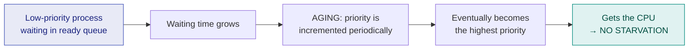

# 8. Priority Scheduling (Preemptive & Non-preemptive)

> ⚠️ **Written from standard course knowledge.** No class material was supplied for Operating Systems.
> **Syllabus:** *Preemptive priority scheduling*

---

## 🎯 In one line

Every process carries a **priority number**; the CPU always goes to the highest-priority ready process — and in the **preemptive** version, a higher-priority arrival **snatches the CPU immediately**.

---

## 1. The algorithm

> **Give the CPU to the process with the highest priority. If two processes have equal priority, use FCFS between them.**

| Property | Value |
|---|---|
| **Type** | Comes in **both** flavours — preemptive and non-preemptive |
| **Selection criterion** | Highest priority among the **arrived** processes |
| **Tie-break** | **FCFS** (smaller arrival time, then smaller process ID) |

### ⚠️ The convention trap — read the question! ⭐⭐⭐

| Convention | Meaning |
|---|---|
| **Lower number = higher priority** | Priority 1 beats priority 5. **Most common in textbooks (Silberschatz) — used in these notes.** |
| **Higher number = higher priority** | Priority 5 beats priority 1. Used by some question papers and by Linux "nice" in reverse. |

> ⭐ **Always write one line at the top of your answer: "Assuming lower number = higher priority."** If the question does not say, this single sentence protects the whole answer.

### Where do priorities come from?

| Type | Set by | Based on |
|---|---|---|
| **Internal** | The OS | Memory needs, time limits, I/O-to-CPU burst ratio, number of open files |
| **External** | Outside the OS | User importance, department, money paid, political importance of the work |
| **Static** | Fixed at creation | Never changes — simple but causes starvation |
| **Dynamic** | Changes at runtime | Adjusted by **aging** or by behaviour |

> 💡 **SJF is a special case of priority scheduling** where priority = $\frac{1}{\text{next CPU burst}}$ — the shorter the burst, the higher the priority. This is a standard one-mark observation.

---

## 2. Worked Example — NON-PREEMPTIVE priority ⭐⭐⭐

**Master process set with priorities** (lower number = higher priority):

| Process | AT | BT | Priority |
|---|---|---|---|
| P1 | 0 | 5 | 2 |
| P2 | 1 | 3 | 3 |
| P3 | 2 | 8 | **1** (highest) |
| P4 | 3 | 6 | 4 (lowest) |

### Trace — decisions only when the CPU is free

| Time CPU free | Arrived & waiting (priority) | Highest → chosen | Runs |
|---|---|---|---|
| **0** | P1 (2) only | **P1** | 0 → 5 |
| **5** | P2 (3), P3 (**1**), P4 (4) | **P3** | 5 → 13 |
| **13** | P2 (3), P4 (4) | **P2** | 13 → 16 |
| **16** | P4 (4) | **P4** | 16 → 22 |

```
 ┌──────────┬──────────────┬────────┬─────────────┐
 │    P1    │      P3      │   P2   │     P4      │
 └──────────┴──────────────┴────────┴─────────────┘
 0          5             13       16            22
```

| Process | AT | BT | Pri | CT | TAT | WT |
|---|---|---|---|---|---|---|
| P1 | 0 | 5 | 2 | 5 | 5 | 0 |
| P2 | 1 | 3 | 3 | 16 | 15 | 12 |
| P3 | 2 | 8 | 1 | 13 | 11 | 3 |
| P4 | 3 | 6 | 4 | 22 | 19 | 13 |
| | | | | | **50** | **28** |

$$\text{Avg TAT} = \frac{50}{4} = \mathbf{12.5} \qquad \text{Avg WT} = \frac{28}{4} = \mathbf{7.0}$$

> 📌 **P1 ran first even though P3 has the highest priority** — because at $t=0$, P3 had not arrived yet, and non-preemptive scheduling cannot take the CPU back afterwards.

---

## 3. Worked Example — PREEMPTIVE priority ⭐⭐⭐

**Same process set.** Now the scheduler re-checks at **every arrival**.

### Trace

| Time | Event | Ready (priority) | Highest | Action |
|---|---|---|---|---|
| **0** | P1 arrives | P1 (2) | P1 | Run **P1** |
| **1** | P2 arrives | P1 (2), P2 (3) | P1 | Continue P1 *(3 is worse than 2)* |
| **2** | **P3 arrives** | P1 (2), P2 (3), **P3 (1)** | **P3** | ⚡ **Preempt P1** (remaining 3), run **P3** |
| **3** | P4 arrives | P3 (1), P1 (2), P2 (3), P4 (4) | P3 | Continue P3 |
| **10** | **P3 completes** | P1 (2, rem 3), P2 (3), P4 (4) | **P1** | Run **P1** |
| **13** | **P1 completes** | P2 (3), P4 (4) | **P2** | Run **P2** |
| **16** | **P2 completes** | P4 (4) | P4 | Run **P4** |
| **22** | **P4 completes** | — | — | Done |

```
 ┌────┬──────────────────┬────────┬────────┬─────────────┐
 │ P1 │        P3        │   P1   │   P2   │     P4      │
 └────┴──────────────────┴────────┴────────┴─────────────┘
 0    2                 10       13       16            22
```

| Process | AT | BT | Pri | CT | TAT | WT | RT |
|---|---|---|---|---|---|---|---|
| P1 | 0 | 5 | 2 | 13 | 13 | **8** | 0 |
| P2 | 1 | 3 | 3 | 16 | 15 | 12 | 12 |
| P3 | 2 | 8 | **1** | **10** | **8** | **0** | 0 |
| P4 | 3 | 6 | 4 | 22 | 19 | 13 | 13 |
| | | | | | **55** | **33** | |

$$\text{Avg TAT} = \frac{55}{4} = \mathbf{13.75} \qquad \text{Avg WT} = \frac{33}{4} = \mathbf{8.25}$$

**Audit:** P1 ran $0\text{–}2$ and $10\text{–}13$ = $2+3 = 5$ ✓ · total length $22 = \sum BT$ ✓

### Comparing the two flavours ⭐⭐

| | Non-preemptive | Preemptive |
|---|---|---|
| Avg TAT | **12.5** | 13.75 |
| Avg WT | **7.0** | 8.25 |
| P3's (highest priority) WT | 3 | **0** ⭐ |
| P3's response time | 3 | **0** ⭐ |
| Context switches | 3 | **4** |

> ⭐ **The lesson to write down:** preemptive priority made the *averages worse* but gave the **highest-priority process WT = 0 and RT = 0**. That is exactly the point — **priority scheduling does not optimise averages, it optimises *importance***. In a real-time system that trade is always worth it.

---

## 4. Starvation and Aging ⭐⭐⭐

### The problem: starvation (indefinite blocking)

> **Starvation:** a low-priority process waits indefinitely because a steady stream of higher-priority processes keeps arriving.

In the example above, P4 (priority 4) ran last. If a priority-1 process arrived every 3 units, **P4 would never run at all**.

> 📌 **The famous anecdote — worth quoting for a mark:** when the IBM 7094 at MIT was shut down in 1973, a low-priority process submitted in **1967** was found still waiting, six years later.

### The cure: AGING ⭐⭐⭐

> **Aging: gradually increase the priority of a process that has been waiting for a long time.**

**Rule example:** *increase the priority by 1 for every 5 units of waiting.*

| Time | P4's waiting duration | P4's effective priority |
|---|---|---|
| 0 | 0 | 4 |
| 5 | 5 | **3** |
| 10 | 10 | **2** |
| 15 | 15 | **1** ← now competitive with anything |
| 20 | 20 | **0** ← highest possible; it *must* run |

Because the priority improves without bound, **every process eventually reaches the top of the queue** — starvation becomes impossible.



> ⚠️ **Aging here ≠ aging in burst prediction** ([ch. 6](06-burst-time-prediction.md)). Here it *raises priority to stop starvation*; there it *decays the weight of old bursts*. Same word, unrelated ideas.

### Other cures

| Cure | How |
|---|---|
| **Aging** ⭐ | Priority rises with waiting time — the standard answer |
| Lower the priority of the running process | A process that has just run drops down |
| Add a time quantum | Combine priority with Round Robin among equal priorities |
| Reserve a share of CPU time for low-priority processes | Guarantees progress |

---

## 5. Advantages and disadvantages ⭐⭐

| Advantages | Disadvantages |
|---|---|
| **Important processes finish first** — essential for real-time and system tasks | **Starvation / indefinite blocking** of low-priority processes |
| Flexible — priority can encode any policy | Requires a **priority assignment mechanism**, which may be arbitrary |
| Preemptive version gives excellent response to critical tasks | **Priority inversion** ([ch. 15](15-synchronization-mechanisms.md)) when priorities interact with locks |
| Non-preemptive version has low overhead | Average WT/TAT can be poor |
| | A crashed high-priority process can block the system |

---

## 6. Common exam questions

1. **Solve the given process set using preemptive priority scheduling; draw the Gantt chart and find avg TAT and WT.** ⭐⭐⭐
2. **Solve the same set non-preemptively and compare.** ⭐⭐⭐
3. **What is starvation? What is aging? How does aging solve starvation?** ⭐⭐⭐
4. **State the advantages and disadvantages of priority scheduling.** ⭐⭐
5. **How is SJF a special case of priority scheduling?** ⭐⭐
6. **Differentiate internal and external priorities; static and dynamic priorities.** ⭐
7. **What happens if all processes have equal priority?** → it degenerates to **FCFS**. ⭐

---

## ⚡ Quick revision

- **Priority scheduling:** highest priority first; **FCFS among equal priorities**.
- ⚠️ **State the convention** — these notes use **lower number = higher priority**.
- **Non-preemptive:** decide only when the CPU is free. **Preemptive:** re-check at **every arrival**.
- Master set (P1=2, P2=3, P3=1, P4=4): non-preemptive → **12.5 / 7.0**; preemptive → **13.75 / 8.25**, but P3 gets **WT = RT = 0**.
- **Priority scheduling optimises importance, not averages.**
- **Starvation** = a low-priority process waits forever. **Aging** = raise priority with waiting time — the cure.
- ⚠️ Aging (priority) ≠ aging (burst prediction).
- **SJF = priority scheduling with priority $\propto 1/\text{burst}$.**
- All priorities equal ⇒ **FCFS**.
- Other risk: **priority inversion** when a low-priority process holds a lock a high-priority process needs.

---

**Previous:** [← 7. SRTF Scheduling](07-srtf-scheduling.md) · **Next:** [9. Round Robin Scheduling →](09-round-robin.md)
