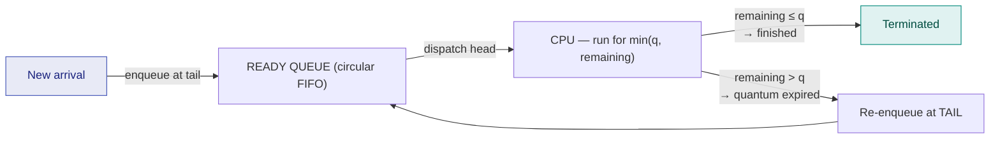

# 9. Round Robin Scheduling

> ⚠️ **Written from standard course knowledge.** No class material was supplied for Operating Systems.
> **Syllabus:** *Round Robin algorithm*

---

## 🎯 In one line

**FCFS with a time quantum and preemption** — everyone gets a fixed slice of CPU in circular order, which makes it **fair and starvation-free**, at the cost of the highest average waiting time of all the algorithms.

---

## 1. The algorithm ⭐⭐⭐

> **Each process gets the CPU for at most one time quantum $q$. When $q$ expires, it is preempted and put at the TAIL of the ready queue, and the next process at the HEAD is dispatched.**

| Property | Value |
|---|---|
| **Type** | **Preemptive** (by timer) |
| **Data structure** | **Circular FIFO queue** |
| **Designed for** | **Time-sharing** systems |
| **Other names** | Time-slicing |

**Two ways a process can leave the CPU:**

| Case | What happens |
|---|---|
| Remaining time **> q** | Runs for exactly $q$, then is **preempted** and re-enters the queue at the **tail** |
| Remaining time **≤ q** | Runs to **completion** and leaves the system; the CPU is handed over immediately |



### ⚠️ The queue-order rule that decides the answer ⭐⭐⭐

When a process is preempted at exactly the same instant another process arrives, **who goes into the queue first?**

> **Convention used in these notes: the NEW ARRIVAL is enqueued first, then the preempted process.**

The reasoning: the arrival happens as an external event at that instant, while the preempted process must first be context-switched out. **Almost every disagreement between two "correct" RR answers comes from this rule** — write it down before you start.

---

## 2. Worked Example — master process set, q = 2 ⭐⭐⭐

| Process | AT | BT |
|---|---|---|
| P1 | 0 | 5 |
| P2 | 1 | 3 |
| P3 | 2 | 8 |
| P4 | 3 | 6 |

### The ready-queue trace — the part examiners want to see

| Time | Running | Ran for | Remaining after | Arrivals during | Ready queue **after** this slice |
|---|---|---|---|---|---|
| 0–2 | **P1** | 2 | P1 = 3 | P2 @1, P3 @2 | [P2, P3, **P1**] |
| 2–4 | **P2** | 2 | P2 = 1 | P4 @3 | [P3, P1, P4, **P2**] |
| 4–6 | **P3** | 2 | P3 = 6 | — | [P1, P4, P2, **P3**] |
| 6–8 | **P1** | 2 | P1 = 1 | — | [P4, P2, P3, **P1**] |
| 8–10 | **P4** | 2 | P4 = 4 | — | [P2, P3, P1, **P4**] |
| 10–11 | **P2** | 1 | **0 → done** | — | [P3, P1, P4] |
| 11–13 | **P3** | 2 | P3 = 4 | — | [P1, P4, **P3**] |
| 13–14 | **P1** | 1 | **0 → done** | — | [P4, P3] |
| 14–16 | **P4** | 2 | P4 = 2 | — | [P3, **P4**] |
| 16–18 | **P3** | 2 | P3 = 2 | — | [P4, **P3**] |
| 18–20 | **P4** | 2 | **0 → done** | — | [P3] |
| 20–22 | **P3** | 2 | **0 → done** | — | [ ] |

### Gantt chart

```
 ┌────┬────┬────┬────┬────┬──┬────┬──┬────┬────┬────┬────┐
 │ P1 │ P2 │ P3 │ P1 │ P4 │P2│ P3 │P1│ P4 │ P3 │ P4 │ P3 │
 └────┴────┴────┴────┴────┴──┴────┴──┴────┴────┴────┴────┘
 0    2    4    6    8   10 11   13 14   16   18   20   22
```

### The table

| Process | AT | BT | CT | TAT = CT−AT | WT = TAT−BT | RT |
|---|---|---|---|---|---|---|
| P1 | 0 | 5 | 14 | 14 | 9 | **0** |
| P2 | 1 | 3 | 11 | 10 | 7 | **1** |
| P3 | 2 | 8 | 22 | 20 | 12 | **2** |
| P4 | 3 | 6 | 20 | 17 | 11 | **5** |
| | | | | **61** | **39** | |

$$\text{Average TAT} = \frac{61}{4} = \mathbf{15.25} \qquad \text{Average WT} = \frac{39}{4} = \mathbf{9.75}$$

**Audit (always do this):** ✅
P1: $2+2+1 = 5$ ✓ · P2: $2+1 = 3$ ✓ · P3: $2+2+2+2 = 8$ ✓ · P4: $2+2+2 = 6$ ✓ · total $22 = \sum BT$ ✓

> ⭐ **Look at the RT column: 0, 1, 2, 5 — every process got the CPU within the first 8 units.** RR has the **worst average waiting time but the best response time**. That is the whole trade, and it is why interactive systems use it.

---

## 3. Round Robin with context-switch overhead ⭐⭐⭐

Every quantum expiry costs a context switch, so **RR is the algorithm most damaged by overhead**.

**Example:** P1 = 4, P2 = 3, P3 = 2, all arriving at $t=0$; $q = 2$, $\delta = 1$.

**Slice sequence:** P1(2), P2(2), P3(2 → done), P1(2 → done), P2(1 → done) — **5 dispatches, so 4 switches.**

```
 ┌────┬──┬────┬──┬────┬──┬────┬──┬──┐
 │ P1 │CS│ P2 │CS│ P3 │CS│ P1 │CS│P2│
 └────┴──┴────┴──┴────┴──┴────┴──┴──┘
 0    2  3    5  6    8  9   11 12 13
```

| Process | BT | CT | TAT | WT |
|---|---|---|---|---|
| P1 | 4 | 11 | 11 | 7 |
| P2 | 3 | 13 | 13 | 10 |
| P3 | 2 | 8 | 8 | 6 |
| | | | **32** | **23** |

$$\text{Avg TAT} = \frac{32}{3} = \mathbf{10.67} \qquad \text{Avg WT} = \frac{23}{3} = \mathbf{7.67}$$

### The overhead formulas ⭐⭐

$$\text{Number of context switches} = (\text{number of dispatches}) - 1$$
$$\text{Total time} = \sum BT + (\text{switches})\times\delta + \text{idle}$$
$$\boxed{\text{CPU efficiency} = \frac{\sum BT}{\sum BT + (\text{switches})\times \delta} = \frac{9}{9+4} = \frac{9}{13} = \mathbf{69.2\%}}$$

**A quick single-process way to see the damage:**

$$\text{Efficiency per slice} = \frac{q}{q+\delta}$$

| $q$ | $\delta$ | Efficiency |
|---|---|---|
| 1 ms | 1 ms | **50%** — half the CPU is wasted switching! |
| 2 ms | 1 ms | 66.7% |
| 10 ms | 1 ms | 90.9% |
| 100 ms | 1 ms | **99%** — but response time is now terrible |

> ⭐ **This table is the whole quantum-selection argument in four rows.**

---

## 4. Choosing the time quantum ⭐⭐⭐

| Quantum | Behaviour | Problem |
|---|---|---|
| **$q \to \infty$** (larger than every burst) | No preemption ever occurs | **RR degenerates into FCFS** ⭐ |
| **$q$ very large** | Few switches, low overhead | Poor response time; convoy effect returns |
| **$q$ moderate** ⭐ | Balanced | ✅ what we want |
| **$q$ very small** | Excellent response | **Overhead dominates** — most of the CPU goes on context switching |
| **$q \to 0$** | Theoretical **processor sharing**: $n$ processes each appear to run at $1/n$ speed | Infinite overhead — unusable |

$$\boxed{q \to \infty \Rightarrow \textbf{FCFS} \qquad\qquad q \to 0 \Rightarrow \textbf{processor sharing} + \text{overhead collapse}}$$

**The rule of thumb to quote:** ⭐

> **Choose $q$ so that about 80% of CPU bursts are shorter than the quantum**, and always $q \gg \delta$. Typical real values: $q$ = 10–100 ms, $\delta$ = 1–10 μs.

**Bounded response time — the RR guarantee:** with $n$ processes in the ready queue,

$$\text{no process waits more than } (n-1) \times q \text{ before its next turn}$$

This bound is why **RR can never starve a process**.

---

## 5. Advantages and disadvantages ⭐⭐

| Advantages | Disadvantages |
|---|---|
| **No starvation** — bounded wait of $(n-1)q$ | **Highest average waiting and turnaround time** |
| **Best response time** ⇒ ideal for time-sharing/interactive | **Many context switches** ⇒ high overhead |
| **Fair** — every process gets an equal share | Performance depends entirely on choosing $q$ well |
| **Simple** to implement (a circular queue + timer) | Ignores priorities and burst lengths — a short job may still be split |
| No need to know burst times ⭐ | Long jobs are slowed down a lot |

> ⭐ **"No need to know burst times"** is a real advantage over SJF/SRTF and is worth a mark.

---

## 6. ⭐ Master comparison — all algorithms on the same process set ⭐⭐⭐

Process set: P1(AT 0, BT 5, pri 2), P2(1, 3, 3), P3(2, 8, 1), P4(3, 6, 4); RR with $q=2$; lower number = higher priority.

| Algorithm | Type | Avg TAT | Avg WT | Switches | Starvation? |
|---|---|---|---|---|---|
| **FCFS** | Non-preemptive | 11.25 | 5.75 | **3** | No |
| **SJF** | Non-preemptive | 10.75 | 5.25 | 3 | **Yes** (long jobs) |
| **SRTF** | Preemptive | **10.50** ⭐ | **5.00** ⭐ | 4 | **Yes** (worse) |
| **Priority (non-preemptive)** | Non-preemptive | 12.50 | 7.00 | 3 | **Yes** (low priority) |
| **Priority (preemptive)** | Preemptive | 13.75 | 8.25 | 4 | **Yes** (low priority) |
| **Round Robin (q = 2)** | Preemptive | 15.25 | 9.75 | **11** | **No** ⭐ |

### How to read this table in an answer ⭐

| Question | Answer |
|---|---|
| Best average WT / TAT? | **SRTF** |
| Best response time / fairness? | **Round Robin** |
| Lowest overhead? | **FCFS** |
| Best for a real-time or system-critical task? | **Priority (preemptive)** |
| Free from starvation? | **FCFS and Round Robin** only |
| Needs burst-time knowledge? | SJF and SRTF (⇒ need **prediction**) |
| Best for a time-sharing OS? | **Round Robin** |
| Best for a batch OS? | **SJF / FCFS** |

> ⭐ **The sentence that earns the concluding mark:** *"No single algorithm is best on every criterion — SRTF minimises waiting time, Round Robin minimises response time and guarantees fairness, FCFS minimises overhead, and priority scheduling serves importance. The right choice depends on the system's goal."*

---

## 7. Common exam questions

1. **Solve the given process set with RR for q = …; draw the Gantt chart and ready-queue trace; find avg TAT and WT.** ⭐⭐⭐
2. **What happens to RR when $q \to \infty$ and when $q \to 0$?** ⭐⭐⭐
3. **How is the time quantum chosen? Show the effect of q on efficiency.** ⭐⭐⭐
4. **Solve RR with a context-switch overhead of δ and compute CPU efficiency.** ⭐⭐⭐
5. **Compare FCFS, SJF, SRTF, Priority and RR.** ⭐⭐⭐
6. **Why is RR free from starvation? What is its waiting-time bound?** ⭐⭐
7. **Why is RR best suited to time-sharing systems?** ⭐⭐

---

## ⚡ Quick revision

- **RR = preemptive FCFS with quantum $q$**; preempted process goes to the **TAIL** of a circular queue.
- ⚠️ **State the queue rule:** on a simultaneous arrival + preemption, the **arrival is enqueued first**.
- Always show the **ready-queue trace table** — that's where the marks are.
- Master set, q = 2 → **avg TAT 15.25, avg WT 9.75**, but **RT = 0, 1, 2, 5** — worst WT, best response.
- **$q \to \infty$ ⇒ FCFS**; **$q \to 0$ ⇒ processor sharing, overhead collapse**.
- Efficiency per slice $= \frac{q}{q+\delta}$; overall $= \frac{\sum BT}{\sum BT + (\text{switches})\delta}$.
- Switches = **dispatches − 1** (RR has many; FCFS has only $n-1$).
- **Rule of thumb:** ~80% of bursts should be shorter than $q$, and $q \gg \delta$.
- **No starvation:** a process waits at most $(n-1)q$.
- Pros: fair, responsive, simple, **no burst-time knowledge needed**. Cons: worst avg WT/TAT, heavy overhead, ignores priority.

---

**Previous:** [← 8. Priority Scheduling](08-priority-scheduling.md) · **Next:** [10. System Calls, User & Kernel Mode →](10-system-calls-user-kernel-mode.md)
