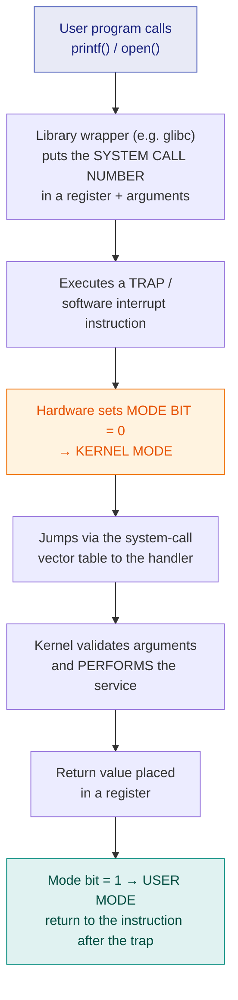

# 10. System Calls, User Mode & Kernel Mode

> ⚠️ **Written from standard course knowledge.** No class material was supplied for Operating Systems.
> **Syllabus:** *System call · User mode (safe mode) · Kernel mode*

---

## 🎯 In one line

A **system call is the only doorway from a user program into the kernel** — the CPU runs user code in the restricted **user mode** and flips a hardware **mode bit** to enter the privileged **kernel mode** to service the request.

---

## 1. Dual-mode operation ⭐⭐⭐

If any program could execute any instruction, one buggy process could halt the CPU, overwrite another process's memory, or read the disk directly. So the hardware provides **two modes of execution**, distinguished by a single **mode bit** in a CPU status register.

| | **User mode** (safe mode) | **Kernel mode** (supervisor / privileged / system mode) |
|---|---|---|
| **Mode bit** | **1** | **0** |
| **Runs** | User applications | The operating system kernel |
| **Instructions allowed** | **Non-privileged only** | **All**, including privileged ones |
| **Memory access** | Only the process's **own** address space | **Entire** memory |
| **Direct I/O / device access** | ❌ Forbidden | ✅ Allowed |
| **If it crashes** | Only that process dies | **The whole system crashes** |
| **Also called** | **Safe mode**, restricted mode, slave mode | Privileged mode, supervisor mode, master mode |

> ⭐ **Why "safe mode"?** Because a program running there **cannot damage anything outside itself** — the hardware simply refuses its dangerous instructions. It is safe *for the system*, not comfortable for the program.

### Privileged instructions ⭐⭐

Instructions that are **only legal in kernel mode**:

| Privileged instruction | Why it must be protected |
|---|---|
| **I/O instructions** (read/write a device register) | Otherwise a process could read another user's disk file |
| **Set the timer** | Otherwise a process could disable preemption and hog the CPU forever |
| **Enable / disable interrupts** | Same — it could make itself un-preemptable |
| **Modify memory-management registers** (base/limit, page tables) | Otherwise it could access another process's memory |
| **Switch the mode bit to kernel mode** | Otherwise the whole protection scheme is pointless |
| **HALT** | Otherwise any process could stop the machine |

> ⚠️ **If a user-mode program attempts a privileged instruction**, the hardware raises an **illegal-instruction trap**, control goes to the OS, and the offending process is normally **terminated**.

---

## 2. What a system call is ⭐⭐⭐

> **A system call is the programmatic interface through which a user process requests a service from the operating system kernel.**

A user process **cannot** open a file, create a process, or send a packet by itself — those need privileged instructions. Instead it **asks the kernel**, and a system call is the request.

> ⭐ **One-line definition for the exam:** *"A system call is the mechanism by which a user program requests a service from the OS kernel, causing a controlled transition from user mode to kernel mode."*

### How the mode switch happens — the mechanism ⭐⭐⭐

**The steps in words (write these for a long answer):**

| Step | What happens |
|---|---|
| 1 | The program calls a library function (`open()`, `fork()`, `read()`). |
| 2 | The wrapper places the **system call number** in a register and the **parameters** in registers, on the stack, or in a block in memory whose address is passed. |
| 3 | It executes a **trap** (software interrupt) instruction — the only legal way for user code to enter the kernel. |
| 4 | The hardware **switches the mode bit to kernel mode** and saves the process context. |
| 5 | Control jumps into the **system-call dispatch table** at a fixed kernel address — the process **cannot choose** where in the kernel it lands. ⭐ |
| 6 | The kernel **validates the arguments** (a user pointer must not point into kernel memory) and performs the service. |
| 7 | The result is returned, the mode bit flips back to **user mode**, and execution resumes after the trap. |

> ⭐ **The crucial security point:** the user program does **not** jump to an arbitrary kernel address. It names a **number**, and the kernel decides which routine that number maps to. That controlled entry point is what makes the dual-mode scheme safe.

### Three ways to pass parameters ⭐

| Method | Detail |
|---|---|
| **Registers** | Fastest, but limited by the number of registers |
| **Block/table in memory** | The **address of the block** is passed in a register — no limit on the number of parameters |
| **Stack** | The program pushes parameters; the kernel pops them |

---

## 3. Types of system calls ⭐⭐⭐

| Category | What it does | UNIX/Linux | Windows |
|---|---|---|---|
| **Process control** | create, terminate, wait, allocate memory | `fork()`, `exec()`, `wait()`, `exit()` | `CreateProcess()`, `ExitProcess()` |
| **File management** | create, delete, open, close, read, write | `open()`, `read()`, `write()`, `close()` | `CreateFile()`, `ReadFile()` |
| **Device management** | request, release, read/write a device | `ioctl()`, `read()`, `write()` | `SetConsoleMode()` |
| **Information maintenance** | get/set time, date, system data, process attributes | `getpid()`, `alarm()`, `sleep()` | `GetCurrentProcessID()` |
| **Communication** | create connections, send/receive messages, shared memory | `pipe()`, `shmget()`, `mmap()` | `CreatePipe()`, `MapViewOfFile()` |
| *(sometimes listed)* **Protection** | set file permissions, allow/deny access | `chmod()`, `umask()` | `SetFileSecurity()` |

> ⭐ **Memorise the five main categories** — "process control, file management, device management, information maintenance, communication" — it is a guaranteed question.

---

## 4. System call vs function call vs interrupt ⭐⭐

| | **Function (procedure) call** | **System call** |
|---|---|---|
| **Runs in** | User mode throughout | **Switches to kernel mode** |
| **Code executed** | In the same program/library | **In the kernel** |
| **Cost** | A few nanoseconds | **Much more** — mode switch, validation, possible context switch |
| **Mechanism** | `call` instruction | **Trap / software interrupt** |

| | **Interrupt** | **Trap (exception)** |
|---|---|---|
| **Caused by** | **Hardware**, asynchronously (device, timer) | **Software**, synchronously (a system call, or an error such as divide-by-zero) |
| **Timing** | Unpredictable | Occurs at a **specific instruction** |
| **Example** | Disk I/O completion, keyboard press | `int 0x80` / `syscall`, page fault, illegal instruction |

> ⭐ **A system call is a *software* interrupt (a trap), deliberately raised by the process itself.** That sentence answers the classic "differentiate trap and interrupt" question.

---

## 5. Why the dual mode exists — the exam answer ⭐⭐

Without protected dual-mode operation:

1. A process could execute **I/O instructions directly** and read or corrupt another user's files.
2. A process could **disable the timer interrupt** and never give up the CPU — no preemption, no multitasking.
3. A process could **write into the kernel's memory** and take over the machine.
4. A single buggy program could **halt the CPU**.

> ⭐ **Therefore dual-mode operation is the hardware foundation of ALL operating-system protection** — memory protection, CPU protection (via the timer) and I/O protection all depend on it.

### The timer — CPU protection ⭐

The OS sets a **timer** (a privileged instruction) before handing the CPU to a user process. When it expires, an interrupt returns control to the kernel. **Without this, a process with an infinite loop would own the machine forever.** This is the hardware that makes preemptive scheduling — and hence Round Robin — possible.

---

## 6. Common exam questions

1. **What is a system call? Explain how a system call is executed (the mode switch).** ⭐⭐⭐
2. **Differentiate user mode and kernel mode.** ⭐⭐⭐
3. **List and explain the types of system calls with examples.** ⭐⭐⭐
4. **What are privileged instructions? Give four examples.** ⭐⭐⭐
5. **Differentiate a system call and a function call.** ⭐⭐
6. **Differentiate trap and interrupt.** ⭐⭐
7. **Why is dual-mode operation necessary? What is the role of the timer?** ⭐⭐
8. **How are parameters passed to the OS in a system call?** ⭐

---

## ⚡ Quick revision

- **Dual mode:** mode bit **1 = user mode (safe mode)**, **0 = kernel mode**.
- **User mode:** non-privileged instructions, own memory only, no direct I/O. **Kernel mode:** everything.
- **Privileged instructions:** I/O, set timer, enable/disable interrupts, modify memory-management registers, switch mode, HALT. Attempting one in user mode ⇒ **trap** ⇒ process killed.
- **System call = the interface for a user program to request a kernel service**, causing a **controlled** user→kernel transition.
- **Mechanism:** call number in register → **trap** → mode bit = 0 → dispatch table → kernel validates and serves → return → mode bit = 1.
- ⭐ The process names a **number**, not an address — that is what keeps it safe.
- **Parameters:** registers · block in memory (address passed) · stack.
- **Five categories:** process control, file management, device management, information maintenance, communication.
- **A system call is a trap = a software interrupt**, synchronous; a hardware interrupt is asynchronous.
- Dual mode + the **timer** are the hardware basis of all OS protection and of preemptive scheduling.

---

**Previous:** [← 9. Round Robin Scheduling](09-round-robin.md) · **Next:** [11. PCB & Context Switching →](11-pcb-and-context-switching.md)
