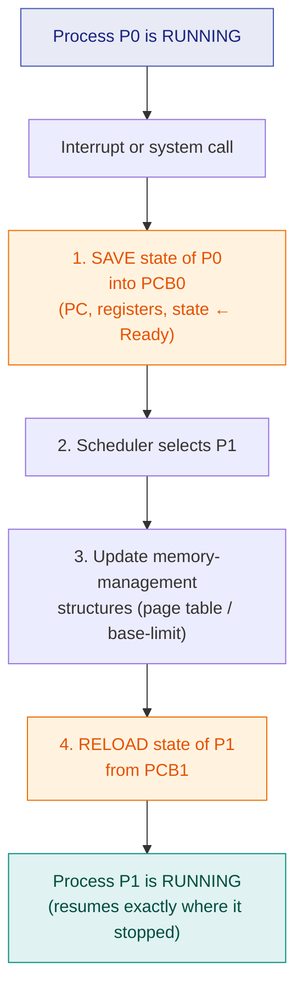

# 11. Process Control Block & Context Switching

> ⚠️ **Written from standard course knowledge.** No class material was supplied for Operating Systems.
> **Syllabus:** *Process Control Block · Context switching*

---

## 🎯 In one line

The **PCB is the process's identity card** stored in the kernel — everything the OS needs to pause a process and restart it exactly where it left off — and a **context switch** is the act of saving one PCB and loading another.

---

## 1. The Process Control Block ⭐⭐⭐

> **A PCB (also called a Task Control Block) is the data structure the OS maintains for every process, holding all the information needed to manage and resume it.**

One PCB is created when the process is created, lives in **kernel memory**, and is destroyed when the process terminates. The kernel keeps them in a **process table**.

### The fields ⭐⭐⭐

```
            ┌───────────────────────────────────┐
            │  PROCESS ID (PID)                 │  identity
            ├───────────────────────────────────┤
            │  PROCESS STATE                    │  new/ready/running/waiting/terminated
            ├───────────────────────────────────┤
            │  PROGRAM COUNTER                  │  ⭐ address of the NEXT instruction
            ├───────────────────────────────────┤
            │  CPU REGISTERS                    │  ⭐ accumulators, index, stack pointer,
            │                                   │     general-purpose, condition codes
            ├───────────────────────────────────┤
            │  CPU SCHEDULING INFORMATION       │  priority, queue pointers, algorithm params
            ├───────────────────────────────────┤
            │  MEMORY-MANAGEMENT INFORMATION    │  base & limit registers, page/segment tables
            ├───────────────────────────────────┤
            │  ACCOUNTING INFORMATION           │  CPU used, time limits, job/process numbers
            ├───────────────────────────────────┤
            │  I/O STATUS INFORMATION           │  open files, allocated devices, pending I/O
            ├───────────────────────────────────┤
            │  PARENT PID / pointers to children│  the process tree
            └───────────────────────────────────┘
```

| Field | What it stores | Why it is needed |
|---|---|---|
| **Process ID (PID)** | A unique integer | To name the process in every system call |
| **Process state** | New / Ready / Running / Waiting / Terminated | The scheduler must know who is runnable |
| **Program counter** ⭐ | Address of the **next instruction** | Without it the process cannot be resumed |
| **CPU registers** ⭐ | All general-purpose registers, stack pointer, condition codes | The computation's live values |
| **Scheduling information** | Priority, pointers to scheduling queues | Input to the scheduler |
| **Memory-management information** | Base/limit registers, page table or segment table | To restore the right address space |
| **Accounting information** | CPU time used, real time elapsed, time limits, account numbers | Billing, quotas, statistics |
| **I/O status information** | List of open files, allocated I/O devices, pending requests | So resources can be reclaimed on exit |
| **Parent/child pointers** | PPID and list of children | Maintains the process tree |

> ⭐ **The two fields that *must* be in any answer are the PROGRAM COUNTER and the CPU REGISTERS** — they are precisely the "context" that makes resumption possible. Everything else is bookkeeping.

### PCB and the process state diagram

The PCB is what actually moves between queues: **the "process" in the ready queue is really a pointer to its PCB.** The ready queue is a linked list of PCBs joined by the queue pointers stored inside them.

---

## 2. Context Switching ⭐⭐⭐

> **A context switch is the operation of saving the state (context) of the currently running process into its PCB and restoring the state of another process from its PCB, so the CPU can switch from one process to another.**

### When does it happen?

| Trigger | Example |
|---|---|
| **Time quantum expires** | Round Robin timer interrupt |
| **Higher-priority process arrives** | Preemptive priority / SRTF |
| **The running process blocks** | Issues an I/O request |
| **An interrupt occurs** | Device signals completion |
| **The process terminates** | Voluntary exit |

### The steps ⭐⭐⭐



**The classic timeline diagram** (draw this if the question says "with a diagram"):

```
  Process P0            Operating System             Process P1
 ┌──────────┐
 │ executing│
 └────┬─────┘  interrupt or system call
      │ ──────────────►┌───────────────────┐
   (idle)              │ save state → PCB0 │
      │                │        ⋮          │
      │                │ reload from PCB1  │
      │                └─────────┬─────────┘         ┌──────────┐
      │                          └────────────────►  │ executing│
      │                                              └────┬─────┘
      │                 ┌───────────────────┐   interrupt │
      │      ◄──────────│ save state → PCB1 │ ◄───────────┘
 ┌────┴─────┐           │        ⋮          │           (idle)
 │ executing│  ◄────────│ reload from PCB0  │
 └──────────┘           └───────────────────┘
```

> ⚠️ **The most quoted fact:** during a context switch the system does **no useful work** — **it is pure overhead**. Both processes are idle while the kernel shuffles state. Typical cost: **1–1000 microseconds**, depending on hardware support (some CPUs can save all registers in one instruction).

### What makes a context switch expensive?

| Cost | Reason |
|---|---|
| Saving/restoring registers | Proportional to the number of registers |
| Switching the address space | Reloading page-table pointers |
| **Cache and TLB flush** ⭐ | The new process's data is not in the cache — this **indirect cost is often larger than the direct one** |
| Pipeline flush | The CPU's instruction pipeline must be emptied |

---

## 3. Context switch vs mode switch ⭐⭐⭐

A favourite exam distinction — they are **not** the same thing.

| | **Mode switch** | **Context switch** |
|---|---|---|
| **What changes** | The **privilege level** (user ↔ kernel) | The **running process** |
| **Process changes?** | ❌ **No** — the same process continues | ✅ **Yes** |
| **Caused by** | System call, trap, interrupt | Scheduler decision, quantum expiry, block |
| **Cost** | Cheap | **Expensive** |
| **PCB saved?** | Only a minimal state on the kernel stack | **Full PCB save and restore** |

> ⭐ **Every context switch involves a mode switch, but not every mode switch causes a context switch.** A `getpid()` system call is a mode switch there and back with **no** context switch at all.

---

## 4. Reducing context-switch overhead

| Technique | How it helps |
|---|---|
| **Threads** ⭐ | Switching between threads of the **same process** skips the address-space switch — much cheaper ([ch. 13](13-threads-and-multithreading.md)) |
| Hardware support | Multiple register sets — switch by changing a pointer instead of copying |
| Larger time quantum | Fewer switches in RR (but worse response time) |
| Better scheduling | Avoid needless preemption (e.g. the SRTF "don't preempt on a tie" rule) |

---

## 5. Common exam questions

1. **What is a PCB? List and explain its fields.** ⭐⭐⭐
2. **What is context switching? Explain with a diagram.** ⭐⭐⭐
3. **Why is context switching called pure overhead?** ⭐⭐⭐
4. **Differentiate context switch and mode switch.** ⭐⭐⭐
5. **Which PCB fields are essential to resume a process?** → **program counter and CPU registers**. ⭐⭐
6. **When does a context switch occur?** ⭐⭐
7. **Why is a thread switch cheaper than a process switch?** ⭐⭐

---

## ⚡ Quick revision

- **PCB = the OS's record of a process**, one per process, kept in kernel memory in the process table.
- **Fields:** PID · state · **program counter** · **CPU registers** · scheduling info (priority, queue pointers) · memory-management info (base/limit, page tables) · accounting info · I/O status (open files, devices) · parent/child pointers.
- ⭐ **PC + registers = the context.** Those two are what make resumption possible.
- Queues are really **linked lists of PCBs**.
- **Context switch = save the running process's state into its PCB, load another's from its PCB.**
- **Steps:** save state → scheduler picks the next → update memory-management structures → reload state → resume.
- ⚠️ **Pure overhead — no useful work is done.** Typical cost 1 μs to 1 ms, plus a **cache/TLB flush** that often costs more than the switch itself.
- **Mode switch ≠ context switch.** Mode switch changes privilege (same process); context switch changes process. Every context switch includes a mode switch; the reverse is false.
- **Thread switches are cheaper** because the address space does not change.

---

**Previous:** [← 10. System Calls, User & Kernel Mode](10-system-calls-user-kernel-mode.md) · **Next:** [12. Process Creation — fork() & exec() →](12-process-creation-fork-exec.md)
