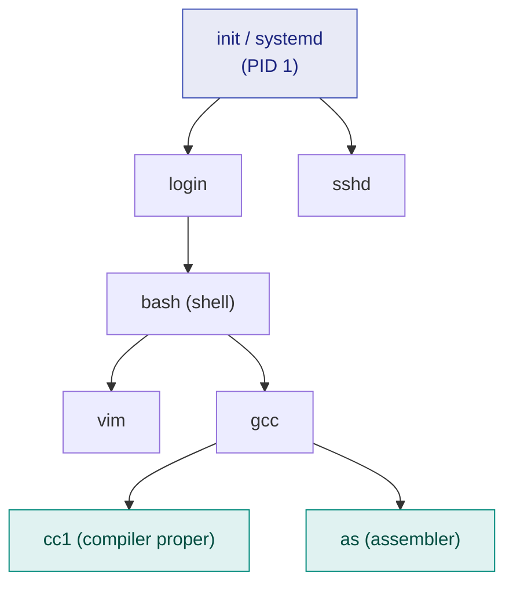

# 12. Process Creation — fork() and exec()

> ⚠️ **Written from standard course knowledge.** No class material was supplied for Operating Systems.
> **Syllabus:** *Process creation · Parent and child process · Resource sharing alternatives · Execution alternatives · fork() · exec()*

---

## 🎯 In one line

A process creates another with **`fork()`**, which produces an **exact duplicate** that differs only in the **return value** — `0` in the child, the child's PID in the parent — and **`exec()`** then **overwrites** the child's memory image with a different program.

---

## 1. The process tree

A process (the **parent**) can create new processes (its **children**), which can create their own children — forming a **tree**.



Each process has a **PID** and a **PPID** (parent's PID). In UNIX the root of the tree is **`init`/`systemd`, PID 1**, created at boot.

---

## 2. Resource-sharing alternatives ⭐⭐⭐

When a parent creates a child, **which of the parent's resources does the child get?** There are three possibilities:

| # | Alternative | Meaning |
|---|---|---|
| **1** | **Parent and child share ALL resources** | The child gets everything the parent has — files, memory, devices |
| **2** | **The child shares a SUBSET of the parent's resources** | E.g. it inherits open files but gets its own memory |
| **3** | **Parent and child share NO resources** | The child gets a completely fresh set from the OS |

> ⭐ **UNIX `fork()` implements alternative 2** — the child gets a **copy** of the parent's address space (so memory is *duplicated*, not shared) but **inherits the parent's open file descriptors** (so files *are* shared).

> ⚠️ **Why restrict sharing at all?** To prevent a child from overloading the system — if both parent and child could freely create and use resources, one runaway process tree could exhaust the machine.

---

## 3. Execution alternatives ⭐⭐⭐

**After creation, who runs?** Two possibilities:

| # | Alternative | Meaning | System call |
|---|---|---|---|
| **1** | **Parent and child execute CONCURRENTLY** | Both are runnable; the scheduler interleaves them | Parent simply continues |
| **2** | **The parent WAITS until the child terminates** | The parent blocks; only the child runs | Parent calls **`wait()`** |

**And what does the child *run*?** Also two possibilities:

| # | Alternative | Meaning |
|---|---|---|
| **a** | The child is a **duplicate** of the parent — same program, same data | plain `fork()` |
| **b** | The child **loads a new program** into its address space | `fork()` followed by **`exec()`** |

> ⭐ **The shell does exactly (2) + (b):** it forks, the child `exec()`s the command you typed, and the shell `wait()`s until it finishes — which is why you get your prompt back only after the command completes. Run it with `&` and the shell skips the `wait()`, choosing alternative (1). **This is the standard exam illustration.**

---

## 4. `fork()` ⭐⭐⭐

> **`fork()` creates a new process by making an exact duplicate of the calling process.**

### What the child inherits vs what is new

| **Copied / inherited** | **Different in the child** |
|---|---|
| Program code (text) | **PID** — a brand-new one |
| Data, heap and stack (a **copy**, not shared) ⭐ | **PPID** = the parent's PID |
| Program counter — it resumes at the same point | **Return value of `fork()`** ⭐ |
| Open file descriptors (**shared**, same file offset) | Resource utilisation counters, reset to 0 |
| Environment variables, working directory | Pending signals, cleared |

### ⭐⭐⭐ The return value — the single most important fact

```c
pid_t pid = fork();
```

| `fork()` returns | In which process | Meaning |
|---|---|---|
| **0** | The **child** | "You are the child" |
| **> 0** (the child's PID) | The **parent** | "You are the parent; here is your child's PID" |
| **−1** | The parent (no child was created) | **Failure** — out of memory or the process limit was reached |

> ⚠️ **Both processes continue from the instruction *after* `fork()`.** The child does not start at `main()`. This is the concept students most often get wrong.

### The standard skeleton

```c
#include <stdio.h>
#include <unistd.h>
#include <sys/wait.h>

int main(void) {
    pid_t pid = fork();

    if (pid < 0) {                       /* 1. failure */
        fprintf(stderr, "fork failed\n");
        return 1;
    } else if (pid == 0) {               /* 2. CHILD */
        printf("Child : my PID = %d, my parent = %d\n", getpid(), getppid());
    } else {                             /* 3. PARENT */
        wait(NULL);                      /* block until the child finishes */
        printf("Parent: my PID = %d, my child = %d\n", getpid(), pid);
    }
    return 0;
}
```

> 💡 **Copy-on-write (COW):** real UNIX does not physically copy the parent's memory at `fork()`. Parent and child **share** the pages, marked read-only; a page is copied **only when one of them writes to it**. This makes `fork()` cheap — important because most children immediately `exec()` and throw the copy away.

---

## 5. Counting processes — the classic numerical ⭐⭐⭐

> $$\boxed{n \text{ calls to fork() } \Rightarrow 2^n \text{ total processes, of which } 2^n - 1 \text{ are children (newly created)}}$$

Each `fork()` **doubles** the number of processes, because every existing process executes it.

### Worked example

```c
int main(void) {
    fork();
    fork();
    fork();
    printf("Hello\n");
    return 0;
}
```

| After | Number of processes |
|---|---|
| Start | 1 |
| 1st `fork()` | $1 \times 2 = 2$ |
| 2nd `fork()` | $2 \times 2 = 4$ |
| 3rd `fork()` | $4 \times 2 = \mathbf{8}$ |

**Answer:** $2^3 = \mathbf{8}$ processes exist, **7 of them children**, and `Hello` is printed **8 times**.

### The fork tree

```
                        P  (original)
             ┌──────────┴──────────┐
        fork #1                    │
             │                     │
             P ──────── C1         │      after fork #1:  P, C1        (2)
             │           │
        fork #2          │
        ┌────┴───┐   ┌───┴────┐
        P       C2   C1      C3          after fork #2:  P,C1,C2,C3    (4)
        │        │    │       │
        fork #3 (each of the 4 forks once)
     ┌──┴──┐  ┌──┴──┐ ┌─┴──┐ ┌─┴──┐
     P    C4  C2   C5 C1  C6 C3  C7      after fork #3: 8 processes    (8)
```

### Variations you should be able to handle ⭐⭐

| Code | Processes | Why |
|---|---|---|
| `fork(); fork();` | $2^2 = 4$ | Straightforward doubling |
| `for(i=0;i<3;i++) fork();` | $2^3 = 8$ | Three calls, each doubling |
| `fork(); printf("A");` | 2 processes, **"A" twice** | Both continue past `fork()` |
| `if (fork() == 0) fork();` | **3** | Only the child (return 0) forks again: P, C1, and C1's child |
| `if (fork() > 0) fork();` | **3** | Only the parent forks again |
| `fork(); exec(...);` | 2 processes, but the child now runs a **different program** | `exec()` replaces the image |

> ⚠️ **Buffered-output trap:** if `printf` output is buffered (not flushed) *before* the `fork()`, the buffer is duplicated too, and lines can appear **twice**. Use `fflush(stdout)` before forking. Worth one line in an answer.

---

## 6. `exec()` ⭐⭐⭐

> **The `exec()` family REPLACES the calling process's memory image with a new program.**

```c
execlp("/bin/ls", "ls", "-l", NULL);
printf("This line NEVER runs if exec succeeded\n");
```

| Key property | Detail |
|---|---|
| **Does NOT create a process** ⭐ | Same PID, same PPID, same process — **new program inside it** |
| **Never returns on success** ⭐ | There is nothing to return to; the old code is gone |
| **Returns −1 on failure only** | e.g. the file does not exist |
| **Replaces** | Text, data, heap and stack — all overwritten |
| **Preserves** | PID, PPID, open file descriptors, working directory, priority |
| **Family members** | `execl`, `execlp`, `execle`, `execv`, `execvp`, `execve` — they differ only in how arguments and the environment are passed (`l` = list, `v` = vector, `p` = search `PATH`, `e` = pass environment) |

### fork() vs exec() ⭐⭐⭐

| | **`fork()`** | **`exec()`** |
|---|---|---|
| **Creates a new process?** | ✅ **Yes** — one more process exists | ❌ **No** — the count is unchanged |
| **PID** | Child gets a **new** PID | **Unchanged** |
| **Program run** | The **same** program | A **new** program |
| **Returns** | **Twice** — 0 to the child, child-PID to the parent | **Never** (on success) |
| **Address space** | **Duplicated** | **Overwritten** |

### The `fork()` + `exec()` idiom ⭐⭐⭐

```c
pid_t pid = fork();
if (pid == 0) {
    execlp("ls", "ls", "-l", NULL);   /* child becomes `ls` */
    perror("exec failed");            /* only reached if exec failed */
    exit(1);
} else {
    wait(NULL);                       /* parent waits for `ls` to finish */
    printf("Child finished\n");
}
```

> ⭐ **This is how every UNIX shell runs every command.** `fork()` to get a spare process, `exec()` to turn it into the requested program, `wait()` to know when it is done. It is the single most-asked "explain with a program" question in this chapter.

---

## 7. Process termination, zombies and orphans ⭐⭐

| Call | Effect |
|---|---|
| **`exit(status)`** | The process terminates; the status is returned to the parent via `wait()` |
| **`wait(&status)`** | The parent **blocks** until a child terminates and collects its exit status |
| **`abort()` / `kill()`** | The parent (or the OS) terminates a child forcibly |

**Why a parent may kill a child:** the child exceeded its resource allocation; its task is no longer needed; or the parent is exiting and the OS does not allow a child to outlive it (**cascading termination**).

| Term | Definition | What happens |
|---|---|---|
| **Zombie process** ⭐ | A process that has **terminated but whose parent has not yet called `wait()`** | Its PCB entry is kept so the exit status can be read. It holds **no memory or CPU, only a process-table slot** |
| **Orphan process** ⭐ | A process whose **parent terminated first** | It is **re-parented to `init`/`systemd` (PID 1)**, which waits for it and cleans it up |

> ⚠️ **Do not swap these two.** Zombie = *child dead, parent alive but negligent*. Orphan = *parent dead, child alive*. A zombie is cleaned up when the parent finally calls `wait()`; an orphan is adopted by `init`.

---

## 8. Common exam questions

1. **Explain `fork()`. What does it return in the parent and in the child?** ⭐⭐⭐
2. **How many processes are created by the given program? How many times is the output printed?** ⭐⭐⭐
3. **Differentiate `fork()` and `exec()`.** ⭐⭐⭐
4. **Write a C program in which a parent creates a child, the child executes a command, and the parent waits.** ⭐⭐⭐
5. **Explain the resource-sharing and execution alternatives in process creation.** ⭐⭐⭐
6. **What is a zombie process? What is an orphan process?** ⭐⭐⭐
7. **What is copy-on-write and why does it matter for `fork()`?** ⭐⭐
8. **Draw a process tree and explain PID/PPID.** ⭐

---

## ⚡ Quick revision

- **Process tree**; root is `init`/`systemd` (**PID 1**). Each process has a **PID** and **PPID**.
- **Resource-sharing alternatives:** share **all** / share a **subset** / share **nothing**. UNIX `fork()` = **subset** (memory copied, file descriptors inherited).
- **Execution alternatives:** parent and child run **concurrently**, or the parent **`wait()`s**. The child may be a **duplicate** or may **`exec()` a new program**.
- **`fork()` returns 0 to the child, the child's PID to the parent, −1 on failure.** Both resume **after** the `fork()` call.
- $\ \boxed{n \text{ forks} \Rightarrow 2^n \text{ processes},\ 2^n - 1 \text{ children}}$ — three forks ⇒ **8 processes, "Hello" 8 times**.
- **`exec()` creates NO process** — same PID, new program; it **never returns** on success.
- **The shell = `fork()` + `exec()` + `wait()`.** Background (`&`) = skip the `wait()`.
- **Copy-on-write** makes `fork()` cheap — pages are copied only when written.
- **Zombie:** terminated child, parent hasn't `wait()`ed — occupies only a process-table entry.
  **Orphan:** parent died first — adopted by **`init` (PID 1)**.

---

**Previous:** [← 11. PCB & Context Switching](11-pcb-and-context-switching.md) · **Next:** [13. Threads & Multithreading →](13-threads-and-multithreading.md)
