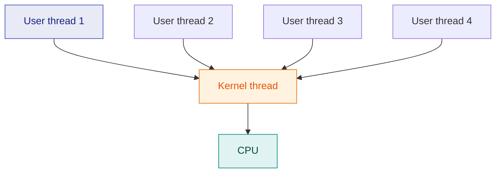
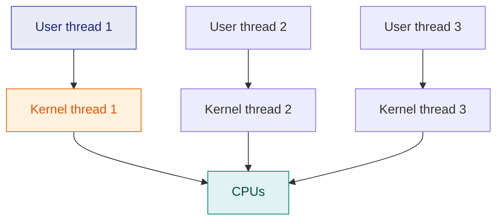
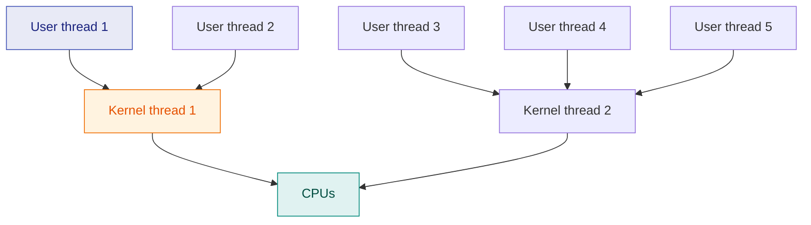

# 13. Threads & Multithreading

> ⚠️ **Written from standard course knowledge.** No class material was supplied for Operating Systems.
> **Syllabus:** *Thread · Multithreading concept · Types of thread (user thread, kernel thread) · Types of relationship between user and kernel threads — many to one, one to one, many to many*

---

## 🎯 In one line

A **thread is a lightweight process** — the smallest unit of CPU scheduling — and threads of one process **share code, data and files** while keeping their **own stack, registers and program counter**.

---

## 1. What a thread is ⭐⭐⭐

> **A thread is a basic unit of CPU utilisation, consisting of a thread ID, a program counter, a register set and a stack.**

A traditional (heavyweight) process has **one** thread of control. A **multithreaded** process has several, all executing inside the same address space.

### What is shared and what is private ⭐⭐⭐

```
        SINGLE-THREADED PROCESS          MULTITHREADED PROCESS
        ┌───────┬───────┬───────┐        ┌───────┬───────┬───────┐
        │ code  │ data  │ files │        │ code  │ data  │ files │  ← SHARED
        ├───────┴───────┴───────┤        ├───────┬───────┬───────┤
        │ registers │   stack   │        │ regs  │ regs  │ regs  │  ← PRIVATE
        ├───────────────────────┤        ├───────┼───────┼───────┤
        │        thread         │        │ stack │ stack │ stack │  ← PRIVATE
        │           │           │        ├───────┼───────┼───────┤
        │           ▼           │        │  T1   │  T2   │  T3   │
        └───────────────────────┘        └───────┴───────┴───────┘
```

| **Shared by all threads of a process** | **Private to each thread** |
|---|---|
| **Code (text) section** | **Thread ID** |
| **Data section** (globals, statics) | **Program counter** |
| **Heap** | **Register set** |
| **Open files and I/O resources** | **Stack** (its own local variables and call frames) |
| Signals, working directory, PID | Thread-specific state and priority |

> ⭐ **The memory hook:** *threads share everything the PROCESS owns and keep only what EXECUTION needs* — a place in the code (PC), the working values (registers) and the call history (stack).

> ⚠️ **Because the data section and heap are shared, threads can corrupt each other's data** — which is exactly why [synchronisation](14-race-condition-and-critical-section.md) is needed.

---

## 2. Process vs Thread ⭐⭐⭐

| | **Process** | **Thread** |
|---|---|---|
| **Weight** | **Heavyweight** | **Lightweight** |
| **Address space** | Its own | **Shared** with sibling threads |
| **Creation cost** | **High** (duplicate the address space) | **Low** (~10–100× cheaper) |
| **Context switch** | **Expensive** (address space + TLB flush) | **Cheap** (no address-space change) ⭐ |
| **Communication** | Needs **IPC** (pipes, shared memory, messages) — kernel involvement | **Direct** — just read/write shared variables ⭐ |
| **Isolation / fault** | One crashing process does **not** kill others | One thread crashing **can kill the whole process** ⭐ |
| **Synchronisation needed?** | Only when sharing explicitly | **Almost always** |
| **Termination** | Independent | Killing the process kills all its threads |

---

## 3. Benefits of multithreading ⭐⭐⭐

| Benefit | Explanation |
|---|---|
| **1. Responsiveness** | A program stays interactive while part of it is busy — a browser can render one tab while another downloads, an editor can reformat while you keep typing |
| **2. Resource sharing** | Threads share memory and files **by default** — no `shmget()`, no pipes, no kernel calls |
| **3. Economy** | Creating and context-switching a thread is far cheaper than a process (no new address space to build) |
| **4. Scalability / multiprocessor utilisation** ⭐ | Threads of one process can run on **different CPUs in parallel** — a single-threaded process can use only one core, no matter how many exist |

> ⭐ **Benefit 4 is the one to stress** for modern multicore machines: *multithreading is the only way a single application can use more than one core.*

### Multithreading models — concurrency vs parallelism

| | Meaning |
|---|---|
| **Concurrency** | Several tasks **make progress** (may be interleaved on one CPU) |
| **Parallelism** | Several tasks **execute at the same instant** (needs ≥ 2 CPUs) |

---

## 4. Types of threads ⭐⭐⭐

| | **User-level threads (ULT)** | **Kernel-level threads (KLT)** |
|---|---|---|
| **Managed by** | A **user-space thread library** (POSIX Pthreads, Java threads, Windows fibres) | **The operating system kernel** directly |
| **Kernel awareness** | The kernel **does not know** they exist — it sees one process ⭐ | The kernel **knows and schedules each one** |
| **Creation / switching** | **Very fast** — no system call, no mode switch | **Slower** — every operation is a system call |
| **Scheduling** | By the library, inside the process | By the OS scheduler |
| **Blocking system call** | ⚠️ **Blocks the ENTIRE process** — all its threads stop | ✅ Only that **one thread** blocks; the others run |
| **Multiprocessor use** | ❌ **Cannot** run threads in parallel on multiple CPUs | ✅ **Can** |
| **Portability** | High — works even on an OS with no thread support | Depends on the OS |
| **Per-thread overhead in the kernel** | None | A kernel data structure per thread |

> ⭐ **The two decisive differences to write down:** (i) a **blocking system call in a ULT blocks the whole process**; (ii) **ULTs cannot exploit multiple processors**. Both flaws are the reason KLTs exist despite being slower.

---

## 5. Multithreading models (ULT ↔ KLT relationships) ⭐⭐⭐

The three ways user threads can be mapped onto kernel threads.

### 5.1 Many-to-One

**Many user threads → one kernel thread.**



| Advantages | Disadvantages |
|---|---|
| Thread management is **entirely in user space ⇒ very efficient** | ⚠️ **One blocking system call blocks ALL threads** |
| Works on any OS, even one with no kernel thread support | ⚠️ **No parallelism** — only one thread runs at a time, even on a multicore CPU |

> 📌 **Examples:** Solaris Green Threads, GNU Portable Threads. **Rarely used today** because of the two flaws above.

### 5.2 One-to-One

**Each user thread → its own kernel thread.**



| Advantages | Disadvantages |
|---|---|
| ✅ **True concurrency** — a blocking call stops only that thread | ⚠️ **Creating a user thread creates a kernel thread** — expensive |
| ✅ **Real parallelism on multiprocessors** | ⚠️ Most systems **limit the number of kernel threads**, so applications must be careful not to create too many |

> 📌 **Examples:** **Linux, Windows (all versions)** — the model used by essentially every modern general-purpose OS.

### 5.3 Many-to-Many

**Many user threads → a smaller or equal number of kernel threads.**



| Advantages | Disadvantages |
|---|---|
| ✅ Create **as many user threads as you like** | ⚠️ **Complex to implement** |
| ✅ Blocking one thread does not stop the others | ⚠️ The library and kernel must cooperate (scheduler activations) |
| ✅ The kernel can schedule the kernel threads on **multiple CPUs** | |

> 📌 **Examples:** Solaris before version 9, Windows with the ThreadFiber package.

**Two-level model:** a variant of many-to-many that *also* lets a particular user thread be **bound** to its own kernel thread when it must never be blocked.

### Comparison table ⭐⭐⭐

| | **Many-to-One** | **One-to-One** | **Many-to-Many** |
|---|---|---|---|
| **Mapping** | many ULT → 1 KLT | 1 ULT → 1 KLT | many ULT → fewer KLT |
| **Blocking call blocks** | **The whole process** | **Only that thread** | Only that thread |
| **True parallelism** | ❌ **No** | ✅ **Yes** | ✅ **Yes** |
| **Cost of creating a thread** | **Very low** | **High** | Low–moderate |
| **Number of threads** | Unlimited | **Limited** by the kernel | Unlimited |
| **Complexity** | Simple | Simple | **Complex** |
| **Example** | Green Threads | **Linux, Windows** | Solaris ≤ 8 |

---

## 6. Common exam questions

1. **What is a thread? What do threads of a process share and what is private to each?** ⭐⭐⭐
2. **Differentiate a process and a thread.** ⭐⭐⭐
3. **List and explain the benefits of multithreading.** ⭐⭐⭐
4. **Differentiate user-level and kernel-level threads.** ⭐⭐⭐
5. **Explain the three multithreading models with diagrams, giving advantages and disadvantages.** ⭐⭐⭐
6. **Why does a blocking system call block all threads in the many-to-one model?** ⭐⭐
7. **Why is a thread called a lightweight process?** ⭐⭐
8. **Differentiate concurrency and parallelism.** ⭐

---

## ⚡ Quick revision

- **Thread = lightweight process**, the unit of CPU scheduling: thread ID + **PC + registers + stack**.
- **Shared:** code, data, heap, **open files**. **Private:** **PC, registers, stack**, thread ID.
- **Process vs thread:** thread creation and switching are far cheaper, communication is direct, **but one bad thread kills the whole process** and synchronisation is essential.
- **Four benefits:** responsiveness · resource sharing · economy · **multiprocessor utilisation**.
- **ULT:** managed by a library, kernel unaware, fast — ⚠️ **a blocking call freezes the whole process** and **no parallelism**.
- **KLT:** managed by the kernel, slower (system calls), but **only the blocking thread stops** and it **can run on multiple CPUs**.
- **Many-to-one:** fast, but no parallelism and blocking freezes everything (Green Threads).
- **One-to-one:** true parallelism, but expensive and the thread count is capped (**Linux, Windows**).
- **Many-to-many:** best of both, but **complex** (Solaris ≤ 8); **two-level** adds bound threads.

---

**Previous:** [← 12. Process Creation — fork() & exec()](12-process-creation-fork-exec.md) · **Next:** [14. Race Condition & Critical Section →](14-race-condition-and-critical-section.md)
