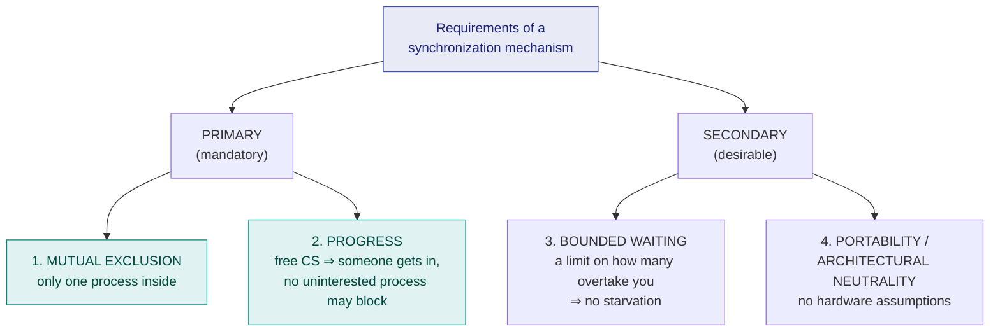

# 14. IPC, Race Conditions & the Critical Section Problem

> ⚠️ **Written from standard course knowledge.** No class material was supplied for Operating Systems.
> **Syllabus:** *Interprocess communication and synchronization · Race condition · Critical section · Process synchronization · Requirements of a synchronization mechanism — primary (mutual exclusion, progress), secondary (bounded waiting, portability/architectural neutrality) · Types — busy waiting, no busy waiting*

---

## 🎯 In one line

When two processes update **shared data at the same time** the result depends on **who runs when** — a **race condition** — and the cure is to let only one process at a time enter the **critical section** where that shared data is touched.

---

## 1. Interprocess Communication (IPC) ⭐⭐

Cooperating processes need to exchange data. There are **two models**:

| | **Shared memory** | **Message passing** |
|---|---|---|
| **How** | A region of memory is mapped into both processes; they read/write it directly | Processes exchange messages via `send()` / `receive()` |
| **Kernel involvement** | **Only at setup**; afterwards it is plain memory access | **Every** message is a system call |
| **Speed** | **Fast** ⭐ | Slower |
| **Synchronisation** | ⚠️ **The programmer's responsibility** | Handled by the kernel |
| **Suits** | Large data on one machine | Small data, **distributed systems** ⭐ |
| **Examples** | `shmget()`, `mmap()` | pipes, sockets, message queues |

> ⭐ **Shared memory is fast *because* the kernel steps aside — and that is exactly why race conditions appear.** This chapter is about fixing the problem that shared memory creates.

### Why processes cooperate

Information sharing · computation speed-up · modularity · convenience.

---

## 2. Race condition ⭐⭐⭐

> **A race condition is a situation in which several processes access and manipulate shared data concurrently, and the final result depends on the particular order in which the accesses happen.**

### The classic demonstration — `count++` and `count--` ⭐⭐⭐

A producer increments a shared counter; a consumer decrements it. In C they look atomic, but the compiler turns them into **three machine instructions each**:

| `count++` (producer) | `count--` (consumer) |
|---|---|
| `S1: reg1 = count` | `S4: reg2 = count` |
| `S2: reg1 = reg1 + 1` | `S5: reg2 = reg2 − 1` |
| `S3: count = reg1` | `S6: count = reg2` |

**Start with `count = 5`.** Correct answer after one `++` and one `--` is **5**.

**An interleaving that goes wrong:**

| Step | Instruction executed | reg1 | reg2 | **count** |
|---|---|---|---|---|
| 1 | `S1: reg1 = count` | **5** | – | 5 |
| 2 | `S2: reg1 = reg1 + 1` | **6** | – | 5 |
| 3 | *(context switch)* `S4: reg2 = count` | 6 | **5** | 5 |
| 4 | `S5: reg2 = reg2 − 1` | 6 | **4** | 5 |
| 5 | `S3: count = reg1` | 6 | 4 | **6** |
| 6 | `S6: count = reg2` | 6 | 4 | **4** ❌ |

**Final value 4 — wrong.** Reorder the last two steps and you get **6** — also wrong. Run the same program a thousand times and it may give 5 every time, then fail once.

> ⭐ **Note why it broke:** the consumer read `count` (step 3) **after** the producer had read it but **before** the producer wrote it back. The producer's update was **lost**.

> ⚠️ **Race-condition bugs are the hardest kind to debug** — they are **non-deterministic** (timing-dependent), often disappear under a debugger, and may surface only under heavy load. That sentence is worth a mark.

---

## 3. The Critical Section ⭐⭐⭐

> **A critical section is the segment of code in which a process accesses shared resources (shared variables, files, tables).**

**The critical section problem:** design a protocol that lets processes cooperate so that **no two processes are ever inside their critical sections at the same time**.

### The four-part structure of every process ⭐⭐⭐

```c
do {
        ┌─────────────────────────────┐
        │      ENTRY SECTION          │   request permission to enter
        └─────────────────────────────┘
        ┌─────────────────────────────┐
        │     CRITICAL SECTION        │   access the shared data
        └─────────────────────────────┘
        ┌─────────────────────────────┐
        │      EXIT SECTION           │   announce departure / release
        └─────────────────────────────┘
        ┌─────────────────────────────┐
        │    REMAINDER SECTION        │   everything else
        └─────────────────────────────┘
} while (true);
```

| Section | Role |
|---|---|
| **Entry section** | The code that **requests permission** to enter the critical section |
| **Critical section** | Where the **shared resource** is accessed — only one process at a time |
| **Exit section** | The code that **releases** the lock so someone else may enter |
| **Remainder section** | The rest of the process's code — no shared data |

> ⭐ **All the mechanisms in [chapter 15](15-synchronization-mechanisms.md) and [chapter 17](17-semaphores-and-mutex.md) are simply different implementations of the entry and exit sections.** Saying that connects the whole unit.

---

## 4. Requirements of a synchronisation mechanism ⭐⭐⭐

A correct solution must satisfy **two primary (mandatory)** requirements and **two secondary (desirable)** ones.

### 4.1 PRIMARY requirements — a solution is WRONG without these ⭐⭐⭐

| # | Requirement | Statement |
|---|---|---|
| **1** | **Mutual Exclusion** | **If one process is executing in its critical section, no other process may be executing in its critical section.** |
| **2** | **Progress** | **If no process is in its critical section and some processes wish to enter, only those NOT in their remainder sections may participate in deciding who enters next, and this decision cannot be postponed indefinitely.** |

**Mutual exclusion in plain words:** *at most one process inside at any instant.* Violating it means the shared data gets corrupted — the mechanism has failed at its only job.

**Progress in plain words:** *if the critical section is free, somebody who wants in must get in, and quickly.* Two ways to violate it:

| Violation | Example |
|---|---|
| A process **not interested** in entering (sitting in its remainder section) is allowed to **block** one that is | The **turn variable** solution — chapter 15 |
| The decision is **deadlocked** — everyone waits, nobody enters | Two processes each waiting for the other |

> ⭐ **Progress = no unnecessary blocking + a decision in finite time.** Remember the phrase *"a process in its remainder section must not stop others from entering."*

### 4.2 SECONDARY requirements — desirable, not strictly mandatory ⭐⭐⭐

| # | Requirement | Statement |
|---|---|---|
| **3** | **Bounded Waiting** | **There must be a bound on the number of times other processes are allowed to enter their critical sections after a process has made a request and before that request is granted.** |
| **4** | **Portability / Architectural Neutrality** | **The solution must not depend on any assumption about the hardware** — number of CPUs, relative speeds, or special instructions. |

**Bounded waiting in plain words:** *you will get your turn after at most N others* — it guarantees **no starvation**. A mechanism can have mutual exclusion and progress and still let one unlucky process wait forever; bounded waiting rules that out.

**Portability / architectural neutrality in plain words:** *a solution that works only on one kind of machine is not a general solution.* Examples of violations:

| Violation | Why |
|---|---|
| **Disabling interrupts** | Works on a **uniprocessor only** — on a multiprocessor the other CPUs keep running |
| **Test-and-Set Lock (TSL)** | Needs a **special atomic hardware instruction** that not every architecture has ([ch. 15](15-synchronization-mechanisms.md)) |
| Assuming a particular **relative speed** of processes | Nothing guarantees it |

> ⭐ **The exam summary sentence:** *"Mutual exclusion and progress are mandatory (primary); bounded waiting and architectural neutrality are desirable (secondary). A solution violating a primary requirement is incorrect; one violating a secondary requirement is merely poor."*



---

## 5. Types of synchronisation mechanisms ⭐⭐⭐

Mechanisms split by **what a waiting process does while it waits**.

| | **Busy waiting (spinning)** | **No busy waiting (blocking / sleeping)** |
|---|---|---|
| **The waiting process** | Sits in a **tight loop repeatedly testing** the condition | Is **blocked** — moved to a waiting queue, state = Waiting |
| **CPU used while waiting** | ⚠️ **Yes — wasted** | ✅ **None** |
| **State during the wait** | **Running** (doing nothing useful) | **Waiting/Blocked** |
| **Cost to start waiting** | None | A **context switch** |
| **Cost to stop waiting** | None | Another **context switch** |
| **Best when** | The expected wait is **shorter than two context switches** | The expected wait is **long** |
| **Also called** | **Spinlock** | Sleep-and-wake, blocking lock |
| **Examples** | Lock variable, TSL, turn variable, Peterson's solution | **Semaphores** (with a waiting queue), mutexes, `sleep()`/`wakeup()` |

> ⚠️ **The special name for the waste:** a process that spins is said to be in a **spinlock**, and the wasted CPU time is the cost of busy waiting.

> ⭐ **Busy waiting is not always bad.** On a **multiprocessor**, if the critical section is only a few instructions long, spinning on one CPU while the holder finishes on another is **cheaper than two context switches**. Real kernels use spinlocks for exactly this. Say this and you have the full answer.

> ⚠️ **Worst case for busy waiting: a uniprocessor with priority scheduling.** A high-priority process spins forever waiting for a lock held by a low-priority process that can never be scheduled to release it — that is **[priority inversion](15-synchronization-mechanisms.md)**, in its deadlock form.

---

## 6. Common exam questions

1. **What is a race condition? Explain with the `count++`/`count--` example.** ⭐⭐⭐
2. **What is a critical section? Draw the general structure of a process with entry, critical, exit and remainder sections.** ⭐⭐⭐
3. **State the requirements a solution to the critical-section problem must satisfy.** ⭐⭐⭐
4. **Differentiate primary and secondary requirements.** ⭐⭐⭐
5. **What is busy waiting? What is a spinlock? When is busy waiting acceptable?** ⭐⭐⭐
6. **Differentiate shared memory and message passing IPC.** ⭐⭐
7. **Why are race conditions difficult to detect and debug?** ⭐⭐
8. **Give an example of a solution that violates progress / bounded waiting.** ⭐⭐

---

## ⚡ Quick revision

- **IPC:** shared memory (fast, kernel only at setup, **you must synchronise**) vs message passing (kernel-managed, good for distributed systems).
- **Race condition:** the result depends on the **order of execution** of concurrent accesses to shared data.
- `count++` = 3 instructions (**load, increment, store**); an interleaving with `count--` turns 5 into **4 or 6** — a **lost update**.
- **Critical section** = the code that touches shared data. Structure: **entry → critical → exit → remainder**.
- **PRIMARY (mandatory):** **1. Mutual exclusion** — one at a time. **2. Progress** — a free CS must be entered, and a process in its **remainder section must not block others**.
- **SECONDARY (desirable):** **3. Bounded waiting** — a limit on how many overtake you ⇒ **no starvation**. **4. Portability / architectural neutrality** — no hardware assumptions (disabling interrupts and TSL both fail this).
- **Busy waiting** = spin in a loop, **wastes CPU**, no context switch — a **spinlock**. **No busy waiting** = block and sleep, costs two context switches but wastes no CPU.
- Spin when the wait is **shorter than two context switches** (typical on multiprocessors); block otherwise.

---

**Previous:** [← 13. Threads & Multithreading](13-threads-and-multithreading.md) · **Next:** [15. Synchronization Mechanisms →](15-synchronization-mechanisms.md)
