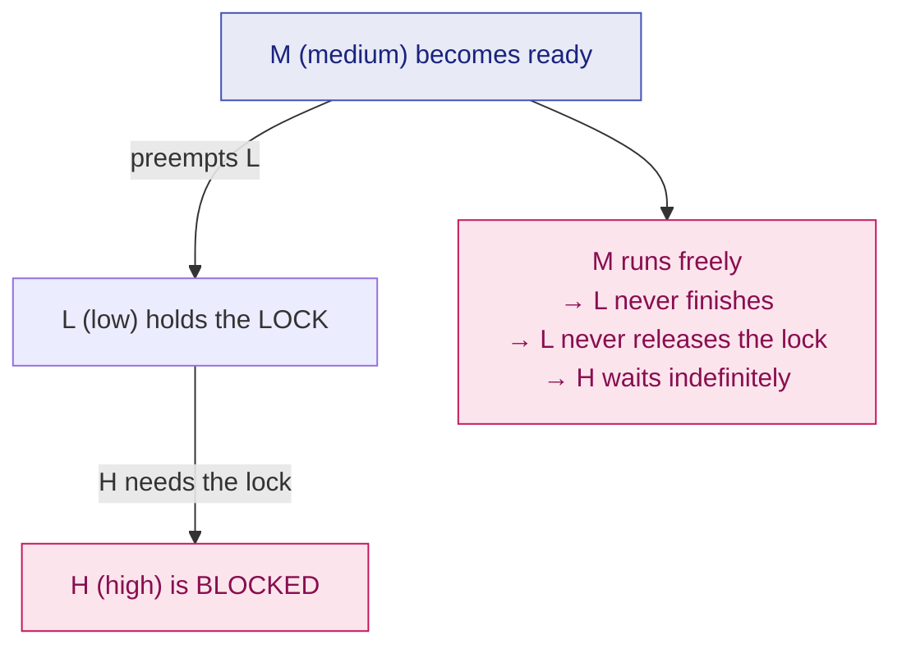

# 15. Synchronization Mechanisms

> ⚠️ **Written from standard course knowledge.** No class material was supplied for Operating Systems.
> **Syllabus:** *Mechanisms — lock variable, test and set lock, turn variable, interested variable · Priority inversion · Sleep and wake*

---

## 🎯 In one line

Four software/hardware attempts at the entry section — **lock variable** (fails mutual exclusion), **TSL** (works, but not portable and unbounded), **turn variable** (fails progress), **interested variable** (deadlocks) — and **Peterson's solution**, which combines the last two and satisfies all four requirements.

---

## 0. How to judge every mechanism ⭐⭐⭐

Check each one against the four requirements from [chapter 14](14-race-condition-and-critical-section.md):

| | Requirement | Type |
|---|---|---|
| 1 | **Mutual exclusion** | Primary |
| 2 | **Progress** | Primary |
| 3 | **Bounded waiting** | Secondary |
| 4 | **Portability / architectural neutrality** | Secondary |

> ⭐ **Answer format that earns full marks:** give the code, explain how it *tries* to work, then give the **exact interleaving** that breaks it, then the verdict table.

---

## 1. Lock Variable ⭐⭐⭐

**Idea:** one shared variable `lock`; `0` means free, `1` means occupied.

```c
/* shared */ int lock = 0;

do {
    while (lock != 0);      /* ENTRY: spin while it is taken   */
    lock = 1;               /*        claim it                 */

        /* CRITICAL SECTION */

    lock = 0;               /* EXIT:  release it               */

        /* REMAINDER SECTION */
} while (true);
```

### ⚠️ Why it FAILS — the breaking interleaving ⭐⭐⭐

The entry section is **two separate operations** (test, then set), and a context switch can land between them.

| Step | Process | Instruction | `lock` | Comment |
|---|---|---|---|---|
| 1 | **P1** | `while (lock != 0)` → **lock is 0, so it exits the loop** | 0 | P1 is about to claim it… |
| 2 | — | ⚡ **context switch** | 0 | …but is preempted first |
| 3 | **P2** | `while (lock != 0)` → **lock is still 0, exits the loop** | 0 | P2 also thinks it is free |
| 4 | **P2** | `lock = 1` | 1 | |
| 5 | **P2** | **enters its critical section** | 1 | |
| 6 | — | ⚡ context switch | 1 | |
| 7 | **P1** | `lock = 1` *(it had already passed the test)* | 1 | |
| 8 | **P1** | **enters its critical section** | 1 | ❌ **BOTH are inside** |

> ⭐ **The root cause in one sentence:** *"test" and "set" are not atomic — the lock variable solution fails because a process can be preempted between checking the lock and acquiring it.* This is the whole point of the section, and it is what the **TSL instruction** was invented to fix.

| Requirement | Verdict |
|---|---|
| **Mutual exclusion** | ❌ **FAILS** |
| **Progress** | ✅ Satisfied |
| **Bounded waiting** | ❌ Fails (no ordering — a process can be overtaken indefinitely) |
| **Portability** | ✅ Pure software, works anywhere |
| **Type** | **Busy waiting** |

---

## 2. Test-and-Set Lock (TSL) ⭐⭐⭐

**Idea:** fix the previous failure with a **hardware instruction that tests and sets in one atomic step** — it cannot be interrupted.

```c
/* The hardware instruction, shown as C. Executed ATOMICALLY. */
boolean TestAndSet(boolean *target) {
    boolean rv = *target;      /* read the old value  */
    *target = true;            /* set it to true      */
    return rv;                 /* return the OLD value */
}
```

```c
/* shared */ boolean lock = false;

do {
    while (TestAndSet(&lock));   /* ENTRY: spin until it returns false */

        /* CRITICAL SECTION */

    lock = false;                /* EXIT */

        /* REMAINDER SECTION */
} while (true);
```

**Why it works:** whoever executes `TestAndSet` first gets back `false` (the lock was free) and enters. Everyone after that gets back `true` and keeps spinning. **The read and the write happen as one indivisible operation, so there is no window to be preempted in.**

| Requirement | Verdict |
|---|---|
| **Mutual exclusion** | ✅ **Satisfied** — guaranteed by atomicity |
| **Progress** | ✅ Satisfied |
| **Bounded waiting** | ❌ **FAILS** — there is no queue; an unlucky process can lose the race forever ⇒ **starvation** |
| **Portability** | ❌ **FAILS** — needs a special hardware instruction (`TSL`, `XCHG`, `CMPXCHG`); not architecture-neutral |
| **Type** | **Busy waiting (spinlock)** |

> ⭐ **Bounded waiting can be added** by making waiting processes take turns via a `waiting[]` array — Silberschatz gives this "bounded-waiting TSL" variant. Mentioning it earns the extra mark.

> 📌 **Related atomic instruction:** **`Swap` / `Compare-and-Swap`** — the same idea, exchanging two values atomically.

---

## 3. Turn Variable (Strict Alternation) ⭐⭐⭐

**Idea:** one shared integer `turn` says whose turn it is. For **two processes only**.

```c
/* shared */ int turn = 0;

/* Process P0 */                     /* Process P1 */
do {                                 do {
    while (turn != 0);                   while (turn != 1);

        /* CRITICAL SECTION */               /* CRITICAL SECTION */

    turn = 1;                            turn = 0;

        /* REMAINDER SECTION */              /* REMAINDER SECTION */
} while (true);                      } while (true);
```

**Mutual exclusion holds** — `turn` has one value, so only one process can pass its test.

### ⚠️ Why it FAILS — progress ⭐⭐⭐

The processes are forced to alternate **strictly**: P0, P1, P0, P1, …

| Step | Situation | Problem |
|---|---|---|
| 1 | P0 enters its CS, exits, sets `turn = 1` | Fine |
| 2 | P0 finishes its remainder quickly and wants the CS **again** | |
| 3 | But `turn == 1`, so P0 must wait | |
| 4 | Meanwhile **P1 is in its REMAINDER section** — it does not want the CS at all, and may be doing a long computation, or may have terminated | ❌ |
| 5 | **P0 is blocked by a process that has no interest in entering** | **PROGRESS VIOLATED** |

> ⭐ **The exact phrase to write:** *"A process in its remainder section is preventing another process from entering its critical section, so the progress requirement is violated."* That is the definition of a progress violation, and the turn variable is its textbook example.

| Requirement | Verdict |
|---|---|
| **Mutual exclusion** | ✅ Satisfied |
| **Progress** | ❌ **FAILS** — strict alternation |
| **Bounded waiting** | ✅ Satisfied (you wait for at most **one** turn) |
| **Portability** | ✅ Pure software |
| **Type** | **Busy waiting** |

---

## 4. Interested Variable (Flag Array) ⭐⭐⭐

**Idea:** fix strict alternation by letting each process **declare its interest**, and only wait if the *other* one is interested.

```c
/* shared */ boolean flag[2] = {false, false};

/* Process Pi (the other is Pj) */
do {
    flag[i] = true;              /* "I want to enter"            */
    while (flag[j]);             /* wait while the other wants in */

        /* CRITICAL SECTION */

    flag[i] = false;             /* "I'm done"                   */

        /* REMAINDER SECTION */
} while (true);
```

This fixes the turn-variable flaw: if P1 is in its remainder section, `flag[1]` is `false`, so P0 walks straight in. ✅

### ⚠️ Why it FAILS — deadlock ⭐⭐⭐

| Step | Process | Instruction | `flag[0]` | `flag[1]` | Comment |
|---|---|---|---|---|---|
| 1 | **P0** | `flag[0] = true` | **true** | false | P0 declares interest |
| 2 | — | ⚡ **context switch** | true | false | |
| 3 | **P1** | `flag[1] = true` | true | **true** | P1 declares interest |
| 4 | **P1** | `while (flag[0])` → true → **waits** | true | true | |
| 5 | **P0** | `while (flag[1])` → true → **waits** | true | true | ❌ |
| | | **Both wait forever — DEADLOCK** | | | |

Each is waiting for the other to lower a flag that **neither will ever lower**, because lowering happens only *after* the critical section.

| Requirement | Verdict |
|---|---|
| **Mutual exclusion** | ✅ Satisfied |
| **Progress** | ❌ **FAILS** — deadlock, so the decision is postponed indefinitely |
| **Bounded waiting** | ❌ Fails |
| **Portability** | ✅ Pure software |
| **Type** | **Busy waiting** |

> 💡 **If you swap the two lines** (`while (flag[j]); flag[i] = true;`) you no longer deadlock — but you lose **mutual exclusion**, because both can pass the test before either sets its flag. Neither order works. **That is why a third idea is needed.**

---

## 5. Peterson's Solution — the one that works ⭐⭐⭐

**Idea: combine the turn variable and the interested variable.** The flags say *who wants in*; `turn` breaks the tie.

```c
/* shared */ boolean flag[2] = {false, false};
/* shared */ int     turn;

/* Process Pi (the other is Pj) */
do {
    flag[i] = true;                      /* 1. "I want to enter"      */
    turn    = j;                         /* 2. "but you go first"  ⭐ */
    while (flag[j] && turn == j);        /* 3. wait only if the other
                                               wants in AND it is
                                               genuinely their turn    */

        /* CRITICAL SECTION */

    flag[i] = false;                     /* 4. "I'm done"             */

        /* REMAINDER SECTION */
} while (true);
```

> ⭐ **The magic is line 2: `turn = j` — each process politely gives the turn AWAY.** If both do it at nearly the same instant, the **second** write wins, so `turn` ends up naming exactly one process, and the other one goes in. One of them always escapes the loop.

### Why each requirement is met ⭐⭐

| Requirement | Why |
|---|---|
| **Mutual exclusion** ✅ | To be inside, Pi needs `flag[j] == false` **or** `turn == i`. Both cannot hold simultaneously for both processes, because `turn` has a single value |
| **Progress** ✅ | If Pj is in its remainder section, `flag[j] == false`, so Pi enters immediately — no strict alternation |
| **Bounded waiting** ✅ | After Pj exits, it sets `flag[j] = false`; if it immediately re-requests, it sets `turn = i`, letting Pi in. **Pi is overtaken at most once** ⇒ bound = 1 |
| **Portability** ✅ | Pure software — no special instruction |
| **Type** | **Busy waiting** |

> ⚠️ **The one honest caveat:** Peterson's solution assumes that loads and stores are **atomic and not reordered**. Modern out-of-order CPUs *do* reorder memory operations, so in practice it needs **memory barriers**. Add this sentence for the extra mark — it is also the reason real systems use hardware instructions or semaphores instead.

---

## 6. Summary — the verdict table ⭐⭐⭐

| Mechanism | Mutual exclusion | Progress | Bounded waiting | Portability | Busy waiting? |
|---|---|---|---|---|---|
| **Lock variable** | ❌ **No** | ✅ | ❌ | ✅ | Yes |
| **Test-and-Set Lock** | ✅ | ✅ | ❌ **No** | ❌ **No** (needs HW) | Yes |
| **Turn variable** | ✅ | ❌ **No** | ✅ | ✅ | Yes |
| **Interested variable** | ✅ | ❌ **No** (deadlock) | ❌ | ✅ | Yes |
| **Peterson's solution** | ✅ | ✅ | ✅ | ✅ | **Yes** ⚠️ |
| **Semaphore** ([ch. 17](17-semaphores-and-mutex.md)) | ✅ | ✅ | ✅ | ✅ | **No** ⭐ |

> ⭐ **The narrative that ties the chapter together:** *the lock variable fails mutual exclusion → TSL fixes that with atomic hardware but is not portable → the turn variable is portable but fails progress → the interested variable fixes progress but deadlocks → Peterson's combines both correctly → but all of them still busy-wait, which is why **semaphores** (which block instead of spinning) are the practical answer.*

### Disabling interrupts — the crude alternative

```c
disable_interrupts();   /* entry  */
    /* critical section */
enable_interrupts();    /* exit   */
```

| Verdict | Why |
|---|---|
| ✅ Mutual exclusion on a **uniprocessor** | No context switch can occur |
| ❌ **Not portable** | On a **multiprocessor** the other CPUs keep running — it does not work at all |
| ❌ **Dangerous** | The clock stops being updated; if the process never re-enables, the system hangs. A user process must never be allowed to do this |

---

## 7. Priority Inversion ⭐⭐⭐

> **Priority inversion is the situation in which a HIGH-priority process is indirectly kept waiting by a LOW-priority process, because the low-priority one holds a resource (lock) the high-priority one needs.**

### The three-process scenario ⭐⭐⭐

Processes **L** (low), **M** (medium), **H** (high). L and H share a resource protected by a lock.

| Step | Event | Who runs |
|---|---|---|
| 1 | **L** acquires the lock and enters its critical section | L |
| 2 | **H** becomes ready; it preempts L (higher priority) | H |
| 3 | **H** tries to acquire the lock → **blocked**, because L holds it | — |
| 4 | L resumes… but **M** becomes ready and **preempts L** (M > L) | **M** |
| 5 | M runs and runs. L cannot finish, so it cannot release the lock. **H stays blocked.** | M |
| 6 | ❌ **The medium-priority process is effectively running ahead of the high-priority one — the priorities are INVERTED** | |



> 📌 **The famous real case — worth one line:** the **Mars Pathfinder** rover (1997) kept resetting on Mars because of a priority inversion between a low-priority meteorological task and a high-priority bus-management task. It was fixed by enabling **priority inheritance** remotely.

### The solutions ⭐⭐⭐

| Solution | How it works |
|---|---|
| **Priority inheritance protocol** ⭐ | While a low-priority process holds a lock that a high-priority process is waiting for, it **temporarily inherits the higher priority**. Now M cannot preempt it, so it finishes quickly and releases the lock. Its priority reverts afterwards |
| **Priority ceiling protocol** | Every resource is given a **ceiling priority** = the highest priority of any process that may use it. A process acquiring the resource is **immediately raised** to that ceiling |
| Disable preemption inside critical sections | Simple but crude; hurts responsiveness |
| Avoid sharing resources across priority levels | Design-level fix |

> ⭐ **The one-line answer:** *"Priority inversion is solved by the priority inheritance protocol, in which the process holding the resource temporarily inherits the priority of the highest-priority process waiting for it."*

---

## 8. Sleep and Wake ⭐⭐⭐

**The motivation:** every mechanism so far **busy-waits**, burning CPU. The fix: instead of spinning, **put the waiting process to sleep** and have someone **wake** it later.

| Call | Effect |
|---|---|
| **`sleep()`** | The calling process is **blocked** — its state becomes **Waiting** and it is removed from the ready queue. **It consumes no CPU.** |
| **`wakeup(P)`** | Process `P` is moved from Waiting back to **Ready** |

```c
/* shared */ int lock = 0;

/* entry */
if (lock == 1)
    sleep();          /* block instead of spinning */
lock = 1;

    /* CRITICAL SECTION */

/* exit */
lock = 0;
wakeup(next_waiting_process);
```

This is the **"no busy waiting"** family — and it is the idea that [semaphores](17-semaphores-and-mutex.md) implement properly.

### ⚠️ The Lost Wakeup Problem ⭐⭐⭐

The naive version is broken, for the same reason the lock variable was: **the test and the sleep are not atomic**.

| Step | Process | Action | `lock` | Comment |
|---|---|---|---|---|
| 1 | **P1** | Checks `lock == 1` → **true**, so it decides to sleep | 1 | About to call `sleep()`… |
| 2 | — | ⚡ **context switch before `sleep()` executes** | 1 | |
| 3 | **P2** | Finishes its critical section, sets `lock = 0` | 0 | |
| 4 | **P2** | Calls `wakeup(P1)` — **but P1 is not asleep yet!** | 0 | ❌ **The wakeup signal is LOST** |
| 5 | — | ⚡ context switch | 0 | |
| 6 | **P1** | Executes `sleep()` — **sleeps forever** | 0 | Nobody will ever wake it |

> ⭐ **"The lost wakeup problem occurs when a wakeup signal is sent to a process that has not yet gone to sleep, so the signal is lost and the process sleeps forever."** Memorise that sentence.

### The fixes

| Fix | How |
|---|---|
| **Wakeup-waiting bit** | A one-bit flag remembers that a wakeup arrived; the next `sleep()` consumes the bit and returns immediately. Works for two processes, but does not scale |
| **Semaphores** ⭐ | A semaphore's `wait()` and `signal()` are **atomic** and it keeps a **count plus a waiting queue**, so a signal is never lost. **This is the real answer** ([ch. 17](17-semaphores-and-mutex.md)) |
| Monitors / condition variables | A higher-level language construct with the same guarantee |

---

## 9. Common exam questions

1. **Explain the lock variable solution and show why it fails.** ⭐⭐⭐
2. **Explain TSL. Which requirement does it fail and why?** ⭐⭐⭐
3. **Explain the turn variable. Show that it violates progress.** ⭐⭐⭐
4. **Explain the interested-variable solution and show the deadlock.** ⭐⭐⭐
5. **Explain Peterson's solution and prove that it satisfies all three requirements.** ⭐⭐⭐
6. **Compare all the mechanisms against the four requirements.** ⭐⭐⭐
7. **What is priority inversion? Explain with an example and give its solution.** ⭐⭐⭐
8. **What is the lost wakeup problem? How is it solved?** ⭐⭐⭐
9. **Why is disabling interrupts not a general solution?** ⭐⭐

---

## ⚡ Quick revision

- **Lock variable:** `while(lock!=0); lock=1;` — ❌ **mutual exclusion fails**, because *test and set are not atomic*.
- **TSL:** `while(TestAndSet(&lock));` — atomic hardware ⇒ ME ✅, but ❌ **bounded waiting** (starvation) and ❌ **portability**.
- **Turn variable:** strict alternation ⇒ ME ✅, ❌ **progress** — *a process in its remainder section blocks the other*.
- **Interested variable:** `flag[i]=true; while(flag[j]);` ⇒ ME ✅, ❌ **progress — both flags true ⇒ DEADLOCK**.
- **Peterson's:** `flag[i]=true; turn=j; while(flag[j] && turn==j);` ⇒ **all four satisfied** ✅. The trick is **`turn = j` — give the turn away**. Still busy-waits; needs memory barriers on real CPUs.
- **Disabling interrupts:** works on a uniprocessor only ⇒ not architecture-neutral.
- **Priority inversion:** L holds the lock, H is blocked, **M preempts L** ⇒ H waits behind M. Fix = **priority inheritance** (L temporarily inherits H's priority); also **priority ceiling**. Real case: **Mars Pathfinder**.
- **Sleep & wake** = the no-busy-waiting family. ⚠️ **Lost wakeup:** a `wakeup()` sent before the process actually calls `sleep()` is lost ⇒ it sleeps forever. Fixed by the **wakeup-waiting bit** or, properly, by **semaphores**.

---

**Previous:** [← 14. Race Condition & Critical Section](14-race-condition-and-critical-section.md) · **Next:** [16. Producer–Consumer Problem →](16-producer-consumer-problem.md)
