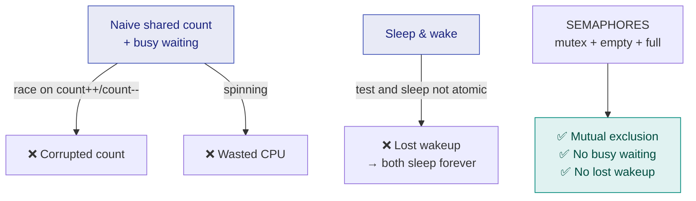

# 16. The Producer–Consumer Problem (Bounded Buffer)

> ⚠️ **Written from standard course knowledge.** No class material was supplied for Operating Systems.
> **Syllabus:** *Producer consumer problem (bounded buffer)*

---

## 🎯 In one line

A **producer** fills a shared fixed-size buffer and a **consumer** empties it — they must never work on a **full** or **empty** buffer, and never touch the buffer **at the same time**.

---

## 1. The problem statement ⭐⭐⭐

> **Two processes share a buffer of fixed size $n$. The PRODUCER generates items and puts them into the buffer; the CONSUMER removes items from it. Synchronise them so that:**
> 1. **the producer does not insert into a FULL buffer,**
> 2. **the consumer does not remove from an EMPTY buffer, and**
> 3. **the producer and consumer do not access the buffer SIMULTANEOUSLY.**

```
                    shared BOUNDED BUFFER (size n = 8)
                 ┌────┬────┬────┬────┬────┬────┬────┬────┐
   PRODUCER ───► │ D1 │ D2 │ D3 │ D4 │    │    │    │    │ ───► CONSUMER
      "in"       └────┴────┴────┴────┴────┴────┴────┴────┘       "out"
                   ▲                   ▲
                  out                  in
                (next to remove)   (next to insert)
                            count = 4
```

| Variant | Buffer | Constraint |
|---|---|---|
| **Bounded buffer** ⭐ | Fixed size $n$ | Producer waits when **full**, consumer waits when **empty** |
| Unbounded buffer | Unlimited | Only the consumer ever waits (when empty) |

> 📌 **Real examples:** a print spooler (applications produce jobs, the printer consumes them), a compiler's lexer feeding its parser, a keyboard buffer, a network card's ring buffer, a web server's request queue.

---

## 2. The shared data and the naive code ⭐⭐⭐

```c
#define n 8                 /* buffer size          */

item  buffer[n];            /* the shared buffer    */
int   in    = 0;            /* next slot to FILL    */
int   out   = 0;            /* next slot to EMPTY   */
int   count = 0;            /* items currently in the buffer ⭐ */
```

### Producer

```c
while (true) {
    /* produce an item into nextProduced */

    while (count == n)                  /* buffer FULL → wait  */
        ;                               /* busy waiting        */

    buffer[in] = nextProduced;
    in = (in + 1) % n;                  /* circular            */
    count++;                            /* ⚠️ shared variable  */
}
```

### Consumer

```c
while (true) {
    while (count == 0)                  /* buffer EMPTY → wait */
        ;                               /* busy waiting        */

    nextConsumed = buffer[out];
    out = (out + 1) % n;                /* circular            */
    count--;                            /* ⚠️ shared variable  */

    /* consume the item in nextConsumed */
}
```

> 💡 **The `% n` is what makes it a circular (ring) buffer** — when `in` reaches the end it wraps to 0, so the array is reused forever.

---

## 3. ⚠️ Why this code is WRONG — the race on `count` ⭐⭐⭐

The buffer indices are fine (`in` is touched only by the producer, `out` only by the consumer), but **`count` is written by both** — and `count++` / `count--` are **not atomic**.

| `count++` (producer) | `count--` (consumer) |
|---|---|
| `S1: reg1 = count` | `S4: reg2 = count` |
| `S2: reg1 = reg1 + 1` | `S5: reg2 = reg2 − 1` |
| `S3: count = reg1` | `S6: count = reg2` |

**Start with `count = 5`** (5 items in the buffer). One insert and one removal should leave **5**.

| Step | Executed | reg1 | reg2 | **count** |
|---|---|---|---|---|
| 1 | `S1: reg1 = count` | **5** | – | 5 |
| 2 | `S2: reg1 = reg1 + 1` | **6** | – | 5 |
| 3 | ⚡ switch — `S4: reg2 = count` | 6 | **5** | 5 |
| 4 | `S5: reg2 = reg2 − 1` | 6 | **4** | 5 |
| 5 | `S3: count = reg1` | 6 | 4 | **6** |
| 6 | `S6: count = reg2` | 6 | 4 | **4** ❌ |

**Result: `count = 4`, though the buffer really holds 5 items.** A different interleaving gives **6**.

### What the corruption actually costs ⭐

| Corrupted value | Consequence |
|---|---|
| `count` too **low** | The producer thinks there is room and **overwrites an unconsumed item** — data is lost |
| `count` too **high** | The consumer thinks there is data and **reads a garbage/empty slot** |
| Drift over time | `count` slowly loses touch with reality and the buffer breaks completely |

> ⭐ **The diagnosis sentence:** *"`count` is a shared variable modified by both processes without mutual exclusion, so `count++` and `count--` form a race condition; the critical section is the code that updates the buffer and `count`."*

### The second flaw: busy waiting

`while (count == n);` **spins**, burning CPU. On a uniprocessor this is worse than wasteful: if the producer spins waiting for the consumer, and the consumer cannot be scheduled, the system makes **no progress at all**.

---

## 4. The sleep-and-wake attempt — and why it also fails ⭐⭐⭐

Replace spinning with blocking:

```c
/* PRODUCER */                          /* CONSUMER */
while (true) {                          while (true) {
    produce(item);                          if (count == 0)
    if (count == n)                             sleep();          /* empty */
        sleep();          /* full */        item = buffer[out];
    buffer[in] = item;                      out = (out + 1) % n;
    in = (in + 1) % n;                      count--;
    count++;                                if (count == n-1)
    if (count == 1)                             wakeup(producer);
        wakeup(consumer);                   consume(item);
}                                       }
```

The reasoning is sound: *if I just made the buffer non-empty, the consumer may be asleep — wake it.*

### ⚠️ The lost wakeup ⭐⭐⭐

| Step | Process | Action | `count` | Comment |
|---|---|---|---|---|
| 1 | **Consumer** | Tests `count == 0` → **true**, decides to sleep | 0 | but has **not slept yet** |
| 2 | — | ⚡ **context switch** | 0 | |
| 3 | **Producer** | Inserts an item, `count++` | **1** | |
| 4 | **Producer** | `count == 1` → calls `wakeup(consumer)` | 1 | ❌ **consumer isn't asleep — signal LOST** |
| 5 | **Producer** | Keeps producing until `count == n`, then **sleeps** | n | |
| 6 | — | ⚡ context switch | n | |
| 7 | **Consumer** | Finally executes `sleep()` | n | ❌ **sleeps forever** |
| | | **BOTH ARE ASLEEP — permanent deadlock** | | |

> ⭐ **Both processes end up asleep and the buffer sits full forever.** The cause is the same as always: **testing the condition and going to sleep are not one atomic operation.**

---

## 5. What a correct solution must provide ⭐⭐⭐

| # | Requirement | What enforces it |
|---|---|---|
| **1** | **Mutual exclusion** on the buffer and on `count` | A **binary semaphore / mutex** |
| **2** | The producer **blocks when the buffer is full** | A **counting semaphore** counting **empty** slots |
| **3** | The consumer **blocks when the buffer is empty** | A **counting semaphore** counting **full** slots |
| **4** | **No busy waiting** | Semaphores **block**, they do not spin |
| **5** | **No lost wakeups** | Semaphore operations are **atomic** and keep a **count + queue** |



> ⭐ **Notice the structure of the answer:** *three* problems (mutual exclusion, full, empty) need *three* semaphores. That mapping is the subject of [chapter 18](18-producer-consumer-using-semaphores.md).

---

## 6. Related classical problems (context)

| Problem | Core issue |
|---|---|
| **Producer–Consumer (bounded buffer)** ⭐ | Coordinating a shared finite buffer |
| **Readers–Writers** | Many readers may read simultaneously; a writer needs exclusive access |
| **Dining Philosophers** | Deadlock and starvation when acquiring multiple resources |
| **Sleeping Barber** | A server and a bounded waiting room |

---

## 7. Common exam questions

1. **State the producer–consumer problem and explain the bounded-buffer version.** ⭐⭐⭐
2. **Write the producer and consumer code and show the race condition on `count`.** ⭐⭐⭐
3. **Why does the sleep-and-wake solution fail? Explain the lost wakeup.** ⭐⭐⭐
4. **What are the three conditions a correct solution must satisfy?** ⭐⭐⭐
5. **Solve the producer–consumer problem using semaphores.** ⭐⭐⭐ *(see [chapter 18](18-producer-consumer-using-semaphores.md))*
6. **Why is `in` not a shared-variable problem but `count` is?** ⭐⭐
7. **Give real-world examples of the producer–consumer pattern.** ⭐

---

## ⚡ Quick revision

- **Producer fills, consumer empties, buffer size $n$.** Three rules: **no insert when full**, **no remove when empty**, **never both at once**.
- Shared data: `buffer[n]`, `in`, `out`, **`count`**. Indices wrap with **`% n`** — a circular buffer.
- ⚠️ **`in` is only the producer's and `out` only the consumer's — but `count` is BOTH's.** That is the race.
- `count++` / `count--` are **three instructions each**; interleaving turns 5 into **4 or 6** — a **lost update**.
- Consequence: count too low ⇒ **overwritten items**; too high ⇒ **garbage read**.
- Busy waiting (`while(count==n);`) wastes CPU and can **deadlock a uniprocessor**.
- **Sleep & wake fails** too: the consumer decides to sleep, is preempted, the producer's `wakeup()` is **lost**, and eventually **both sleep forever**.
- A correct solution needs **three semaphores**: **`mutex`** (mutual exclusion) + **`empty`** (counts free slots) + **`full`** (counts filled slots).

---

**Previous:** [← 15. Synchronization Mechanisms](15-synchronization-mechanisms.md) · **Next:** [17. Semaphores & Mutex →](17-semaphores-and-mutex.md)
