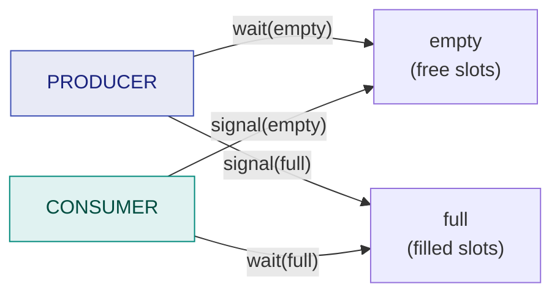

# 18. Producer–Consumer Implementation Using Semaphores

> ⚠️ **Written from standard course knowledge.** No class material was supplied for Operating Systems.
> **Syllabus:** *Consumer and producer implementation using semaphores*

---

## 🎯 In one line

Three semaphores solve the three problems: **`mutex`** gives mutual exclusion, **`empty`** counts free slots so the producer blocks on a full buffer, and **`full`** counts filled slots so the consumer blocks on an empty one.

---

## 1. The three semaphores ⭐⭐⭐

| Semaphore | Type | Initial value | Counts | Purpose |
|---|---|---|---|---|
| **`mutex`** | **Binary** | **1** | — | **Mutual exclusion** on the buffer |
| **`empty`** | **Counting** | **n** | **Empty slots** | The producer **blocks when the buffer is full** |
| **`full`** | **Counting** | **0** | **Filled slots** | The consumer **blocks when the buffer is empty** |

> ⭐ **The memory hook for the initial values:** *at the start the buffer is entirely empty, so `empty = n` and `full = 0`, and nobody is inside, so `mutex = 1`.* Getting these three numbers right is worth most of the marks.

$$\boxed{\texttt{mutex} = 1, \qquad \texttt{empty} = n, \qquad \texttt{full} = 0} \qquad \text{and always } \texttt{empty} + \texttt{full} = n$$

---

## 2. The solution ⭐⭐⭐

```c
/* ---------- shared data ---------- */
#define n 8
item      buffer[n];
int       in = 0, out = 0;

semaphore mutex = 1;        /* mutual exclusion      */
semaphore empty = n;        /* number of empty slots */
semaphore full  = 0;        /* number of full slots  */
```

### Producer

```c
do {
    /* ... produce an item into nextProduced ... */

    wait(empty);                     /* 1. claim an empty slot (block if full)  */
    wait(mutex);                     /* 2. enter the critical section           */

        buffer[in] = nextProduced;   /*    CRITICAL SECTION                     */
        in = (in + 1) % n;

    signal(mutex);                   /* 3. leave the critical section           */
    signal(full);                    /* 4. announce: one more full slot         */

} while (true);
```

### Consumer

```c
do {
    wait(full);                      /* 1. claim a full slot (block if empty)   */
    wait(mutex);                     /* 2. enter the critical section           */

        nextConsumed = buffer[out];  /*    CRITICAL SECTION                     */
        out = (out + 1) % n;

    signal(mutex);                   /* 3. leave the critical section           */
    signal(empty);                   /* 4. announce: one more empty slot        */

    /* ... consume the item in nextConsumed ... */

} while (true);
```

### The symmetry worth pointing out ⭐



> ⭐ **"The producer consumes an `empty` and produces a `full`; the consumer consumes a `full` and produces an `empty`."** That single sentence is the cleanest way to state the solution — and it makes the code impossible to misremember.

---

## 3. Worked trace — n = 3 ⭐⭐⭐

Initial: `mutex = 1`, `empty = 3`, `full = 0`, buffer empty.

| Step | Action | mutex | empty | full | Buffer | Comment |
|---|---|---|---|---|---|---|
| 0 | *initial* | 1 | **3** | **0** | – – – | |
| 1 | Consumer `wait(full)` | 1 | 3 | **−1** | – – – | ⚠️ **Consumer BLOCKS** — buffer empty |
| 2 | Producer `wait(empty)` | 1 | **2** | −1 | – – – | |
| 3 | Producer `wait(mutex)` | **0** | 2 | −1 | – – – | in the critical section |
| 4 | Producer inserts A | 0 | 2 | −1 | **A** – – | |
| 5 | Producer `signal(mutex)` | **1** | 2 | −1 | A – – | |
| 6 | Producer `signal(full)` | 1 | 2 | **0** | A – – | ✅ **Consumer is WOKEN** |
| 7 | Producer `wait(empty)`,`wait(mutex)`, inserts B | 0 | **1** | 0 | A **B** – | |
| 8 | Producer `signal(mutex)`, `signal(full)` | 1 | 1 | **1** | A B – | |
| 9 | Consumer (awake) `wait(mutex)` | **0** | 1 | 1 | A B – | |
| 10 | Consumer removes A | 0 | 1 | 1 | – B – | |
| 11 | Consumer `signal(mutex)`, `signal(empty)` | **1** | **2** | 1 | – B – | |
| 12 | Producer fills the remaining slots | 0→1 | **0** | **3**→ | B C D | buffer now full |
| 13 | Producer `wait(empty)` | 1 | **−1** | 3 | full | ⚠️ **Producer BLOCKS** — buffer full |

**Invariant check at every row:** `empty + full` + (items in flight) $= n$ ✓ and `mutex` is never below −1 while one process is inside ✓

> ⭐ **The two blocking moments (rows 1 and 13) are exactly what the question asks you to demonstrate:** the consumer blocks on an empty buffer, the producer blocks on a full one — **without any busy waiting**.

---

## 4. ⚠️⚠️ Why the ORDER of the two `wait`s matters — the deadlock ⭐⭐⭐

**This is the single most-asked follow-up question in the whole topic.**

### The wrong version — `wait(mutex)` first

```c
/* ❌ WRONG PRODUCER */              /* ❌ WRONG CONSUMER */
wait(mutex);                         wait(mutex);
wait(empty);                         wait(full);
    /* insert */                         /* remove */
signal(mutex);                       signal(mutex);
signal(full);                        signal(empty);
```

### The deadlock trace ⭐⭐⭐

Suppose the buffer is **FULL** (`empty = 0`, `full = n`):

| Step | Process | Action | mutex | empty | Comment |
|---|---|---|---|---|---|
| 1 | **Producer** | `wait(mutex)` → succeeds | **0** | 0 | ✅ Producer is **inside**, holding the lock |
| 2 | **Producer** | `wait(empty)` → 0 becomes −1 | 0 | **−1** | ⚠️ **Producer BLOCKS — still holding `mutex`!** |
| 3 | **Consumer** | `wait(mutex)` → 0 becomes −1 | **−1** | −1 | ⚠️ **Consumer BLOCKS** — the lock is held by the sleeping producer |
| 4 | | **DEADLOCK** | | | The producer waits for the consumer to free a slot; the consumer waits for the producer to free the mutex |

> ⭐ **The explanation sentence:** *"The producer blocks on `empty` while still holding `mutex`, so the consumer — the only process that could free a slot — can never enter its critical section. Each waits for the other: deadlock."*

> ⭐ **The rule to remember:** **NEVER acquire the mutual-exclusion lock before the counting semaphore.** Always:
> $$\texttt{wait(counting)} \rightarrow \texttt{wait(mutex)} \rightarrow \text{CS} \rightarrow \texttt{signal(mutex)} \rightarrow \texttt{signal(counting)}$$
> Equivalently: **`mutex` must be the INNERMOST lock** — acquired last, released first.

### What about the order of the two `signal`s?

```c
signal(full);        /* instead of signal(mutex); signal(full); */
signal(mutex);
```

> ✅ **This is SAFE.** `signal()` **never blocks**, so swapping the two releases cannot cause a deadlock. It is merely slightly less efficient: a woken consumer may immediately find `mutex` still locked and block again. **Answer: the `wait` order is critical; the `signal` order is not.**

---

## 5. Verification — does the solution meet the requirements? ⭐⭐

| Requirement | Met? | Why |
|---|---|---|
| **Mutual exclusion** | ✅ | `mutex` is binary, initialised to 1 |
| **Producer blocks when full** | ✅ | `wait(empty)` with `empty` at 0 blocks it |
| **Consumer blocks when empty** | ✅ | `wait(full)` with `full` at 0 blocks it |
| **No busy waiting** | ✅ | Semaphores **block**; waiting processes use no CPU |
| **No lost wakeups** | ✅ | The counts remember signals; the operations are atomic |
| **Progress / bounded waiting** | ✅ | Provided the semaphore queues are **FIFO** |
| **Deadlock-free** | ✅ | **Only if the `wait` order is `counting` then `mutex`** |

### Two extensions sometimes asked

| Variation | Change |
|---|---|
| **Multiple producers / multiple consumers** | The **same code works unchanged** — `mutex` already serialises every buffer access. ⭐ A good short answer |
| **Unbounded buffer** | Drop the `empty` semaphore entirely — the producer never has to wait |

---

## 6. Common exam questions

1. **Solve the producer–consumer problem using semaphores. Give the initial values and the code.** ⭐⭐⭐
2. **What are the initial values of `mutex`, `empty` and `full`, and why?** ⭐⭐⭐
3. **What happens if `wait(mutex)` is executed before `wait(empty)`? Show the deadlock.** ⭐⭐⭐
4. **Does the order of the `signal` operations matter? Justify.** ⭐⭐⭐
5. **Trace the semaphore values for a given sequence of producer/consumer actions.** ⭐⭐⭐
6. **Show that the solution satisfies mutual exclusion and avoids busy waiting.** ⭐⭐
7. **Does the solution still work with multiple producers and consumers?** ⭐⭐

---

## ⚡ Quick revision

- **Three semaphores:** $\ \texttt{mutex} = 1$ (binary, mutual exclusion), $\ \texttt{empty} = n$ (free slots), $\ \texttt{full} = 0$ (filled slots).
- **Producer:** `wait(empty) → wait(mutex) → insert → signal(mutex) → signal(full)`.
- **Consumer:** `wait(full) → wait(mutex) → remove → signal(mutex) → signal(empty)`.
- ⭐ **"The producer consumes an `empty` and produces a `full`; the consumer does the reverse."**
- Invariant: **`empty + full = n`**.
- ⚠️⚠️ **Swapping `wait(mutex)` and `wait(empty)` causes DEADLOCK:** the producer sleeps on `empty` **while holding `mutex`**, so the consumer can never enter to free a slot.
- **Rule: `mutex` is the INNERMOST lock** — acquired last, released first. Counting semaphore first, always.
- **Swapping the two `signal`s is SAFE** — `signal()` never blocks.
- ✅ No busy waiting, no lost wakeups, works unchanged for **multiple** producers and consumers.
- Unbounded buffer ⇒ drop `empty`.

---

**Previous:** [← 17. Semaphores & Mutex](17-semaphores-and-mutex.md) · **Next:** [19. Deadlock & Necessary Conditions →](19-deadlock-and-necessary-conditions.md)
