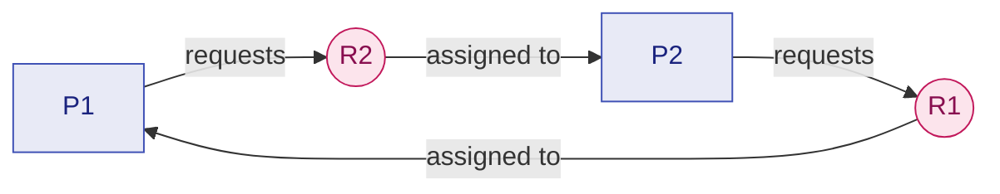
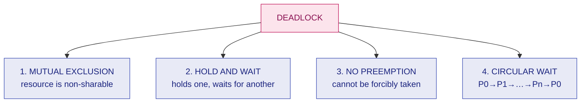
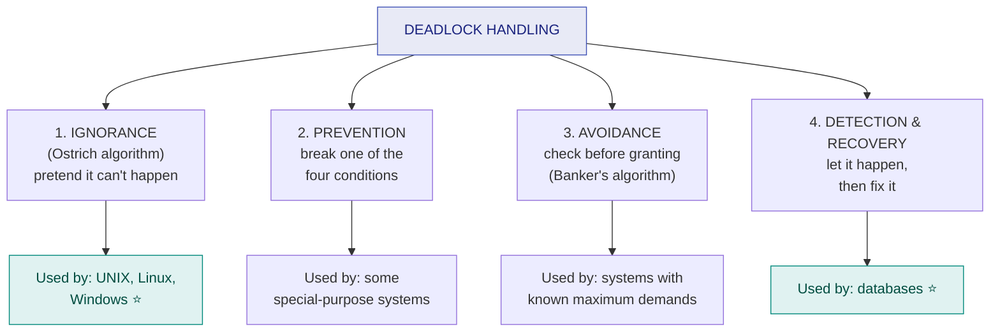

# 19. Deadlock — Necessary Conditions, Handling & Prevention

> ⚠️ **Written from standard course knowledge.** No class material was supplied for Operating Systems.
> **Syllabus:** *Deadlock (with diagram) · Necessary conditions for deadlock · Deadlock handling — ignorance, prevention, avoidance, detection and recovery*

---

## 🎯 In one line

A **deadlock** is a set of processes each holding a resource and each waiting for a resource held by another — it needs **all four** of mutual exclusion, hold-and-wait, no preemption and circular wait, so **breaking any one of them prevents it**.

---

## 1. What a deadlock is ⭐⭐⭐

> **A deadlock is a situation in which a set of processes is blocked because each process is holding a resource and waiting to acquire a resource held by another process in the set. None can ever proceed.**

### The diagram ⭐⭐⭐

```
        ┌───────────────┐                       ┌───────────────┐
        │   PROCESS P1  │                       │   PROCESS P2  │
        └───────┬───────┘                       └───────┬───────┘
                │ holds                                 │ holds
                ▼                                       ▼
        ┌───────────────┐                       ┌───────────────┐
        │  RESOURCE R1  │                       │  RESOURCE R2  │
        └───────┬───────┘                       └───────┬───────┘
                │                                       │
                │        ┌─────────────────┐            │
                └───────►│   requested by  │◄───────────┘
                         │  P2        P1   │
                         └─────────────────┘

              P1 holds R1 and waits for R2
              P2 holds R2 and waits for R1
                    → CIRCULAR WAIT → DEADLOCK
```

Drawn as a **cycle** (this is the Resource Allocation Graph form — [chapter 21](21-rag-detection-and-recovery.md)):



### The code that produces it ⭐⭐

```c
    /* Process P1 */                    /* Process P2 */
    wait(R1);                           wait(R2);        ⚠️ opposite order
    wait(R2);                           wait(R1);
        /* use both */                      /* use both */
    signal(R2);                         signal(R1);
    signal(R1);                         signal(R2);
```

If P1 completes `wait(R1)` and P2 completes `wait(R2)` before either proceeds, **both block forever**.

> 📌 **The everyday analogy:** two cars meet on a one-lane bridge from opposite ends. Each needs the other to reverse. Neither does.

### Deadlock vs Starvation ⭐⭐⭐

| | **Deadlock** | **Starvation** (indefinite blocking) |
|---|---|---|
| **Cause** | **Circular waiting** for resources | **Unfair scheduling / priority** policy |
| **Who is affected** | A **set** of processes, all blocked | **One** (or a few) unlucky processes |
| **Progress in the system** | Those processes make **no progress at all**, ever | Others **do** progress; the victim keeps losing |
| **Can it resolve itself?** | ❌ **Never** without outside intervention | ✅ Possibly, if the load changes |
| **Cure** | Prevention, avoidance, or detection + recovery | **Aging** |

> ⭐ **"Every deadlock is starvation, but not every starvation is a deadlock."** Worth one line.

### The resource-usage protocol

Every process uses a resource in three steps: **Request → Use → Release**. A deadlock can only happen in the **request** step, when the request must wait.

| Resource type | Example |
|---|---|
| **Preemptable** | CPU, memory — can be taken away and given back safely |
| **Non-preemptable** ⭐ | Printer, tape drive, mutex/semaphore, file lock — **taking it away breaks the work**. Deadlocks involve these |

---

## 2. The four necessary conditions ⭐⭐⭐

> **A deadlock can occur only if ALL FOUR of these conditions hold simultaneously.** (Coffman's conditions, 1971.)

| # | Condition | Statement |
|---|---|---|
| **1** | **Mutual Exclusion** | **At least one resource must be held in a non-sharable mode** — only one process can use it at a time. |
| **2** | **Hold and Wait** | **A process is holding at least one resource and is waiting to acquire additional resources held by other processes.** |
| **3** | **No Preemption** | **A resource cannot be forcibly taken from a process; it can be released only voluntarily by the process holding it.** |
| **4** | **Circular Wait** | **There exists a set $\{P_0, P_1, \ldots, P_n\}$ such that $P_0$ waits for a resource held by $P_1$, $P_1$ for one held by $P_2$, …, and $P_n$ for one held by $P_0$.** |



> ⭐⭐⭐ **The two facts that carry all the marks:**
> 1. **All four must hold together.** Remove any one and deadlock is **impossible** — that is the whole basis of deadlock **prevention**.
> 2. **Circular wait implies hold-and-wait**, so the four are *necessary* but **not independent**. The four together are necessary; for **single-instance** resources a cycle is also **sufficient** ([ch. 21](21-rag-detection-and-recovery.md)).

**Memory aid:** **M**y **H**ouse **N**eeds **C**leaning — **M**utual exclusion, **H**old and wait, **N**o preemption, **C**ircular wait.

---

## 3. The four handling strategies ⭐⭐⭐



| Strategy | Approach | Resource utilisation | Overhead | Used by |
|---|---|---|---|---|
| **1. Ignorance** | Pretend deadlocks never happen | **Best** | **None** | **UNIX, Linux, Windows** |
| **2. Prevention** | Design so one condition can **never** hold | **Poor** | Low | Special-purpose systems |
| **3. Avoidance** | Grant a request only if the system **stays safe** | Moderate | **High** (runs an algorithm per request) | Systems with known max demands |
| **4. Detection & recovery** | Allow it, detect it, then break it | Good | Moderate–high | **Databases** |

---

## 4. Strategy 1 — Deadlock Ignorance (the Ostrich Algorithm) ⭐⭐⭐

> **Pretend the problem does not exist. If a deadlock occurs, the user notices the system is stuck and reboots or kills the process.**

Named after the ostrich that supposedly buries its head in the sand.

| Why it is chosen | Justification |
|---|---|
| **Deadlocks are rare** | Once every few months or years on a general-purpose system |
| **Prevention and avoidance are expensive** | They cost performance and resource utilisation **all the time**, to guard against something that almost never happens |
| **Detection costs CPU** | Running a detection algorithm periodically has a real cost |
| **Users accept it** | A rare reboot is cheaper than a permanently slower system |

> ⭐ **The exam sentence:** *"UNIX, Linux and Windows all use deadlock ignorance, because the cost of prevention or avoidance is not worth the rarity of the event. This is a deliberate engineering trade-off, not an oversight."*

| Advantage | Disadvantage |
|---|---|
| **No overhead at all** | The system **can** hang |
| **Maximum resource utilisation** | Work in progress may be lost |
| Simplest to implement | **Unacceptable for critical/real-time systems** |

---

## 5. Strategy 2 — Deadlock Prevention ⭐⭐⭐

> **Ensure that at least ONE of the four necessary conditions can never hold.** Then a deadlock is structurally impossible.

### 5.1 Break Mutual Exclusion

**How:** make resources **sharable**.

| Assessment | |
|---|---|
| **Works for** | Read-only files, and resources that can be **spooled** (e.g. a printer daemon lets many processes "print" at once) |
| ⚠️ **Generally NOT possible** ⭐ | Some resources are **intrinsically non-sharable** — a printer, a mutex, a tape drive. You cannot let two processes write to a printer simultaneously |
| **Verdict** | **The least practical of the four.** Say this explicitly |

### 5.2 Break Hold and Wait ⭐⭐

**How:** a process must never hold one resource while waiting for another. Two protocols:

| Protocol | Rule |
|---|---|
| **(a) Request everything at once** | A process must request **all** the resources it will ever need **before it starts**, and gets them all or none |
| **(b) Release before requesting** | A process may request resources **only when it holds none** — it must release everything first |

| Advantage | Disadvantage |
|---|---|
| Simple, and genuinely prevents deadlock | ⚠️ **Low resource utilisation** — a resource needed only at the end is held from the start |
| | ⚠️ **Starvation** — a process needing several popular resources may never get them all at once |
| | ⚠️ A process often **cannot know in advance** what it will need |

### 5.3 Break No Preemption ⭐⭐

**How:** allow resources to be **taken away**.

| Protocol | Rule |
|---|---|
| **(a)** | If a process holding resources requests another that cannot be immediately granted, **all its current resources are preempted** (released) and it restarts later with all of them |
| **(b)** | If the requested resource is held by another process that is **itself waiting**, preempt it from that process |

| Advantage | Disadvantage |
|---|---|
| Effective | ⚠️ **Only applies to resources whose state can be SAVED AND RESTORED** — CPU registers, memory |
| | ⚠️ **Useless for printers, tape drives, mutexes** — preempting them corrupts the work |
| | ⚠️ Risk of **repeated rollback** and **starvation** |

### 5.4 Break Circular Wait ⭐⭐⭐

**How:** impose a **total ordering** on all resource types and require each process to request resources **in increasing order of that number**.

$$F(\text{tape drive}) = 1,\quad F(\text{disk drive}) = 5,\quad F(\text{printer}) = 12$$

**Rule:** a process holding a resource $R_i$ may request $R_j$ **only if $F(R_j) > F(R_i)$.**

**Why a cycle becomes impossible:** a cycle would require some process to request a resource with a **lower** number than one it already holds, which the rule forbids. ∎

| Advantage | Disadvantage |
|---|---|
| ⭐ **The most PRACTICAL of the four** — and the one real programmers actually use | Choosing a sensible ordering requires knowing the usage pattern |
| Cheap: no runtime algorithm, just a coding discipline | ⚠️ May force a process to acquire a resource **earlier than needed**, lowering utilisation |

> ⭐ **This is the same fix as the semaphore-ordering rule** in [chapter 17](17-semaphores-and-mutex.md): *always acquire locks in the same global order.* Connecting the two topics is worth a mark.

### Summary table ⭐⭐⭐

| Condition to break | Method | Practical? |
|---|---|---|
| **Mutual exclusion** | Make resources sharable / spooling | ❌ **Usually impossible** |
| **Hold and wait** | Request all at once, or release before requesting | ⚠️ Possible, but **poor utilisation + starvation** |
| **No preemption** | Preempt and roll back | ⚠️ Only for **savable-state** resources |
| **Circular wait** | **Total ordering of resource types** | ✅ **The most practical** ⭐ |

---

## 6. Strategies 3 and 4 — a preview

| Strategy | Idea | Chapter |
|---|---|---|
| **Avoidance** | The system knows each process's **maximum** demand in advance and grants a request only if the resulting state is **safe** — the **Banker's algorithm** | [→ ch. 20](20-deadlock-avoidance-bankers.md) |
| **Detection & recovery** | Let deadlocks happen; run a detection algorithm on the **resource allocation graph**; recover by killing processes or preempting resources | [→ ch. 21](21-rag-detection-and-recovery.md) |

### Prevention vs Avoidance ⭐⭐⭐

| | **Prevention** | **Avoidance** |
|---|---|---|
| **When it acts** | At **design time** — the system is built so a condition never holds | At **runtime** — every request is examined |
| **What it needs** | Nothing extra | ⭐ **Advance knowledge of each process's MAXIMUM demand** |
| **Method** | Break one of the four conditions | Keep the system in a **safe state** |
| **Resource utilisation** | **Low** | **Better** |
| **Runtime cost** | **None** | **High** — an algorithm runs on every request |

> ⭐ **The clean one-liner:** *"Prevention makes deadlock structurally impossible by negating a necessary condition; avoidance allows all four conditions but uses advance knowledge to steer the system away from unsafe states."*

---

## 7. Common exam questions

1. **What is a deadlock? Explain with a diagram.** ⭐⭐⭐
2. **State and explain the four necessary conditions for deadlock.** ⭐⭐⭐
3. **Explain the four methods of handling deadlock.** ⭐⭐⭐
4. **Explain deadlock prevention — how is each of the four conditions broken?** ⭐⭐⭐
5. **Differentiate deadlock prevention and deadlock avoidance.** ⭐⭐⭐
6. **Differentiate deadlock and starvation.** ⭐⭐⭐
7. **What is the ostrich algorithm? Why do UNIX and Windows use it?** ⭐⭐⭐
8. **Which condition is the easiest to break in practice, and how?** → **circular wait**, by total ordering. ⭐⭐

---

## ⚡ Quick revision

- **Deadlock:** every process in a set holds a resource and waits for one held by another — **none can ever proceed**.
- **Deadlock ≠ starvation:** deadlock = circular wait, permanent, affects a set; starvation = unfair scheduling, affects one, cured by **aging**.
- **Four necessary conditions (all must hold):** **Mutual exclusion · Hold and wait · No preemption · Circular wait.** *(My House Needs Cleaning)*
- **Break any one ⇒ no deadlock** — that is **prevention**.
- **Four handling strategies:** **ignorance** (ostrich — UNIX/Linux/Windows), **prevention**, **avoidance** (Banker's), **detection & recovery** (databases).
- **Prevention methods:** mutual exclusion → sharing/spooling (**usually impossible**); hold-and-wait → request all at once or release first (**poor utilisation, starvation**); no preemption → preempt and roll back (**only for savable resources**); circular wait → **total ordering of resource types (the practical one)** ⭐.
- **Prevention = design-time, no runtime cost, low utilisation. Avoidance = runtime, needs MAXIMUM demands known in advance, better utilisation.**
- Deadlocks involve **non-preemptable** resources; the danger point is the **request** step.

---

**Previous:** [← 18. Producer–Consumer Using Semaphores](18-producer-consumer-using-semaphores.md) · **Next:** [20. Deadlock Avoidance — Banker's Algorithm →](20-deadlock-avoidance-bankers.md)
