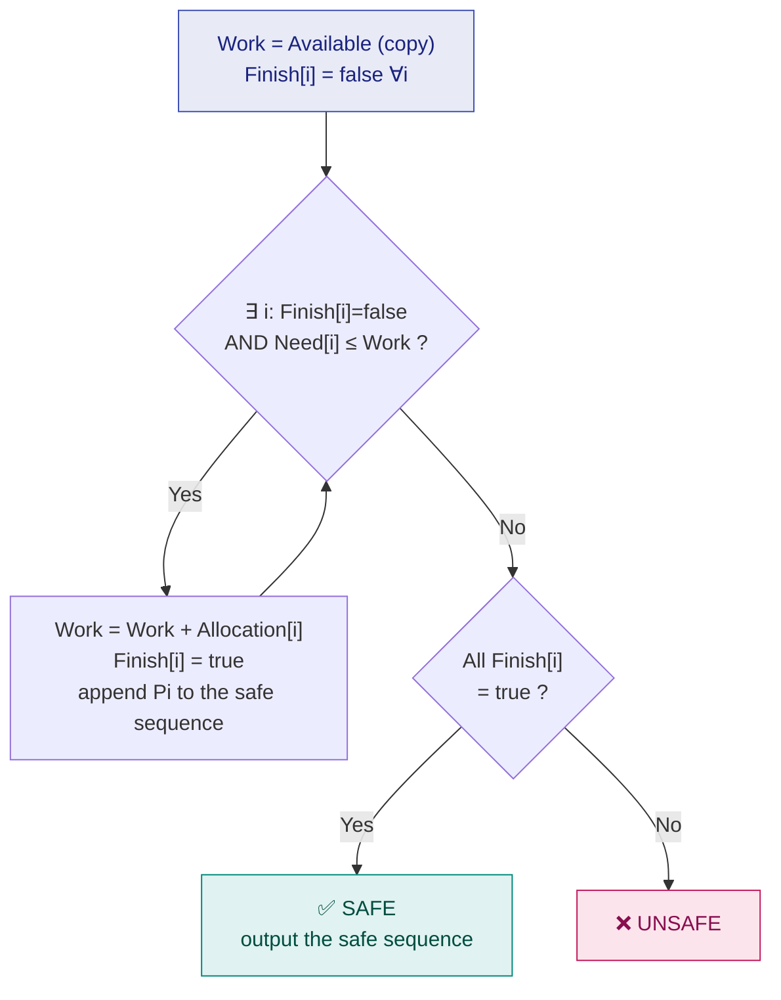

# 20. Deadlock Avoidance — Banker's Algorithm

> ⚠️ **Written from standard course knowledge.** No class material was supplied for Operating Systems.
> **Syllabus:** *Deadlock avoidance · Banker's algorithm*

---

## 🎯 In one line

Before granting any request, the OS pretends to grant it and checks whether a **safe sequence** still exists — if yes it grants, if no it makes the process wait.

---

## 1. Safe and unsafe states ⭐⭐⭐

> **A state is SAFE if there exists a sequence of all processes $\langle P_1, P_2, \ldots, P_n \rangle$ such that, for each $P_i$, the resources it may still need can be satisfied by the currently available resources plus the resources held by all $P_j$ with $j < i$.**
>
> Such a sequence is called a **safe sequence**. A state with no safe sequence is **UNSAFE**.

**In plain words:** *can we finish everybody, one at a time, if we let each one run to completion and return what it holds?*

> ⭐⭐⭐ **The relationship you must state:**
> - **Safe ⇒ NO deadlock.** ✅
> - **Unsafe ⇏ deadlock.** ⚠️ An unsafe state *may* lead to deadlock; it is not one yet, and might still work out if processes happen not to request their maximum.
> - **Deadlock ⇒ unsafe.** Every deadlocked state is unsafe.
>
> **Avoidance keeps the system in safe states only** — it is therefore **conservative**: it refuses some requests that would in fact have been fine.

```
        ┌──────────────────────────────────────────┐
        │              UNSAFE                      │
        │     ┌──────────────────────┐             │
        │     │      DEADLOCK        │             │
        │     └──────────────────────┘             │
        └──────────────────────────────────────────┘
        ┌──────────────────────────────────────────┐
        │               SAFE  ← avoidance keeps    │
        │                       us in here         │
        └──────────────────────────────────────────┘
```

### The single-resource illustration ⭐⭐⭐

**12 tape drives; three processes:**

| Process | Max need | Currently allocated | Still needs |
|---|---|---|---|
| P0 | 10 | 5 | 5 |
| P1 | 4 | 2 | 2 |
| P2 | 9 | 2 | 7 |
| | | **9 allocated** | **Available = 12 − 9 = 3** |

**Is this safe?** Try to build a sequence with Work = 3:

| Step | Candidate | Needs | Work available | Grant? | New Work |
|---|---|---|---|---|---|
| 1 | **P1** | 2 | 3 | ✅ 2 ≤ 3 | $3 + 2 = 5$ |
| 2 | **P0** | 5 | 5 | ✅ 5 ≤ 5 | $5 + 5 = 10$ |
| 3 | **P2** | 7 | 10 | ✅ 7 ≤ 10 | $10 + 2 = 12$ |

✅ **SAFE**, with safe sequence $\langle P_1, P_0, P_2 \rangle$.

**Now suppose P2 requests and is granted one more drive** (allocated 3, available 2):

| Process | Max | Allocated | Still needs |
|---|---|---|---|
| P0 | 10 | 5 | 5 |
| P1 | 4 | 2 | 2 |
| P2 | 9 | **3** | **6** |
| | | 10 | **Available = 2** |

| Step | Candidate | Needs | Work | Grant? |
|---|---|---|---|---|
| 1 | P1 | 2 | 2 | ✅ → Work = 4 |
| 2 | P0 | 5 | 4 | ❌ |
| 2' | P2 | 6 | 4 | ❌ |

❌ **UNSAFE** — after P1 finishes, neither P0 nor P2 can be satisfied.

> ⭐ **Therefore the OS must REFUSE P2's request**, even though the drive is physically available. **That is deadlock avoidance in one example** — and it shows the price: a usable resource is left idle.

---

## 2. The Banker's Algorithm ⭐⭐⭐

Named after a banker who never lends so much cash that they cannot satisfy every customer's maximum credit line.

**Applies to:** multiple resource types with **multiple instances**. **Requirement:** every process must **declare its maximum need in advance**.

### The four data structures ⭐⭐⭐

For $n$ processes and $m$ resource types:

| Structure | Size | Meaning |
|---|---|---|
| **Available** | $1 \times m$ | Number of **free instances** of each resource type |
| **Max** | $n \times m$ | `Max[i][j]` = the **maximum** instances of $R_j$ that $P_i$ may ever request |
| **Allocation** | $n \times m$ | `Allocation[i][j]` = instances of $R_j$ **currently held** by $P_i$ |
| **Need** | $n \times m$ | `Need[i][j]` = instances of $R_j$ that $P_i$ **may still need** |

$$\boxed{\textbf{Need} = \textbf{Max} - \textbf{Allocation}}$$

> ⚠️ **Always compute and write out the Need matrix first.** Half the marks in a Banker's question come from it, and every later step uses it.

**Useful identity for checking your data:**
$$\text{Available}_j = \text{Total}_j - \sum_{i} \text{Allocation}[i][j]$$

---

## 3. Part A — the Safety Algorithm ⭐⭐⭐

*"Is the current state safe?"*

```
1. Work = Available                  (a COPY — never modify Available itself ⭐)
   Finish[i] = false  for all i

2. Find an index i such that BOTH:
       (a) Finish[i] == false
       (b) Need[i] ≤ Work           (component-wise, for EVERY resource type)
   If no such i exists, go to step 4.

3. Work = Work + Allocation[i]       (Pi finishes and RETURNS everything)
   Finish[i] = true
   Record Pi in the safe sequence
   Go to step 2.

4. If Finish[i] == true for ALL i  → the state is SAFE
   Otherwise                       → the state is UNSAFE
```



> ⚠️ **`Need[i] ≤ Work` must hold for EVERY resource type.** $(6,0,0) \le (5,3,2)$ is **false** because $6 > 5$ — one failing column is enough.

**Complexity:** $O(m \times n^2)$.

---

## 4. Part B — the Resource-Request Algorithm ⭐⭐⭐

*"Process $P_i$ requests $Request_i$. Should we grant it?"*

```
Step 1: if Request[i] ≤ Need[i]          → continue
        else                             → ERROR: the process exceeded its declared maximum

Step 2: if Request[i] ≤ Available        → continue
        else                             → Pi must WAIT (resources not available right now)

Step 3: PRETEND to allocate:
            Available    = Available    − Request[i]
            Allocation[i]= Allocation[i]+ Request[i]
            Need[i]      = Need[i]      − Request[i]

Step 4: Run the SAFETY ALGORITHM on this pretend state.
            SAFE   → ✅ grant the request (make the change permanent)
            UNSAFE → ❌ roll back to the old state and make Pi WAIT
```

> ⭐ **All three checks matter and each has a different failure message:** *exceeds maximum* = an error; *exceeds available* = wait; *unsafe* = wait. Losing marks here is usually from skipping step 1.

---

## 5. ⭐⭐⭐ The complete worked example

**System:** 5 processes $P_0 \ldots P_4$, 3 resource types $A(10), B(5), C(7)$.

### Given

| Process | Allocation<br/>A B C | Max<br/>A B C |
|---|---|---|
| **P0** | 0 1 0 | 7 5 3 |
| **P1** | 2 0 0 | 3 2 2 |
| **P2** | 3 0 2 | 9 0 2 |
| **P3** | 2 1 1 | 2 2 2 |
| **P4** | 0 0 2 | 4 3 3 |

### Step 1 — compute Available ⭐

$$\text{Total allocated} = (0{+}2{+}3{+}2{+}0,\ 1{+}0{+}0{+}1{+}0,\ 0{+}0{+}2{+}1{+}2) = (7,\ 2,\ 5)$$
$$\textbf{Available} = (10,5,7) - (7,2,5) = \mathbf{(3,\ 3,\ 2)}$$

### Step 2 — compute Need = Max − Allocation ⭐⭐⭐

| Process | Allocation | Max | **Need = Max − Alloc** |
|---|---|---|---|
| **P0** | 0 1 0 | 7 5 3 | **7 4 3** |
| **P1** | 2 0 0 | 3 2 2 | **1 2 2** |
| **P2** | 3 0 2 | 9 0 2 | **6 0 0** |
| **P3** | 2 1 1 | 2 2 2 | **0 1 1** |
| **P4** | 0 0 2 | 4 3 3 | **4 3 1** |

### Step 3 — run the safety algorithm, Work = (3, 3, 2)

| Iter | Try | Need | Work | $Need \le Work$? | Action | New Work = Work + Allocation |
|---|---|---|---|---|---|---|
| 1 | P0 | 7 4 3 | 3 3 2 | ❌ (7 > 3) | skip | — |
| 1 | **P1** | **1 2 2** | 3 3 2 | ✅ | **run P1** | $(3,3,2)+(2,0,0) = \mathbf{(5,3,2)}$ |
| 2 | P2 | 6 0 0 | 5 3 2 | ❌ (6 > 5) | skip | — |
| 2 | **P3** | **0 1 1** | 5 3 2 | ✅ | **run P3** | $(5,3,2)+(2,1,1) = \mathbf{(7,4,3)}$ |
| 3 | **P4** | **4 3 1** | 7 4 3 | ✅ | **run P4** | $(7,4,3)+(0,0,2) = \mathbf{(7,4,5)}$ |
| 4 | **P0** | **7 4 3** | 7 4 5 | ✅ | **run P0** | $(7,4,5)+(0,1,0) = \mathbf{(7,5,5)}$ |
| 5 | **P2** | **6 0 0** | 7 5 5 | ✅ | **run P2** | $(7,5,5)+(3,0,2) = \mathbf{(10,5,7)}$ |

All `Finish[i] = true`, and the final Work $(10,5,7)$ equals the total resources ✓

### ✅ Answer: the system is SAFE, with safe sequence

$$\boxed{\langle P_1,\ P_3,\ P_4,\ P_0,\ P_2 \rangle}$$

> 💡 **Other safe sequences may exist** (e.g. $\langle P_1, P_3, P_4, P_2, P_0\rangle$). **Any one of them is a correct answer** — you only have to exhibit one. Say so in your answer.

---

## 6. ⭐⭐⭐ Request example 1 — GRANTED

> **$P_1$ requests $(1, 0, 2)$. Can it be granted?**

**Step 1 — is $Request_1 \le Need_1$?**
$$(1,0,2) \le (1,2,2) \quad ✅$$

**Step 2 — is $Request_1 \le Available$?**
$$(1,0,2) \le (3,3,2) \quad ✅$$

**Step 3 — pretend to allocate:**

$$\text{Available} = (3,3,2) - (1,0,2) = \mathbf{(2,3,0)}$$
$$\text{Allocation}_1 = (2,0,0) + (1,0,2) = \mathbf{(3,0,2)} \qquad \text{Need}_1 = (1,2,2) - (1,0,2) = \mathbf{(0,2,0)}$$

**The pretend state:**

| Process | Allocation | Need |
|---|---|---|
| P0 | 0 1 0 | 7 4 3 |
| **P1** | **3 0 2** | **0 2 0** |
| P2 | 3 0 2 | 6 0 0 |
| P3 | 2 1 1 | 0 1 1 |
| P4 | 0 0 2 | 4 3 1 |
| | | **Available = (2, 3, 0)** |

**Step 4 — safety check, Work = (2, 3, 0):**

| Iter | Process | Need | Work | OK? | New Work |
|---|---|---|---|---|---|
| 1 | P0 | 7 4 3 | 2 3 0 | ❌ | — |
| 1 | **P1** | 0 2 0 | 2 3 0 | ✅ | $(2,3,0)+(3,0,2) = (5,3,2)$ |
| 2 | P2 | 6 0 0 | 5 3 2 | ❌ | — |
| 2 | **P3** | 0 1 1 | 5 3 2 | ✅ | $(5,3,2)+(2,1,1) = (7,4,3)$ |
| 3 | **P4** | 4 3 1 | 7 4 3 | ✅ | $(7,4,3)+(0,0,2) = (7,4,5)$ |
| 4 | **P0** | 7 4 3 | 7 4 5 | ✅ | $(7,4,5)+(0,1,0) = (7,5,5)$ |
| 5 | **P2** | 6 0 0 | 7 5 5 | ✅ | $(7,5,5)+(3,0,2) = (10,5,7)$ |

✅ **SAFE**, safe sequence $\langle P_1, P_3, P_4, P_0, P_2 \rangle$.

### **Answer: the request is GRANTED.** ✅

---

## 7. ⭐⭐⭐ Request example 2 — DENIED

> **$P_4$ requests $(3, 3, 0)$ (from the original state). Can it be granted?**

**Step 1:** $(3,3,0) \le Need_4 = (4,3,1)$ ✅
**Step 2:** $(3,3,0) \le Available = (3,3,2)$ ✅ — *the resources are physically there!*

**Step 3 — pretend:**
$$\text{Available} = (3,3,2)-(3,3,0) = \mathbf{(0,0,2)} \qquad \text{Allocation}_4 = (3,3,2) \qquad \text{Need}_4 = (1,0,1)$$

**Step 4 — safety check, Work = (0, 0, 2):**

| Process | Need | $\le (0,0,2)$? |
|---|---|---|
| P0 | 7 4 3 | ❌ |
| P1 | 1 2 2 | ❌ |
| P2 | 6 0 0 | ❌ |
| P3 | 0 1 1 | ❌ (needs B = 1 > 0) |
| P4 | 1 0 1 | ❌ (needs A = 1 > 0) |

**No process can proceed** — `Finish[i] = false` for all $i$.

### ❌ **UNSAFE — the request is DENIED and $P_4$ must WAIT.**

> ⭐ **The point of this example:** the resources **were available**, and the request was **within P4's declared maximum** — yet granting it would leave the system unable to guarantee completion. **This is exactly what avoidance is for**, and it is the standard "explain why a request is refused" question.

> ⚠️ **Do not say "the system would deadlock."** Say **"the system would enter an unsafe state, so the request is denied"** — unsafe is not the same as deadlocked.

---

## 8. Advantages and disadvantages ⭐⭐

| Advantages | Disadvantages |
|---|---|
| **Prevents deadlock** while allowing all four conditions | ⚠️ **Maximum demand must be known in advance** — usually impossible for interactive processes |
| **Better resource utilisation** than prevention | ⚠️ **The number of processes must be fixed** |
| No preemption or rollback needed | ⚠️ **The resource pool must be fixed** (no device may fail) |
| Gives a concrete safe sequence | ⚠️ **High runtime overhead** — $O(mn^2)$ **on every request** |
| | ⚠️ **Conservative** — refuses requests that would have been harmless |

> ⭐ **The conclusion examiners look for:** *"Because of these restrictions the Banker's algorithm is rarely used in general-purpose operating systems; it is mainly of theoretical and teaching value."*

---

## 9. Common exam questions

1. **Given Allocation, Max and Available, find the Need matrix and determine whether the system is safe. Give the safe sequence.** ⭐⭐⭐
2. **Can request $(x,y,z)$ by $P_i$ be granted? Justify using the resource-request algorithm.** ⭐⭐⭐
3. **Define safe state and unsafe state. Is an unsafe state always a deadlock?** ⭐⭐⭐
4. **Explain the Banker's algorithm with its data structures.** ⭐⭐⭐
5. **State the advantages and disadvantages of deadlock avoidance.** ⭐⭐
6. **Differentiate deadlock prevention and avoidance.** ⭐⭐⭐
7. **Why is it called the "Banker's" algorithm?** ⭐

---

## ⚡ Quick revision

- **Safe state** = a **safe sequence** exists ⇒ **no deadlock**. **Unsafe ≠ deadlock**, but it *may* lead to one. **Deadlock ⇒ unsafe.**
- **Avoidance keeps the system in safe states**, which makes it **conservative** — it refuses some harmless requests.
- **Requires each process to declare its MAXIMUM demand in advance.**
- **Four structures:** Available ($1{\times}m$), Max, Allocation, Need ($n{\times}m$). $\ \boxed{Need = Max - Allocation}$ — **compute it first**.
- **Safety algorithm:** `Work = Available` (a **copy**), `Finish[] = false`; repeatedly find an unfinished $P_i$ with $Need_i \le Work$, then `Work += Allocation[i]`. All finished ⇒ **SAFE**.
- ⚠️ $Need_i \le Work$ must hold for **every** resource type.
- **Request algorithm:** ① $Request \le Need$ (else **error**) ② $Request \le Available$ (else **wait**) ③ **pretend** to allocate ④ run the **safety check** → safe = grant, unsafe = **roll back and wait**.
- **Standard example:** Available $(3,3,2)$ → safe sequence $\langle P_1, P_3, P_4, P_0, P_2\rangle$. $P_1$'s request $(1,0,2)$ is **granted**; $P_4$'s request $(3,3,0)$ leaves Work $(0,0,2)$ where **nobody can proceed** ⇒ **denied**.
- Any valid safe sequence is an acceptable answer.
- **Limits:** max demands rarely known, fixed process count and resource pool, $O(mn^2)$ per request ⇒ **rarely used in real systems**.

---

**Previous:** [← 19. Deadlock & Necessary Conditions](19-deadlock-and-necessary-conditions.md) · **Next:** [21. Resource Allocation Graph, Detection & Recovery →](21-rag-detection-and-recovery.md)
