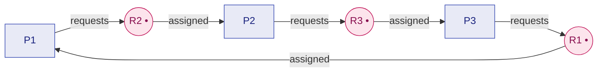
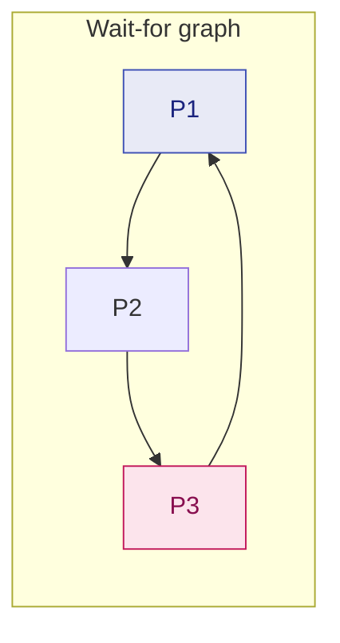
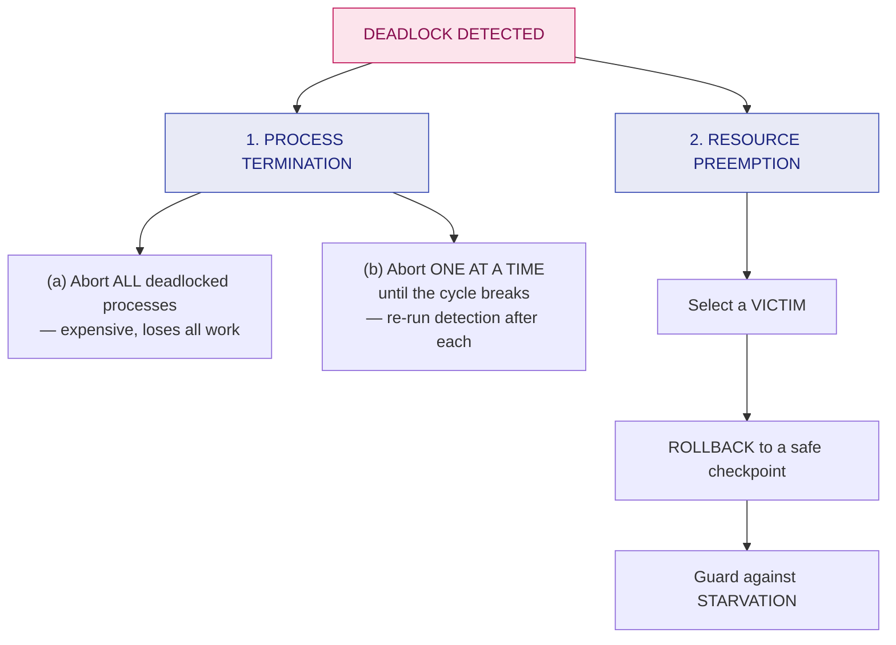

# 21. Resource Allocation Graph, Deadlock Detection & Recovery

> ⚠️ **Written from standard course knowledge.** No class material was supplied for Operating Systems.
> **Syllabus:** *Resource allocation graph · Deadlock detection and recovery*

---

## 🎯 In one line

Draw processes and resources as a graph: **no cycle ⇒ no deadlock**; **a cycle with single-instance resources ⇒ definitely deadlock**; a cycle with multiple instances ⇒ **maybe** — and once detected, recover by **killing processes** or **preempting resources**.

---

## 1. The Resource Allocation Graph (RAG) ⭐⭐⭐

> **A directed graph in which the vertices are the processes and resource types of the system, and the edges show which resources are requested and which are allocated.**

### Notation ⭐⭐⭐

| Symbol | Drawn as | Meaning |
|---|---|---|
| **Process $P_i$** | A **circle** ◯ | A process |
| **Resource type $R_j$** | A **rectangle** ▭ with one **dot •** per instance | A resource with $k$ instances |
| **Request edge** $P_i \rightarrow R_j$ | Arrow **from process to resource** | $P_i$ has **requested** $R_j$ and is **waiting** |
| **Assignment edge** $R_j \rightarrow P_i$ | Arrow **from a dot to the process** | An instance of $R_j$ is **allocated** to $P_i$ |
| *(avoidance only)* **Claim edge** $P_i \dashrightarrow R_j$ | **Dashed** arrow | $P_i$ **may request** $R_j$ in future |

```
       REQUEST                              ASSIGNMENT
     ┌───┐                                ┌─────────┐
     │P1 │─────────────►┌─────────┐       │ R2  • • │──────────►┌───┐
     └───┘              │ R1  •   │       └─────────┘           │P2 │
   "P1 is waiting       └─────────┘       "one instance of R2    └───┘
    for R1"                                is held by P2"
```

> ⚠️ **Direction is everything.** Process **→** Resource means *"I want it"*; Resource **→** Process means *"you have it"*. Reversing an arrow reverses the meaning and loses the marks.

> ⭐ **When a request is granted, the request edge is TRANSFORMED into an assignment edge** (it flips direction). When the resource is released, the edge is deleted.

### The three rules ⭐⭐⭐

| Situation | Conclusion |
|---|---|
| **No cycle** in the graph | ✅ **Definitely NO deadlock** |
| **A cycle exists**, and **every resource type has exactly ONE instance** | ❌ **DEADLOCK — guaranteed** |
| **A cycle exists**, and **some resource type has SEVERAL instances** | ⚠️ **MAY or MAY NOT be a deadlock** — the cycle is **necessary but not sufficient** |

$$\boxed{\text{single instance: cycle} \Leftrightarrow \text{deadlock} \qquad\qquad \text{multiple instances: cycle is only NECESSARY}}$$

---

## 2. Example A — a cycle WITH deadlock (single instances) ⭐⭐⭐

Three processes, three single-instance resources.



**The cycle:** $P_1 \rightarrow R_2 \rightarrow P_2 \rightarrow R_3 \rightarrow P_3 \rightarrow R_1 \rightarrow P_1$

Every resource has **one instance**, so the only holder of $R_2$ is $P_2$, which will never release it because it is waiting for $R_3$, and so on around the loop.

### ❌ **DEADLOCK.** All three processes are blocked forever.

---

## 3. Example B — a cycle WITHOUT deadlock (multiple instances) ⭐⭐⭐

$R_1$ has **two instances**; $R_2$ has **two instances**. Four processes.

| Edge | Meaning |
|---|---|
| $R_1 \rightarrow P_1$ | one instance of $R_1$ held by $P_1$ |
| $R_1 \rightarrow P_3$ | the other instance of $R_1$ held by $P_3$ |
| $P_1 \rightarrow R_2$ | $P_1$ waits for $R_2$ |
| $R_2 \rightarrow P_2$, $R_2 \rightarrow P_4$ | both instances of $R_2$ are held, by $P_2$ and $P_4$ |
| $P_2 \rightarrow R_1$ | $P_2$ waits for $R_1$ |

**The cycle:** $P_1 \rightarrow R_2 \rightarrow P_2 \rightarrow R_1 \rightarrow P_1$ — a cycle **exists**.

**But there is no deadlock**, because:

| Step | Reasoning |
|---|---|
| 1 | **$P_4$ is not waiting for anything** — it holds an instance of $R_2$ and can finish |
| 2 | When $P_4$ finishes it **releases its instance of $R_2$** |
| 3 | That instance is given to **$P_1$**, which can now finish |
| 4 | $P_1$ releases its instance of $R_1$, which goes to $P_2$ |
| 5 | Everyone completes ✅ |

### ✅ **NO deadlock, despite the cycle.**

> ⭐ **The rule in one sentence:** *"With multiple instances, a cycle is a necessary but not a sufficient condition for deadlock — the cycle can be broken by a process outside it that is not waiting and can release its resources."*

> ⚠️ **The commonest exam error** is writing "there is a cycle, therefore deadlock" without checking instance counts. **Always state the instance count before concluding.**

---

## 4. The Wait-For Graph (single instances) ⭐⭐

For systems where **every resource has one instance**, the RAG can be collapsed by **removing the resource nodes**:

$$\text{If } P_i \rightarrow R_q \text{ and } R_q \rightarrow P_j, \text{ then draw } \boxed{P_i \rightarrow P_j} \quad (\text{"}P_i \text{ waits for } P_j\text{"})$$



> ⭐ **Deadlock exists ⟺ the wait-for graph contains a cycle.** The OS detects it by periodically running a **cycle-detection algorithm**, which costs $O(n^2)$ where $n$ is the number of vertices.

---

## 5. Detection with multiple instances ⭐⭐⭐

The algorithm is **almost the Banker's safety algorithm**, with one crucial change.

| | **Banker's (avoidance)** | **Detection** |
|---|---|---|
| Uses the matrix | **Need** (what it *may* still ask for) | ⭐ **Request** (what it is asking for **right now**) |
| Asks | "Could everyone finish in the worst case?" | "Can everyone finish given the current requests?" |
| Runs | **Before** granting a request | **Periodically**, or when the system seems slow |
| Requires max demands | ✅ Yes | ❌ **No** |

```
1. Work = Available
   Finish[i] = false  if Allocation[i] ≠ 0,  else true   ⭐
2. Find an i with Finish[i] == false and Request[i] ≤ Work
   If none exists, go to 4.
3. Work = Work + Allocation[i];  Finish[i] = true;  go to 2.
4. If Finish[i] == false for some i → the system is DEADLOCKED,
   and those processes with Finish[i] == false are the deadlocked set.
```

> ⭐ **Note step 1:** a process holding **nothing** can never be part of a deadlock, so it is marked finished immediately.

### Worked example — NOT deadlocked ⭐⭐

**Resources:** $A(7), B(2), C(6)$. **Available = (0, 0, 0)** — everything is allocated.

| Process | Allocation<br/>A B C | Request<br/>A B C |
|---|---|---|
| P0 | 0 1 0 | **0 0 0** |
| P1 | 2 0 0 | 2 0 2 |
| P2 | 3 0 3 | **0 0 0** |
| P3 | 2 1 1 | 1 0 0 |
| P4 | 0 0 2 | 0 0 2 |

| Iter | Process | Request | Work | OK? | New Work |
|---|---|---|---|---|---|
| 1 | **P0** | 0 0 0 | 0 0 0 | ✅ | $(0,0,0)+(0,1,0) = (0,1,0)$ |
| 2 | **P2** | 0 0 0 | 0 1 0 | ✅ | $(0,1,0)+(3,0,3) = (3,1,3)$ |
| 3 | **P3** | 1 0 0 | 3 1 3 | ✅ | $(3,1,3)+(2,1,1) = (5,2,4)$ |
| 4 | **P1** | 2 0 2 | 5 2 4 | ✅ | $(5,2,4)+(2,0,0) = (7,2,4)$ |
| 5 | **P4** | 0 0 2 | 7 2 4 | ✅ | $(7,2,4)+(0,0,2) = (7,2,6)$ |

✅ **All `Finish[i] = true` ⇒ NO DEADLOCK**, with sequence $\langle P_0, P_2, P_3, P_1, P_4\rangle$.

### The same system, one change — DEADLOCKED ⭐⭐⭐

**Now $P_2$ requests $(0, 0, 1)$ instead of $(0,0,0)$.**

| Iter | Process | Request | Work | OK? |
|---|---|---|---|---|
| 1 | **P0** | 0 0 0 | (0,0,0) | ✅ → Work = **(0,1,0)** |
| 2 | P1 | 2 0 2 | (0,1,0) | ❌ |
| 2 | P2 | **0 0 1** | (0,1,0) | ❌ (needs C = 1 > 0) |
| 2 | P3 | 1 0 0 | (0,1,0) | ❌ (needs A = 1 > 0) |
| 2 | P4 | 0 0 2 | (0,1,0) | ❌ |

❌ **DEADLOCK.** `Finish[i] = false` for $P_1, P_2, P_3, P_4$ —

$$\text{Deadlocked set} = \{P_1,\ P_2,\ P_3,\ P_4\}$$

> ⭐ **Notice how little it took:** $P_2$ asking for **one** extra instance of C turned a healthy system into a four-process deadlock. That is the standard illustration.

### How often should detection run? ⭐⭐

| Frequency | Trade-off |
|---|---|
| **On every request that cannot be granted** | Detects immediately and identifies the exact cause, but **very expensive** ($O(mn^2)$ each time) |
| **Periodically** (e.g. once an hour) | Cheap, but many processes may already be deadlocked, and it is harder to tell **which** request caused it |
| **When CPU utilisation drops** below a threshold (e.g. 40%) ⭐ | A practical heuristic — deadlocked processes stop using the CPU, so utilisation falls |

---

## 6. Recovery from deadlock ⭐⭐⭐

Once a deadlock is detected, there are **two recovery methods**.



### 6.1 Process termination ⭐⭐⭐

| Method | Description | Cost |
|---|---|---|
| **(a) Abort ALL deadlocked processes** | Guaranteed to break the deadlock | ⚠️ **Very expensive** — all partial work is lost, possibly hours of computation |
| **(b) Abort ONE process at a time** | Kill one, then **re-run the detection algorithm**; repeat until the deadlock is gone | ⚠️ Considerable **overhead** (detection after each kill), but far less work lost |

**How to choose which process to abort (victim-selection criteria):** ⭐⭐⭐

1. **Priority** of the process — kill the lowest
2. **How long it has computed**, and how much longer it needs — kill the one that has done least
3. **How many and what type of resources it holds** — killing it should free the most
4. **How many more resources it needs to complete**
5. **How many processes will need to be terminated**
6. **Whether it is interactive or batch** — kill batch first, since a user is not watching

> ⚠️ **The danger of killing a process mid-update:** if it was halfway through writing a file or updating a database, the data is left **inconsistent**. This is why databases use **transactions and rollback** instead of raw kills.

### 6.2 Resource preemption ⭐⭐⭐

Take resources away from processes and give them to others until the cycle breaks. **Three issues must be addressed:**

| Issue | The question | The answer |
|---|---|---|
| **1. Selecting a victim** ⭐ | **Which** resources/processes to preempt? | Minimise **cost** — use the same criteria as above (resources held, time computed, priority) |
| **2. Rollback** ⭐ | What happens to a process whose resource is taken? | It cannot continue normally. **Roll it back to a safe state (checkpoint) and restart it from there.** The simplest form is a **total rollback** — abort and restart from the beginning |
| **3. Starvation** ⭐ | How do we ensure the **same process** is not always chosen as the victim? | **Include the number of rollbacks in the cost factor**, so a process picked repeatedly becomes an expensive victim and is eventually left alone |

> ⭐ **"Selecting a victim, rollback, starvation" — memorise these three words.** The question *"what are the three issues in resource preemption?"* is asked directly.

---

## 7. Comparison of all four strategies ⭐⭐⭐

| | **Ignorance** | **Prevention** | **Avoidance** | **Detection & Recovery** |
|---|---|---|---|---|
| **Deadlock possible?** | ✅ Yes | ❌ No | ❌ No | ✅ Yes, then fixed |
| **Advance knowledge needed** | None | None | **Max demands** | None |
| **Resource utilisation** | **Best** | **Worst** | Moderate | Good |
| **Runtime overhead** | **None** | Low | **High** (every request) | Moderate (periodic) |
| **Work lost** | Everything (on reboot) | None | None | **Some** (rollback/kill) |
| **Used by** | **UNIX, Linux, Windows** | Special systems | Rare | **Databases** |

---

## 8. Common exam questions

1. **What is a resource allocation graph? Explain request and assignment edges with a diagram.** ⭐⭐⭐
2. **Given a RAG, determine whether a deadlock exists. Justify.** ⭐⭐⭐
3. **Show a RAG with a cycle but no deadlock. Explain why.** ⭐⭐⭐
4. **Explain the deadlock detection algorithm for multiple resource instances.** ⭐⭐⭐
5. **Given Allocation, Request and Available, determine whether the system is deadlocked and identify the deadlocked processes.** ⭐⭐⭐
6. **Explain recovery from deadlock by process termination and by resource preemption.** ⭐⭐⭐
7. **What are the three issues in resource preemption?** ⭐⭐⭐
8. **What is a wait-for graph? How is it derived from a RAG?** ⭐⭐
9. **How does the detection algorithm differ from the Banker's algorithm?** ⭐⭐⭐

---

## ⚡ Quick revision

- **RAG:** processes = **circles**, resources = **rectangles with a dot per instance**. **$P_i \rightarrow R_j$ = request**, **$R_j \rightarrow P_i$ = assignment**. A granted request **flips** the edge.
- **No cycle ⇒ no deadlock.** **Cycle + single instances ⇒ deadlock (guaranteed).** **Cycle + multiple instances ⇒ may or may not** — necessary, not sufficient.
- A cycle can be harmless if a process **outside** the cycle holds an instance and is **not waiting** — it finishes and releases.
- **Wait-for graph:** delete the resource nodes; $P_i \rightarrow P_j$ means "$P_i$ waits for $P_j$". **Deadlock ⟺ a cycle**, detected in $O(n^2)$.
- **Detection algorithm = Banker's safety algorithm but with the REQUEST matrix instead of Need**, and processes holding nothing are marked finished at the start.
- Standard example: Available $(0,0,0)$ → sequence $\langle P_0,P_2,P_3,P_1,P_4\rangle$ ⇒ no deadlock; change $P_2$'s request to $(0,0,1)$ ⇒ **deadlocked set $\{P_1,P_2,P_3,P_4\}$**.
- **Run detection** on each blocked request (costly), periodically, or **when CPU utilisation drops** below ~40%.
- **Recovery ① process termination:** abort **all** (expensive) or **one at a time** (re-run detection after each). Victim chosen by **priority, computation done, resources held, resources still needed, interactive vs batch**.
- **Recovery ② resource preemption — three issues: selecting a victim · rollback (to a checkpoint) · starvation** (count rollbacks in the cost).

---

**Previous:** [← 20. Deadlock Avoidance — Banker's Algorithm](20-deadlock-avoidance-bankers.md) · **Next:** [22. Numerical Problem Bank →](22-numerical-problem-bank.md)
