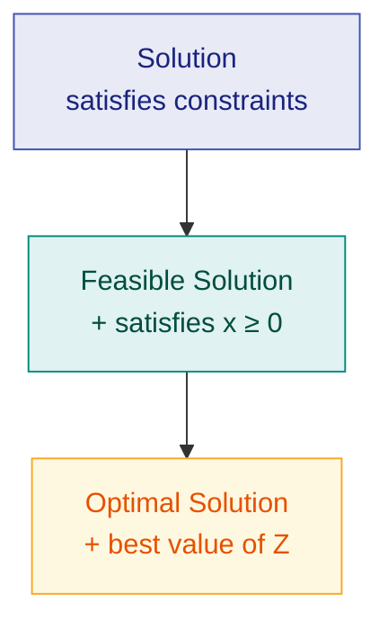
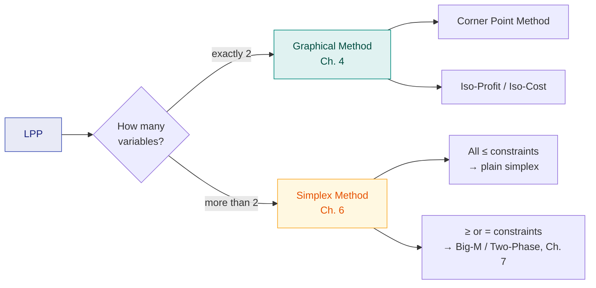

# 1. Introduction to Optimization & LPP

> **Syllabus:** From the beginning — up to duality
> **Source:** `OPTIMIZATION_CLASS_NOTE-1.pdf` (Class Note 1, NIT Manipur)

---

## 🎯 In one line

**Optimization** is finding the best possible solution — maximizing or minimizing an objective function — while satisfying all given constraints.

---

## 1. Concept

Real life constantly forces "best choice" decisions under limits:

1. A company wants **maximum profit**.
2. A factory wants **minimum production cost**.
3. A farmer wants **maximum crop yield**.

None of these are free choices — you have limited labour, raw material, money, machine time. The process of finding the best solution under such limits is called **optimization**.

**Example (Class Note 1, Example 1):** A shopkeeper sells two products.
- Profit from Product A = Rs. 50 per unit
- Profit from Product B = Rs. 40 per unit

The shopkeeper wants to produce them so total profit is maximum. That is an optimization problem.

Every optimization problem has three ingredients:

```
┌──────────────────────────────────────────────────┐
│  DECISION VARIABLES   what you control  (x₁, x₂…)│
│  OBJECTIVE FUNCTION   what you optimize    (Z)   │
│  CONSTRAINTS          the limits you face        │
└──────────────────────────────────────────────────┘
```

---

## 2. Classification of Optimization Problems

Classified by the nature of the objective function, the constraints, and the decision variables.

| # | Type | Meaning | Example |
|---|---|---|---|
| 1 | **Linear (LPP)** | Objective **and** all constraints are linear | Max $Z = 3x+2y$ s.t. $x+y \le 5,\ 2x+y \le 8,\ x,y \ge 0$ |
| 2 | **Nonlinear (NLPP)** | Nonlinear objective, or ≥1 nonlinear constraint | Min $f(x,y)=x^2+y^2$ s.t. $x+y \ge 2$ |
| 3 | **Constrained** | Optimized subject to one or more constraints | Min/Max $f(x)$ s.t. $g_i(x) \le 0,\ i=1,\dots,m$ |
| 4 | **Unconstrained** | No constraints on the decision variables | Min $f(x) = x^2 - 4x + 5$ |
| 5 | **Convex** | Convex objective + convex feasible region | Key property: **every local minimum is also the global minimum** |
| 6 | **Integer** | Some/all variables restricted to integers | Number of buses, workers, machines — must be whole numbers |
| 7 | **Dynamic** | Solved in stages; each stage's decision affects later stages | Dynamic Programming |

> ⭐ **Why convexity matters:** in a convex problem you never get trapped in a "local best that isn't the real best". Convex problems are generally much easier to solve than non-convex ones.

---

## 3. What is Linear Programming (LP)?

**Definition:** Linear Programming is a mathematical technique used to find the **maximum or minimum value of a linear function** while satisfying a set of **linear constraints**.

When both the objective and the restrictions are linear, we use LP to find the best solution.

**Applications:** Business, Manufacturing, Transportation, Agriculture, Banking, Production Planning and Scheduling.

### Linear Programming Problem (LPP)

**Definition:** An LPP is a problem in which we maximize or minimize a **linear objective function**, subject to a set of **linear constraints**.

---

## 4. Mathematical Description of a General LPP

Find the values of the decision variables $x_1, x_2, \dots, x_n$ which **maximize or minimize**

$$Z = c_1x_1 + c_2x_2 + \cdots + c_nx_n \tag{1}$$

subject to the linear constraints

$$
\begin{aligned}
a_{11}x_1 + a_{12}x_2 + \cdots + a_{1n}x_n &\le (=, \ge)\ b_1 \\
a_{21}x_1 + a_{22}x_2 + \cdots + a_{2n}x_n &\le (=, \ge)\ b_2 \\
&\ \ \vdots \\
a_{m1}x_1 + a_{m2}x_2 + \cdots + a_{mn}x_n &\le (=, \ge)\ b_m
\end{aligned}
\tag{2}
$$

together with the **non-negative restrictions**

$$x_1, x_2, \dots, x_n \ge 0 \tag{3}$$

where $a_{ij},\ b_i,\ c_j$ are known constants and $x_1,\dots,x_n$ are the decision variables.

| Part | Name |
|---|---|
| (1) — the function $Z$ | **Objective function** |
| (2) — the inequalities/equations | **Constraints** |
| (3) — the $\ge 0$ conditions | **Non-negative restrictions** |

### Matrix Form

$$\text{Optimize } Z = CX \quad \text{subject to } AX \le (=,\ge) b,\quad X \ge 0$$

| Symbol | Name | Shape |
|---|---|---|
| $A = [a_{ij}]_{m \times n}$ | **Coefficient matrix** | $m \times n$ |
| $C = \begin{bmatrix} c_1 & c_2 & \cdots & c_n \end{bmatrix}$ | **Cost (or price) vector** | $1 \times n$ |
| $b = \begin{bmatrix} b_1 \\ b_2 \\ \vdots \\ b_m \end{bmatrix}$ | **Requirement (or resource) vector** | $m \times 1$ |
| $X = \begin{bmatrix} x_1 \\ x_2 \\ \vdots \\ x_n \end{bmatrix}$ | **Decision variable vector** | $n \times 1$ |

---

## 5. Some Important Definitions ⭐

These get asked directly. Learn the exact wording.

| Term | Definition |
|---|---|
| **Solution** | A set of values assigned to $x_1,\dots,x_n$ that **satisfies all the constraints** of the LPP. |
| **Feasible Solution** | A solution that satisfies all the constraints **as well as** the non-negative restrictions $x_j \ge 0$. |
| **Optimal (Optimum) Solution** | A feasible solution that gives the **best possible value** of the objective function (max or min, as required). |
| **Unbounded Solution** | If $Z$ can be increased indefinitely (max) or decreased indefinitely (min) **without violating any constraint**. |
| **Fundamental Extreme Point Theorem** | If an optimal solution of an LPP exists, then **at least one optimal solution occurs at an extreme point (corner point)** of the feasible region. |



> ⭐ **The Extreme Point Theorem is the whole reason the graphical and simplex methods work.** You never have to check infinitely many feasible points — checking the corners is enough.

---

## 6. Methods for Solving an LPP

| Method | When to use | Note |
|---|---|---|
| **Graphical (Geometrical) Method** | Objective has only **two decision variables** | Three variables *can* be drawn, but it becomes difficult to visualise — so graphical is mainly for 2 variables. |
| **Simplex Method** | **Any** number of decision variables | The most powerful algebraic method. Starts with an initial feasible solution and improves it step by step until optimal. |



---

## 7. Worked Example — recognising problem type

**Q. Classify each and justify.**

| Problem | Type | Why |
|---|---|---|
| Max $Z = 3x + 2y$ s.t. $x+y \le 5$, $x,y\ge0$ | **Linear (LPP)** | Objective and all constraints linear |
| Min $f(x,y) = x^2+y^2$ s.t. $x+y \ge 2$ | **Nonlinear, constrained** | $x^2+y^2$ is nonlinear; a constraint is present |
| Min $f(x) = x^2-4x+5$ | **Nonlinear, unconstrained** | No constraints at all |
| Max profit, where $x$ = number of buses bought | **Integer** | You cannot buy 2.7 buses |

---

## 8. Common exam questions

1. **What is a Linear Programming Problem?** → Definition above.
2. **Write the mathematical form of a general L.P.P.** → Equations (1), (2), (3) + the three part-names.
3. **Write the matrix form of an LPP and name each component.** → $Z=CX$, $AX \le b$, $X \ge 0$; coefficient matrix, cost vector, requirement vector, decision variable vector.
4. **Define:** solution / feasible solution / optimal solution / unbounded solution.
5. **State the Fundamental Extreme Point Theorem.**
6. **Classify optimization problems.** → The 7-row table.
7. **Distinguish linear vs nonlinear optimization** with an example of each.
8. **Why is convex optimization easier?** → Every local minimum is the global minimum.

---

## ⚡ Quick revision

- **Optimization** = best solution, maximizing/minimizing an objective, subject to constraints.
- Three ingredients: **decision variables, objective function, constraints**.
- **LPP** = linear objective + linear constraints + $x \ge 0$.
- General form: maximize/minimize $Z = \sum c_jx_j$ s.t. $\sum a_{ij}x_j \le (=,\ge) b_i$, $x_j \ge 0$.
- Matrix form: $Z = CX$, $AX \le b$, $X \ge 0$. — $A$ coefficient, $C$ cost, $b$ requirement, $X$ decision.
- **Solution ⊃ Feasible ⊃ Optimal.**
- **Extreme Point Theorem:** an optimum, if it exists, sits at a corner point.
- **Unbounded** = $Z$ improves forever without breaking a constraint.
- 2 variables → **graphical**; any number → **simplex**.
- Convex ⇒ **local min = global min**.

---

**Next:** [2. LPP Formulation →](02-lpp-formulation.md)
