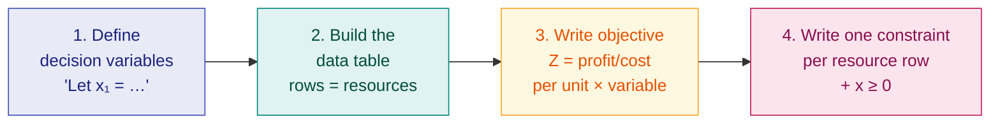

# 2. LPP Formulation

> **Syllabus:** From the beginning — up to duality
> **Source:** `OPTIMIZATION_CLASS_NOTE-1.pdf` (Question 5), `optimization__assignment_I.pdf` (Q5–Q8)

---

## 🎯 In one line

Formulation = turning a word problem into **decision variables + objective function + constraints + non-negativity**.

---

## 1. Concept

Formulation questions are guaranteed marks — the assignment has **four** of them (Q5, Q6, Q7, Q8). They need no clever maths, only a reliable routine.

### The 4-step routine



### The table trick ⭐

Always draw this table first. The constraints then read straight off the **rows**:

```
             ┌────────┬────────┬────────┬───────────┐
             │ Prod 1 │ Prod 2 │ Prod 3 │ Available │
             │  (x₁)  │  (x₂)  │  (x₃)  │           │
  ┌──────────┼────────┼────────┼────────┼───────────┤
  │Resource A│   a₁₁  │   a₁₂  │   a₁₃  │    b₁     │ → a₁₁x₁+a₁₂x₂+a₁₃x₃ ≤ b₁
  │Resource B│   a₂₁  │   a₂₂  │   a₂₃  │    b₂     │ → a₂₁x₁+a₂₂x₂+a₂₃x₃ ≤ b₂
  ├──────────┼────────┼────────┼────────┼───────────┤
  │ Profit   │   c₁   │   c₂   │   c₃   │     —     │ → Max Z = c₁x₁+c₂x₂+c₃x₃
  └──────────┴────────┴────────┴────────┴───────────┘
                                              ↑
                                    columns = products
                                    rows    = constraints
```

### Which way does the inequality point?

| Phrase in the question | Inequality |
|---|---|
| "available", "at most", "capacity", "in stock", "cannot exceed" | $\le$ |
| "minimum requirement", "at least", "must provide" | $\ge$ |
| "exactly", "must equal" | $=$ |
| Maximize **profit** | resources are limited → mostly $\le$ |
| Minimize **cost** | requirements must be met → mostly $\ge$ |

> ⚠️ **Common mistake:** a *maximize profit* problem uses $\le$ (you can't use more than you have). A *minimize cost* diet problem uses $\ge$ (you must meet the nutrition minimum). Getting this backwards loses all the marks.

---

## 2. Worked Example 1 — the tyre factory (Class Note 1, Question 5)

**Problem.** A tyre factory produces three types of tyres $T_1, T_2, T_3$. Three chemicals $C_1, C_2, C_3$ are required.
- One tyre of $T_1$ requires **2 units of $C_1$** and **3 units of $C_3$**.
- One tyre of $T_2$ requires **3 units of $C_1$**, **2 units of $C_2$**, **2 units of $C_3$**.
- One tyre of $T_3$ requires **5 units of $C_2$** and **4 units of $C_3$**.

Stock: 20 units of $C_1$, 25 units of $C_2$, 30 units of $C_3$.
Profit: $T_1$ = Rs. 6, $T_2$ = Rs. 10, $T_3$ = Rs. 8 per tyre.

Assuming all tyres can be sold, formulate as an LPP.

### Solution

**Step 1 — Decision variables.**
Let the factory produce $x_1$, $x_2$, $x_3$ tyres of types $T_1$, $T_2$, $T_3$ respectively.

**Step 2 — Data table.**

| Chemicals | $T_1$ ($x_1$) | $T_2$ ($x_2$) | $T_3$ ($x_3$) | Available |
|---|---|---|---|---|
| $C_1$ | 2 | 3 | 0 | 20 |
| $C_2$ | 0 | 2 | 5 | 25 |
| $C_3$ | 3 | 2 | 4 | 30 |
| **Profit (Rs./tyre)** | 6 | 10 | 8 | — |

**Step 3 — Objective function.**
Total profit $= 6x_1 + 10x_2 + 8x_3$. Since we want maximum profit:

$$\text{Maximize } Z = 6x_1 + 10x_2 + 8x_3$$

**Step 4 — Constraints, one per chemical.**

*Chemical $C_1$:* one $T_1$ needs 2 units, so $x_1$ tyres need $2x_1$. One $T_2$ needs 3 units, so $x_2$ tyres need $3x_2$. $T_3$ does not require $C_1$. Total required $= 2x_1 + 3x_2$. Only 20 units available:
$$2x_1 + 3x_2 \le 20$$

*Chemical $C_2$:* $T_2$ needs 2 units each → $2x_2$; $T_3$ needs 5 units each → $5x_3$. Total $= 2x_2 + 5x_3$. Only 25 available:
$$2x_2 + 5x_3 \le 25$$

*Chemical $C_3$:* $T_1 \to 3x_1$, $T_2 \to 2x_2$, $T_3 \to 4x_3$. Total $= 3x_1+2x_2+4x_3$. Only 30 available:
$$3x_1 + 2x_2 + 4x_3 \le 30$$

Since the number of tyres produced cannot be negative, $x_1, x_2, x_3 \ge 0$.

### ✅ Final model

$$
\begin{aligned}
\text{Maximize } && Z &= 6x_1 + 10x_2 + 8x_3 \\
\text{subject to } && 2x_1 + 3x_2 &\le 20 \\
&& 2x_2 + 5x_3 &\le 25 \\
&& 3x_1 + 2x_2 + 4x_3 &\le 30 \\
&& x_1, x_2, x_3 &\ge 0
\end{aligned}
$$

---

## 3. Worked Example 2 — maximization (Assignment Q5)

**Problem.** A factory produces two products A and B.
- Each unit of **A**: 2 h moulding, 3 h grinding, 4 h polishing.
- Each unit of **B**: 4 h moulding, 2 h grinding, 2 h polishing.

Available: moulding 20 h, grinding 24 h, polishing 13 h.
Profit: Rs. 5 per unit of A, Rs. 3 per unit of B. Formulate to maximize profit.

### Solution

Let $x_1$ = units of A produced, $x_2$ = units of B produced.

| Operation | A ($x_1$) | B ($x_2$) | Available (h) |
|---|---|---|---|
| Moulding | 2 | 4 | 20 |
| Grinding | 3 | 2 | 24 |
| Polishing | 4 | 2 | 13 |
| **Profit (Rs.)** | 5 | 3 | — |

$$
\begin{aligned}
\text{Maximize } && Z &= 5x_1 + 3x_2 \\
\text{subject to } && 2x_1 + 4x_2 &\le 20 &&\text{(moulding)} \\
&& 3x_1 + 2x_2 &\le 24 &&\text{(grinding)} \\
&& 4x_1 + 2x_2 &\le 13 &&\text{(polishing)} \\
&& x_1, x_2 &\ge 0
\end{aligned}
$$

---

## 4. Worked Example 3 — minimization / diet problem (Assignment Q6, second part)

**Problem.** Minimum daily requirement of vitamins A, B, C = 30, 20, 16 units. Two foods X and Y:
- 1 g of **X** provides 7, 5, 2 units of A, B, C.
- 1 g of **Y** provides 2, 4, 8 units of A, B, C.

Cost: X = Rs. 2/g, Y = Rs. 1/g. Minimize total expense.

### Solution

Let $x_1$ = grams of food X purchased per day, $x_2$ = grams of food Y.

| Vitamin | X ($x_1$) | Y ($x_2$) | Minimum required |
|---|---|---|---|
| A | 7 | 2 | 30 |
| B | 5 | 4 | 20 |
| C | 2 | 8 | 16 |
| **Cost (Rs./g)** | 2 | 1 | — |

> ⚠️ Note the flip: this is a **minimization** problem, so the constraints are $\ge$ — the diet must *at least* meet each requirement.

$$
\begin{aligned}
\text{Minimize } && Z &= 2x_1 + x_2 \\
\text{subject to } && 7x_1 + 2x_2 &\ge 30 &&\text{(vitamin A)} \\
&& 5x_1 + 4x_2 &\ge 20 &&\text{(vitamin B)} \\
&& 2x_1 + 8x_2 &\ge 16 &&\text{(vitamin C)} \\
&& x_1, x_2 &\ge 0
\end{aligned}
$$

---

## 5. Worked Example 4 — four operations (Assignment Q7)

**Problem.** A firm produces A and B; each needs Grinding, Turning, Assembling, Testing.

| Product | Grinding | Turning | Assembling | Testing |
|---|---|---|---|---|
| A | 1 | 3 | 4 | 5 |
| B | 2 | 1 | 3 | 4 |

Capacities: grinding 30 h, turning 60 h, assembling 200 h, testing 200 h.
Profit: A = Rs. 3, B = Rs. 2. Maximize profit.

### Solution

Let $x_1$ = units of A, $x_2$ = units of B.

> 💡 **Watch the table orientation.** Here products are **rows** and operations are **columns** — the opposite of the tyre table. Constraints come from **operations**, so you read down the *columns*.

$$
\begin{aligned}
\text{Maximize } && Z &= 3x_1 + 2x_2 \\
\text{subject to } && x_1 + 2x_2 &\le 30 &&\text{(grinding)} \\
&& 3x_1 + x_2 &\le 60 &&\text{(turning)} \\
&& 4x_1 + 3x_2 &\le 200 &&\text{(assembling)} \\
&& 5x_1 + 4x_2 &\le 200 &&\text{(testing)} \\
&& x_1, x_2 &\ge 0
\end{aligned}
$$

---

## 6. Worked Example 5 — unit conversion trap (Assignment Q8)

**Problem.** Metals iron, copper, zinc, manganese produce commodities A, B, C.

| Metal | A | B | C | Available |
|---|---|---|---|---|
| Iron | 40 | 70 | 50 | 1 metric ton |
| Copper | 30 | 14 | 18 | 5 quintals |
| Zinc | 7 | 0 | 8 | 2 quintals |
| Manganese | 4 | 9 | 0 | 2 quintals |
| **Profit (Rs.)** | 300 | 200 | 100 | — |

### Solution

> ⚠️ **The trap:** requirements are in **kg**, availability in **tons/quintals**. Convert first.
> **1 metric ton = 1000 kg**, **1 quintal = 100 kg** → copper $= 500$ kg, zinc $= 200$ kg, manganese $= 200$ kg.

Let $x_1, x_2, x_3$ = units of commodities A, B, C produced.

$$
\begin{aligned}
\text{Maximize } && Z &= 300x_1 + 200x_2 + 100x_3 \\
\text{subject to } && 40x_1 + 70x_2 + 50x_3 &\le 1000 &&\text{(iron, kg)} \\
&& 30x_1 + 14x_2 + 18x_3 &\le 500 &&\text{(copper, kg)} \\
&& 7x_1 \phantom{+ 70x_2} + 8x_3 &\le 200 &&\text{(zinc, kg)} \\
&& 4x_1 + 9x_2 &\le 200 &&\text{(manganese, kg)} \\
&& x_1, x_2, x_3 &\ge 0
\end{aligned}
$$

---

## 7. Common exam questions

1. **Formulate as an LPP** — any of the five patterns above. This is the most reliable question in the paper.
2. **Maximize-profit** problems → $\le$ constraints.
3. **Minimize-cost / diet** problems → $\ge$ constraints.
4. **Mixed problems** (Assignment Q6 first part: "at most 40 premium boards per week") → add a simple bound $x_2 \le 40$.

---

## ⚡ Quick revision

- **Routine:** define variables → data table → objective → one constraint per resource → $x \ge 0$.
- Always write **"Let $x_1$ = …"** explicitly. Marks are given for it.
- **Rows of the table = constraints. Columns = products.** Check which way the table is printed.
- Maximize profit → **$\le$** (limited resources). Minimize cost → **$\ge$** (minimum requirements).
- "at most / available / capacity" → $\le$ · "at least / minimum" → $\ge$ · "exactly" → $=$
- **Convert units** before writing constraints (ton → kg, quintal → kg).
- Never forget the **non-negativity restrictions** — they are part of the model.

---

**Previous:** [← 1. Introduction](01-introduction-to-optimization-and-lpp.md) · **Next:** [3. Basic Solutions & BFS →](03-basic-solutions-and-bfs.md)
