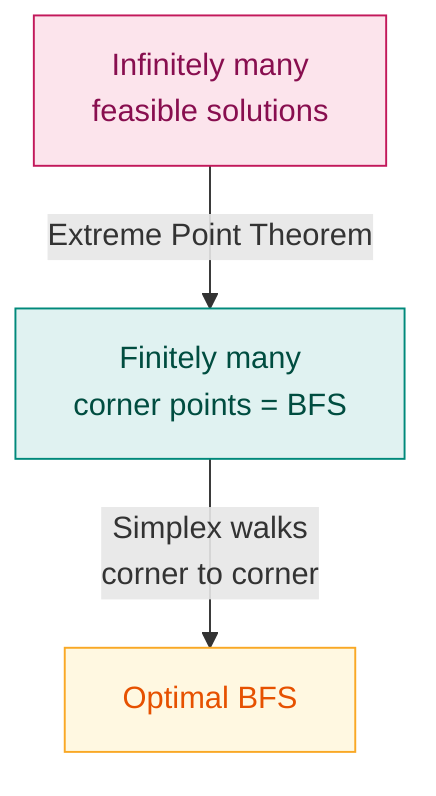

# 3. Basic Solutions & Basic Feasible Solutions

> **Syllabus:** From the beginning — up to duality
> **Source:** `OPTIMIZATION_CLASS_NOTE-1.pdf` (Examples 6–8), `Optimization _Class Note_II.pdf`

---

## 🎯 In one line

A **basic solution** picks $m$ linearly independent columns as a basis and sets the other $n-m$ variables to zero; if it is also non-negative, it is a **basic feasible solution (BFS)** — and the simplex method only ever visits these.

---

## 1. Concept — why bother?

An LPP can have **infinitely many** feasible solutions. Checking all of them is impossible.

But the **Fundamental Extreme Point Theorem** says the optimum sits at a *corner* of the feasible region — and corners correspond exactly to **basic feasible solutions**. There are only finitely many of those (at most $\binom{n}{m}$).



**That reduction is the whole idea behind the simplex method.**

---

## 2. Setup

Consider the system $AX = b$, where $A$ is $m \times n$, $X$ is the vector of unknowns, $b$ the constant vector. Assume $n > m$ and

$$\text{rank}(A) = \text{rank}(A|b) = m$$

This means the system is **consistent** and all equations are **linearly independent**.

---

## 3. Definitions ⭐

These are asked directly — the assignment has a whole question listing all six.

| Term | Definition |
|---|---|
| **Basic Solution** | Obtained by selecting any $m$ **linearly independent columns** of $A$. The variables for those columns are **basic variables**; the remaining $n-m$ are set to zero and called **non-basic variables**. If $B$ is the non-singular matrix of the selected columns, then $X_B = B^{-1}b$. |
| **Basic Variables** | The variables corresponding to the selected linearly independent columns. |
| **Non-basic Variables** | The variables set equal to zero. There are at least $n-m$ of them. |
| **Basic Feasible Solution (BFS)** | A solution that is **both** a basic solution **and** a feasible solution — i.e. a basic solution with all variables $\ge 0$. |
| **Optimal Basic Feasible Solution** | A BFS that gives the optimum (max or min) value of the objective function among all feasible solutions. |
| **Non-degenerate BFS** | All $m$ basic variables are **strictly positive** (none equals zero). |
| **Degenerate BFS** | **One or more** basic variables equals zero. |

> 📌 Every basic solution contains **at least $n-m$ variables equal to zero**.
> 📌 A basic solution is **not necessarily non-negative** — that is exactly what separates "basic" from "basic *feasible*".
> 📌 Since there are $m$ constraints, at most $m$ variables can be basic.

### The hierarchy

```
        ALL SOLUTIONS  (satisfy AX = b)
        ┌──────────────────────────────────────────┐
        │   BASIC SOLUTIONS                        │
        │   (n−m vars = 0, columns L.I.)           │
        │   ┌────────────────────────────────┐     │
        │   │  BASIC FEASIBLE SOLUTIONS      │     │
        │   │  (all vars ≥ 0)                │     │
        │   │  ┌──────────────────────┐      │     │
        │   │  │ OPTIMAL BFS          │      │     │
        │   │  │ (best Z)  ← answer   │      │     │
        │   │  └──────────────────────┘      │     │
        │   └────────────────────────────────┘     │
        └──────────────────────────────────────────┘
```

### Feasible vs Basic Feasible — the difference ⭐

| Feasible Solution | Basic Feasible Solution |
|---|---|
| Satisfies all constraints and $x \ge 0$ | Same, **plus** it is a basic solution |
| Can be **any** point in the feasible region | Only a **corner (extreme) point** |
| Infinitely many | At most $\binom{n}{m}$ — finitely many |
| Vectors of non-zero variables may be linearly **dependent** | Vectors of non-zero variables are linearly **independent** |
| Not necessarily optimal-candidate | The optimum is guaranteed to be among these |

---

## 4. How many basic solutions?

Choosing $m$ columns out of $n$:

$$\text{Number of basic solutions} \le \binom{n}{m} = \frac{n!}{m!\,(n-m)!}$$

It is "$\le$" and not "$=$" because some choices give a **singular** $B$ (determinant zero) — those do not form a basis and are rejected.

---

## 5. Worked Example 1 — basic solution by elimination (Example 6)

**Find a basic solution of** $x_1 + x_2 + x_3 = 4$, $\ 2x_1 + x_2 + 3x_3 = 7$.

Here $m = 2$, $n = 3$. Three variables, two equations → one variable must be non-basic.

**Choose $x_3$ as non-basic, set $x_3 = 0$:**

$$x_1 + x_2 = 4, \qquad 2x_1 + x_2 = 7$$

Subtracting the first from the second: $x_1 = 3$. Substituting: $x_2 = 1$.

$$\boxed{(x_1, x_2, x_3) = (3, 1, 0)}$$

Here $x_1, x_2$ are basic; $x_3$ is non-basic.

**Now instead choose $x_2 = 0$:**

$$x_1 + x_3 = 4, \qquad 2x_1 + 3x_3 = 7$$

Solving: $x_3 = -1$, $x_1 = 5$ → $(5, 0, -1)$.

> ⚠️ Notice $(5,0,-1)$ **is** a basic solution but **is not feasible**, because $x_3 = -1 < 0$. This is the concrete proof that *basic ≠ basic feasible*.

---

## 6. Worked Example 2 — identifying a BFS (Example 7)

**System:** $x_1+x_2+x_3 = 4$, $\ 2x_1+x_2+x_4 = 5$, $\ x_1,x_2,x_3,x_4 \ge 0$.

Here $m=2$, $n=4$, so every BFS must have at least $n - m = 2$ variables equal to zero.

Choose $x_3 = 0$, $x_4 = 0$:

$$x_1 + x_2 = 4, \qquad 2x_1 + x_2 = 5$$

Solving: $x_1 = 1$, $x_2 = 3$.

$$(x_1,x_2,x_3,x_4) = (1,3,0,0)$$

All variables are non-negative → this **is a basic feasible solution**.
Both basic variables ($x_1=1$, $x_2=3$) are strictly positive → it is **non-degenerate**.

**Contrast:** $(x_1,x_2,x_3,x_4) = (2,0,0,1)$ with $x_1, x_2$ chosen as basic variables. One basic variable ($x_2$) is zero → this is a **degenerate** BFS.

---

## 7. Worked Example 3 — find ALL basic solutions (Example 8) ⭐

This is the exact pattern of an assignment question. Learn this format.

**Find all the basic solutions of**
$$x_1 + 2x_2 + x_3 = 4, \qquad 2x_1 + x_2 + 5x_3 = 5$$
and state whether they are degenerate or non-degenerate.

### Solution

In matrix form $AX = b$ where

$$A = \begin{bmatrix} 1 & 2 & 1 \\ 2 & 1 & 5 \end{bmatrix},\quad X = \begin{bmatrix} x_1 \\ x_2 \\ x_3\end{bmatrix},\quad b = \begin{bmatrix} 4 \\ 5 \end{bmatrix}$$

$A$ is $2 \times 3$, so choose any **two** columns to form basis $B$. There are $\binom{3}{2} = 3$ possible choices.

---

**Case 1 — columns 1 and 2** (basic variables $x_1, x_2$; non-basic $x_3 = 0$)

$$B = \begin{bmatrix} 1 & 2 \\ 2 & 1 \end{bmatrix}, \qquad \det(B) = 1(1) - 2(2) = -3 \ne 0 \ \checkmark$$

$$B^{-1} = \frac{1}{-3}\begin{bmatrix} 1 & -2 \\ -2 & 1 \end{bmatrix}$$

$$X_B = B^{-1}b = \frac{1}{-3}\begin{bmatrix} 1 & -2 \\ -2 & 1\end{bmatrix}\begin{bmatrix}4\\5\end{bmatrix} = \frac{1}{-3}\begin{bmatrix}-6\\-3\end{bmatrix} = \begin{bmatrix}2\\1\end{bmatrix}$$

$$\boxed{(x_1,x_2,x_3) = (2,\,1,\,0)}$$

---

**Case 2 — columns 1 and 3** (basic $x_1, x_3$; non-basic $x_2 = 0$)

$$B = \begin{bmatrix} 1 & 1 \\ 2 & 5 \end{bmatrix}, \qquad \det(B) = 5 - 2 = 3 \ne 0 \ \checkmark$$

$$B^{-1} = \frac{1}{3}\begin{bmatrix} 5 & -1 \\ -2 & 1 \end{bmatrix}$$

$$X_B = \frac{1}{3}\begin{bmatrix} 5 & -1 \\ -2 & 1\end{bmatrix}\begin{bmatrix}4\\5\end{bmatrix} = \frac{1}{3}\begin{bmatrix}15\\-3\end{bmatrix} = \begin{bmatrix}5\\-1\end{bmatrix}$$

$$\boxed{(x_1,x_2,x_3) = (5,\,0,\,-1)}$$

---

**Case 3 — columns 2 and 3** (basic $x_2, x_3$; non-basic $x_1 = 0$)

$$B = \begin{bmatrix} 2 & 1 \\ 1 & 5 \end{bmatrix}, \qquad \det(B) = 10 - 1 = 9 \ne 0 \ \checkmark$$

$$B^{-1} = \frac{1}{9}\begin{bmatrix} 5 & -1 \\ -1 & 2 \end{bmatrix}$$

$$X_B = \frac{1}{9}\begin{bmatrix} 5 & -1 \\ -1 & 2\end{bmatrix}\begin{bmatrix}4\\5\end{bmatrix} = \frac{1}{9}\begin{bmatrix}15\\6\end{bmatrix} = \begin{bmatrix}5/3\\2/3\end{bmatrix}$$

$$\boxed{(x_1,x_2,x_3) = \left(0,\ \tfrac{5}{3},\ \tfrac{2}{3}\right)}$$

---

### ✅ Summary table

| Case | Basic vars | Basic solution | Feasible? | Degenerate? |
|---|---|---|---|---|
| 1 | $x_1, x_2$ | $(2,\ 1,\ 0)$ | ✅ Yes — a **BFS** | Non-degenerate (both $> 0$) |
| 2 | $x_1, x_3$ | $(5,\ 0,\ -1)$ | ❌ No ($x_3 < 0$) | Non-degenerate (both $\ne 0$) |
| 3 | $x_2, x_3$ | $(0,\ \tfrac53,\ \tfrac23)$ | ✅ Yes — a **BFS** | Non-degenerate (both $> 0$) |

**Conclusion:** there are **3 basic solutions**, of which **2 are basic feasible solutions**. In every case both basic variables are non-zero, so **all three are non-degenerate**. ∎

---

## 8. Reducing a feasible solution to a BFS

A feasible solution that is *not* basic has linearly **dependent** column vectors among its non-zero variables. We drive one variable to zero to fix that.

### Procedure

1. Write $\alpha_1x_1 + \alpha_2x_2 + \cdots = b$, where $\alpha_j$ is column $j$ of $A$.
2. The $\alpha_j$ of the non-zero variables are dependent, so write one as a combination of the others: $\alpha_1 = a\alpha_2 + b\alpha_3$.
3. Rearrange into $\sum \lambda_i \alpha_i = 0$ and read off $\lambda_1, \lambda_2, \dots$
4. Apply the rule below to decide which variable becomes zero.
5. Eliminate that column and read off the new solution.

> **Rule.** Define
> $$\nu = \max_{1 \le i \le n}\left(\frac{\lambda_i}{x_i}\right)$$
> The variable $x_i$ corresponding to the **maximum** value of $\lambda_i / x_i$ is set equal to zero.

6. Verify the remaining columns are linearly independent ($\det \ne 0$) — then it is a BFS.

A full numeric run of this appears in [Chapter 10, Q13](10-assignment-question-bank.md).

---

## 9. Common exam questions

1. **Define** feasible / optimum / basic feasible / optimal basic feasible / non-degenerate BFS / degenerate BFS. *(straight from the table)*
2. **Differentiate** a feasible solution from a basic feasible solution. *(the comparison table)*
3. **Find all basic solutions** of a given system and prove they are non-degenerate. *(Worked Example 3 — use the $B^{-1}b$ format)*
4. **Find all basic feasible solutions** of a system.
5. **Show that a given point is a feasible solution** → just substitute into each constraint and check $\ge 0$.
6. **Reduce a given feasible solution to a BFS.** *(Section 8)*
7. **State the Fundamental Theorem of LPP.**

---

## ⚡ Quick revision

- $AX = b$, $A$ is $m \times n$, $n > m$, rank $= m$.
- **Basic solution:** pick $m$ L.I. columns → $B$; set other $n-m$ variables to 0; $X_B = B^{-1}b$.
- Number of basic solutions $\le \binom{n}{m}$ (singular $B$ ⇒ rejected).
- **Basic + all $\ge 0$ = BFS.** Basic solutions can be negative; BFS cannot.
- **Non-degenerate:** every basic variable $> 0$. **Degenerate:** some basic variable $= 0$.
- Every basic solution has **at least $n-m$ zeros**; at most $m$ variables are basic.
- BFS ⟷ **corner point** of the feasible region. Simplex hops from one BFS to a better one.
- Feasible ≠ Basic Feasible: feasible is any point in the region; basic feasible is a *corner*.
- To reduce FS → BFS: express dependence, compute $\nu = \max(\lambda_i/x_i)$, zero that variable.

---

**Previous:** [← 2. LPP Formulation](02-lpp-formulation.md) · **Next:** [4. Graphical Method →](04-graphical-method.md)
