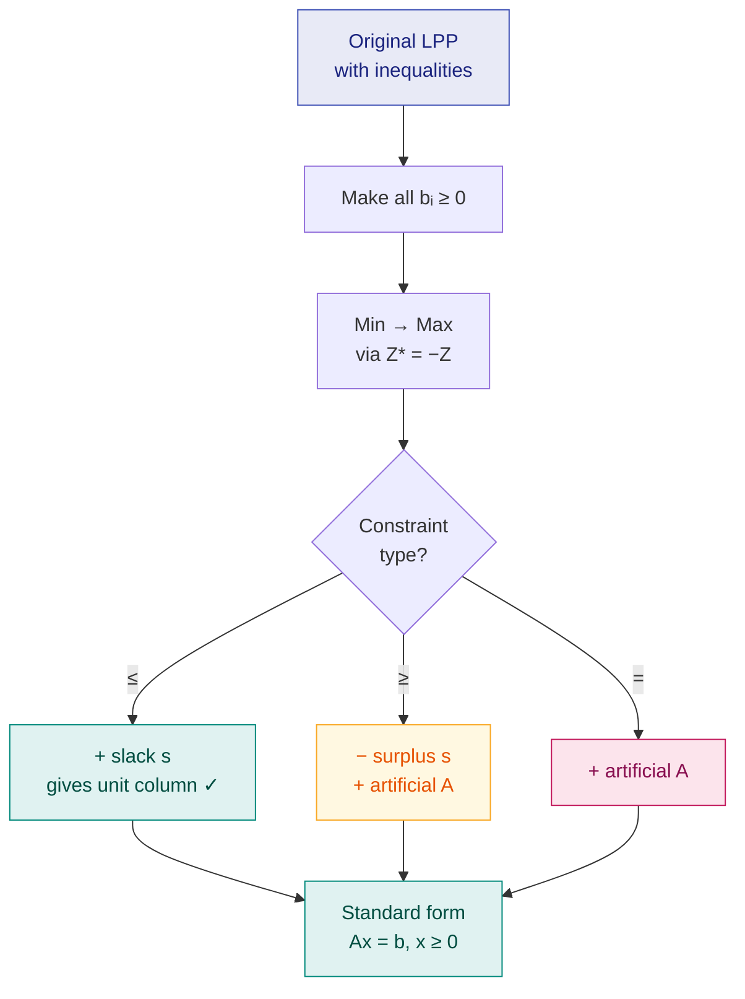

# 5. Standard Form, Slack & Surplus Variables

> **Syllabus:** From the beginning — up to duality · *Simplex portion: study only from class notes*
> **Source:** `Optimization _Class Note_II.pdf`, `OPtimization_class_notes_III.pdf`

---

## 🎯 In one line

Before simplex can run, every inequality must become an **equation** — add a **slack** variable to $\le$, subtract a **surplus** variable from $\ge$, and add an **artificial** variable wherever no ready-made unit column exists.

---

## 1. Concept

The simplex method works on **equations**, not inequalities, and it needs an identity matrix to start from. Converting the problem is therefore step zero of every simplex question.

---

## 2. Slack Variable

If a constraint has the form

$$a_1x_1 + \cdots + a_nx_n \le b$$

we **add** a non-negative variable:

$$a_1x_1 + \cdots + a_nx_n + s = b, \qquad s \ge 0$$

The variable $s$ is called a **slack variable**.

$$\boxed{\le \ \longrightarrow\ +\ \text{slack variable}}$$

**Meaning:** a slack variable measures **unused capacity**. If a machine has 20 hours available and you use 17, the slack is 3.

### Example

$$
\begin{aligned}
\text{Maximize } && Z &= 2x_1 + 3x_2 + 4x_3 \\
\text{s.t. } && x_1 + x_2 + x_3 &\le b_1 \\
&& 2x_1 + 4x_2 - x_3 &\le b_2, \qquad x_1,x_2,x_3 \ge 0
\end{aligned}
$$

Introduce $x_4, x_5$:

$$x_1 + x_2 + x_3 + x_4 = b_1, \qquad 2x_1 + 4x_2 - x_3 + x_5 = b_2$$

where $x_4, x_5 \ge 0$. Thus $x_4$ and $x_5$ are **slack variables**.

---

## 3. Surplus Variable

If a constraint has the form

$$a_1x_1 + \cdots + a_nx_n \ge b$$

we **subtract** a non-negative variable:

$$a_1x_1 + \cdots + a_nx_n - s = b, \qquad s \ge 0$$

The variable $s$ is called a **surplus variable**.

$$\boxed{\ge \ \longrightarrow\ -\ \text{surplus variable}}$$

**Meaning:** a surplus variable measures the amount **above a minimum requirement**. If the diet must provide at least 30 units of vitamin A and it provides 34, the surplus is 4.

### Example

$$
\begin{aligned}
\text{Maximize } && Z &= 2x_1 + 4x_2 + 4x_3 \\
\text{s.t. } && x_1 + x_2 + 2x_3 &\le b_1 \\
&& 2x_1 + 4x_2 + 6x_3 &\ge b_2 \\
&& x_1 - 2x_2 + 4x_3 &\ge b_3
\end{aligned}
$$

Introduce $x_4$ as a slack variable and $x_5, x_6$ as surplus variables:

$$
\begin{aligned}
x_1 + x_2 + 2x_3 + x_4 &= b_1 \\
2x_1 + 4x_2 + 6x_3 - x_5 &= b_2 \\
x_1 - 2x_2 + 4x_3 - x_6 &= b_3
\end{aligned}
$$

Hence $x_4$ is a **slack** variable and $x_5, x_6$ are **surplus** variables.

---

## 4. Artificial Variable

**Definition:** An artificial variable is a **temporary** non-negative variable added with coefficient $+1$ when a constraint does not supply a convenient basic unit column. Its purpose is **only** to create an initial basis. It has **no physical meaning** in the original problem, so its value must become **zero** before the original problem is solved.

### Why surplus alone is not enough ⭐

This is the key insight examiners test. Consider $x_1 + 2x_2 \ge 6$. Subtract a surplus:

$$x_1 + 2x_2 - s_1 = 6$$

To start simplex we set the non-basic variables to zero: $x_1 = x_2 = 0$, which gives

$$-s_1 = 6 \quad\Longrightarrow\quad s_1 = -6$$

which **violates $s_1 \ge 0$**. The surplus variable therefore **cannot** give an initial B.F.S. — its column is $[-1]$, not a unit column. So we add an artificial variable $A_1$:

$$x_1 + 2x_2 - s_1 + A_1 = 6$$

Now the artificial column has coefficient $+1$, and the temporary initial B.F.S. is

$$x_1 = x_2 = s_1 = 0, \qquad A_1 = 6$$

> ⚠️ This point is feasible only for the **enlarged artificial problem**, not the original one. The simplex procedure must later force $A_1 = 0$.

### Example — an equality constraint

Consider $x_1 + x_2 \le 4$, $\ 2x_1 + x_2 = 5$.

After adding a slack to the first row, its column is $[1, 0]^T$ — but there is **no second basic unit column**. Add $A_2$ to the equality:

$$x_1 + x_2 + s_1 = 4, \qquad 2x_1 + x_2 + A_2 = 5$$

The columns of $s_1$ and $A_2$ now form $I_2$. The temporary initial basis is $\{s_1, A_2\}$ with

$$x_1 = x_2 = 0, \quad s_1 = 4, \quad A_2 = 5$$

---

## 5. The master summary table ⭐

| Constraint type | Add / subtract | Artificial needed? | Resulting form |
|---|---|---|---|
| $a^Tx \le b_i$ | $+$ slack $s_i$ | ❌ No — slack already gives a unit column | $a^Tx + s_i = b_i$ |
| $a^Tx \ge b_i$ | $-$ surplus $s_i$ | ✅ **Yes** — surplus coefficient is $-1$, using it as basic gives $-b_i$ | $a^Tx - s_i + A_i = b_i$, initially $A_i = b_i$ |
| $a^Tx = b_i$ | nothing | ✅ **Yes** — no slack column is produced at all | $a^Tx + A_i = b_i$, initially $A_i = b_i$ |

$$\boxed{\le \ \to\ +s \qquad\qquad \ge\ \to\ -s + A \qquad\qquad =\ \to\ +A}$$

### The three variables compared

| | Slack | Surplus | Artificial |
|---|---|---|---|
| **Sign in constraint** | $+$ | $-$ | $+$ |
| **Used for** | $\le$ | $\ge$ | $\ge$ and $=$ |
| **Physical meaning** | Unused capacity | Excess over requirement | **None** — purely a computational device |
| **Objective coefficient** | $0$ | $0$ | $-M$ (max) / $+M$ (min) |
| **Must leave the basis?** | No | No | **Yes** — must become $0$ |

> ⭐ **If an artificial variable is still positive in the final solution, the original LPP is infeasible.** (An artificial variable remaining basic at value *zero* is only degeneracy, not infeasibility.)

---

## 6. Pre-processing rules before simplex

**Rule 1 — make every $b_i$ non-negative.** If $b_i < 0$, multiply the whole constraint by $-1$ **and reverse the inequality sign**. For example:

$$7x_1 - 8x_2 \le -3 \qquad\Longrightarrow\qquad -7x_1 + 8x_2 \ge 3$$

**Rule 2 — convert minimization to maximization.**

$$\min Z = -\max(-Z)$$

If the problem is a minimization, maximize $Z^* = -Z$. **If $Z^*_{\max} = v$, then $Z_{\min} = -v$.**

> 📌 This is Assignment Q3: *"What is the relation between the optimum value of a maximization problem and a minimization problem?"* → $\min Z = -\max(-Z)$.

---

## 7. Standard Matrix Form

After introducing slack or surplus variables, consider an LPP with $m$ constraints and $N$ variables, where $N = m + n$. It can be written as

$$\boxed{\text{Maximize } Z = \mathbf{cx} \quad\text{subject to}\quad A\mathbf{x} = \mathbf{b},\qquad \mathbf{x} \ge 0}$$

where $A = [a_{ij}]_{m \times N}$.

### Standard form requirements

| Requirement | Why |
|---|---|
| Objective is **maximization** | Simplex optimality test is written for max |
| All constraints are **equations** | Simplex operates on equations |
| All variables $\ge 0$ | Non-negativity is assumed throughout |
| All $b_i \ge 0$ | Otherwise the initial basic solution is negative → not a BFS |

### Canonical vs Standard form

| | **Canonical form** | **Standard form** |
|---|---|---|
| Constraints | Inequalities ($\le$ for max, $\ge$ for min) | **Equations** |
| Variables | $x \ge 0$ | $x \ge 0$, including slack/surplus/artificial |
| Used for | Stating the problem, **duality** | **Simplex computation** |

---

## 8. Worked Example — full conversion to standard form

**Convert to standard form:**

$$
\begin{aligned}
\text{Minimize } && Z &= 3x_1 + 2x_2 \\
\text{s.t. } && x_1 + x_2 &\le 4 \\
&& x_1 + 3x_2 &\ge 6 \\
&& 2x_1 + x_2 &= 5 \\
&& x_1, x_2 &\ge 0
\end{aligned}
$$

**Step 1 — Min → Max.** Maximize $Z^* = -3x_1 - 2x_2$. *(Remember: $Z_{\min} = -Z^*_{\max}$ at the end.)*

**Step 2 — all $b_i \ge 0$ already** ($4, 6, 5$) ✓

**Step 3 — convert each constraint:**

| Original | Type | Conversion |
|---|---|---|
| $x_1 + x_2 \le 4$ | $\le$ | $x_1 + x_2 + s_1 = 4$ |
| $x_1 + 3x_2 \ge 6$ | $\ge$ | $x_1 + 3x_2 - s_2 + A_2 = 6$ |
| $2x_1 + x_2 = 5$ | $=$ | $2x_1 + x_2 + A_3 = 5$ |

**✅ Standard form:**

$$
\begin{aligned}
\text{Maximize } && Z^* &= -3x_1 - 2x_2 + 0s_1 + 0s_2 - MA_2 - MA_3 \\
\text{s.t. } && x_1 + x_2 + s_1 &= 4 \\
&& x_1 + 3x_2 - s_2 + A_2 &= 6 \\
&& 2x_1 + x_2 + A_3 &= 5 \\
&& x_1, x_2, s_1, s_2, A_2, A_3 &\ge 0
\end{aligned}
$$

**Initial basis:** $\{s_1, A_2, A_3\}$ — their columns form $I_3$. Initial B.F.S.:

$$x_1 = x_2 = s_2 = 0, \qquad s_1 = 4,\quad A_2 = 6,\quad A_3 = 5$$

---

## 9. Common exam questions

1. **Define slack variable and surplus variable.** *(Assignment question — give definition + sign + meaning + example.)*
2. **When are artificial variables introduced in an LPP?** → For $\ge$ and $=$ constraints, where no unit column is otherwise available. Explain the $s_1 = -6$ argument.
3. **Write the standard form of a general LPP.** *(Assignment Q4)*
4. **What is the relation between the optimum of a max and a min problem?** *(Assignment Q3)* → $\min Z = -\max(-Z)$.
5. **Convert the following LPP to standard form.**
6. **Distinguish slack, surplus and artificial variables.** *(the 5-row comparison table)*

---

## ⚡ Quick revision

- $\le\ \to +\text{slack}$ · $\ge\ \to -\text{surplus} + \text{artificial}$ · $=\ \to +\text{artificial}$
- **Slack** = unused capacity · **Surplus** = excess over minimum · **Artificial** = no meaning, computational only
- Surplus alone fails because its column is $-1$: setting others to zero gives $s = -b < 0$, not a BFS.
- Artificial variables have objective coefficient $-M$ (max) or $+M$ (min), and **must leave the basis**.
- Artificial positive at the optimum ⇒ **infeasible**. Artificial basic at value $0$ ⇒ only **degeneracy**.
- Make all $b_i \ge 0$ first: multiply by $-1$ **and flip the inequality**.
- $\min Z = -\max(-Z)$; if $\max(-Z) = v$ then $\min Z = -v$.
- Standard form: **Max** $Z = cx$, $Ax = b$, $x \ge 0$, all $b_i \ge 0$.

---

**Previous:** [← 4. Graphical Method](04-graphical-method.md) · **Next:** [6. Simplex Method →](06-simplex-method.md)
