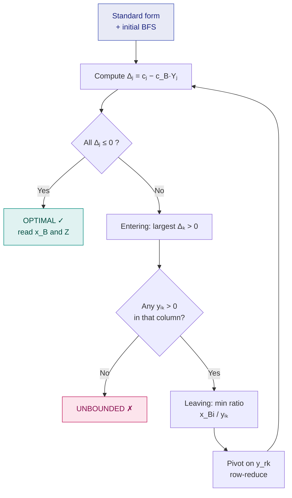

# 6. The Simplex Method

> **Syllabus:** *"For the Simplex Method and Revised Simplex Method portion, study **only from the class notes**."*
> **Source:** `Optimization _Class Note_II.pdf`, `OPtimization_class_notes_III.pdf`

---

## 🎯 In one line

Start at a basic feasible solution and **hop from corner to corner**, each time improving $Z$, until no positive $\Delta_j$ remains — that corner is optimal.

---

## 1. Why we need it

An LPP may have **infinitely many** feasible solutions, so checking every one is impractical.

The **Fundamental Theorem of Linear Programming** states: *if an LPP has an optimal feasible solution, then at least one **Basic Feasible Solution (BFS)** is optimal.*

So instead of searching among all feasible solutions, we search only among the **basic** feasible solutions — and there are finitely many.

The **Simplex Method** (also called the Simplex Algorithm) was developed by **George B. Dantzig in 1947**. It is an **iterative** procedure that starts with an initial B.F.S. and moves from one B.F.S. to another, improving the objective-function value until an optimal B.F.S. is obtained.

### Advantages over the graphical method ⭐

| | Graphical | Simplex |
|---|---|---|
| Variables handled | Only **2** | **Any number** |
| Nature | Drawing, visual | **Systematic algebraic** procedure |
| Accuracy | Limited by reading the graph | Exact |
| Detects unbounded / infeasible | By inspection only | **Automatically**, via a clear test |

> 📌 The simplex method does **not** examine all feasible solutions — it moves systematically from one B.F.S. to another. It can also indicate whether the problem has an **unbounded** solution.

---

## 2. Notation and the core formulas ⭐⭐

Write the LPP in standard form: maximize $Z = c^Tx$, $Ax = b$, $x \ge 0$.

Choose $m$ linearly independent columns of $A$ to form the **basis matrix $B$**. The corresponding variables are **basic**; the rest are **non-basic**. Setting the non-basic variables to zero gives $x_B = B^{-1}b$. This is a B.F.S. when $x_B \ge 0$. If a basic variable is zero, the B.F.S. is **degenerate**.

**Memorise these four:**

$$\boxed{\;x_B = B^{-1}b \qquad Y_j = B^{-1}\alpha_j \qquad Z = c_B^T x_B \qquad \Delta_j = c_j - c_B^T Y_j\;}$$

| Symbol | Meaning |
|---|---|
| $\alpha_j$ | Column $j$ of the constraint matrix |
| $Y_j$ | The **transformed** column $j$ |
| $c_B$ | Objective coefficients of the **basic** variables |
| $\Delta_j$ | **Reduced cost** — how much $Z$ improves per unit of $x_j$ entering |

> 💡 For a usual all-$\le$ starting solution, the **slack variables form the basis** and $c_B = 0$. Therefore initially $Z = 0$ and $\Delta_j = c_j$ — which makes the first table very quick to write.

---

## 3. The simplex table layout

```
        ┌──────┬──────┬────────────────────────────────┬──────────┐
   cⱼ → │      │      │  c₁    c₂   …   cₙ  │ 0   0    │          │
        ├──────┼──────┼─────────────────────┼──────────┼──────────┤
   c_B  │Basis │ x_B  │  y₁₁   y₁₂  …  y₁ₙ  │ 1   0    │  Ratio   │
        │      │      │  y₂₁   y₂₂  …  y₂ₙ  │ 0   1    │ x_Bi/yik │
        ├──────┼──────┼─────────────────────┴──────────┼──────────┤
        │ Z =  │c_B·x_B│  Δ₁    Δ₂   …   Δₙ   Δₙ₊₁ …   │          │
        └──────┴──────┴────────────────────────────────┴──────────┘
                            ↑ pivot column (largest Δⱼ > 0)
```

---

## 4. Optimality test ⭐

Using the convention $\Delta_j = c_j - c_B^TY_j$ for a **maximization** problem:

| Condition | Conclusion |
|---|---|
| $\Delta_j \le 0$ for **all** $j$ | The current B.F.S. is **optimal** |
| Every non-basic $\Delta_j < 0$ | The optimal solution is **unique** |
| Some non-basic $\Delta_j = 0$ at an optimum | An **alternative optimal solution** may exist |
| At least one $\Delta_j > 0$ | Not optimal — proceed to improve |
| Entering column has $\Delta_k > 0$ but **every** $y_{ik} \le 0$ | No leaving variable exists → **unbounded** |
| Phase I ends with $W^* > 0$, or an artificial variable is positive at the Big-M optimum | **No feasible solution** |

> ⚠️ An artificial variable may remain basic at value **zero** because of degeneracy; this alone does **not** imply infeasibility.

---

## 5. Selection rules for one iteration ⭐

| Item | Rule |
|---|---|
| **Entering variable** | Select $x_k$ with the **largest positive** reduced cost: $\Delta_k = \max\{\Delta_j : \Delta_j > 0\}$ |
| **Leaving variable** | Select row $r$ by the **minimum ratio test**: $\dfrac{x_{Br}}{y_{rk}} = \min\limits_i \left\{ \dfrac{x_{Bi}}{y_{ik}} : y_{ik} > 0 \right\}$. **Ignore zero and negative denominators.** |
| **Pivot element** | The element $y_{rk}$ at the intersection of the entering column and leaving row. Divide the pivot row by $y_{rk}$, then make all other entries in that column zero by row operations. |

> 📌 **Ties.** If the *minimum ratio* is tied, the next B.F.S. may be **degenerate**. If the *largest positive $\Delta_j$* is tied, any tied column may be chosen; a consistent rule such as **Bland's rule** helps prevent **cycling**.

---

## 6. Complete computational procedure ⭐

This is the answer to *"Give the computational procedure for the simplex method."*

| Step | Procedure |
|---|---|
| **1** | If necessary, convert minimization into maximization using $Z^* = -Z$. |
| **2** | Make every right-hand side $b_i$ non-negative. Multiply a negative row by $-1$ and reverse its inequality. |
| **3** | Convert every constraint into an equation using slack, surplus, and when needed artificial variables. |
| **4** | Find an initial basis and calculate $x_B = B^{-1}b$. If artificial variables occur, use the **two-phase** or **Big-M** method. |
| **5** | Construct the simplex table and calculate $Y_j$, $Z$, and every $\Delta_j = c_j - c_B^TY_j$. |
| **6** | **Test optimality.** If all $\Delta_j \le 0$, the current B.F.S. is optimal. |
| **7** | If some $\Delta_j > 0$, choose the column with the **largest positive** $\Delta_j$ as the entering column $Y_k$. |
| **8** | Choose the leaving row by the **minimum positive-ratio test**, pivot on the intersection entry, and construct the revised table. |
| **9** | Recalculate the reduced costs and repeat Steps 6–8 until an optimum is obtained, or the problem is found to be unbounded or infeasible. |



---

## 7. Fully worked example ⭐⭐

$$
\begin{aligned}
\text{Maximize } && Z &= 5x_1 + 4x_2 \\
\text{subject to } && 6x_1 + 4x_2 &\le 24 \\
&& x_1 + 2x_2 &\le 6 \\
&& x_1, x_2 &\ge 0
\end{aligned}
$$

### Step 1 — Standard form

Both constraints are $\le$ with $b_i \ge 0$, so add slack variables $s_1, s_2$:

$$
\begin{aligned}
6x_1 + 4x_2 + s_1 &= 24 \\
x_1 + 2x_2 + s_2 &= 6 \\
x_1, x_2, s_1, s_2 &\ge 0
\end{aligned}
$$

$$\text{Maximize } Z = 5x_1 + 4x_2 + 0s_1 + 0s_2$$

**Initial basis** $\{s_1, s_2\}$ (their columns form $I_2$), so $c_B = (0,0)$ and $x_B = (24, 6)$, giving $Z = 0$ and $\Delta_j = c_j$.

---

### Table 1 (initial)

| $c_B$ | Basis | $x_B$ | $x_1$ **(5)** | $x_2$ (4) | $s_1$ (0) | $s_2$ (0) | Ratio $x_{Bi}/y_{i1}$ |
|---|---|---|---|---|---|---|---|
| 0 | $s_1$ | 24 | **6** ← pivot | 4 | 1 | 0 | $24/6 = 4$ ← **min** |
| 0 | $s_2$ | 6 | 1 | 2 | 0 | 1 | $6/1 = 6$ |
| | $Z = 0$ | | $\Delta_1 = 5$ ⭐ | $\Delta_2 = 4$ | $0$ | $0$ | |

- **Entering:** $\Delta_1 = 5$ is the largest positive → **$x_1$ enters**.
- **Leaving:** ratios $24/6=4$ and $6/1=6$; minimum is $4$ → **$s_1$ leaves** (row 1).
- **Pivot element** $= 6$.

**Row operations.** New $R_1 = R_1 / 6$:
$$(1,\ \tfrac23,\ \tfrac16,\ 0 \mid 4)$$
New $R_2 = R_2 - 1 \times$ new $R_1$:
$$(0,\ \tfrac43,\ -\tfrac16,\ 1 \mid 2)$$

---

### Table 2

| $c_B$ | Basis | $x_B$ | $x_1$ (5) | $x_2$ **(4)** | $s_1$ (0) | $s_2$ (0) | Ratio $x_{Bi}/y_{i2}$ |
|---|---|---|---|---|---|---|---|
| 5 | $x_1$ | 4 | 1 | $\tfrac23$ | $\tfrac16$ | 0 | $4 \div \tfrac23 = 6$ |
| 0 | $s_2$ | 2 | 0 | $\mathbf{\tfrac43}$ ← pivot | $-\tfrac16$ | 1 | $2 \div \tfrac43 = \tfrac32$ ← **min** |
| | $Z = 20$ | | $0$ | $\Delta_2 = \tfrac23$ ⭐ | $-\tfrac56$ | $0$ | |

**Check the $\Delta_j$ row:** $c_B = (5, 0)$.
- $\Delta_1 = 5 - (5)(1) - (0)(0) = 0$
- $\Delta_2 = 4 - (5)(\tfrac23) - (0)(\tfrac43) = 4 - \tfrac{10}{3} = \tfrac23$
- $\Delta_{s_1} = 0 - (5)(\tfrac16) - (0)(-\tfrac16) = -\tfrac56$
- $\Delta_{s_2} = 0 - 0 - 0 = 0$
- $Z = c_B^Tx_B = 5(4) + 0(2) = 20$

$\Delta_2 = \tfrac23 > 0$ → not optimal. **$x_2$ enters**, **$s_2$ leaves**, pivot $= \tfrac43$.

**Row operations.** New $R_2 = R_2 \div \tfrac43$:
$$(0,\ 1,\ -\tfrac18,\ \tfrac34 \mid \tfrac32)$$
New $R_1 = R_1 - \tfrac23 \times$ new $R_2$:
$$\left(1,\ 0,\ \tfrac16 + \tfrac1{12},\ -\tfrac12 \;\middle|\; 4 - 1\right) = \left(1,\ 0,\ \tfrac14,\ -\tfrac12 \mid 3\right)$$

---

### Table 3 (final)

| $c_B$ | Basis | $x_B$ | $x_1$ (5) | $x_2$ (4) | $s_1$ (0) | $s_2$ (0) |
|---|---|---|---|---|---|---|
| 5 | $x_1$ | 3 | 1 | 0 | $\tfrac14$ | $-\tfrac12$ |
| 4 | $x_2$ | $\tfrac32$ | 0 | 1 | $-\tfrac18$ | $\tfrac34$ |
| | $Z = 21$ | | $0$ | $0$ | $-\tfrac34$ | $-\tfrac12$ |

**Check:** $c_B = (5,4)$.
- $\Delta_{s_1} = 0 - \left[5(\tfrac14) + 4(-\tfrac18)\right] = -\left[\tfrac54 - \tfrac12\right] = -\tfrac34$
- $\Delta_{s_2} = 0 - \left[5(-\tfrac12) + 4(\tfrac34)\right] = -\left[-\tfrac52 + 3\right] = -\tfrac12$
- $Z = 5(3) + 4(\tfrac32) = 15 + 6 = 21$

**All $\Delta_j \le 0$ → OPTIMAL.**

### ✅ Answer

$$\boxed{x_1 = 3,\qquad x_2 = \tfrac32,\qquad Z_{\max} = 21}$$

**Verification:** $6(3) + 4(1.5) = 24 \le 24$ ✓ (binding) · $3 + 2(1.5) = 6 \le 6$ ✓ (binding) · $Z = 15+6 = 21$ ✓

> 📌 Both slacks are zero at the optimum, so both resources are fully used. Both non-basic $\Delta_j$ are strictly negative, so the optimum is **unique**.

---

## 8. Reading the final table

| Look at | To find |
|---|---|
| $x_B$ column | Values of the basic variables |
| Variables not in Basis | Equal to **zero** |
| $Z$ cell | Optimal objective value |
| $\Delta_j$ of a **slack** | Its magnitude = the **dual variable / shadow price** of that constraint ([Ch. 9](09-duality.md)) |
| Slack value $> 0$ | That resource is **not** fully used |
| Non-basic $\Delta_j = 0$ | **Alternative optimum** exists |

---

## 9. Common exam questions

1. **Solve the following LPP by the simplex method.** → the full table procedure above.
2. **Give the computational procedure for the simplex method.** → the 9-step table.
3. **State the Fundamental Theorem of LPP.** → If an optimal feasible solution exists, at least one B.F.S. is optimal.
4. **Give three advantages of the simplex method over the graphical method.** → any number of variables; systematic algebraic procedure; automatic detection of unboundedness/infeasibility.
5. **How do you detect an unbounded solution in the simplex table?** → $\Delta_k > 0$ but every $y_{ik} \le 0$ in that column.
6. **How do you detect alternative optima?** → a **non-basic** variable has $\Delta_j = 0$ at the optimum.
7. **What is degeneracy?** → a basic variable equals zero; arises from a **tie in the minimum ratio test**.

---

## ⚡ Quick revision

- **Fundamental Theorem:** if an optimum exists, some **B.F.S.** is optimal → search corners only.
- Dantzig, **1947**. Iterative: BFS → better BFS → … → optimal BFS.
- **Four formulas:** $x_B = B^{-1}b$, $Y_j = B^{-1}\alpha_j$, $Z = c_B^Tx_B$, $\Delta_j = c_j - c_B^TY_j$.
- Initial all-$\le$ table: slacks are basic, $c_B = 0$, so $Z = 0$ and $\Delta_j = c_j$.
- **Optimal (max)** when **all $\Delta_j \le 0$**.
- **Entering** = largest positive $\Delta_j$. **Leaving** = min ratio $x_{Bi}/y_{ik}$ over **$y_{ik} > 0$ only**.
- **Pivot:** divide pivot row by pivot element, then clear the rest of that column.
- $\Delta_k > 0$ but all $y_{ik} \le 0$ ⇒ **unbounded**.
- Non-basic $\Delta_j = 0$ at optimum ⇒ **alternative optima**.
- Tie in min ratio ⇒ **degeneracy**; use Bland's rule to avoid **cycling**.

---

**Previous:** [← 5. Standard Form](05-standard-form-slack-surplus.md) · **Next:** [7. Big-M & Two-Phase →](07-big-m-and-two-phase.md)
