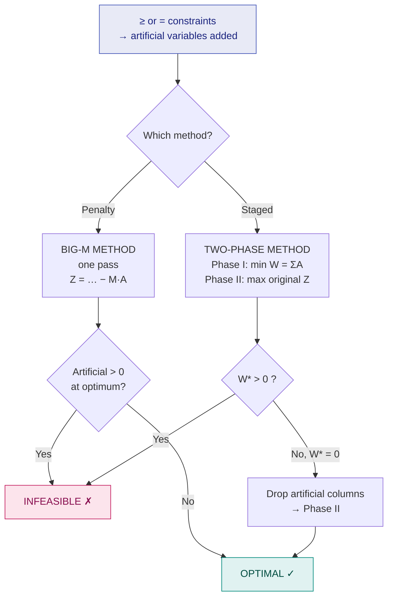

# 7. Artificial Variables — Big-M & Two-Phase Methods

> **Syllabus:** *Simplex portion: study only from the class notes*
> **Source:** `OPtimization_class_notes_III.pdf`, `optimization IV.pdf` (Class Notes IV)

---

## 🎯 In one line

When $\ge$ or $=$ constraints leave us without a starting identity matrix, add **artificial variables** to manufacture one — then use **Big-M** (penalty) or **Two-Phase** (minimise them away) to drive them back to zero.

---

## 1. The problem artificial variables solve

In the simplex method we need an initial B.F.S. to start. For a $\le$ constraint, a slack variable usually provides a starting basic variable. However, when a constraint contains $\ge$ or $=$, **the required identity matrix may not be obtained directly**.

**Artificial Variable:** a temporary variable introduced into a constraint **only** for the purpose of obtaining an initial basic feasible solution. Artificial variables have **no physical meaning** in the original LPP, so they must be removed from the basis during the simplex iterations.

### When do we introduce them? ⭐

| Case | Constraint | What happens | Result |
|---|---|---|---|
| **1** | $ax + by \le c$ | Add slack $s$: $ax+by+s=c$ | $\le\ \to\ +$ slack. **No artificial normally required.** |
| **2** | $ax + by \ge c$ | Subtract surplus $s$: $ax+by-s=c$. This does **not** give a suitable basic variable | $\ge\ \to\ -$ surplus $+$ **artificial** $A$ |
| **3** | $ax + by = c$ | Neither slack nor surplus exists | $=\ \to\ +$ **artificial** $A$ |

$$\boxed{\le \to +s \qquad \ge \to -s+A \qquad = \to +A}$$

> ⚠️ **Why the surplus alone fails.** For $x_1+2x_2 \ge 6$ we get $x_1+2x_2-s_1=6$. Setting $x_1=x_2=0$ gives $s_1 = -6 < 0$ — not feasible. The surplus column is $[-1]$, not a unit column. Adding $A_1$ with coefficient $+1$ fixes it: initial B.F.S. $x_1=x_2=s_1=0$, $A_1=6$.

---

## 2. Two routes to remove them

---

## 3. The Big-M Method

The Big-M Method solves LPPs in which artificial variables are required. $M$ represents a **very large positive number**. Since artificial variables do not belong to the original LPP, a **very large penalty** is assigned to them in the objective function.

$$\boxed{\text{For maximization: coefficient } = -M \qquad \text{For minimization: coefficient } = +M}$$

**Example.** If Maximize $Z = 3x_1 + 5x_2$ and $A_1, A_2$ are artificial variables, the modified objective is

$$Z = 3x_1 + 5x_2 - MA_1 - MA_2$$

Because we want the artificial variables to become zero, the large penalty $M$ **forces them to leave the basis** during the iterations. Once an artificial variable leaves the basis, it is normally **not allowed to enter again**.

### Steps of the Big-M Method

| Step | Action |
|---|---|
| 1 | Convert the problem to standard form. |
| 2 | Make all $b_i \ge 0$. |
| 3 | For a $\le$ constraint, add a slack variable. |
| 4 | For a $\ge$ constraint, **subtract a surplus** variable and **add an artificial** variable. |
| 5 | For an **equality** constraint, add an artificial variable. |
| 6 | Modify the objective by assigning a large penalty: $-MA_i$ for maximization, $+MA_i$ for minimization. |
| 7 | Form the initial simplex table (artificial + slack columns form the basis). |
| 8–11 | Apply the usual entering / leaving / pivot rules. Treat $M$ as larger than any number. |
| 12 | Repeat until the optimality condition is satisfied. |

> ⭐ **Infeasibility test.** At the end of the Big-M method, **all artificial variables must be removed from the basis**. If an artificial variable remains in the final basis **with a positive value**, the original LPP has **no feasible solution**.
> $$\text{Positive artificial variable in final solution} \Longrightarrow \text{L.P.P. is infeasible}$$
>
> ⚠️ An artificial variable may remain basic with value **zero** because of **degeneracy** — this does **not** imply infeasibility.

### Handling $M$ in arithmetic

Write each $\Delta_j$ as $(\text{number}) + (\text{coefficient})M$ and compare **the $M$ part first**, since $M$ is arbitrarily large.

$$7M - 4 \ >\ 4M - 1 \quad\text{because } 7 > 4$$

---

## 4. The Two-Phase Method

Instead of a penalty, we remove the artificial variables in a **separate first stage**.

**Phase I.** Ignore the original objective. Minimise the sum of the artificial variables:

$$\text{Minimize } W = A_1 + A_2 + \cdots$$

- If the minimum $W^* = 0$, then all artificial variables are zero. **Delete their columns** and proceed to Phase II.
- If $W^* > 0$, the original constraints are **infeasible** — stop.

**Phase II.** Starting from the B.F.S. found in Phase I, maximise the **original** objective $Z$ using the ordinary simplex method.

### Example of the setup (from Class Notes III)

$$
\begin{aligned}
\text{maximize } && Z &= 3x_1 + 2x_2 \\
&& x_1 + x_2 &\le 4, \quad x_1 + 3x_2 \ge 6, \quad 2x_1 + x_2 = 5, \quad x_1,x_2 \ge 0
\end{aligned}
$$

The equations become

$$x_1 + x_2 + s_1 = 4, \qquad x_1 + 3x_2 - s_2 + A_2 = 6, \qquad 2x_1 + x_2 + A_3 = 5$$

The initial basis is $\{s_1, A_2, A_3\}$ with $s_1 = 4$, $A_2 = 6$, $A_3 = 5$.

- **Two-phase:** in Phase I minimise $W = A_2 + A_3$; here the initial value is $W = 6 + 5 = 11$.
- **Big-M:** use $Z_M = 3x_1 + 2x_2 - MA_2 - MA_3$ with $M > 0$ very large.

### Big-M vs Two-Phase

| | **Big-M** | **Two-Phase** |
|---|---|---|
| Passes | **One** | **Two** |
| Objective | Original $Z$ with $\mp M A_i$ penalties | Phase I: $\min W = \sum A_i$; Phase II: original $Z$ |
| Arithmetic | Must carry $M$ symbolically | Plain numbers — less error-prone |
| Infeasible when | An artificial is $> 0$ at the optimum | $W^* > 0$ |
| Best for | Short problems | Larger problems, computer implementation |

---

## 5. Fully worked Big-M example ⭐⭐

$$
\begin{aligned}
\text{Minimize } && Z &= 4x_1 + x_2 \\
\text{subject to } && 3x_1 + x_2 &= 3 \\
&& 4x_1 + 3x_2 &\ge 6 \\
&& x_1 + 2x_2 &\le 4 \\
&& x_1, x_2 &\ge 0
\end{aligned}
$$

### Step 1 — convert to maximization

$$\text{Maximize } Z^* = -4x_1 - x_2 \qquad (\text{then } Z_{\min} = -Z^*_{\max})$$

### Step 2 — standard form

| Constraint | Type | Conversion |
|---|---|---|
| $3x_1 + x_2 = 3$ | $=$ | $3x_1 + x_2 + A_1 = 3$ |
| $4x_1 + 3x_2 \ge 6$ | $\ge$ | $4x_1 + 3x_2 - s_1 + A_2 = 6$ |
| $x_1 + 2x_2 \le 4$ | $\le$ | $x_1 + 2x_2 + s_2 = 4$ |

$$\text{Maximize } Z^* = -4x_1 - x_2 + 0s_1 + 0s_2 - MA_1 - MA_2$$

**Initial basis** $\{A_1, A_2, s_2\}$, $c_B = (-M, -M, 0)$, $x_B = (3, 6, 4)$, $Z^* = -9M$.

---

### Table 1

| $c_B$ | Basis | $x_B$ | $x_1$ $(-4)$ | $x_2$ $(-1)$ | $s_1$ $(0)$ | $A_1$ $(-M)$ | $A_2$ $(-M)$ | $s_2$ $(0)$ | Ratio |
|---|---|---|---|---|---|---|---|---|---|
| $-M$ | $A_1$ | 3 | **3** ← pivot | 1 | 0 | 1 | 0 | 0 | $3/3 = 1$ ← **min** |
| $-M$ | $A_2$ | 6 | 4 | 3 | $-1$ | 0 | 1 | 0 | $6/4 = 1.5$ |
| $0$ | $s_2$ | 4 | 1 | 2 | 0 | 0 | 0 | 1 | $4/1 = 4$ |
| | $Z^*=-9M$ | | $7M-4$ ⭐ | $4M-1$ | $-M$ | $0$ | $0$ | $0$ |

$\Delta_1 = -4 - [(-M)(3)+(-M)(4)] = 7M-4$ — the largest (biggest $M$ coefficient) → **$x_1$ enters**, **$A_1$ leaves**, pivot $=3$.

$R_1 \to R_1/3$; $R_2 \to R_2 - 4R_1$; $R_3 \to R_3 - R_1$.

---

### Table 2

| $c_B$ | Basis | $x_B$ | $x_1$ | $x_2$ | $s_1$ | $A_2$ | $s_2$ | Ratio |
|---|---|---|---|---|---|---|---|---|
| $-4$ | $x_1$ | 1 | 1 | $\tfrac13$ | 0 | 0 | 0 | $1 \div \tfrac13 = 3$ |
| $-M$ | $A_2$ | 2 | 0 | $\mathbf{\tfrac53}$ ← pivot | $-1$ | 1 | 0 | $2 \div \tfrac53 = 1.2$ ← **min** |
| $0$ | $s_2$ | 3 | 0 | $\tfrac53$ | 0 | 0 | 1 | $3 \div \tfrac53 = 1.8$ |
| | $Z^*=-4-2M$ | | $0$ | $\tfrac53M + \tfrac13$ ⭐ | $-M$ | $0$ | $0$ |

$\Delta_2 = -1 - [(-4)(\tfrac13) + (-M)(\tfrac53)] = \tfrac53M + \tfrac13 > 0$ → **$x_2$ enters**, **$A_2$ leaves**, pivot $=\tfrac53$.

*(Column $A_1$ dropped — an artificial variable that has left the basis never re-enters.)*

$R_2 \to R_2 \div \tfrac53$; $R_1 \to R_1 - \tfrac13 R_2$; $R_3 \to R_3 - \tfrac53 R_2$.

---

### Table 3

Both artificial variables are now out of the basis — drop their columns.

| $c_B$ | Basis | $x_B$ | $x_1$ | $x_2$ | $s_1$ | $s_2$ | Ratio |
|---|---|---|---|---|---|---|---|
| $-4$ | $x_1$ | $\tfrac35$ | 1 | 0 | $\tfrac15$ | 0 | $\tfrac35 \div \tfrac15 = 3$ |
| $-1$ | $x_2$ | $\tfrac65$ | 0 | 1 | $-\tfrac35$ | 0 | negative → skip |
| $0$ | $s_2$ | 1 | 0 | 0 | **1** ← pivot | 1 | $1/1 = 1$ ← **min** |
| | $Z^*=-\tfrac{18}{5}$ | | $0$ | $0$ | $\tfrac15$ ⭐ | $0$ |

$\Delta_{s_1} = 0 - \left[(-4)(\tfrac15) + (-1)(-\tfrac35)\right] = -\left[-\tfrac45 + \tfrac35\right] = \tfrac15 > 0$ → **$s_1$ enters**, **$s_2$ leaves**, pivot $= 1$.

$R_1 \to R_1 - \tfrac15 R_3$; $R_2 \to R_2 + \tfrac35 R_3$.

---

### Table 4 (final)

| $c_B$ | Basis | $x_B$ | $x_1$ | $x_2$ | $s_1$ | $s_2$ |
|---|---|---|---|---|---|---|
| $-4$ | $x_1$ | $\tfrac25$ | 1 | 0 | 0 | $-\tfrac15$ |
| $-1$ | $x_2$ | $\tfrac95$ | 0 | 1 | 0 | $\tfrac35$ |
| $0$ | $s_1$ | 1 | 0 | 0 | 1 | 1 |
| | $Z^*=-\tfrac{17}{5}$ | | $0$ | $0$ | $0$ | $-\tfrac15$ |

$\Delta_{s_2} = 0 - \left[(-4)(-\tfrac15) + (-1)(\tfrac35)\right] = -\left[\tfrac45 - \tfrac35\right] = -\tfrac15$

**All $\Delta_j \le 0$ → OPTIMAL.** No artificial variable remains in the basis ✓

### ✅ Answer

$$Z^*_{\max} = -\tfrac{17}{5} \quad\Longrightarrow\quad \boxed{Z_{\min} = \tfrac{17}{5} = 3.4,\qquad x_1 = \tfrac25,\quad x_2 = \tfrac95}$$

**Verification:**
- $3(\tfrac25) + \tfrac95 = \tfrac65 + \tfrac95 = 3$ ✓ (equality holds)
- $4(\tfrac25) + 3(\tfrac95) = \tfrac85 + \tfrac{27}{5} = 7 \ge 6$ ✓ (surplus $s_1 = 1$, matching the table)
- $\tfrac25 + 2(\tfrac95) = \tfrac25 + \tfrac{18}{5} = 4 \le 4$ ✓ (binding, $s_2 = 0$)
- $Z = 4(\tfrac25) + \tfrac95 = \tfrac85+\tfrac95 = \tfrac{17}{5}$ ✓

---

## 6. Common exam questions

1. **When are artificial variables introduced in an LPP?** *(Assignment question)* → for $\ge$ and $=$ constraints; explain the $s_1 = -6$ failure.
2. **Explain the Big-M method with its steps.** → the 12-step table + the $\mp M$ rule.
3. **Solve the following LPP by the Big-M method.** → the full worked run above.
4. **Explain the Two-Phase method.** → Phase I minimise $W = \sum A_i$; $W^*=0$ → Phase II, else infeasible.
5. **Distinguish Big-M from the Two-Phase method.** → the comparison table.
6. **How do you detect infeasibility?** → artificial positive at the Big-M optimum, or $W^* > 0$ in Phase I.
7. **Why must artificial variables leave the basis?** → they have no physical meaning; a positive artificial means the original constraints cannot be satisfied.

---

## ⚡ Quick revision

- **Artificial variable** = temporary, coefficient $+1$, only to build an initial basis. **No physical meaning.**
- $\le \to +s$ (no artificial) · $\ge \to -s + A$ · $= \to +A$
- **Big-M:** penalty $-MA_i$ for max, $+MA_i$ for min. $M$ is arbitrarily large — compare the $M$ parts first.
- Once an artificial leaves the basis, it **never re-enters**; drop its column.
- **Big-M infeasibility:** artificial variable **positive** in the final basis.
- **Two-Phase:** Phase I minimise $W = \sum A_i$. $W^* = 0$ → drop artificials → Phase II. $W^* > 0$ → **infeasible**.
- Artificial basic at value **zero** = **degeneracy**, not infeasibility.
- For a min problem: solve $\max(-Z)$, then negate at the very end.

---

**Previous:** [← 6. Simplex Method](06-simplex-method.md) · **Next:** [8. Revised Simplex Method →](08-revised-simplex-method.md)
