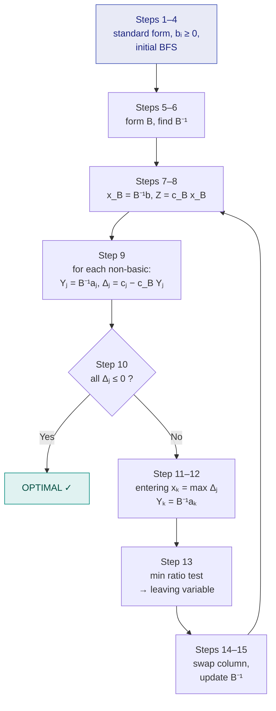

# 8. The Revised Simplex Method

> **Syllabus:** *"For the Simplex Method and Revised Simplex Method portion, study **only from the class notes**."*
> **Source:** `optimization IV.pdf` (Class Notes IV)

---

## 🎯 In one line

Same algorithm as ordinary simplex, but instead of rewriting the whole tableau each iteration we keep only $B^{-1}$ and compute **just the columns we actually need** — $x_B = B^{-1}b$, $Y_j = B^{-1}a_j$, $\Delta_j = c_j - c_BB^{-1}a_j$.

---

## 1. Introduction

The Revised Simplex Method is an **improved computational form** of the ordinary simplex method.

The ordinary simplex method works with the **complete simplex table at every iteration**. However, a large part of the information in that table is **not required** for deciding the entering and leaving variables. The main idea is:

> **Compute and store only the information required at the current iteration, instead of computing the entire simplex table.**

Hence the revised simplex method is particularly useful for solving **large** LPPs with the help of computers.

### Why is it called "revised"?

The method follows **essentially the same principle** as the ordinary simplex method — the difference lies mainly in the **computational procedure**.

| | Ordinary simplex | Revised simplex |
|---|---|---|
| After every pivot | The complete tableau is updated | We work mainly with $B$, $B^{-1}$, $x_B$, $Y_j = B^{-1}a_j$, and $\Delta_j = c_j - Z_j$ |

Unnecessary calculations involving the complete tableau are avoided.

---

## 2. Standard Forms

| Form | When used |
|---|---|
| **Standard Form I** | An initial BFS can be obtained using only **slack or surplus** variables — artificial variables are **not** required. |
| **Standard Form II** | **Artificial variables are required** to obtain an initial basis. They are handled by the Two-Phase Method or another artificial-variable technique. |

---

## 3. Standard Form I — the theory ⭐

Consider: Maximize $Z = c_1x_1 + \cdots + c_nx_n$ subject to $\sum_j a_{ij}x_j \le b_i$, $x_j \ge 0$.

**1. Matrix form.** After introducing slack variables: $Ax = b$, $x \ge 0$, $Z = c^Tx$.

**2. Basis Matrix.** The columns of $A$ corresponding to the current basic variables $x_{B1},\dots,x_{Bm}$ form the basis matrix

$$B = \begin{bmatrix} \alpha_1 & \alpha_2 & \cdots & \alpha_m \end{bmatrix}$$

$B$ is an $m \times m$ **nonsingular** matrix, so $B^{-1}$ exists. **The revised simplex method uses $B^{-1}$ instead of repeatedly writing the entire tableau.**

**3. Basic Solution.** Since $Bx_B = b$:

$$\boxed{x_B = B^{-1}b}$$

For a **basic feasible** solution we require $x_B = B^{-1}b \ge 0$.

**4. Objective value.** With $c_B = \begin{bmatrix} c_{B1} & \cdots & c_{Bm}\end{bmatrix}$:

$$\boxed{Z = c_Bx_B = c_BB^{-1}b}$$

**5. Computation for a non-basic variable.** For a column $a_j$ of a non-basic $x_j$:

$$Y_j = B^{-1}a_j, \qquad Z_j = c_BY_j, \qquad \boxed{\Delta_j = c_j - Z_j = c_j - c_BB^{-1}a_j}$$

> ⭐ **This is one of the most important formulas in the revised simplex method.**

**6. Optimality Test.** For maximization, the current BFS is **optimal if $\Delta_j \le 0$ for every non-basic variable**. If some $\Delta_j > 0$, the solution can still be improved.

**7. Entering Variable.** Select the non-basic variable with the **largest positive** $\Delta_j$:

$$\Delta_k = \max\{\Delta_j : \Delta_j > 0\}$$

Then $x_k$ enters. The column needed for the ratio test is $Y_k = B^{-1}a_k$.

**8. Leaving Variable — minimum ratio test.**

$$\theta = \min_{y_{ik} > 0} \frac{(x_B)_i}{y_{ik}}$$

The basic variable corresponding to the minimum positive ratio leaves. The element at the intersection of the entering column and leaving row is the **pivot (key) element**.

**9. Unbounded Solution.** If $\Delta_k > 0$ for an entering variable but **all** components of $Y_k = B^{-1}a_k$ satisfy $y_{ik} \le 0$, no positive ratio can be formed → the objective can increase without bound → **unbounded solution**.

---

## 4. Computational procedure (16 steps) ⭐

| Step | Action |
|---|---|
| 1 | If minimization, convert to maximization form if required. |
| 2 | Convert constraints into equations with slack/surplus/artificial variables. |
| 3 | Ensure $b_i \ge 0$. |
| 4 | Identify an initial basic feasible solution. |
| 5 | Form the initial basis matrix $B$. |
| 6 | Find $B^{-1}$. |
| 7 | Compute $x_B = B^{-1}b$. |
| 8 | Compute $Z = c_Bx_B$. |
| 9 | For every non-basic $x_j$: $Y_j = B^{-1}a_j$, $Z_j = c_BY_j$, $\Delta_j = c_j - Z_j$. |
| 10 | Optimality test: if $\Delta_j \le 0$ for all non-basic $j$, current solution is optimal. |
| 11 | Else choose the largest positive $\Delta_j$ → entering variable. |
| 12 | For entering $x_k$, calculate $Y_k = B^{-1}a_k$. |
| 13 | Minimum ratio test $\theta = \min_{y_{ik}>0}(x_B)_i / y_{ik}$ → leaving variable. |
| 14 | Replace the leaving column of the basis by the entering column → new basis matrix. |
| 15 | Compute or update the new $B^{-1}$. |
| 16 | Repeat until $\Delta_j \le 0$ for all non-basic variables. |

---

## 5. Ordinary vs Revised Simplex ⭐

| Ordinary Simplex Method | Revised Simplex Method |
|---|---|
| The complete simplex tableau is constructed | The complete tableau is generally **not required** |
| Most entries are recalculated at every iteration | Only the quantities required for the current iteration are calculated |
| Requires more storage for large problems | Requires **less storage** |
| May involve many unnecessary arithmetic calculations | **Avoids** many unnecessary calculations |
| Convenient for small problems and hand calculations | More suitable for **large problems and computers** |
| Works directly with the simplex table | Mainly works with $B^{-1}$, $x_B$, $Y_j$ and reduced costs |

### Advantages of the Revised Simplex Method

1. **Less computation** — does not calculate every entry of the complete tableau each iteration.
2. **Less computer memory** — only the basis matrix, its inverse and the required vectors are stored.
3. **Efficient for large problems** — avoids storing a very large table.
4. **Suitable for computer implementation** — mainly matrix and vector operations.
5. **Same principle as the simplex method** — entering/leaving rules are essentially unchanged.
6. **Only necessary information is computed.**

---

## 6. Fully worked example (Class Notes IV, Example 1) ⭐⭐

$$
\begin{aligned}
\text{Maximize } && Z &= x_1 + 2x_2 \\
\text{subject to } && x_1 + x_2 &\le 3 \\
&& x_1 + 2x_2 &\le 5 \\
&& 3x_1 + x_2 &\le 6 \\
&& x_1, x_2 &\ge 0
\end{aligned}
$$

### Step 1 — standard form

Introduce slack variables $x_3, x_4, x_5$:

$$x_1+x_2+x_3 = 3, \qquad x_1+2x_2+x_4 = 5, \qquad 3x_1+x_2+x_5 = 6$$

$$A = \begin{bmatrix} 1&1&1&0&0 \\ 1&2&0&1&0 \\ 3&1&0&0&1\end{bmatrix},\quad b = \begin{bmatrix}3\\5\\6\end{bmatrix},\quad c = \begin{bmatrix}1&2&0&0&0\end{bmatrix}$$

All constraints are $\le$ with $b_i \ge 0$, so no artificial variables are needed → **Standard Form I**.

---

### Iteration 1

**Basis** $\{x_3, x_4, x_5\}$ → $B = I_3$, so $B^{-1} = I_3$, and $c_B = (0,0,0)$.

$$x_B = B^{-1}b = \begin{bmatrix}3\\5\\6\end{bmatrix}, \qquad Z = c_Bx_B = 0$$

**Reduced costs.** Since $c_B = 0$, every $Z_j = 0$, so $\Delta_j = c_j$:

$$\Delta_1 = 1, \qquad \Delta_2 = 2 \ \ ⭐$$

$\Delta_2 = 2$ is the largest positive → **$x_2$ enters**.

$$Y_2 = B^{-1}a_2 = a_2 = \begin{bmatrix}1\\2\\1\end{bmatrix}$$

**Minimum ratio test:**

$$\theta = \min\left\{\frac{3}{1},\ \frac{5}{2},\ \frac{6}{1}\right\} = \min\{3,\ 2.5,\ 6\} = 2.5 \ \text{(row 2)}$$

→ **$x_4$ leaves**, pivot element $= 2$.

---

### Iteration 2

**New basis** $\{x_3, x_2, x_5\}$:

$$B = \begin{bmatrix} 1&1&0 \\ 0&2&0 \\ 0&1&1 \end{bmatrix}, \qquad \det(B) = 2 \ne 0$$

**Find $B^{-1}$** by row-reducing $[B \mid I]$:

$$
\left[\begin{array}{ccc|ccc}
1&1&0 & 1&0&0\\
0&2&0 & 0&1&0\\
0&1&1 & 0&0&1
\end{array}\right]
\xrightarrow{R_2 \to R_2/2}
\xrightarrow[R_3 \to R_3 - R_2]{R_1 \to R_1 - R_2}
\left[\begin{array}{ccc|ccc}
1&0&0 & 1&-\tfrac12&0\\
0&1&0 & 0&\tfrac12&0\\
0&0&1 & 0&-\tfrac12&1
\end{array}\right]
$$

$$B^{-1} = \begin{bmatrix} 1&-\tfrac12&0 \\ 0&\tfrac12&0 \\ 0&-\tfrac12&1\end{bmatrix}$$

**Current basic solution:**

$$x_B = B^{-1}b = \begin{bmatrix} 1&-\tfrac12&0 \\ 0&\tfrac12&0 \\ 0&-\tfrac12&1\end{bmatrix}\begin{bmatrix}3\\5\\6\end{bmatrix} = \begin{bmatrix} 3 - \tfrac52 \\ \tfrac52 \\ -\tfrac52 + 6\end{bmatrix} = \begin{bmatrix} \tfrac12 \\ \tfrac52 \\ \tfrac72\end{bmatrix}$$

So $x_3 = \tfrac12$, $x_2 = \tfrac52$, $x_5 = \tfrac72$. With $c_B = (0, 2, 0)$:

$$Z = c_Bx_B = 0\left(\tfrac12\right) + 2\left(\tfrac52\right) + 0\left(\tfrac72\right) = 5$$

**Reduced costs for the non-basic variables $x_1$ and $x_4$:**

$$Y_1 = B^{-1}a_1 = \begin{bmatrix} 1&-\tfrac12&0 \\ 0&\tfrac12&0 \\ 0&-\tfrac12&1\end{bmatrix}\begin{bmatrix}1\\1\\3\end{bmatrix} = \begin{bmatrix} \tfrac12 \\ \tfrac12 \\ \tfrac52 \end{bmatrix}$$

$$Z_1 = c_BY_1 = 0\left(\tfrac12\right) + 2\left(\tfrac12\right) + 0\left(\tfrac52\right) = 1 \quad\Longrightarrow\quad \Delta_1 = c_1 - Z_1 = 1 - 1 = 0$$

$$Y_4 = B^{-1}a_4 = \begin{bmatrix} 1&-\tfrac12&0 \\ 0&\tfrac12&0 \\ 0&-\tfrac12&1\end{bmatrix}\begin{bmatrix}0\\1\\0\end{bmatrix} = \begin{bmatrix} -\tfrac12 \\ \tfrac12 \\ -\tfrac12 \end{bmatrix}$$

$$Z_4 = 2\left(\tfrac12\right) = 1 \quad\Longrightarrow\quad \Delta_4 = c_4 - Z_4 = 0 - 1 = -1$$

**Optimality test:** $\Delta_1 = 0 \le 0$ and $\Delta_4 = -1 \le 0$ → **all $\Delta_j \le 0$ → OPTIMAL.**

### ✅ Answer

$$\boxed{x_1 = 0,\qquad x_2 = \tfrac52 = 2.5,\qquad Z_{\max} = 5}$$

**Verification:** $0 + 2.5 = 2.5 \le 3$ ✓ · $0 + 5 = 5 \le 5$ ✓ (binding) · $0 + 2.5 = 2.5 \le 6$ ✓ · $Z = 0 + 2(2.5) = 5$ ✓

> ⭐ **Alternative optimum.** The non-basic variable $x_1$ has $\Delta_1 = 0$, which signals an **alternative optimal solution**. Bringing $x_1$ in (ratios $\tfrac{1/2}{1/2}=1$, $\tfrac{5/2}{1/2}=5$, $\tfrac{7/2}{5/2}=1.4$; minimum $=1$) gives $x_1 = 1$, $x_2 = 2$ — and indeed $Z = 1 + 2(2) = 5$, the same value. **Every point on the segment joining $(0, 2.5)$ and $(1, 2)$ is optimal.**

---

## 7. Common exam questions

1. **Solve the following LPP by the Revised Simplex Method.** → the full $B^{-1}$ procedure above. **Show $B$, $B^{-1}$, $x_B$, $Y_j$, $\Delta_j$ at every iteration** — that is what the marks are for.
2. **Distinguish the ordinary simplex method from the revised simplex method.** → the 6-row comparison table.
3. **State the advantages of the revised simplex method.** → the 6-point list.
4. **Why is it called the "revised" simplex method?** → same principle, different computational procedure; works with $B^{-1}$ rather than the full tableau.
5. **What are Standard Form I and Standard Form II?** → without / with artificial variables.
6. **Write the formula for the reduced cost in the revised simplex method.** → $\Delta_j = c_j - c_BB^{-1}a_j$.
7. **How is an unbounded solution detected?** → $\Delta_k > 0$ but all components of $Y_k = B^{-1}a_k$ are $\le 0$.

---

## ⚡ Quick revision

- Same algorithm as simplex; only the **bookkeeping** differs — keep $B^{-1}$, not the tableau.
- **The five formulas:**
  $$x_B = B^{-1}b \quad Z = c_BB^{-1}b \quad Y_j = B^{-1}a_j \quad Z_j = c_BY_j \quad \Delta_j = c_j - c_BB^{-1}a_j$$
- **Standard Form I** = no artificial variables needed · **Standard Form II** = artificial variables needed (use Two-Phase).
- $B$ is $m \times m$ and **nonsingular**, so $B^{-1}$ always exists for a valid basis.
- **Optimal (max)** when $\Delta_j \le 0$ for all non-basic $j$.
- **Entering** = largest positive $\Delta_j$ · **Leaving** = $\min_{y_{ik}>0}(x_B)_i/y_{ik}$.
- **Unbounded:** $\Delta_k > 0$ but every $y_{ik} \le 0$.
- Non-basic $\Delta_j = 0$ at optimum ⇒ **alternative optima**.
- Advantages: less computation, less memory, good for large problems, suits computers.

---

**Previous:** [← 7. Big-M & Two-Phase](07-big-m-and-two-phase.md) · **Next:** [9. Duality →](09-duality.md)
